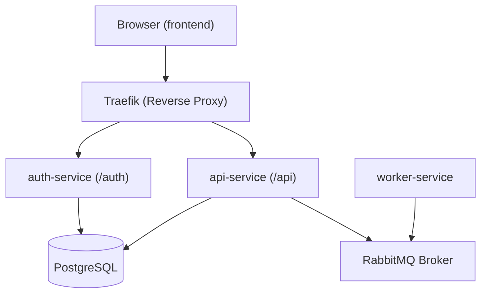
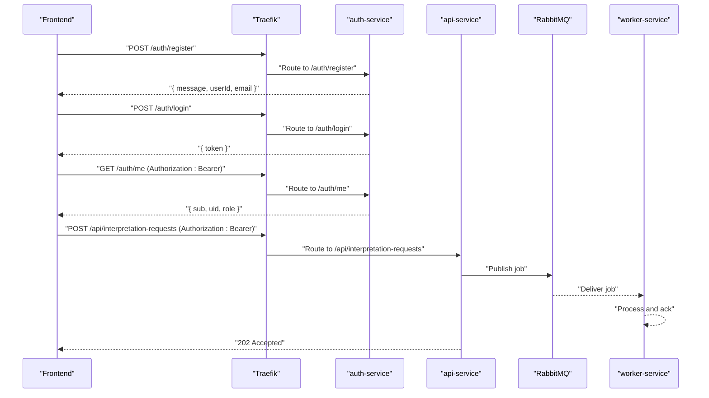
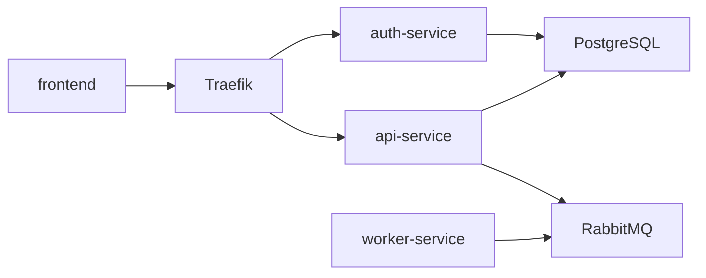

# API Reference

<cite>
**Referenced Files in This Document**
- [README.md](file://README.md)
- [docker-compose.yml](file://docker-compose.yml)
- [services/auth-service/src/index.js](file://services/auth-service/src/index.js)
- [services/auth-service/src/db.js](file://services/auth-service/src/db.js)
- [services/api-service/src/index.js](file://services/api-service/src/index.js)
- [services/api-service/src/db.js](file://services/api-service/src/db.js)
- [services/api-service/package.json](file://services/api-service/package.json)
- [services/auth-service/package.json](file://services/auth-service/package.json)
- [frontend/config.js](file://frontend/config.js)
- [frontend/script.js](file://frontend/script.js)
</cite>

## Table of Contents
1. [Introduction](#introduction)
2. [Project Structure](#project-structure)
3. [Core Components](#core-components)
4. [Architecture Overview](#architecture-overview)
5. [Detailed Component Analysis](#detailed-component-analysis)
6. [Dependency Analysis](#dependency-analysis)
7. [Performance Considerations](#performance-considerations)
8. [Troubleshooting Guide](#troubleshooting-guide)
9. [Conclusion](#conclusion)
10. [Appendices](#appendices)

## Introduction
This document provides a comprehensive API reference for the SignVue system. It covers authentication endpoints (/auth) and business logic endpoints (/api), including HTTP methods, URL patterns, request/response schemas, authentication requirements, error response formats, status codes, and practical integration guidance. It also addresses API versioning, backward compatibility, and deprecation policies.

## Project Structure
SignVue is a multi-service architecture composed of:
- Traefik reverse proxy routing requests to services based on path prefixes
- auth-service exposing /auth endpoints
- api-service exposing /api endpoints and asynchronous job submission
- worker-service consuming RabbitMQ jobs
- Frontend static UI consuming both /auth and /api

**Diagram sources**
- [docker-compose.yml:73-105](file://docker-compose.yml#L73-L105)
- [services/auth-service/src/index.js:13-117](file://services/auth-service/src/index.js#L13-L117)
- [services/api-service/src/index.js:16-133](file://services/api-service/src/index.js#L16-L133)

**Section sources**
- [README.md:34-50](file://README.md#L34-L50)
- [docker-compose.yml:73-105](file://docker-compose.yml#L73-L105)

## Core Components
- Authentication service (/auth): Registration, login, and verification endpoints.
- API service (/api): Session CRUD, interpretation request submission, and admin stats endpoint.
- Worker service: Consumes RabbitMQ jobs for asynchronous processing.
- Frontend: Sends authenticated requests to /auth and /api endpoints.

Key runtime and configuration details:
- JWT shared secret is configured via environment variable for both auth-service and api-service.
- Database connectivity is configured via DATABASE_URL environment variable.
- RabbitMQ connectivity is configured via RABBITMQ_URL environment variable.

**Section sources**
- [README.md:92-98](file://README.md#L92-L98)
- [services/auth-service/src/db.js:3-12](file://services/auth-service/src/db.js#L3-L12)
- [services/api-service/src/db.js:3-12](file://services/api-service/src/db.js#L3-L12)
- [services/api-service/package.json:9-18](file://services/api-service/package.json#L9-L18)
- [services/auth-service/package.json:9-17](file://services/auth-service/package.json#L9-L17)

## Architecture Overview
The frontend communicates with Traefik, which routes:
- /auth* to auth-service
- /api* to api-service

Both services connect to PostgreSQL. The api-service publishes interpretation requests to RabbitMQ, which worker-service consumes.

**Diagram sources**
- [services/auth-service/src/index.js:13-117](file://services/auth-service/src/index.js#L13-L117)
- [services/api-service/src/index.js:27-121](file://services/api-service/src/index.js#L27-L121)
- [services/worker-service/src/index.js:45-81](file://services/worker-service/src/index.js#L45-L81)

## Detailed Component Analysis

### Authentication Endpoints (/auth)
All endpoints are exposed under /auth.

- POST /auth/register
  - Purpose: Register a new user.
  - Request body: { email, password }
  - Responses:
    - 200 OK: { message, userId, email }
    - 400 Bad Request: Missing fields
    - 409 Conflict: Email already used
    - 500 Internal Server Error: Server error
  - Notes: The auth-service returns a structured message and user identifiers upon successful registration.

- POST /auth/login
  - Purpose: Authenticate and issue JWT.
  - Request body: { email, password }
  - Responses:
    - 200 OK: { token }
    - 400 Bad Request: Missing fields
    - 401 Unauthorized: User not found or invalid credentials
    - 500 Internal Server Error: Server error
  - Notes: JWT is signed with a shared secret and includes subject and user identifier.

- GET /auth/me
  - Purpose: Verify and return token payload.
  - Headers: Authorization: Bearer <token>
  - Responses:
    - 200 OK: Decoded token payload
    - 401 Unauthorized: Missing or invalid token
  - Notes: Token verification uses the shared JWT secret.

- GET /auth/verify
  - Purpose: Verify token without returning payload.
  - Headers: Authorization: Bearer <token>
  - Responses:
    - 200 OK: { sub, uid, role }
    - 401 Unauthorized: Missing or invalid token
  - Notes: Useful for lightweight checks.

- GET /health
  - Purpose: Health check for auth-service.
  - Responses:
    - 200 OK: { status: "auth-service ok" }

Authentication header requirement:
- All protected endpoints require Authorization: Bearer <token>.
- Tokens are validated against the shared JWT secret.

Error response format:
- JSON object with a message field describing the error.
- Status codes align with HTTP semantics (400, 401, 409, 500).

Rate limiting considerations:
- Not implemented in the current codebase. Consider implementing rate limiting at Traefik or per-service middleware.

Practical curl examples:
- Register: curl -X POST http://localhost:9080/auth/register -H "Content-Type: application/json" -d '{"email":"user@example.com","password":"pass"}'
- Login: curl -X POST http://localhost:9080/auth/login -H "Content-Type: application/json" -d '{"email":"user@example.com","password":"pass"}'
- Verify token: curl -X GET http://localhost:9080/auth/me -H "Authorization: Bearer YOUR_JWT_HERE"

Client implementation guidelines:
- Store the issued token securely (e.g., in secure storage).
- Attach Authorization: Bearer <token> to all subsequent requests to /api endpoints.
- Refresh tokens as needed; the auth-service issues short-lived tokens.

Integration patterns:
- Frontend uses Authorization header for authenticated requests.
- Frontend validates session by calling /auth/me and persists user email.

**Section sources**
- [services/auth-service/src/index.js:13-117](file://services/auth-service/src/index.js#L13-L117)
- [frontend/script.js:176-248](file://frontend/script.js#L176-L248)

### Business Logic Endpoints (/api)
All endpoints are exposed under /api.

- GET /api/sessions
  - Purpose: List sessions for the authenticated user; admins see all sessions.
  - Headers: Authorization: Bearer <token>
  - Responses:
    - 200 OK: Array of sessions
    - 401 Unauthorized: Missing or invalid token
    - 500 Internal Server Error: Server error

- POST /api/sessions
  - Purpose: Create a new session.
  - Headers: Authorization: Bearer <token>
  - Request body: Session creation payload (fields depend on schema)
  - Responses:
    - 201 Created: Session resource representation
    - 400 Bad Request: Validation errors
    - 401 Unauthorized: Missing or invalid token
    - 500 Internal Server Error: Server error

- GET /api/sessions/:id
  - Purpose: Retrieve a specific session by ID.
  - Headers: Authorization: Bearer <token>
  - Responses:
    - 200 OK: Session resource
    - 401 Unauthorized: Missing or invalid token
    - 404 Not Found: Session not found
    - 500 Internal Server Error: Server error

- PUT /api/sessions/:id
  - Purpose: Update a specific session by ID.
  - Headers: Authorization: Bearer <token>
  - Request body: Partial session update payload
  - Responses:
    - 200 OK: Updated session resource
    - 400 Bad Request: Validation errors
    - 401 Unauthorized: Missing or invalid token
    - 404 Not Found: Session not found
    - 500 Internal Server Error: Server error

- DELETE /api/sessions/:id
  - Purpose: Delete a specific session by ID.
  - Headers: Authorization: Bearer <token>
  - Responses:
    - 204 No Content
    - 401 Unauthorized: Missing or invalid token
    - 404 Not Found: Session not found
    - 500 Internal Server Error: Server error

- POST /api/interpretation-requests
  - Purpose: Submit an interpretation request; returns immediately with 202 Accepted and publishes a job to RabbitMQ.
  - Headers: Authorization: Bearer <token>
  - Request body: Optional JSON { source, sessionId }
  - Responses:
    - 202 Accepted: Request accepted for asynchronous processing
    - 400 Bad Request: Validation errors
    - 401 Unauthorized: Missing or invalid token
    - 500 Internal Server Error: Server error
  - Notes: The worker-service consumes jobs from the queue and logs processing.

- GET /api/stats/sessions
  - Purpose: Admin-only endpoint to retrieve session statistics.
  - Headers: Authorization: Bearer <token>
  - Responses:
    - 200 OK: Statistics data
    - 401 Unauthorized: Missing or invalid token
    - 403 Forbidden: Non-admin user
    - 500 Internal Server Error: Server error

- GET /health
  - Purpose: Health check for api-service.
  - Responses:
    - 200 OK: { status: "up" } or { status: "down" }

Authentication header requirement:
- All protected endpoints require Authorization: Bearer <token>.
- Token verification uses the shared JWT secret.

Error response format:
- JSON object with a message field describing the error.
- Status codes align with HTTP semantics (400, 401, 403, 404, 409, 500).

Rate limiting considerations:
- Not implemented in the current codebase. Consider implementing rate limiting at Traefik or per-service middleware.

Practical curl examples:
- Create session: curl -X POST http://localhost:9080/api/sessions -H "Authorization: Bearer YOUR_JWT_HERE" -H "Content-Type: application/json" -d '{}'
- Submit interpretation request: curl -X POST http://localhost:9080/api/interpretation-requests -H "Authorization: Bearer YOUR_JWT_HERE" -H "Content-Type: application/json" -d '{}'

Client implementation guidelines:
- Use Authorization: Bearer <token> for all /api requests.
- Handle 202 Accepted for asynchronous jobs; poll or rely on downstream notifications if applicable.
- Respect role-based access for admin-only endpoints.

Integration patterns:
- Frontend calls /api/interpretation-requests during camera demo and attaches Authorization header.

**Section sources**
- [services/api-service/src/index.js:27-121](file://services/api-service/src/index.js#L27-L121)
- [frontend/script.js:429-435](file://frontend/script.js#L429-L435)

### Database and Schema
The api-service manages several tables:
- users: Stores user identities and credentials.
- interpretation_sessions: Stores session metadata linked to users.
- translations: Stores translation records with indexes for efficient queries.

Indexes:
- Sessions: user_email
- Translations: user_id and created_at DESC

These tables are created/migrated at startup.

**Section sources**
- [services/api-service/src/db.js:30-78](file://services/api-service/src/db.js#L30-L78)

## Dependency Analysis
- Services communicate via HTTP and RabbitMQ.
- Frontend relies on Traefik for routing to auth-service and api-service.
- Both services depend on PostgreSQL for persistence.
- api-service publishes to RabbitMQ; worker-service consumes.

**Diagram sources**
- [docker-compose.yml:73-105](file://docker-compose.yml#L73-L105)
- [services/worker-service/src/index.js:45-81](file://services/worker-service/src/index.js#L45-L81)

**Section sources**
- [docker-compose.yml:73-105](file://docker-compose.yml#L73-L105)
- [services/worker-service/src/index.js:45-81](file://services/worker-service/src/index.js#L45-L81)

## Performance Considerations
- Asynchronous processing: Interpretation requests return 202 Accepted and are processed asynchronously via RabbitMQ, reducing latency for clients.
- Indexes: PostgreSQL indexes on user_email and created_at improve query performance for sessions and translations.
- Health checks: Services expose /health endpoints for monitoring and load balancer integration.
- Recommendations:
  - Add rate limiting at Traefik or per-service middleware.
  - Consider connection pooling and query optimization for high-load scenarios.
  - Monitor RabbitMQ queue depth and worker throughput.

[No sources needed since this section provides general guidance]

## Troubleshooting Guide
Common issues and resolutions:
- Missing or invalid Authorization header:
  - Symptom: 401 Unauthorized on protected endpoints.
  - Resolution: Ensure Authorization: Bearer <token> is present and valid.

- Invalid or expired token:
  - Symptom: 401 Unauthorized on /auth/me or /api endpoints.
  - Resolution: Re-authenticate via /auth/login and store the new token.

- Database connectivity failures:
  - Symptom: Health checks failing or server errors.
  - Resolution: Verify DATABASE_URL environment variable and database availability.

- RabbitMQ connectivity failures:
  - Symptom: Jobs not processed or errors when submitting interpretation requests.
  - Resolution: Verify RABBITMQ_URL environment variable and RabbitMQ service status.

- CORS issues:
  - Symptom: Cross-origin errors in browser.
  - Resolution: Ensure CORS is enabled and properly configured in api-service.

**Section sources**
- [services/auth-service/src/index.js:97-112](file://services/auth-service/src/index.js#L97-L112)
- [services/api-service/src/index.js:16-24](file://services/api-service/src/index.js#L16-L24)
- [services/api-service/src/db.js:14-27](file://services/api-service/src/db.js#L14-L27)
- [services/worker-service/src/index.js:45-81](file://services/worker-service/src/index.js#L45-L81)

## Conclusion
SignVue’s API provides a clear separation between authentication and business logic, with JWT-based authentication and asynchronous job processing. Clients should consistently attach Authorization headers, handle 202 Accepted responses for asynchronous tasks, and respect role-based access controls. The current codebase does not implement rate limiting; consider adding it for production hardening.

[No sources needed since this section summarizes without analyzing specific files]

## Appendices

### API Versioning, Backward Compatibility, and Deprecation
- Current state: No explicit versioning scheme is evident in the codebase.
- Recommendations:
  - Introduce a version prefix (e.g., /api/v1) to enable controlled evolution.
  - Maintain backward compatibility by supporting previous versions for a defined period.
  - Announce deprecations with timelines and migration guides.
  - Use HTTP cache headers and ETags for incremental improvements.

[No sources needed since this section provides general guidance]

### Environment Variables
- JWT_SECRET: Shared secret for signing and verifying JWTs (auth-service and api-service).
- DATABASE_URL: Connection string for PostgreSQL.
- RABBITMQ_URL: Connection string for RabbitMQ.
- CONSUL_HOST: Host for service discovery (api-service and worker-service).

**Section sources**
- [README.md:92-98](file://README.md#L92-L98)
- [services/auth-service/src/db.js:3-12](file://services/auth-service/src/db.js#L3-L12)
- [services/api-service/src/db.js:3-12](file://services/api-service/src/db.js#L3-L12)
- [docker-compose.yml:61-87](file://docker-compose.yml#L61-L87)

### Frontend Integration Notes
- Base URL resolution:
  - Uses meta tag or window override to determine API base URL.
  - Defaults to a hosted backend if not overridden.
- Token handling:
  - Stores JWT in secure storage and attaches Authorization header to requests.
  - Validates session by calling /auth/me on boot.

**Section sources**
- [frontend/config.js:7-17](file://frontend/config.js#L7-L17)
- [frontend/script.js:176-248](file://frontend/script.js#L176-L248)