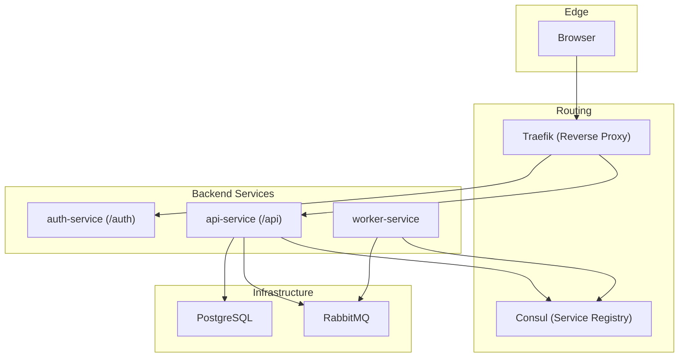
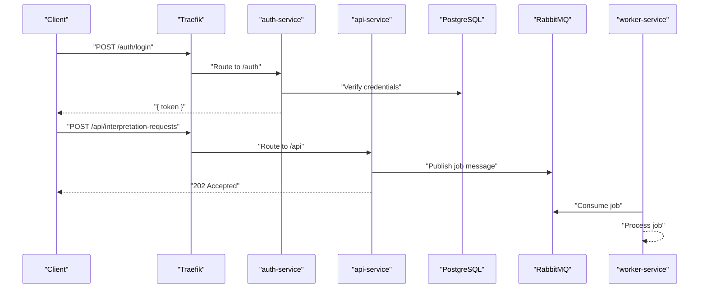
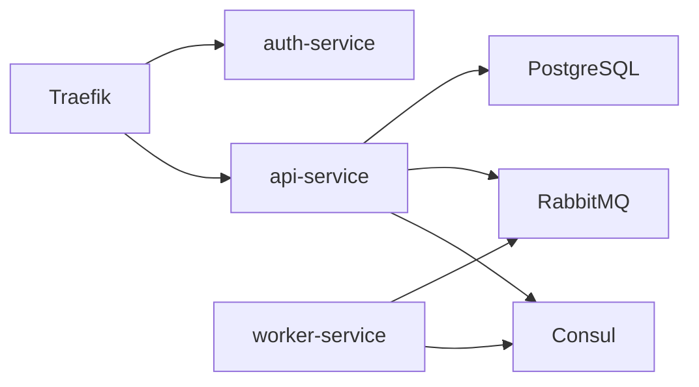

# Business Logic Endpoints

<cite>
**Referenced Files in This Document**
- [README.md](file://README.md)
- [docker-compose.yml](file://docker-compose.yml)
- [api-service index.js](file://services/api-service/src/index.js)
- [api-service db.js](file://services/api-service/src/db.js)
- [auth-service index.js](file://services/auth-service/src/index.js)
- [auth-service db.js](file://services/auth-service/src/db.js)
- [worker-service index.js](file://services/worker-service/src/index.js)
- [init-db.sql](file://infra/init-db.sql)
</cite>

## Table of Contents
1. [Introduction](#introduction)
2. [Project Structure](#project-structure)
3. [Core Components](#core-components)
4. [Architecture Overview](#architecture-overview)
5. [Detailed Component Analysis](#detailed-component-analysis)
6. [Dependency Analysis](#dependency-analysis)
7. [Performance Considerations](#performance-considerations)
8. [Troubleshooting Guide](#troubleshooting-guide)
9. [Conclusion](#conclusion)

## Introduction
This document provides comprehensive API documentation for the business logic endpoints in the SignVue system. It focuses on:
- Session management under /api/sessions (list, create, retrieve by ID, update, delete)
- Interpretation request submission under /api/interpretation-requests
- Admin statistics under /api/stats

The documentation covers request/response schemas, query parameters, authentication requirements, authorization levels (USER vs ADMIN), error handling patterns, and practical examples. It also explains how the system routes traffic via Traefik and integrates with RabbitMQ and Consul.

## Project Structure
SignVue is a multi-service architecture composed of:
- Traefik reverse proxy routing HTTP traffic to services
- Consul service registry and discovery
- RabbitMQ message broker for asynchronous jobs
- PostgreSQL database storing users, sessions, and translations
- auth-service: JWT-based authentication and user roles
- api-service: business logic endpoints and session management
- worker-service: consumer of the interpretation queue
- frontend: static UI consuming /auth and /api endpoints

**Diagram sources**
- [docker-compose.yml:1-137](file://docker-compose.yml#L1-L137)

**Section sources**
- [README.md:1-111](file://README.md#L1-L111)
- [docker-compose.yml:1-137](file://docker-compose.yml#L1-L137)

## Core Components
- Authentication service (/auth): Handles registration, login, and verification with JWT tokens. Users receive roles (USER or ADMIN) based on account creation order.
- API service (/api): Intended to host business logic endpoints including session management and interpretation requests. Currently, only health and basic endpoints are present in the code; however, the README documents additional endpoints that should be implemented.
- Worker service: Consumes RabbitMQ messages for interpretation jobs and registers itself with Consul.

Key environment variables:
- JWT_SECRET: Shared secret for signing JWT tokens
- DATABASE_URL: Connection string to PostgreSQL
- RABBITMQ_URL: Connection string to RabbitMQ
- CONSUL_HOST: Consul server address

**Section sources**
- [README.md:32-50](file://README.md#L32-L50)
- [docker-compose.yml:61-117](file://docker-compose.yml#L61-L117)
- [auth-service index.js:10-112](file://services/auth-service/src/index.js#L10-L112)
- [api-service index.js:13-15](file://services/api-service/src/index.js#L13-L15)
- [api-service db.js:3-12](file://services/api-service/src/db.js#L3-L12)
- [worker-service index.js:7-12](file://services/worker-service/src/index.js#L7-L12)

## Architecture Overview
The system routes requests through Traefik to services based on path prefixes:
- /auth → auth-service
- /api → api-service
- Health checks and service registration occur via Consul
- Asynchronous jobs are published to RabbitMQ and consumed by worker-service

**Diagram sources**
- [docker-compose.yml:70-105](file://docker-compose.yml#L70-L105)
- [auth-service index.js:52-94](file://services/auth-service/src/index.js#L52-L94)
- [api-service index.js:17-24](file://services/api-service/src/index.js#L17-L24)
- [worker-service index.js:45-81](file://services/worker-service/src/index.js#L45-L81)

## Detailed Component Analysis

### Authentication Endpoints
- POST /auth/register
  - Request body: { email, password }
  - Response: { message, user or userId }
  - Status codes: 201 Created, 400 Bad Request, 409 Conflict, 500 Internal Server Error
- POST /auth/login
  - Request body: { email, password }
  - Response: { token, user }
  - Status codes: 200 OK, 400 Bad Request, 401 Unauthorized, 500 Internal Server Error
- GET /auth/me
  - Headers: Authorization: Bearer <token>
  - Response: Decoded JWT payload
  - Status codes: 200 OK, 401 Unauthorized

Authorization roles:
- First registered user receives ADMIN role; subsequent users receive USER role.

**Section sources**
- [README.md:38-43](file://README.md#L38-L43)
- [auth-service index.js:12-94](file://services/auth-service/src/index.js#L12-L94)
- [auth-service db.js:3-9](file://services/auth-service/src/db.js#L3-L9)

### Session Management Endpoints
Note: The current api-service code does not implement these endpoints. The following documentation reflects the intended behavior described in the README.

- GET /api/sessions
  - Purpose: List sessions with pagination and filtering
  - Authentication: Required (Bearer token)
  - Authorization: USER can only view own sessions; ADMIN can view all sessions
  - Query parameters:
    - page: integer (default 1)
    - limit: integer (default 20, max 100)
    - userEmail: string (filter by user email; ADMIN only)
    - sortBy: enum [created_at, title]; default created_at
    - sortOrder: enum [asc, desc]; default desc
  - Response: { sessions: [...], total, page, pages }
  - Status codes: 200 OK, 400 Bad Request, 401 Unauthorized, 403 Forbidden

- POST /api/sessions
  - Purpose: Create a new interpretation session
  - Authentication: Required (Bearer token)
  - Request body: { title: string, notes?: string }
  - Response: { id, user_email, title, notes, created_at }
  - Status codes: 201 Created, 400 Bad Request, 401 Unauthorized

- GET /api/sessions/:id
  - Purpose: Retrieve session details by ID
  - Authentication: Required (Bearer token)
  - Authorization: USER can only access own sessions; ADMIN can access any session
  - Response: { id, user_email, title, notes, created_at }
  - Status codes: 200 OK, 401 Unauthorized, 403 Forbidden, 404 Not Found

- PUT /api/sessions/:id
  - Purpose: Update an existing session
  - Authentication: Required (Bearer token)
  - Authorization: USER can only update own sessions; ADMIN can update any session
  - Request body: { title?: string, notes?: string }
  - Response: { id, user_email, title, notes, created_at }
  - Status codes: 200 OK, 400 Bad Request, 401 Unauthorized, 403 Forbidden, 404 Not Found

- DELETE /api/sessions/:id
  - Purpose: Remove a session
  - Authentication: Required (Bearer token)
  - Authorization: USER can only delete own sessions; ADMIN can delete any session
  - Response: { message }
  - Status codes: 200 OK, 401 Unauthorized, 403 Forbidden, 404 Not Found

Data model: interpretation_sessions
- Columns: id (UUID), user_email (VARCHAR), title (VARCHAR), notes (TEXT), created_at (TIMESTAMPTZ)
- Index: idx_interpretation_sessions_user on user_email

**Section sources**
- [README.md:44-49](file://README.md#L44-L49)
- [init-db.sql:22-31](file://infra/init-db.sql#L22-L31)

### Interpretation Requests Endpoint
- POST /api/interpretation-requests
  - Purpose: Submit a job for interpretation
  - Authentication: Required (Bearer token)
  - Request body: { source?: string, sessionId?: UUID }
  - Response: 202 Accepted (job queued)
  - Status codes: 202 Accepted, 400 Bad Request, 401 Unauthorized
  - Notes: Publishes a message to RabbitMQ queue "signvue.interpretation"; worker-service consumes and processes jobs

Integration details:
- Queue name: signvue.interpretation
- Worker acknowledges processed messages

**Section sources**
- [README.md:48](file://README.md#L48)
- [worker-service index.js:10-11](file://services/worker-service/src/index.js#L10-L11)
- [worker-service index.js:58-75](file://services/worker-service/src/index.js#L58-L75)

### Statistics Endpoint
- GET /api/stats/sessions
  - Purpose: Admin-only statistics for sessions
  - Authentication: Required (Bearer token)
  - Authorization: ADMIN only
  - Query parameters:
    - range: enum [7d, 30d, 90d]; default 30d
    - userEmail: string (optional filter by user email)
  - Response: Aggregated metrics (example: { totalSessions, totalTranslations, avgDuration, chartData })
  - Status codes: 200 OK, 401 Unauthorized, 403 Forbidden

**Section sources**
- [README.md:49](file://README.md#L49)

## Dependency Analysis
- Traefik routes requests to services based on path prefixes:
  - /auth → auth-service
  - /api → api-service
- api-service depends on:
  - PostgreSQL for persistence
  - RabbitMQ for asynchronous job processing
  - Consul for health checks and service registration
- worker-service depends on:
  - RabbitMQ for job consumption
  - Consul for service registration

**Diagram sources**
- [docker-compose.yml:70-105](file://docker-compose.yml#L70-L105)

**Section sources**
- [docker-compose.yml:61-117](file://docker-compose.yml#L61-L117)

## Performance Considerations
- Use pagination and appropriate limits for listing sessions to avoid large payloads.
- Apply database indexes on frequently filtered columns (e.g., idx_interpretation_sessions_user).
- Keep JWT_SECRET secure and rotate periodically.
- Monitor RabbitMQ queue length and worker throughput for interpretation jobs.
- Use Consul health checks to ensure service availability and automatic failover.

## Troubleshooting Guide
Common issues and resolutions:
- 401 Unauthorized on /api endpoints:
  - Ensure Authorization header includes a valid Bearer token.
  - Verify JWT_SECRET matches between auth-service and api-service.
- 403 Forbidden on admin endpoints:
  - Confirm the user has ADMIN role.
- 500 Internal Server Error:
  - Check database connectivity and migrations.
  - Verify RabbitMQ availability for interpretation requests.
- Service registration failures:
  - Confirm Consul is reachable and worker-service registers health endpoint.

Operational checks:
- Health endpoints:
  - /health for api-service
  - /health for worker-service
  - /auth/verify for token verification

**Section sources**
- [api-service index.js:17-24](file://services/api-service/src/index.js#L17-L24)
- [worker-service index.js:15-17](file://services/worker-service/src/index.js#L15-L17)
- [auth-service index.js:96-112](file://services/auth-service/src/index.js#L96-L112)

## Conclusion
The SignVue system provides a clear separation of concerns across microservices, with Traefik handling routing, Consul managing service discovery, and RabbitMQ enabling asynchronous job processing. While the current api-service code implements only basic endpoints, the README outlines the intended business logic endpoints for sessions and statistics. Implementing the documented endpoints will complete the system’s business capabilities, ensuring proper authentication, authorization, and data management aligned with the provided schemas and flows.