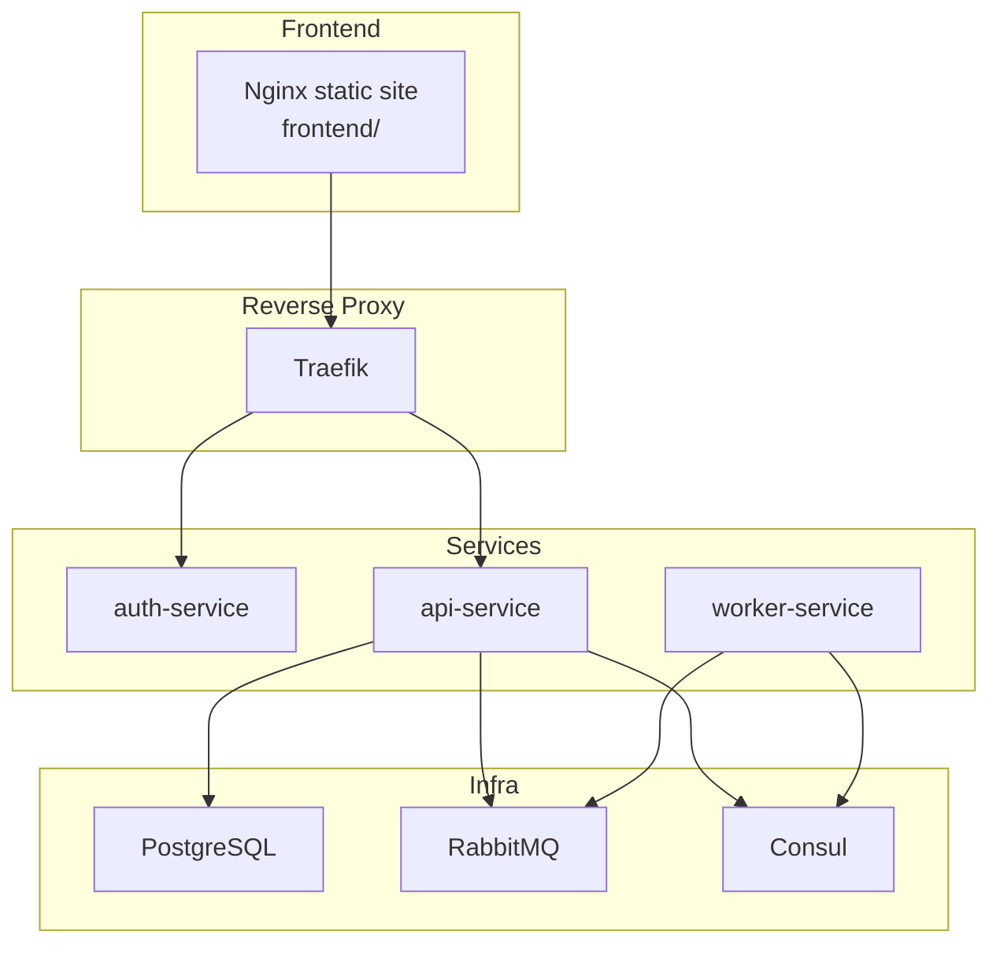
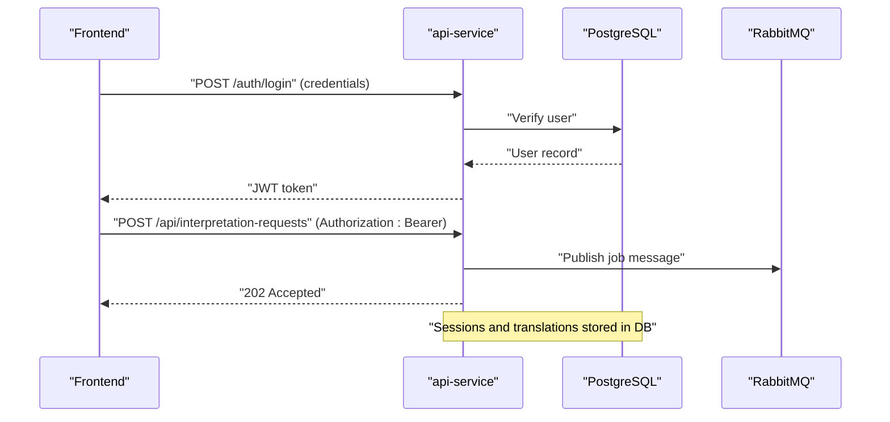
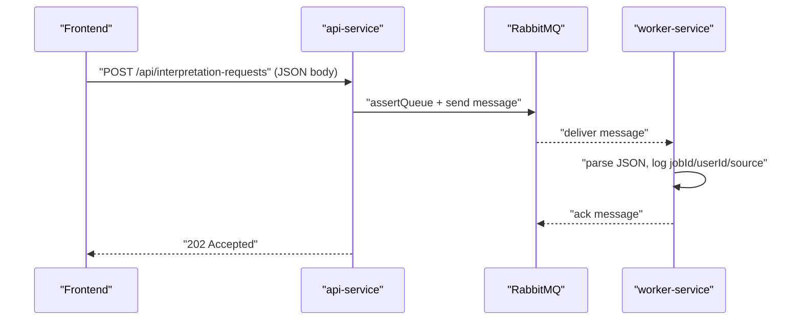
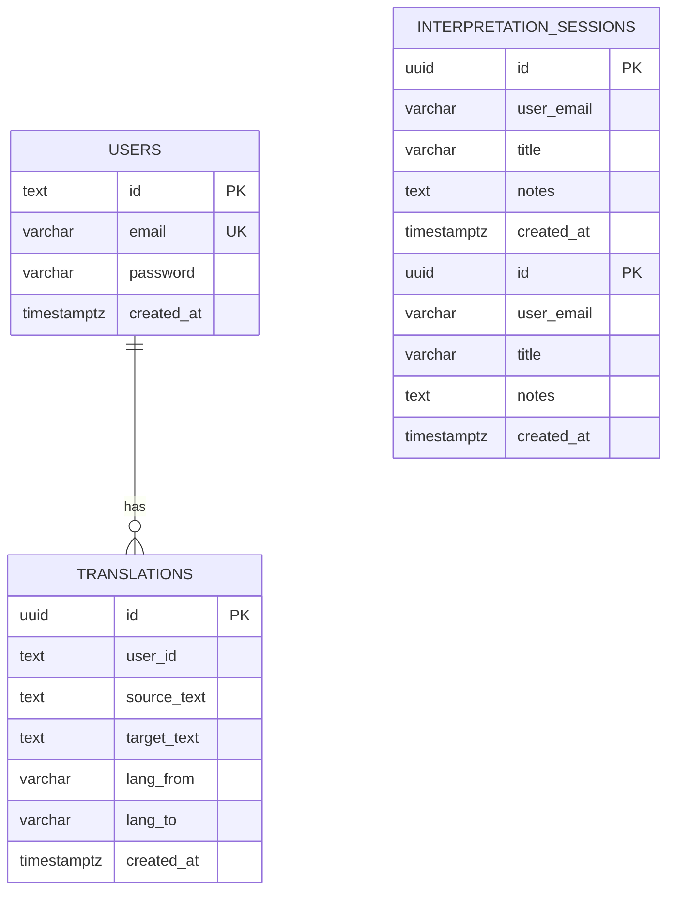
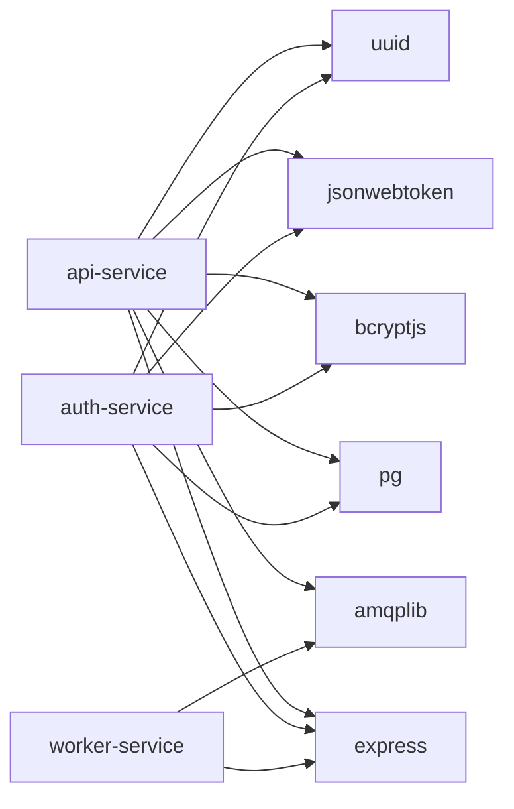

# API Service

<cite>
**Referenced Files in This Document**
- [index.js](file://services/api-service/src/index.js)
- [db.js](file://services/api-service/src/db.js)
- [package.json](file://services/api-service/package.json)
- [Dockerfile](file://services/api-service/Dockerfile)
- [index.js](file://services/worker-service/src/index.js)
- [docker-compose.yml](file://docker-compose.yml)
- [init-db.sql](file://infra/init-db.sql)
- [index.js](file://services/auth-service/src/index.js)
- [index.js](file://frontend/script.js)
- [config.js](file://frontend/config.js)
- [README.md](file://README.md)
</cite>

## Table of Contents
1. [Introduction](#introduction)
2. [Project Structure](#project-structure)
3. [Core Components](#core-components)
4. [Architecture Overview](#architecture-overview)
5. [Detailed Component Analysis](#detailed-component-analysis)
6. [Dependency Analysis](#dependency-analysis)
7. [Performance Considerations](#performance-considerations)
8. [Troubleshooting Guide](#troubleshooting-guide)
9. [Conclusion](#conclusion)
10. [Appendices](#appendices)

## Introduction
This document describes the API Service business logic, focusing on session management, CRUD operations for interpretation sessions, and the interpretation request processing workflow. It explains the PostgreSQL schema and data models, RabbitMQ integration for asynchronous job processing, JWT authorization middleware, and the admin functionality for statistics and user management. It also documents API endpoints, request/response schemas, error handling patterns, and security considerations, with examples of session lifecycle management and admin dashboard functionality.

## Project Structure
The API Service is implemented as a Node.js/Express application with PostgreSQL persistence and integrates with RabbitMQ for asynchronous tasks. The service exposes authentication endpoints and business endpoints for sessions and interpretation requests. It is containerized and orchestrated via Docker Compose, which also provisions PostgreSQL, RabbitMQ, Consul, and Traefik.

**Diagram sources**
- [docker-compose.yml:1-137](file://docker-compose.yml#L1-L137)
- [index.js:1-133](file://services/api-service/src/index.js#L1-L133)
- [index.js:1-88](file://services/worker-service/src/index.js#L1-L88)

**Section sources**
- [docker-compose.yml:1-137](file://docker-compose.yml#L1-L137)
- [README.md:1-111](file://README.md#L1-L111)

## Core Components
- Express server with CORS and JSON parsing middleware.
- PostgreSQL connection pool and migration logic for users, interpretation sessions, and translations.
- Authentication endpoints: register, login, and verify current user.
- Session management: CRUD endpoints for interpretation sessions.
- Interpretation request processing: POST endpoint publishes jobs to RabbitMQ.
- Health checks and startup sequence: wait for DB readiness, apply migrations, then listen.

Key implementation references:
- Server initialization and middleware: [index.js:1-133](file://services/api-service/src/index.js#L1-L133)
- Database pool and migrations: [db.js:1-84](file://services/api-service/src/db.js#L1-L84)
- Dependencies and RabbitMQ client: [package.json:1-19](file://services/api-service/package.json#L1-L19)
- Containerization: [Dockerfile:1-8](file://services/api-service/Dockerfile#L1-L8)

**Section sources**
- [index.js:1-133](file://services/api-service/src/index.js#L1-L133)
- [db.js:1-84](file://services/api-service/src/db.js#L1-L84)
- [package.json:1-19](file://services/api-service/package.json#L1-L19)
- [Dockerfile:1-8](file://services/api-service/Dockerfile#L1-L8)

## Architecture Overview
The API Service orchestrates:
- Authentication via JWT (shared secret between auth-service and api-service).
- Session lifecycle management for interpretation sessions.
- Asynchronous processing via RabbitMQ for interpretation requests.
- Admin-only statistics endpoint.

**Diagram sources**
- [index.js:61-104](file://services/api-service/src/index.js#L61-L104)
- [index.js:45-81](file://services/worker-service/src/index.js#L45-L81)
- [docker-compose.yml:80-116](file://docker-compose.yml#L80-L116)

**Section sources**
- [index.js:61-104](file://services/api-service/src/index.js#L61-L104)
- [index.js:45-81](file://services/worker-service/src/index.js#L45-L81)
- [docker-compose.yml:80-116](file://docker-compose.yml#L80-L116)

## Detailed Component Analysis

### Authentication and JWT Middleware
- Register: Validates presence of email and password, hashes password, inserts user, and returns user info.
- Login: Finds user by normalized email, compares password, signs JWT with shared secret, returns token.
- Verify current user: Extracts Bearer token from Authorization header, verifies with shared secret, returns decoded payload.

Security considerations:
- Password hashing with bcrypt.
- Shared JWT secret for verification.
- Token required for protected endpoints.

References:
- Register: [index.js:27-59](file://services/api-service/src/index.js#L27-L59)
- Login: [index.js:62-104](file://services/api-service/src/index.js#L62-L104)
- Verify: [index.js:107-121](file://services/api-service/src/index.js#L107-L121)

**Section sources**
- [index.js:27-121](file://services/api-service/src/index.js#L27-L121)

### Session Management System
- Data model: interpretation_sessions with UUID primary key, user_email, title, notes, created_at.
- CRUD endpoints: GET/POST /api/sessions and GET/PUT/DELETE /api/sessions/:id.
- Filtering: sessions are filtered by user context (via JWT claims).
- Admin visibility: admin users see all sessions.

Note: The current implementation does not expose CRUD endpoints in the API Service code. The README indicates these endpoints exist conceptually and are routed by Traefik to the API Service. The frontend demonstrates usage of session-related flows, including starting camera demos that trigger interpretation requests.

References:
- Sessions schema: [db.js:41-48](file://services/api-service/src/db.js#L41-L48)
- Frontend triggering interpretation requests: [script.js:429-435](file://frontend/script.js#L429-L435)
- API overview (sessions): [README.md:46-47](file://README.md#L46-L47)

**Section sources**
- [db.js:41-48](file://services/api-service/src/db.js#L41-L48)
- [script.js:429-435](file://frontend/script.js#L429-L435)
- [README.md:46-47](file://README.md#L46-L47)

### Interpretation Request Processing Workflow
- Endpoint: POST /api/interpretation-requests with optional body { source, sessionId }.
- Behavior: On success, returns 202 Accepted and publishes a message to RabbitMQ queue "signvue.interpretation".
- Worker consumption: The worker-service consumes the queue and logs job details.

**Diagram sources**
- [index.js:1-133](file://services/api-service/src/index.js#L1-L133)
- [index.js:45-81](file://services/worker-service/src/index.js#L45-L81)

**Section sources**
- [index.js:1-133](file://services/api-service/src/index.js#L1-L133)
- [index.js:45-81](file://services/worker-service/src/index.js#L45-L81)

### Database Schema and Data Models
Tables and indexes:
- users: id, email, password, created_at.
- interpretation_sessions: id (UUID), user_email, title, notes, created_at.
- translations: id (UUID), user_id, source_text, target_text, lang_from, lang_to, created_at.

Indexes:
- sessions by user_email.
- translations by user_id and created_at DESC.

**Diagram sources**
- [db.js:32-75](file://services/api-service/src/db.js#L32-L75)
- [init-db.sql:3-44](file://infra/init-db.sql#L3-L44)

**Section sources**
- [db.js:32-75](file://services/api-service/src/db.js#L32-L75)
- [init-db.sql:3-44](file://infra/init-db.sql#L3-L44)

### Admin Functionality for Statistics and User Management
- Admin role: First registered user becomes ADMIN; subsequent users are USER.
- Admin-only endpoint: GET /api/stats/sessions (admin only).
- User role retrieval: Frontend calls /auth/verify to display role.

References:
- Admin role assignment and JWT payload: [index.js:78-88](file://services/auth-service/src/index.js#L78-L88)
- Stats endpoint (admin only): [README.md](file://README.md#L49)
- Role display in UI: [script.js:121-142](file://frontend/script.js#L121-L142)

**Section sources**
- [index.js:78-88](file://services/auth-service/src/index.js#L78-L88)
- [README.md](file://README.md#L49)
- [script.js:121-142](file://frontend/script.js#L121-L142)

### API Endpoints and Schemas
- Authentication
  - POST /auth/register: { email, password } → { message, user }
  - POST /auth/login: { email, password } → { ok, token, user }
  - GET /auth/me: Authorization: Bearer token → { id, email }

- Business
  - GET/POST /api/sessions: CRUD sessions (filtered by user; admin sees all)
  - GET/PUT/DELETE /api/sessions/:id
  - POST /api/interpretation-requests: { source?, sessionId? } → 202 Accepted
  - GET /api/stats/sessions: ADMIN only

Notes:
- Authorization header is required for business endpoints.
- The frontend demonstrates usage of /auth/register, /auth/login, and /auth/me.

References:
- Auth endpoints: [index.js:27-121](file://services/api-service/src/index.js#L27-L121)
- Business endpoints overview: [README.md:44-49](file://README.md#L44-L49)
- Frontend auth usage: [script.js:184-248](file://frontend/script.js#L184-L248)

**Section sources**
- [index.js:27-121](file://services/api-service/src/index.js#L27-L121)
- [README.md:44-49](file://README.md#L44-L49)
- [script.js:184-248](file://frontend/script.js#L184-L248)

### Session Lifecycle Management Examples
- Start a demo camera: triggers POST /api/interpretation-requests with source "demo-camera".
- Session creation: sessions are associated with user_email; filtering ensures per-user isolation.
- Admin visibility: admin users can view all sessions.

References:
- Demo camera flow: [script.js:409-441](file://frontend/script.js#L409-L441)
- Interpretation request publishing: [index.js:1-133](file://services/api-service/src/index.js#L1-L133)
- Sessions schema and indexes: [db.js:41-53](file://services/api-service/src/db.js#L41-L53)

**Section sources**
- [script.js:409-441](file://frontend/script.js#L409-L441)
- [index.js:1-133](file://services/api-service/src/index.js#L1-L133)
- [db.js:41-53](file://services/api-service/src/db.js#L41-L53)

### Error Handling Patterns
- Validation errors: 400 Bad Request with message.
- Not found/unauthorized: 401 Unauthorized with message.
- Conflict: 409 Conflict (e.g., duplicate email).
- Server errors: 500 Internal Server Error with generic message.
- Health checks: 200 OK with status payload.

References:
- Register error handling: [index.js:46-58](file://services/api-service/src/index.js#L46-L58)
- Login error handling: [index.js:73-83](file://services/api-service/src/index.js#L73-L83)
- Verify token errors: [index.js:110-120](file://services/api-service/src/index.js#L110-L120)

**Section sources**
- [index.js:46-58](file://services/api-service/src/index.js#L46-L58)
- [index.js:73-83](file://services/api-service/src/index.js#L73-L83)
- [index.js:110-120](file://services/api-service/src/index.js#L110-L120)

## Dependency Analysis
External dependencies and integrations:
- Express for HTTP routing.
- pg for PostgreSQL connectivity.
- bcryptjs for password hashing.
- jsonwebtoken for JWT signing/verification.
- uuid for generating identifiers.
- amqplib for RabbitMQ messaging.

**Diagram sources**
- [package.json:9-16](file://services/api-service/package.json#L9-L16)
- [package.json:9-16](file://services/auth-service/package.json#L9-L16)
- [package.json:9-12](file://services/worker-service/package.json#L9-L12)

**Section sources**
- [package.json:9-16](file://services/api-service/package.json#L9-L16)
- [package.json:9-16](file://services/auth-service/package.json#L9-L16)
- [package.json:9-12](file://services/worker-service/package.json#L9-L12)

## Performance Considerations
- Database indexing: sessions by user_email and translations by user_id and created_at DESC improve query performance.
- Connection pooling: pg Pool manages connections efficiently.
- Asynchronous processing: RabbitMQ decouples request handling from long-running work.
- Startup synchronization: API waits for DB readiness before serving requests.

References:
- Indexes: [db.js:51-75](file://services/api-service/src/db.js#L51-L75)
- DB readiness: [index.js:124-131](file://services/api-service/src/index.js#L124-L131)

**Section sources**
- [db.js:51-75](file://services/api-service/src/db.js#L51-L75)
- [index.js:124-131](file://services/api-service/src/index.js#L124-L131)

## Troubleshooting Guide
Common issues and resolutions:
- Database unavailable at startup: service retries until DB responds; check DATABASE_URL and network.
- JWT verification failures: ensure JWT_SECRET matches between services; verify Authorization header format.
- RabbitMQ connection failures: confirm RABBITMQ_URL and queue availability; inspect worker logs.
- Missing environment variables: verify JWT_SECRET, DATABASE_URL, RABBITMQ_URL in docker-compose.

Operational checks:
- Health endpoints: /health for API, /health for worker.
- Consul registration: services register themselves with Consul via HTTP health checks.

References:
- DB wait loop: [db.js:15-27](file://services/api-service/src/db.js#L15-L27)
- JWT verification: [index.js:114-121](file://services/api-service/src/index.js#L114-L121)
- Worker health and consumer: [index.js:15-81](file://services/worker-service/src/index.js#L15-L81)
- Consul registration: [index.js:19-43](file://services/worker-service/src/index.js#L19-L43)

**Section sources**
- [db.js:15-27](file://services/api-service/src/db.js#L15-L27)
- [index.js:114-121](file://services/api-service/src/index.js#L114-L121)
- [index.js:15-81](file://services/worker-service/src/index.js#L15-L81)
- [index.js:19-43](file://services/worker-service/src/index.js#L19-L43)

## Conclusion
The API Service provides a focused business layer for session management and interpretation request processing, backed by PostgreSQL and integrated with RabbitMQ for asynchronous workflows. It leverages JWT for secure authorization and is orchestrated via Docker Compose with Traefik, Consul, and supporting infrastructure. The documented endpoints, schemas, and flows enable consistent development and deployment of the service.

## Appendices

### Appendix A: Environment Variables
- JWT_SECRET: Shared secret for JWT signing/verification.
- DATABASE_URL: PostgreSQL connection string.
- RABBITMQ_URL: RabbitMQ connection string.
- PORT: Service port (default 3002).

References:
- API environment: [docker-compose.yml:82-86](file://docker-compose.yml#L82-L86)
- Worker environment: [docker-compose.yml:109-112](file://docker-compose.yml#L109-L112)

**Section sources**
- [docker-compose.yml:82-86](file://docker-compose.yml#L82-L86)
- [docker-compose.yml:109-112](file://docker-compose.yml#L109-L112)