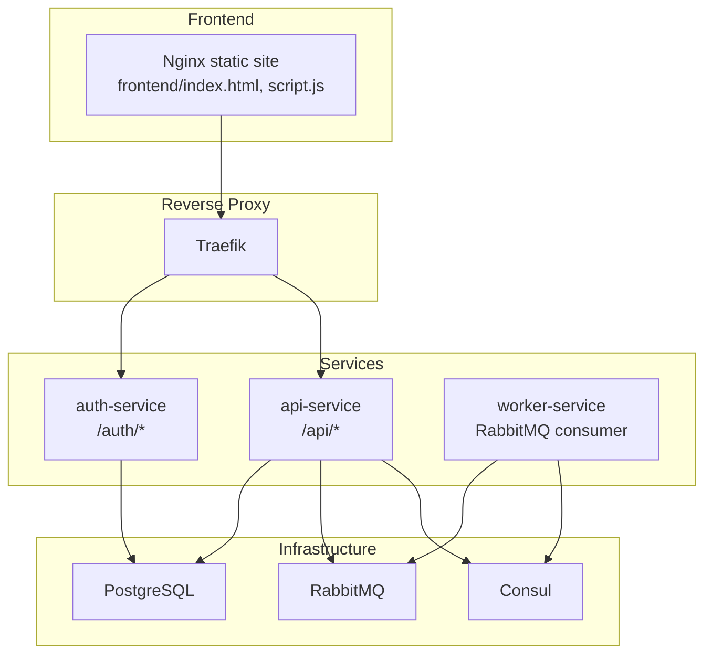
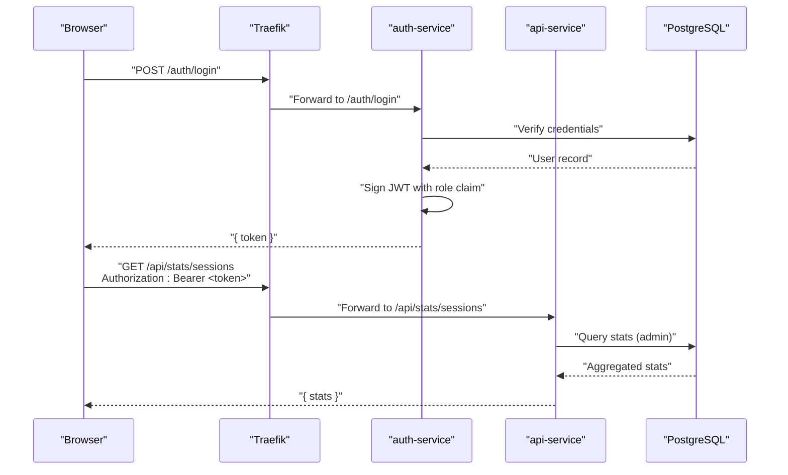
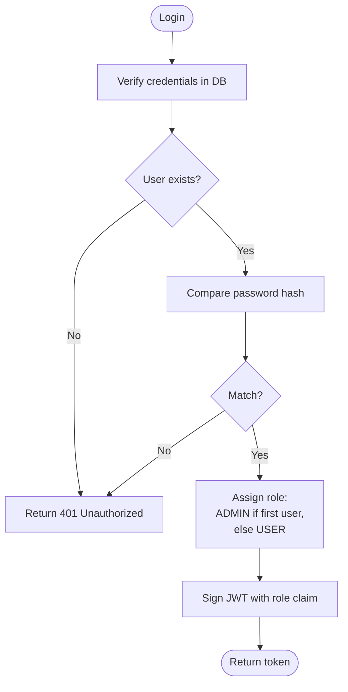
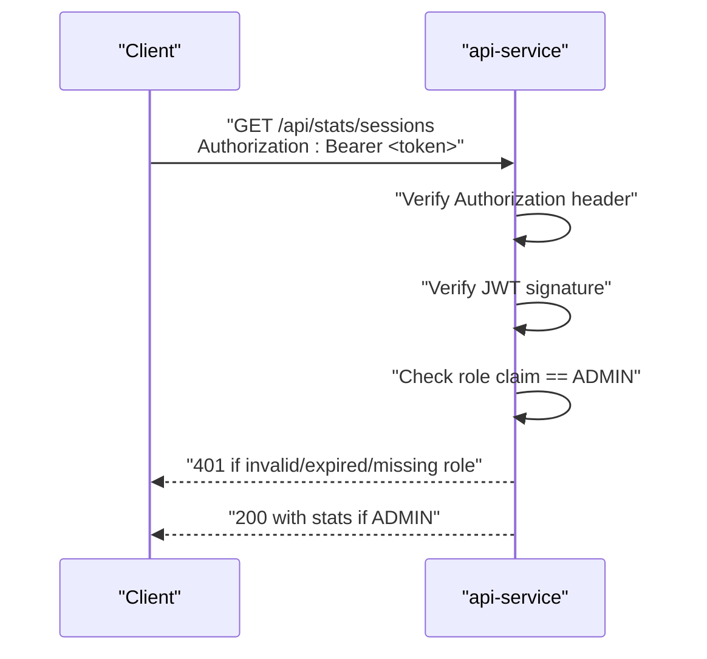
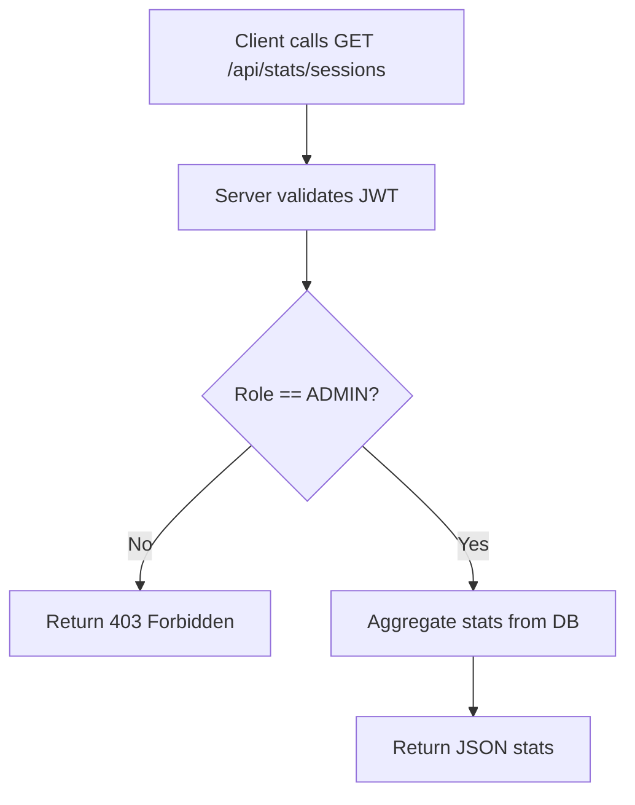
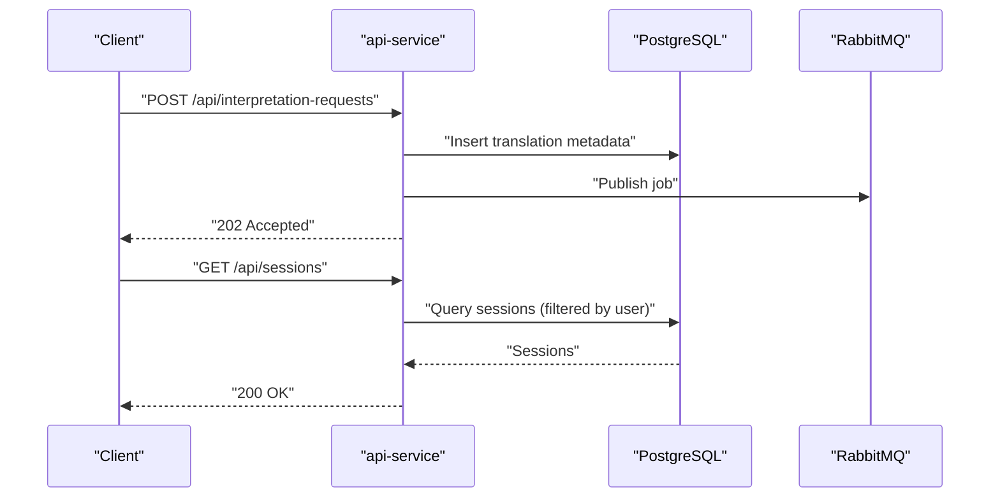
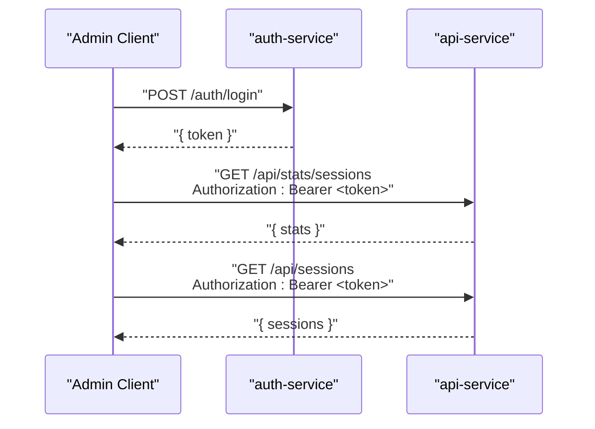
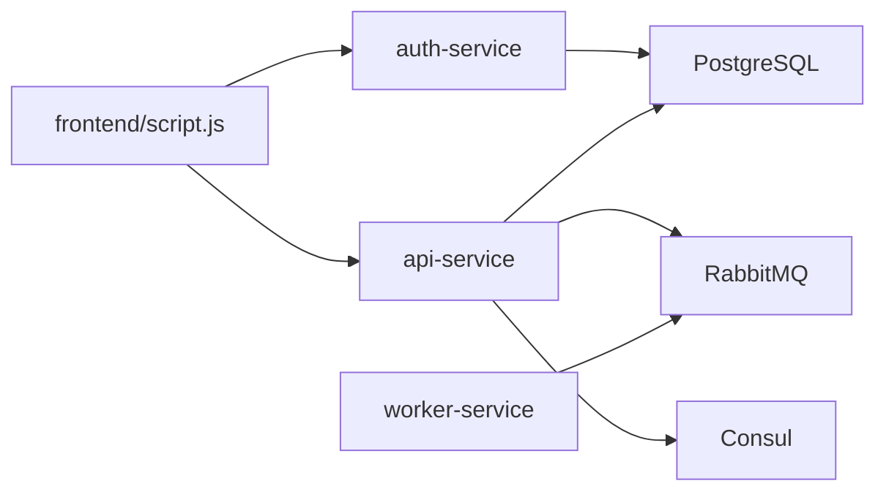

# Admin Functionality

<cite>
**Referenced Files in This Document**
- [README.md](file://README.md)
- [docker-compose.yml](file://docker-compose.yml)
- [services/auth-service/src/index.js](file://services/auth-service/src/index.js)
- [services/auth-service/src/db.js](file://services/auth-service/src/db.js)
- [services/api-service/src/index.js](file://services/api-service/src/index.js)
- [services/api-service/src/db.js](file://services/api-service/src/db.js)
- [infra/init-db.sql](file://infra/init-db.sql)
- [frontend/script.js](file://frontend/script.js)
- [frontend/index.html](file://frontend/index.html)
</cite>

## Table of Contents
1. [Introduction](#introduction)
2. [Project Structure](#project-structure)
3. [Core Components](#core-components)
4. [Architecture Overview](#architecture-overview)
5. [Detailed Component Analysis](#detailed-component-analysis)
6. [Dependency Analysis](#dependency-analysis)
7. [Performance Considerations](#performance-considerations)
8. [Troubleshooting Guide](#troubleshooting-guide)
9. [Conclusion](#conclusion)
10. [Appendices](#appendices)

## Introduction
This document explains the admin functionality in the SignVue microservices architecture. It covers statistics collection, user management, and system monitoring capabilities, focusing on admin-only endpoints for retrieving system metrics, user analytics, and session statistics. It also documents role-based access control (RBAC), admin authentication requirements, and privilege escalation mechanisms. Finally, it outlines security considerations for admin access, audit logging, and data privacy compliance for administrative functions.

## Project Structure
The repository is organized into:
- Frontend UI (static Nginx serving HTML/CSS/JS)
- Microservices:
  - auth-service: JWT-based authentication and user roles
  - api-service: business APIs, session management, and admin stats
  - worker-service: asynchronous job consumer (not covered here)
- Infrastructure initialization scripts and Docker Compose orchestration

**Diagram sources**
- [docker-compose.yml:1-137](file://docker-compose.yml#L1-L137)
- [frontend/index.html:1-222](file://frontend/index.html#L1-L222)
- [frontend/script.js:1-726](file://frontend/script.js#L1-L726)

**Section sources**
- [README.md:1-111](file://README.md#L1-L111)
- [docker-compose.yml:1-137](file://docker-compose.yml#L1-L137)

## Core Components
- Authentication and RBAC:
  - auth-service issues JWTs containing user identity and role claims.
  - First registered user becomes ADMIN; subsequent users are USER.
- Business APIs:
  - api-service exposes session CRUD, interpretation requests, and admin stats endpoint.
- Frontend:
  - Displays user role and integrates with backend endpoints.

Key RBAC and admin endpoints:
- Role assignment: First registration receives ADMIN; others receive USER.
- Admin-only endpoint: GET /api/stats/sessions (described in README).
- Session management: GET/POST/PUT/DELETE /api/sessions with per-user filtering; admins see all sessions.

**Section sources**
- [README.md:32-50](file://README.md#L32-L50)
- [services/auth-service/src/index.js:53-94](file://services/auth-service/src/index.js#L53-L94)
- [infra/init-db.sql:3-9](file://infra/init-db.sql#L3-L9)
- [services/api-service/src/index.js:1-133](file://services/api-service/src/index.js#L1-L133)

## Architecture Overview
The admin functionality spans authentication, business logic, and data persistence. Admin privileges are enforced via JWT claims and server-side checks.

**Diagram sources**
- [services/auth-service/src/index.js:53-94](file://services/auth-service/src/index.js#L53-L94)
- [services/api-service/src/index.js:1-133](file://services/api-service/src/index.js#L1-L133)
- [infra/init-db.sql:3-9](file://infra/init-db.sql#L3-L9)

## Detailed Component Analysis

### Role-Based Access Control (RBAC)
- JWT payload includes a role claim derived from the user record.
- auth-service sets role to ADMIN for the first user; subsequent users are USER.
- Frontend displays role in the user panel.

**Diagram sources**
- [services/auth-service/src/index.js:53-94](file://services/auth-service/src/index.js#L53-L94)
- [infra/init-db.sql:3-9](file://infra/init-db.sql#L3-L9)

**Section sources**
- [services/auth-service/src/index.js:53-94](file://services/auth-service/src/index.js#L53-L94)
- [infra/init-db.sql:3-9](file://infra/init-db.sql#L3-L9)
- [frontend/script.js:121-142](file://frontend/script.js#L121-L142)

### Admin Authentication Requirements
- Clients must present a valid JWT with Authorization: Bearer <token>.
- The backend verifies the token signature using the shared JWT_SECRET.
- Admin-only endpoints require a role claim indicating ADMIN.

**Diagram sources**
- [services/api-service/src/index.js:107-121](file://services/api-service/src/index.js#L107-L121)
- [services/auth-service/src/index.js:97-112](file://services/auth-service/src/index.js#L97-L112)

**Section sources**
- [services/api-service/src/index.js:107-121](file://services/api-service/src/index.js#L107-L121)
- [services/auth-service/src/index.js:97-112](file://services/auth-service/src/index.js#L97-L112)

### Privilege Escalation Mechanisms
- There is no explicit privilege escalation mechanism in the current codebase.
- The first registered user automatically becomes ADMIN; no runtime promotion/demotion endpoints are exposed.

Implications:
- Administrators can be designated only during initial deployment.
- No self-service elevation; administrators must manage user roles externally if needed.

**Section sources**
- [README.md:32-32](file://README.md#L32-L32)
- [infra/init-db.sql:3-9](file://infra/init-db.sql#L3-L9)

### Statistics Collection and Admin Metrics
- Admin-only endpoint: GET /api/stats/sessions (described in README).
- Purpose: Provide system metrics, user analytics, and session statistics for administrators.
- Implementation note: The endpoint is documented but not implemented in the provided api-service source; consult the service’s routing and handlers for actual behavior.

**Diagram sources**
- [README.md:49-49](file://README.md#L49-L49)
- [services/api-service/src/index.js:1-133](file://services/api-service/src/index.js#L1-L133)

**Section sources**
- [README.md:49-49](file://README.md#L49-L49)

### User Management and Session Analytics
- Session CRUD:
  - GET/POST /api/sessions (filtered by user; admins see all)
  - GET/PUT/DELETE /api/sessions/:id
- Interpretation requests:
  - POST /api/interpretation-requests publishes a job to RabbitMQ
- Admin stats:
  - GET /api/stats/sessions (admin-only)

**Diagram sources**
- [README.md:48-48](file://README.md#L48-L48)
- [services/api-service/src/index.js:1-133](file://services/api-service/src/index.js#L1-L133)
- [infra/init-db.sql:22-43](file://infra/init-db.sql#L22-L43)

**Section sources**
- [README.md:46-49](file://README.md#L46-L49)
- [services/api-service/src/index.js:1-133](file://services/api-service/src/index.js#L1-L133)
- [infra/init-db.sql:22-43](file://infra/init-db.sql#L22-L43)

### Admin Dashboard Data Structures
- Admin stats endpoint returns aggregated metrics suitable for dashboards (e.g., counts, time series).
- Session analytics include creation timestamps, titles, and associated user/email.
- Translation analytics include language pairs and timestamps.

Note: The exact JSON schema is not included in the provided sources; refer to the service implementation for precise shapes.

**Section sources**
- [README.md:49-49](file://README.md#L49-L49)
- [infra/init-db.sql:22-43](file://infra/init-db.sql#L22-L43)

### Reporting Endpoints and Workflows
- Reporting:
  - GET /api/stats/sessions (admin-only): returns system/session metrics.
- User administration:
  - Session CRUD endpoints enable administrators to audit and manage user sessions.
- Workflow:
  - Admin authenticates via /auth/login, obtains a JWT, and calls admin endpoints with Authorization header.

**Diagram sources**
- [services/auth-service/src/index.js:53-94](file://services/auth-service/src/index.js#L53-L94)
- [services/api-service/src/index.js:1-133](file://services/api-service/src/index.js#L1-L133)

**Section sources**
- [README.md:46-49](file://README.md#L46-L49)
- [services/auth-service/src/index.js:53-94](file://services/auth-service/src/index.js#L53-L94)
- [services/api-service/src/index.js:1-133](file://services/api-service/src/index.js#L1-L133)

## Dependency Analysis
- auth-service depends on PostgreSQL for user storage and JWT signing.
- api-service depends on PostgreSQL for sessions and translations, RabbitMQ for async jobs, and Consul for service registration.
- Frontend communicates with both services via Traefik.

**Diagram sources**
- [docker-compose.yml:1-137](file://docker-compose.yml#L1-L137)
- [frontend/script.js:176-182](file://frontend/script.js#L176-L182)

**Section sources**
- [docker-compose.yml:1-137](file://docker-compose.yml#L1-L137)
- [services/api-service/src/db.js:1-84](file://services/api-service/src/db.js#L1-L84)
- [services/auth-service/src/db.js:1-13](file://services/auth-service/src/db.js#L1-L13)

## Performance Considerations
- Token verification occurs on each request; keep JWT_SECRET consistent across services.
- Admin queries should leverage appropriate database indexes (e.g., created_at, user filters).
- Asynchronous processing via RabbitMQ prevents blocking on long-running tasks.
- Use pagination for session and translation lists to avoid large payloads.

## Troubleshooting Guide
- 401 Unauthorized on admin endpoints:
  - Ensure Authorization: Bearer <token> is present and valid.
  - Confirm the token was signed by auth-service with the correct JWT_SECRET.
- 403 Forbidden on /api/stats/sessions:
  - Verify the role claim indicates ADMIN.
- Database connectivity:
  - api-service and auth-service wait for PostgreSQL readiness; confirm DATABASE_URL is set.
- RabbitMQ:
  - Worker-service consumes jobs; ensure RabbitMQ is reachable and queue exists.

**Section sources**
- [services/api-service/src/index.js:107-121](file://services/api-service/src/index.js#L107-L121)
- [services/auth-service/src/index.js:97-112](file://services/auth-service/src/index.js#L97-L112)
- [services/api-service/src/db.js:14-27](file://services/api-service/src/db.js#L14-L27)
- [services/worker-service/src/index.js:45-81](file://services/worker-service/src/index.js#L45-L81)

## Conclusion
The SignVue admin functionality centers on JWT-based RBAC with a dedicated ADMIN role, enforced by auth-service and consumed by api-service. Admin-only metrics and analytics are exposed via GET /api/stats/sessions, while session and translation data are managed through CRUD endpoints. Security relies on shared secrets, signed tokens, and role checks. Administrators can monitor and audit system usage, subject to the current implementation and deployment configuration.

## Appendices

### Data Privacy and Audit Logging Recommendations
- Audit logging:
  - Log admin actions (e.g., accessing /api/stats/sessions) with timestamps, user ID, and IP.
- Data minimization:
  - Avoid exposing personally identifiable information in admin reports unless necessary.
- Compliance:
  - Ensure retention policies and data deletion mechanisms align with applicable regulations.

[No sources needed since this section provides general guidance]