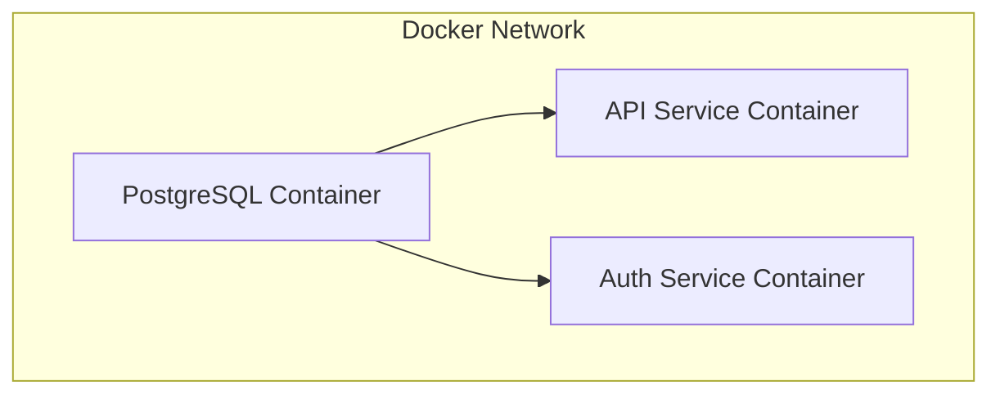
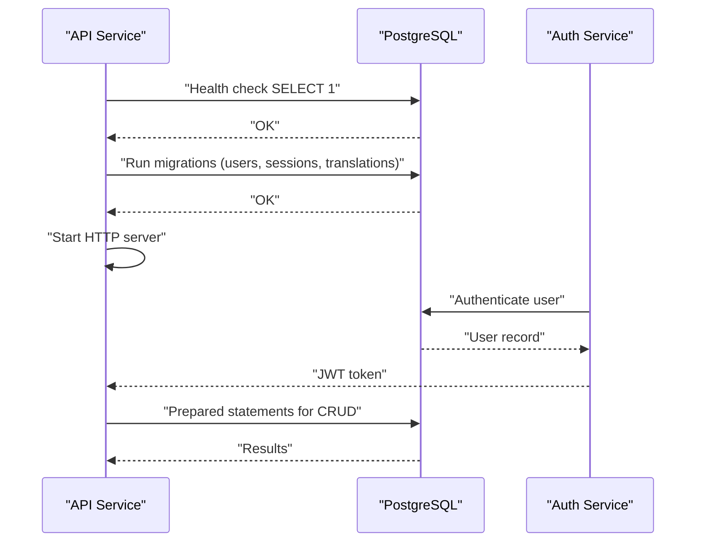
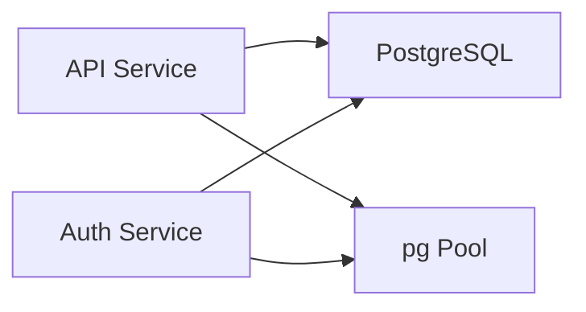
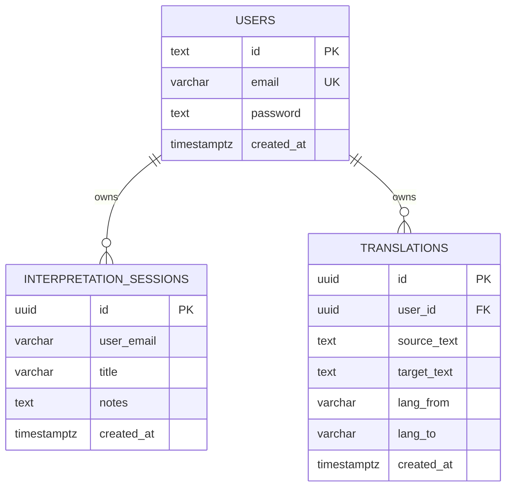

# Database Integration

<cite>
**Referenced Files in This Document**
- [services/api-service/src/db.js](file://services/api-service/src/db.js)
- [services/api-service/src/index.js](file://services/api-service/src/index.js)
- [services/auth-service/src/db.js](file://services/auth-service/src/db.js)
- [services/auth-service/src/index.js](file://services/auth-service/src/index.js)
- [infra/init-db.sql](file://infra/init-db.sql)
- [docker-compose.yml](file://docker-compose.yml)
- [services/api-service/package.json](file://services/api-service/package.json)
</cite>

## Table of Contents
1. [Introduction](#introduction)
2. [Project Structure](#project-structure)
3. [Core Components](#core-components)
4. [Architecture Overview](#architecture-overview)
5. [Detailed Component Analysis](#detailed-component-analysis)
6. [Dependency Analysis](#dependency-analysis)
7. [Performance Considerations](#performance-considerations)
8. [Troubleshooting Guide](#troubleshooting-guide)
9. [Conclusion](#conclusion)
10. [Appendices](#appendices)

## Introduction
This document explains the PostgreSQL database integration within the API Service and related services. It covers connection pooling configuration, migration management, schema initialization, data models, query patterns, prepared statements, connection lifecycle, and operational procedures. It also provides diagrams, indexing strategies, and recommendations for performance and reliability.

## Project Structure
The database integration spans:
- A shared PostgreSQL container orchestrated via Docker Compose
- Initialization SQL executed at first container startup
- Two Node.js services that connect to the database:
  - API Service: performs migrations and exposes REST endpoints
  - Auth Service: authenticates users and manages tokens

**Diagram sources**
- [docker-compose.yml:40-95](file://docker-compose.yml#L40-L95)

**Section sources**
- [docker-compose.yml:1-137](file://docker-compose.yml#L1-L137)

## Core Components
- PostgreSQL connection pool configured via the pg library
- Migration manager that creates tables and indexes
- Health checks and readiness logic
- Prepared statements for secure query execution
- Environment-driven configuration for DATABASE_URL

Key implementation references:
- Pool creation and environment validation
  - [services/api-service/src/db.js:1-12](file://services/api-service/src/db.js#L1-L12)
  - [services/auth-service/src/db.js:1-9](file://services/auth-service/src/db.js#L1-L9)
- Migration logic for users, sessions, and translations
  - [services/api-service/src/db.js:29-78](file://services/api-service/src/db.js#L29-L78)
- Health endpoint and connection verification
  - [services/api-service/src/index.js:16-24](file://services/api-service/src/index.js#L16-L24)
- Prepared statements and query patterns
  - [services/api-service/src/index.js:37-43](file://services/api-service/src/index.js#L37-L43)
  - [services/api-service/src/index.js:68-71](file://services/api-service/src/index.js#L68-L71)
  - [services/auth-service/src/index.js:22-25](file://services/auth-service/src/index.js#L22-L25)
  - [services/auth-service/src/index.js:61-64](file://services/auth-service/src/index.js#L61-L64)

**Section sources**
- [services/api-service/src/db.js:1-84](file://services/api-service/src/db.js#L1-L84)
- [services/auth-service/src/db.js:1-13](file://services/auth-service/src/db.js#L1-L13)
- [services/api-service/src/index.js:16-133](file://services/api-service/src/index.js#L16-L133)
- [services/auth-service/src/index.js:12-124](file://services/auth-service/src/index.js#L12-L124)

## Architecture Overview
The API Service initializes the database schema and validates connectivity before serving requests. The Auth Service handles authentication against the same database.

**Diagram sources**
- [services/api-service/src/db.js:14-27](file://services/api-service/src/db.js#L14-L27)
- [services/api-service/src/db.js:29-78](file://services/api-service/src/db.js#L29-L78)
- [services/api-service/src/index.js:123-131](file://services/api-service/src/index.js#L123-L131)
- [services/auth-service/src/index.js:52-94](file://services/auth-service/src/index.js#L52-L94)

## Detailed Component Analysis

### Database Connection Pooling
- Pool instantiation uses the pg library with a connection string from DATABASE_URL
- API Service validates DATABASE_URL presence and exits if missing
- Auth Service uses a minimal pool export without explicit validation

Operational implications:
- Single connection string shared across services
- No explicit pool configuration parameters (e.g., max, idleTimeout, connectionTimeout)
- Health checks rely on executing a simple query against the pool

References:
- [services/api-service/src/db.js:1-12](file://services/api-service/src/db.js#L1-L12)
- [services/auth-service/src/db.js:1-9](file://services/auth-service/src/db.js#L1-L9)
- [docker-compose.yml:82-86](file://docker-compose.yml#L82-L86)

**Section sources**
- [services/api-service/src/db.js:1-12](file://services/api-service/src/db.js#L1-L12)
- [services/auth-service/src/db.js:1-9](file://services/auth-service/src/db.js#L1-L9)
- [docker-compose.yml:82-86](file://docker-compose.yml#L82-L86)

### Migration Management and Schema Initialization
The API Service runs migrations at startup to create:
- Users table with unique email and timestamps
- Interpretation sessions table with UUID primary key and indexes
- Translations table with UUID primary key, foreign key to users, and indexes

Initialization script (first-run only):
- Creates users, refresh_tokens, interpretation_sessions, and translations
- Adds indexes for efficient lookups

References:
- [services/api-service/src/db.js:29-78](file://services/api-service/src/db.js#L29-L78)
- [infra/init-db.sql:1-44](file://infra/init-db.sql#L1-L44)

**Section sources**
- [services/api-service/src/db.js:29-78](file://services/api-service/src/db.js#L29-L78)
- [infra/init-db.sql:1-44](file://infra/init-db.sql#L1-L44)

### Data Models, Keys, and Indexes
Primary and foreign keys:
- Users: id (TEXT in API service; SERIAL in init script)
- Sessions: id (UUID)
- Translations: id (UUID), user_id (UUID/INTEGER depending on service)

Indexes:
- Sessions: index on user_email
- Translations: index on user_id and created_at DESC

Notes:
- The API Service uses TEXT id for users while the init script uses SERIAL; this mismatch should be reconciled for consistency.

References:
- [services/api-service/src/db.js:32-37](file://services/api-service/src/db.js#L32-L37)
- [services/api-service/src/db.js:41-48](file://services/api-service/src/db.js#L41-L48)
- [services/api-service/src/db.js:56-65](file://services/api-service/src/db.js#L56-L65)
- [infra/init-db.sql:3-9](file://infra/init-db.sql#L3-L9)
- [infra/init-db.sql:22-28](file://infra/init-db.sql#L22-L28)
- [infra/init-db.sql:32-40](file://infra/init-db.sql#L32-L40)

**Section sources**
- [services/api-service/src/db.js:32-65](file://services/api-service/src/db.js#L32-L65)
- [infra/init-db.sql:3-40](file://infra/init-db.sql#L3-L40)

### Query Patterns and Prepared Statements
- Registration uses a prepared INSERT with conflict resolution and returning clause
- Login uses a prepared SELECT with parameterized email
- Health endpoint executes a simple SELECT against the pool

References:
- [services/api-service/src/index.js:37-43](file://services/api-service/src/index.js#L37-L43)
- [services/api-service/src/index.js:68-71](file://services/api-service/src/index.js#L68-L71)
- [services/api-service/src/index.js:17-24](file://services/api-service/src/index.js#L17-L24)
- [services/auth-service/src/index.js:22-25](file://services/auth-service/src/index.js#L22-L25)
- [services/auth-service/src/index.js:61-64](file://services/auth-service/src/index.js#L61-L64)

**Section sources**
- [services/api-service/src/index.js:37-71](file://services/api-service/src/index.js#L37-L71)
- [services/api-service/src/index.js:17-24](file://services/api-service/src/index.js#L17-L24)
- [services/auth-service/src/index.js:22-64](file://services/auth-service/src/index.js#L22-L64)

### Connection Lifecycle Management
- Startup sequence: wait for DB readiness, apply migrations, then start server
- Health endpoint verifies connectivity by executing a simple query
- No explicit pool close or graceful shutdown logic observed

References:
- [services/api-service/src/index.js:123-131](file://services/api-service/src/index.js#L123-L131)
- [services/api-service/src/db.js:14-27](file://services/api-service/src/db.js#L14-L27)

**Section sources**
- [services/api-service/src/index.js:123-131](file://services/api-service/src/index.js#L123-L131)
- [services/api-service/src/db.js:14-27](file://services/api-service/src/db.js#L14-L27)

### Data Validation Rules
- Email uniqueness enforced at DB level (unique constraint)
- Password stored as hash; comparison performed in application logic
- Role defaults to USER in the init script

References:
- [services/api-service/src/db.js:34](file://services/api-service/src/db.js#L34)
- [infra/init-db.sql:5](file://infra/init-db.sql#L5)
- [services/auth-service/src/index.js:31-38](file://services/auth-service/src/index.js#L31-L38)

**Section sources**
- [services/api-service/src/db.js:34](file://services/api-service/src/db.js#L34)
- [infra/init-db.sql:5](file://infra/init-db.sql#L5)
- [services/auth-service/src/index.js:31-38](file://services/auth-service/src/index.js#L31-L38)

## Dependency Analysis
External dependencies and runtime relationships:
- API Service depends on pg for database connectivity
- Both services depend on PostgreSQL availability
- Docker Compose defines environment variables and network connectivity

**Diagram sources**
- [services/api-service/package.json:9-16](file://services/api-service/package.json#L9-L16)
- [docker-compose.yml:82-86](file://docker-compose.yml#L82-L86)

**Section sources**
- [services/api-service/package.json:9-16](file://services/api-service/package.json#L9-L16)
- [docker-compose.yml:82-86](file://docker-compose.yml#L82-L86)

## Performance Considerations
Connection pooling optimization:
- Add pool configuration parameters (max connections, idle timeout, connection timeout) to reduce contention and improve throughput
- Monitor pool usage and adjust based on concurrent request patterns

Query performance tuning:
- Ensure indexes align with query patterns (existing indexes on user_email and user_id are appropriate)
- Consider partial indexes for frequently filtered columns
- Use EXPLAIN/EXPLAIN ANALYZE to profile slow queries

Operational procedures:
- Regular backups using logical or physical backup strategies
- Point-in-time recovery (PITR) enabled via WAL archiving
- Monitor replication lag and failover readiness

[No sources needed since this section provides general guidance]

## Troubleshooting Guide
Common issues and remedies:
- Missing DATABASE_URL: the API Service exits early; ensure environment variable is set
  - Reference: [services/api-service/src/db.js:5-8](file://services/api-service/src/db.js#L5-L8)
- Database readiness: the API Service waits for a successful SELECT 1; retry logic is embedded
  - Reference: [services/api-service/src/db.js:15-27](file://services/api-service/src/db.js#L15-L27)
- Migration failures: inspect migration steps and constraints; reconcile differences between API Service and init script schemas
  - References: [services/api-service/src/db.js:29-78](file://services/api-service/src/db.js#L29-L78), [infra/init-db.sql:1-44](file://infra/init-db.sql#L1-L44)
- Authentication errors: verify user existence and password hashes
  - Reference: [services/auth-service/src/index.js:60-76](file://services/auth-service/src/index.js#L60-L76)

**Section sources**
- [services/api-service/src/db.js:5-8](file://services/api-service/src/db.js#L5-L8)
- [services/api-service/src/db.js:15-27](file://services/api-service/src/db.js#L15-L27)
- [services/api-service/src/db.js:29-78](file://services/api-service/src/db.js#L29-L78)
- [infra/init-db.sql:1-44](file://infra/init-db.sql#L1-L44)
- [services/auth-service/src/index.js:60-76](file://services/auth-service/src/index.js#L60-L76)

## Conclusion
The API Service integrates PostgreSQL using a straightforward connection pool and a lightweight migration strategy. The schema supports user management, session tracking, and translation records with targeted indexes. While functional, improvements in pool configuration, schema consistency, and operational monitoring would enhance reliability and performance.

[No sources needed since this section summarizes without analyzing specific files]

## Appendices

### Database Schema Diagram

**Diagram sources**
- [services/api-service/src/db.js:32-65](file://services/api-service/src/db.js#L32-L65)
- [infra/init-db.sql:3-40](file://infra/init-db.sql#L3-L40)

### Migration Scripts
- First-run initialization script executed by PostgreSQL at container startup
  - [infra/init-db.sql:1-44](file://infra/init-db.sql#L1-L44)
- API Service migration routine executed at service startup
  - [services/api-service/src/db.js:29-78](file://services/api-service/src/db.js#L29-L78)

**Section sources**
- [infra/init-db.sql:1-44](file://infra/init-db.sql#L1-L44)
- [services/api-service/src/db.js:29-78](file://services/api-service/src/db.js#L29-L78)