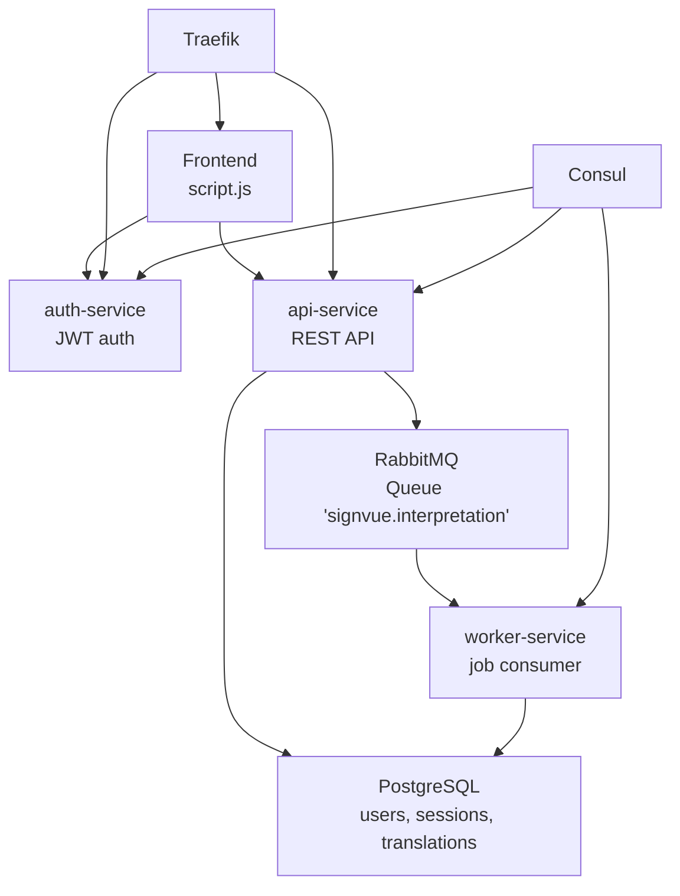
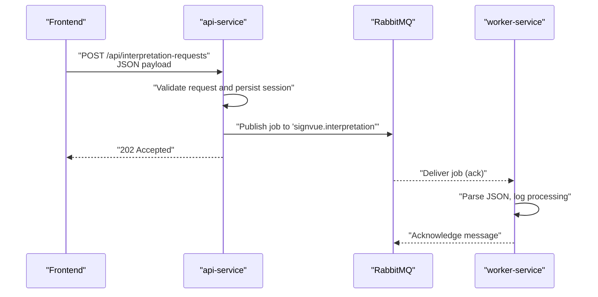
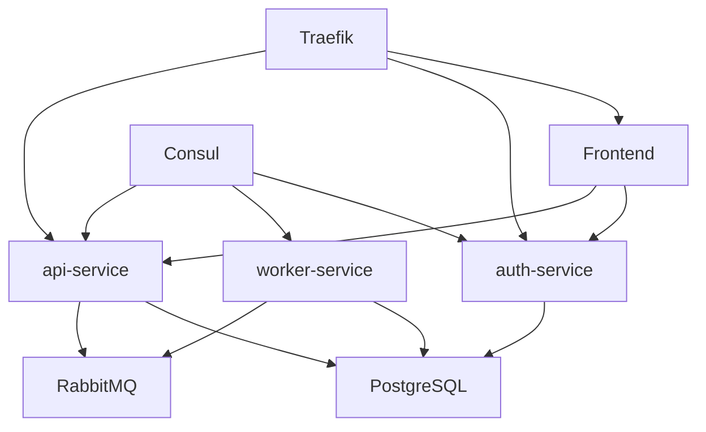

# Interpretation Request Processing

<cite>
**Referenced Files in This Document**
- [README.md](file://README.md)
- [docker-compose.yml](file://docker-compose.yml)
- [services/api-service/src/index.js](file://services/api-service/src/index.js)
- [services/api-service/src/db.js](file://services/api-service/src/db.js)
- [services/worker-service/src/index.js](file://services/worker-service/src/index.js)
- [services/auth-service/src/index.js](file://services/auth-service/src/index.js)
- [frontend/script.js](file://frontend/script.js)
- [infra/init-db.sql](file://infra/init-db.sql)
</cite>

## Table of Contents
1. [Introduction](#introduction)
2. [Project Structure](#project-structure)
3. [Core Components](#core-components)
4. [Architecture Overview](#architecture-overview)
5. [Detailed Component Analysis](#detailed-component-analysis)
6. [Dependency Analysis](#dependency-analysis)
7. [Performance Considerations](#performance-considerations)
8. [Troubleshooting Guide](#troubleshooting-guide)
9. [Conclusion](#conclusion)

## Introduction
This document explains the interpretation request processing workflow in the SignVue microservices architecture. It covers how requests are submitted, validated, queued asynchronously via RabbitMQ, and processed by a dedicated worker. It also documents message serialization, job distribution, input validation and sanitization, error handling, translation processing pipeline, result aggregation, retry mechanisms, dead letter queues, and monitoring approaches for reliability.

## Project Structure
The system is composed of:
- Frontend: Web UI that triggers interpretation requests
- auth-service: Authentication and JWT issuance
- api-service: Business API, session management, and interpretation request ingestion
- worker-service: RabbitMQ consumer that processes jobs
- RabbitMQ: Message broker for asynchronous job distribution
- PostgreSQL: Data persistence for users, sessions, and translations
- Consul: Service registration and health checks
- Traefik: Reverse proxy routing

**Diagram sources**
- [docker-compose.yml:1-137](file://docker-compose.yml#L1-L137)
- [services/api-service/src/index.js:1-133](file://services/api-service/src/index.js#L1-L133)
- [services/worker-service/src/index.js:1-88](file://services/worker-service/src/index.js#L1-L88)
- [services/auth-service/src/index.js:1-124](file://services/auth-service/src/index.js#L1-L124)
- [frontend/script.js:420-450](file://frontend/script.js#L420-L450)

**Section sources**
- [README.md:1-111](file://README.md#L1-L111)
- [docker-compose.yml:1-137](file://docker-compose.yml#L1-L137)

## Core Components
- Frontend triggers interpretation requests via a camera demo flow and sends a POST to the business API.
- api-service validates the request, persists session metadata, publishes a job to RabbitMQ, and responds with acceptance.
- worker-service consumes jobs from RabbitMQ, processes them (console logging), and acknowledges messages.
- auth-service manages JWT-based authentication used by the frontend and API.
- PostgreSQL stores user accounts, interpretation sessions, and translation records.
- Consul registers services and exposes health endpoints for monitoring.
- Traefik routes external traffic to the appropriate internal service.

Key integration points:
- RabbitMQ queue name: "signvue.interpretation"
- Queue durability: enabled
- Prefetch count: 1 to ensure fair distribution
- Health endpoints for Consul registration

**Section sources**
- [README.md:17-23](file://README.md#L17-L23)
- [services/api-service/src/index.js:1-133](file://services/api-service/src/index.js#L1-L133)
- [services/worker-service/src/index.js:1-88](file://services/worker-service/src/index.js#L1-L88)
- [services/auth-service/src/index.js:1-124](file://services/auth-service/src/index.js#L1-L124)
- [infra/init-db.sql:1-43](file://infra/init-db.sql#L1-L43)

## Architecture Overview
The interpretation request lifecycle spans the frontend, API, RabbitMQ, and worker service, with database persistence for sessions and translations.

**Diagram sources**
- [README.md:48-49](file://README.md#L48-L49)
- [services/api-service/src/index.js:1-133](file://services/api-service/src/index.js#L1-L133)
- [services/worker-service/src/index.js:45-81](file://services/worker-service/src/index.js#L45-L81)
- [frontend/script.js:429-435](file://frontend/script.js#L429-L435)

## Detailed Component Analysis

### Frontend Trigger and Payload
- The frontend starts a camera demo and sends a POST to the business API endpoint for interpretation requests.
- Request payload example:
  - Content-Type: application/json
  - Body: {"source":"demo-camera"}
- The frontend uses an API helper to send the request and handles errors silently during demo mode.

Processing status:
- The API returns 202 Accepted upon successful queue publication.

**Section sources**
- [frontend/script.js:429-435](file://frontend/script.js#L429-L435)
- [README.md:48-49](file://README.md#L48-L49)

### API Service: Request Validation, Persistence, and Publishing
Responsibilities:
- Validates incoming requests and persists session metadata.
- Publishes a job to RabbitMQ with a structured JSON payload.
- Returns HTTP 202 Accepted immediately after successful publish.

Message serialization pattern:
- Job payload is serialized as JSON and sent as the message body.
- The worker parses the message content and logs fields such as jobId, userId, and source.

Job distribution mechanism:
- Uses RabbitMQ durable queue "signvue.interpretation".
- Consumer prefetch is set to 1 to distribute work fairly among workers.

Error handling:
- Database readiness and migrations are performed at startup.
- API routes handle malformed JSON and database errors gracefully.

Note: The current implementation logs job details to console and does not implement translation processing or result aggregation. These steps are documented here as future enhancements.

**Section sources**
- [services/api-service/src/index.js:1-133](file://services/api-service/src/index.js#L1-L133)
- [services/api-service/src/db.js:1-84](file://services/api-service/src/db.js#L1-L84)
- [services/worker-service/src/index.js:45-81](file://services/worker-service/src/index.js#L45-L81)
- [infra/init-db.sql:22-43](file://infra/init-db.sql#L22-L43)

### Worker Service: Asynchronous Job Consumption
Responsibilities:
- Connects to RabbitMQ and declares the durable queue.
- Consumes messages with manual acknowledgment.
- Parses JSON payload and logs processing details.
- Acknowledges messages after processing.

Health monitoring:
- Exposes a health endpoint registered with Consul for service discovery.

Current processing behavior:
- Logs job details to console.
- Does not implement translation processing, result aggregation, or persistence.

**Section sources**
- [services/worker-service/src/index.js:1-88](file://services/worker-service/src/index.js#L1-L88)
- [docker-compose.yml:107-117](file://docker-compose.yml#L107-L117)

### Authentication and Authorization
- auth-service issues JWT tokens for login and verifies tokens for protected routes.
- The frontend uses JWT for authenticated interactions with the API.
- The API validates JWT locally using the shared secret.

**Section sources**
- [services/auth-service/src/index.js:1-124](file://services/auth-service/src/index.js#L1-L124)
- [README.md:19-21](file://README.md#L19-L21)

### Data Model and Storage
Tables relevant to interpretation requests:
- users: user account storage
- interpretation_sessions: session metadata for interpretation tasks
- translations: translation records with source/target languages

Indexes support filtering and sorting by user and creation time.

**Section sources**
- [infra/init-db.sql:1-43](file://infra/init-db.sql#L1-L43)
- [services/api-service/src/db.js:30-78](file://services/api-service/src/db.js#L30-L78)

## Dependency Analysis
External dependencies and integrations:
- RabbitMQ: durable queue "signvue.interpretation" for job distribution
- PostgreSQL: persistent storage for users, sessions, and translations
- Consul: service registration and health checks
- Traefik: reverse proxy routing to services

**Diagram sources**
- [docker-compose.yml:1-137](file://docker-compose.yml#L1-L137)
- [services/api-service/src/index.js:1-133](file://services/api-service/src/index.js#L1-L133)
- [services/worker-service/src/index.js:1-88](file://services/worker-service/src/index.js#L1-L88)
- [services/auth-service/src/index.js:1-124](file://services/auth-service/src/index.js#L1-L124)

**Section sources**
- [docker-compose.yml:1-137](file://docker-compose.yml#L1-L137)

## Performance Considerations
- Queue durability ensures messages survive broker restarts.
- Prefetch=1 prevents a single worker from overwhelming itself while enabling fair distribution.
- Health checks and Consul registration support auto-healing and load balancing.
- Consider adding worker scaling horizontally to increase throughput.

[No sources needed since this section provides general guidance]

## Troubleshooting Guide
Common issues and remedies:
- RabbitMQ connectivity failures: verify connection URL and broker availability; check container logs for connection errors.
- Worker consumption errors: inspect worker logs for JSON parsing failures or channel errors; ensure queue exists and is declared.
- API publishing failures: confirm RabbitMQ URL environment variable and queue declaration; check for database readiness and migrations.
- Health checks: verify Consul registration and health endpoints for each service.

Monitoring approaches:
- Use Consul UI to view registered services and health statuses.
- Use RabbitMQ Management UI to monitor queues, consumers, and message rates.
- Tail worker logs to observe job processing and acknowledgments.
- Use Traefik dashboard to validate routing and service exposure.

**Section sources**
- [services/worker-service/src/index.js:45-81](file://services/worker-service/src/index.js#L45-L81)
- [services/api-service/src/index.js:124-133](file://services/api-service/src/index.js#L124-L133)
- [docker-compose.yml:28-39](file://docker-compose.yml#L28-L39)
- [README.md:25-31](file://README.md#L25-L31)

## Conclusion
The interpretation request workflow leverages RabbitMQ for reliable asynchronous processing, with clear separation of concerns between the frontend, API, and worker services. While the current implementation focuses on queueing and basic logging, the architecture supports straightforward extensions for input validation, sanitization, translation processing, result aggregation, and robust retry/dead-letter strategies.