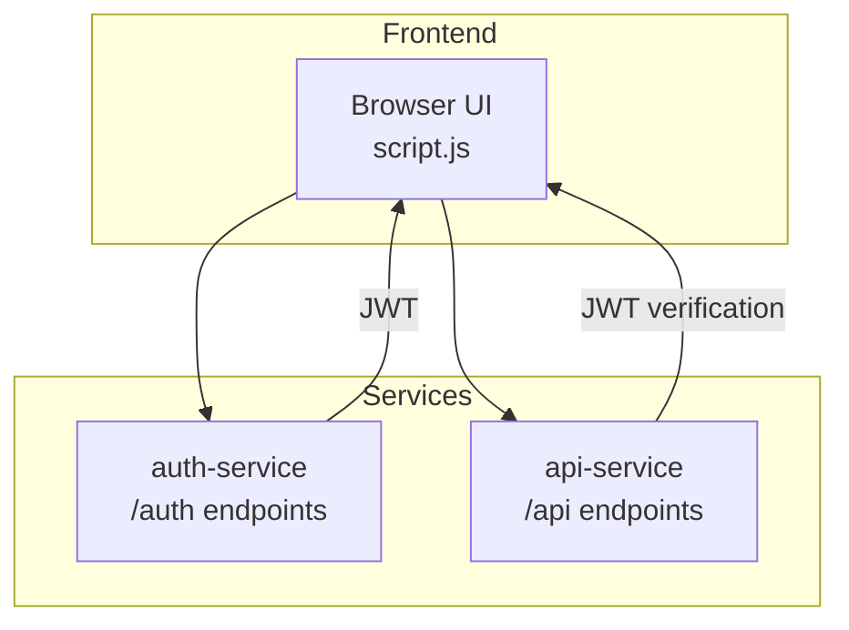
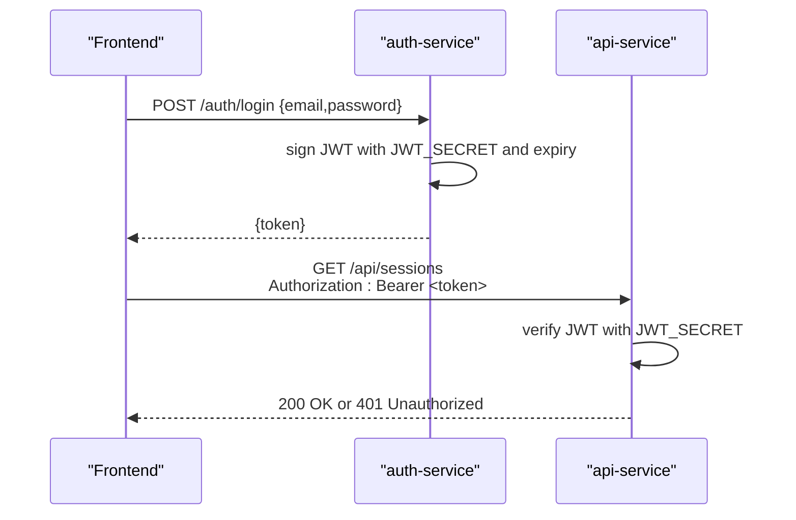
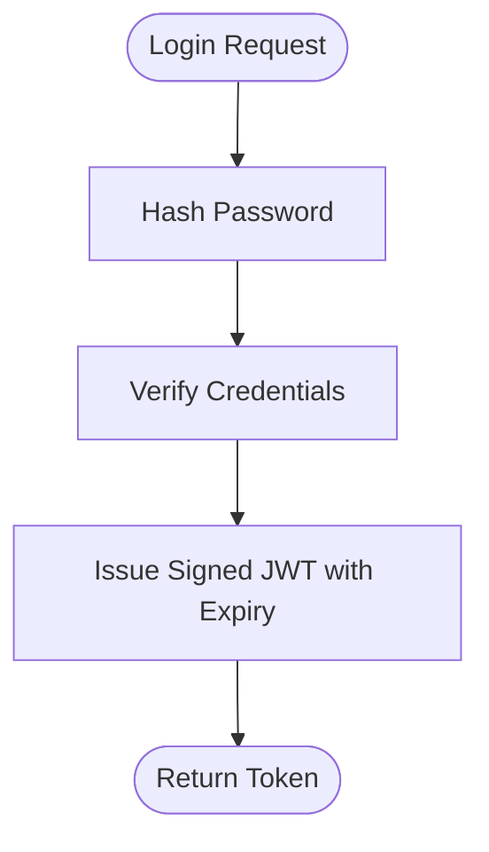
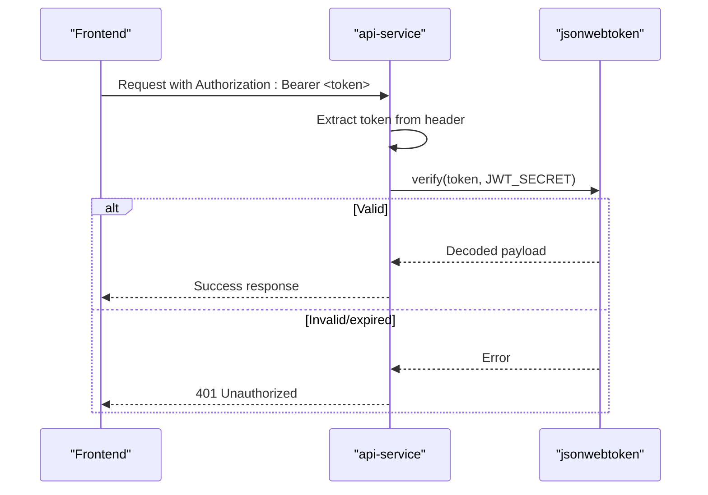
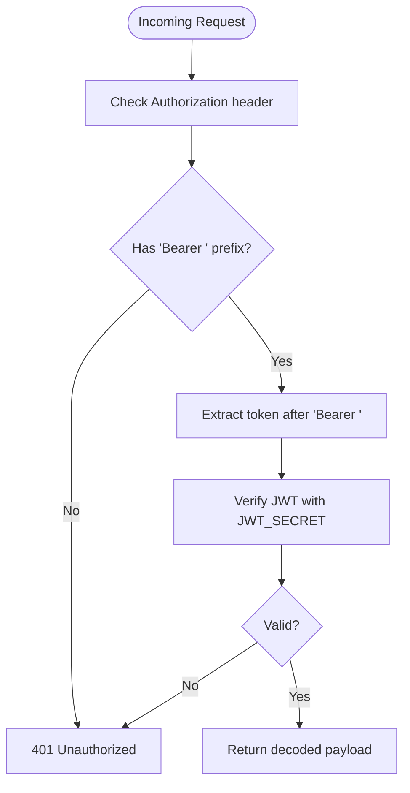
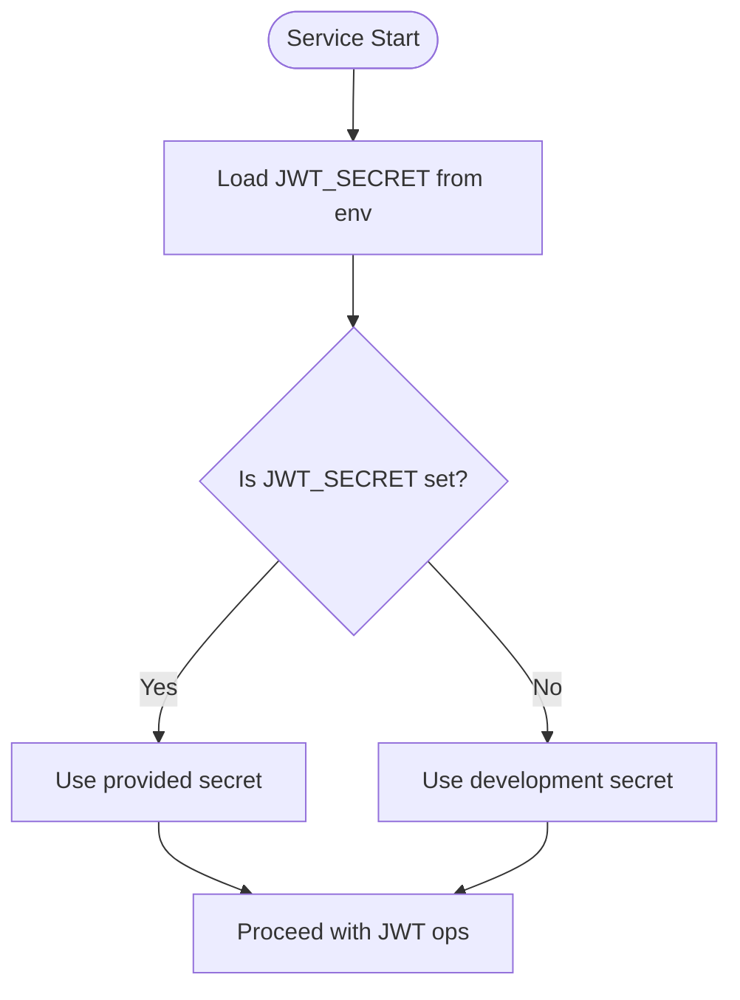
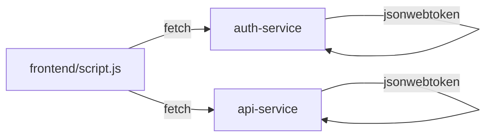

# JWT Authentication Middleware

<cite>
**Referenced Files in This Document**
- [README.md](file://README.md)
- [auth-service/src/index.js](file://services/auth-service/src/index.js)
- [api-service/src/index.js](file://services/api-service/src/index.js)
- [frontend/script.js](file://frontend/script.js)
- [frontend/config.js](file://frontend/config.js)
- [frontend/index.html](file://frontend/index.html)
- [auth-service/package.json](file://services/auth-service/package.json)
- [api-service/package.json](file://services/api-service/package.json)
</cite>

## Table of Contents
1. [Introduction](#introduction)
2. [Project Structure](#project-structure)
3. [Core Components](#core-components)
4. [Architecture Overview](#architecture-overview)
5. [Detailed Component Analysis](#detailed-component-analysis)
6. [Dependency Analysis](#dependency-analysis)
7. [Performance Considerations](#performance-considerations)
8. [Troubleshooting Guide](#troubleshooting-guide)
9. [Conclusion](#conclusion)
10. [Appendices](#appendices)

## Introduction
This document explains the JWT authentication implementation used by the API Service and related components. It covers token generation, signature verification, expiration handling, middleware-like protections, token extraction from headers, user context injection, configuration of JWT_SECRET, refresh strategies, and security best practices. It also documents how protected routes are enforced, how tokens are validated, and how errors are handled for invalid tokens. Token storage considerations, CSRF protection, and logout mechanisms are addressed.

## Project Structure
The authentication and API services are implemented as separate Express applications:
- auth-service: handles registration, login, and token issuance/verification.
- api-service: exposes business endpoints and verifies JWTs from clients.
- frontend: stores tokens and attaches them to requests.

**Diagram sources**
- [auth-service/src/index.js:1-124](file://services/auth-service/src/index.js#L1-L124)
- [api-service/src/index.js:1-133](file://services/api-service/src/index.js#L1-L133)
- [frontend/script.js:176-182](file://frontend/script.js#L176-L182)

**Section sources**
- [README.md:12-23](file://README.md#L12-L23)
- [auth-service/src/index.js:10-10](file://services/auth-service/src/index.js#L10-L10)
- [api-service/src/index.js:14-14](file://services/api-service/src/index.js#L14-L14)

## Core Components
- JWT_SECRET: shared secret used by auth-service and api-service for signing and verifying tokens. Defined via environment variable or defaults to a development value.
- Token generation: performed during login in auth-service and api-service using the shared JWT_SECRET and an expiration policy.
- Token verification: performed by api-service on incoming requests to protect business endpoints.
- Frontend token handling: stores the JWT and attaches it to Authorization headers for subsequent requests.

Key implementation references:
- JWT_SECRET definition and usage in auth-service and api-service.
- Token issuance with expiration in auth-service and api-service.
- Header parsing and verification logic in api-service.

**Section sources**
- [README.md:94-94](file://README.md#L94-L94)
- [auth-service/src/index.js:10-10](file://services/auth-service/src/index.js#L10-L10)
- [api-service/src/index.js:14-14](file://services/api-service/src/index.js#L14-L14)
- [auth-service/src/index.js:78-86](file://services/auth-service/src/index.js#L78-L86)
- [api-service/src/index.js:85-89](file://services/api-service/src/index.js#L85-L89)
- [api-service/src/index.js:107-121](file://services/api-service/src/index.js#L107-L121)

## Architecture Overview
The system uses a shared JWT_SECRET to issue signed tokens from auth-service and verify them in api-service. The frontend obtains a token upon successful login and includes it in the Authorization header for protected API calls.

**Diagram sources**
- [auth-service/src/index.js:52-94](file://services/auth-service/src/index.js#L52-L94)
- [api-service/src/index.js:61-104](file://services/api-service/src/index.js#L61-L104)
- [api-service/src/index.js:107-121](file://services/api-service/src/index.js#L107-L121)

## Detailed Component Analysis

### Token Generation and Expiration
- auth-service issues a JWT with subject, user identifier, and role, expiring in 1 hour.
- api-service issues a JWT with user identity, expiring in 7 days.
- Both rely on the same JWT_SECRET for signing.

**Diagram sources**
- [auth-service/src/index.js:78-86](file://services/auth-service/src/index.js#L78-L86)
- [api-service/src/index.js:85-89](file://services/api-service/src/index.js#L85-L89)

**Section sources**
- [auth-service/src/index.js:78-86](file://services/auth-service/src/index.js#L78-L86)
- [api-service/src/index.js:85-89](file://services/api-service/src/index.js#L85-L89)

### Signature Verification and Protected Routes
- api-service verifies the JWT on protected endpoints by extracting the Bearer token from the Authorization header and validating it against JWT_SECRET.
- On success, the endpoint proceeds; on failure, it returns 401 Unauthorized.

**Diagram sources**
- [api-service/src/index.js:107-121](file://services/api-service/src/index.js#L107-L121)

**Section sources**
- [api-service/src/index.js:107-121](file://services/api-service/src/index.js#L107-L121)

### Token Extraction from Headers and User Context Injection
- The Authorization header is parsed to extract the Bearer token.
- On successful verification, the decoded payload (including user identity and roles) is returned to the client, enabling user context in the UI.

**Diagram sources**
- [api-service/src/index.js:107-121](file://services/api-service/src/index.js#L107-L121)

**Section sources**
- [api-service/src/index.js:107-121](file://services/api-service/src/index.js#L107-L121)

### JWT_SECRET Configuration
- JWT_SECRET is loaded from environment variables in both services.
- A development fallback is used if the environment variable is missing.
- The README emphasizes setting JWT_SECRET in production.

**Diagram sources**
- [auth-service/src/index.js:10-10](file://services/auth-service/src/index.js#L10-L10)
- [api-service/src/index.js:14-14](file://services/api-service/src/index.js#L14-L14)
- [README.md:94-94](file://README.md#L94-L94)

**Section sources**
- [auth-service/src/index.js:10-10](file://services/auth-service/src/index.js#L10-L10)
- [api-service/src/index.js:14-14](file://services/api-service/src/index.js#L14-L14)
- [README.md:94-94](file://README.md#L94-L94)

### Token Refresh Strategies
- Current implementation does not include a dedicated refresh endpoint.
- Recommendation: Introduce a /refresh endpoint in auth-service that accepts a short-lived JWT and returns a new signed token with a fresh expiry. Store refresh tokens server-side in a revocable store for enhanced security.

[No sources needed since this section provides general guidance]

### Security Best Practices
- Use HTTPS in production to prevent token interception.
- Set HttpOnly and SameSite cookies for tokens if stored in cookies; otherwise, store tokens securely in memory or secure storage.
- Enforce short token lifetimes and implement refresh flows.
- Add rate limiting and input validation to mitigate abuse.
- Rotate JWT_SECRET periodically and invalidate existing tokens.

[No sources needed since this section provides general guidance]

### Examples of Protected Route Implementation
- Example pattern: Require Authorization: Bearer <token> on GET /api/sessions and verify with JWT_SECRET.
- On success, return session data; on failure, return 401 Unauthorized.

**Section sources**
- [api-service/src/index.js:107-121](file://services/api-service/src/index.js#L107-L121)

### Token Validation Flows
- Parse Authorization header.
- Split by space and take the second element as the token.
- Verify with JWT_SECRET; handle errors by returning 401.

**Section sources**
- [api-service/src/index.js:107-121](file://services/api-service/src/index.js#L107-L121)

### Error Handling for Invalid Tokens
- Missing or malformed Authorization header yields 401.
- Malformed or expired token yields 401 with a descriptive message.

**Section sources**
- [api-service/src/index.js:107-121](file://services/api-service/src/index.js#L107-L121)

### Token Storage Considerations
- Frontend stores the JWT in localStorage and attaches it to Authorization headers for subsequent requests.
- Recommendation: Prefer HttpOnly cookies for tokens when using traditional web apps to mitigate XSS risks. For SPA, keep tokens in memory and use secure storage APIs.

**Section sources**
- [frontend/script.js:160-167](file://frontend/script.js#L160-L167)
- [frontend/script.js:176-182](file://frontend/script.js#L176-L182)

### CSRF Protection
- CSRF is mitigated by using Authorization headers rather than cookies for state-changing requests.
- Recommendation: For cookie-based flows, add CSRF tokens and SameSite=Lax|Strict policies.

[No sources needed since this section provides general guidance]

### Logout Mechanisms
- Frontend clears stored tokens and session data on logout.
- Recommendation: Implement a server-side blacklist or short-lived tokens to immediately invalidate sessions.

**Section sources**
- [frontend/script.js:678-694](file://frontend/script.js#L678-L694)

## Dependency Analysis
Both services depend on jsonwebtoken for signing and verification. The frontend depends on fetch and localStorage for token handling.

**Diagram sources**
- [auth-service/package.json:13-14](file://services/auth-service/package.json#L13-L14)
- [api-service/package.json:14-14](file://services/api-service/package.json#L14-L14)
- [frontend/script.js:176-182](file://frontend/script.js#L176-L182)

**Section sources**
- [auth-service/package.json:13-14](file://services/auth-service/package.json#L13-L14)
- [api-service/package.json:14-14](file://services/api-service/package.json#L14-L14)
- [frontend/script.js:176-182](file://frontend/script.js#L176-L182)

## Performance Considerations
- Keep JWT_SECRET unchanged during runtime to avoid unnecessary reloads.
- Prefer short token lifetimes with efficient refresh mechanisms to minimize verification overhead.
- Cache verification results only for short durations if needed.

[No sources needed since this section provides general guidance]

## Troubleshooting Guide
- 401 Unauthorized on protected routes:
  - Ensure Authorization header includes Bearer <token>.
  - Confirm JWT_SECRET matches between services.
  - Verify token is not expired.
- 400 Bad Request on login/register:
  - Check required fields and credentials.
- Network errors:
  - Confirm service availability and CORS configuration.

**Section sources**
- [api-service/src/index.js:107-121](file://services/api-service/src/index.js#L107-L121)
- [auth-service/src/index.js:13-50](file://services/auth-service/src/index.js#L13-L50)
- [api-service/src/index.js:27-59](file://services/api-service/src/index.js#L27-L59)

## Conclusion
The JWT authentication implementation relies on a shared JWT_SECRET to sign tokens in auth-service and verify them in api-service. The frontend manages tokens and attaches them to requests. To harden the system, introduce a refresh endpoint, enforce HTTPS, consider cookie-based storage with HttpOnly and SameSite, and implement logout and blacklist strategies.

[No sources needed since this section summarizes without analyzing specific files]

## Appendices
- Environment variables:
  - JWT_SECRET: shared secret for signing/verifying JWTs.
  - DATABASE_URL: database connection string for api-service.
- Frontend configuration:
  - Base API URL can be overridden via meta tag or global variable.

**Section sources**
- [README.md:94-94](file://README.md#L94-L94)
- [api-service/src/db.js:3-8](file://services/api-service/src/db.js#L3-L8)
- [frontend/config.js:7-17](file://frontend/config.js#L7-L17)