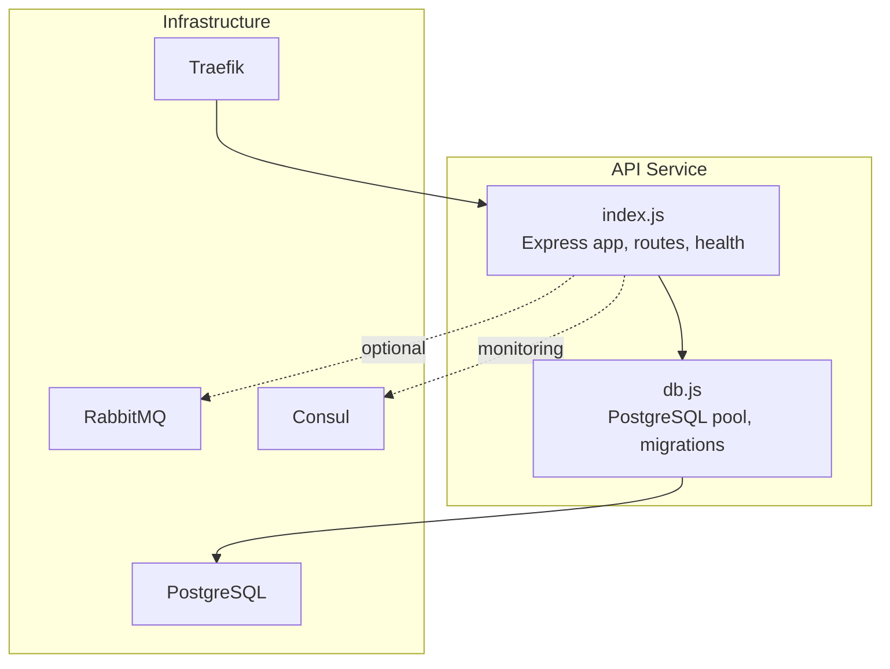
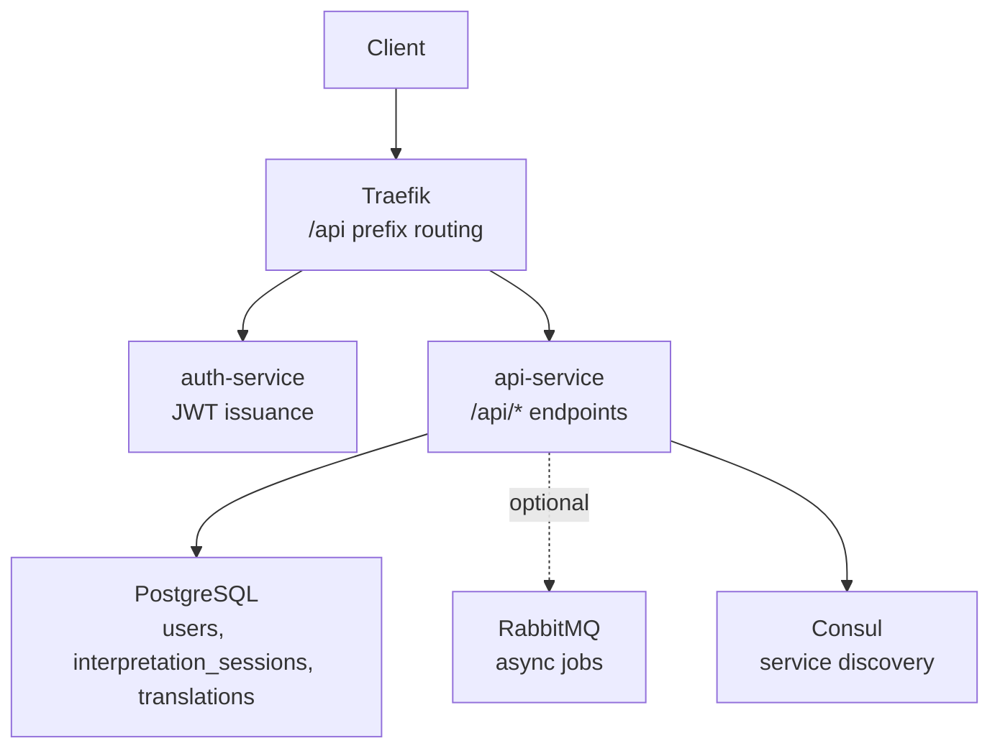
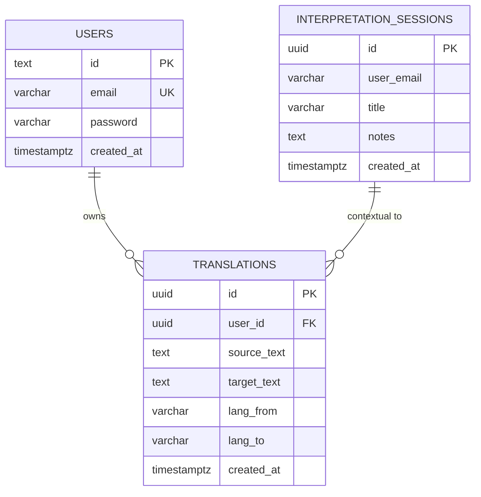
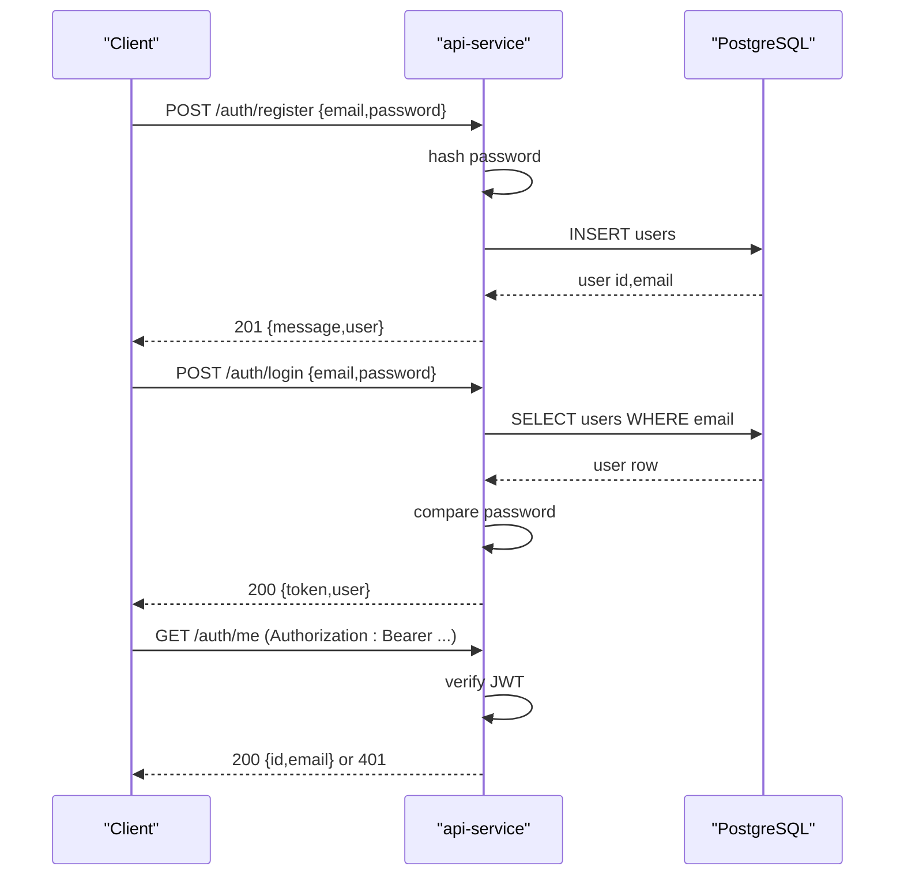
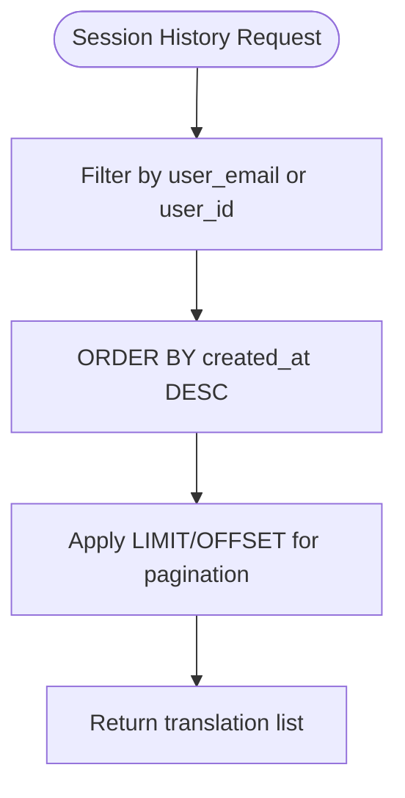
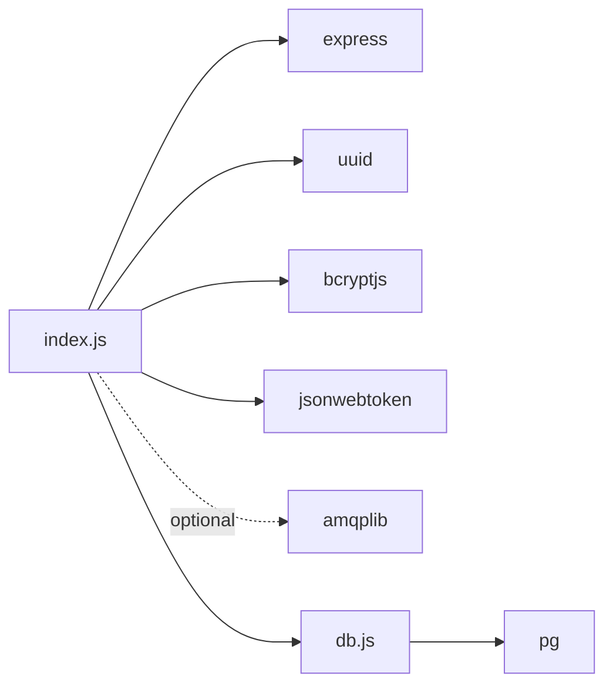

# Session Management

<cite>
**Referenced Files in This Document**
- [index.js](file://services/api-service/src/index.js)
- [db.js](file://services/api-service/src/db.js)
- [init-db.sql](file://infra/init-db.sql)
- [docker-compose.yml](file://docker-compose.yml)
- [README.md](file://README.md)
- [package.json](file://services/api-service/package.json)
</cite>

## Table of Contents
1. [Introduction](#introduction)
2. [Project Structure](#project-structure)
3. [Core Components](#core-components)
4. [Architecture Overview](#architecture-overview)
5. [Detailed Component Analysis](#detailed-component-analysis)
6. [Dependency Analysis](#dependency-analysis)
7. [Performance Considerations](#performance-considerations)
8. [Troubleshooting Guide](#troubleshooting-guide)
9. [Conclusion](#conclusion)
10. [Appendices](#appendices)

## Introduction
This document describes the session management system within the API Service. It focuses on the lifecycle of interpretation sessions, including creation, retrieval, updates, and deletion. It also documents the database schema relationships between sessions and translations, indexing and query optimization strategies, transaction handling, concurrency considerations, timeouts, and cleanup procedures. Where applicable, examples of request shapes and response outcomes are provided with precise source references.

## Project Structure
The API Service exposes authentication endpoints and defines session-related endpoints in the public documentation. The runtime implementation currently includes authentication handlers and database initialization/migrations. The session CRUD endpoints are documented in the public API guide but are not present in the current implementation files.

**Diagram sources**
- [index.js:123-133](file://services/api-service/src/index.js#L123-L133)
- [db.js:10-27](file://services/api-service/src/db.js#L10-L27)
- [docker-compose.yml:40-58](file://docker-compose.yml#L40-L58)
- [docker-compose.yml:28-38](file://docker-compose.yml#L28-L38)
- [docker-compose.yml:20-27](file://docker-compose.yml#L20-L27)
- [docker-compose.yml:4-18](file://docker-compose.yml#L4-L18)

**Section sources**
- [README.md:44-50](file://README.md#L44-L50)
- [index.js:123-133](file://services/api-service/src/index.js#L123-L133)
- [db.js:30-78](file://services/api-service/src/db.js#L30-L78)
- [docker-compose.yml:80-106](file://docker-compose.yml#L80-L106)

## Core Components
- Express application and middleware: CORS, JSON body parsing, health endpoint.
- Authentication endpoints: register, login, verify.
- Database integration: connection pool, migration, and wait-for-database logic.
- Session-related endpoints: documented in the public API guide but not yet implemented in the current codebase.

Key implementation references:
- Health check and startup sequence: [index.js:16-24](file://services/api-service/src/index.js#L16-L24), [index.js:123-133](file://services/api-service/src/index.js#L123-L133)
- Authentication handlers: [index.js:26-121](file://services/api-service/src/index.js#L26-L121)
- Database pool and migrations: [db.js:10-27](file://services/api-service/src/db.js#L10-L27), [db.js:30-78](file://services/api-service/src/db.js#L30-L78)
- Public API documentation for sessions: [README.md:46-49](file://README.md#L46-L49)

**Section sources**
- [index.js:16-24](file://services/api-service/src/index.js#L16-L24)
- [index.js:26-121](file://services/api-service/src/index.js#L26-L121)
- [index.js:123-133](file://services/api-service/src/index.js#L123-L133)
- [db.js:10-27](file://services/api-service/src/db.js#L10-L27)
- [db.js:30-78](file://services/api-service/src/db.js#L30-L78)
- [README.md:46-49](file://README.md#L46-L49)

## Architecture Overview
The API Service integrates with PostgreSQL for persistence, optionally interacts with RabbitMQ for asynchronous tasks, registers with Consul for service discovery, and is exposed via Traefik. Session management is planned to be exposed under the /api prefix with JWT-protected endpoints.

**Diagram sources**
- [docker-compose.yml:4-18](file://docker-compose.yml#L4-L18)
- [docker-compose.yml:59-79](file://docker-compose.yml#L59-L79)
- [docker-compose.yml:80-106](file://docker-compose.yml#L80-L106)
- [docker-compose.yml:107-117](file://docker-compose.yml#L107-L117)
- [docker-compose.yml:20-27](file://docker-compose.yml#L20-L27)
- [README.md:34-50](file://README.md#L34-L50)

## Detailed Component Analysis

### Database Schema and Relationships
The schema supports:
- Users: identity and credentials.
- Interpretation sessions: per-user sessions with UUID primary keys and timestamps.
- Translations: per-user translations with foreign keys and indexes.

- Primary keys: users.id, interpretation_sessions.id, translations.id.
- Indexes: sessions by user_email, translations by user_id and created_at descending.
- Constraints: user_email is not enforced as a foreign key; user_id references users(id) with ON DELETE SET NULL.

**Diagram sources**
- [db.js:32-47](file://services/api-service/src/db.js#L32-L47)
- [db.js:56-75](file://services/api-service/src/db.js#L56-L75)
- [init-db.sql:3-28](file://infra/init-db.sql#L3-L28)
- [init-db.sql:32-44](file://infra/init-db.sql#L32-L44)

**Section sources**
- [db.js:30-78](file://services/api-service/src/db.js#L30-L78)
- [init-db.sql:1-44](file://infra/init-db.sql#L1-L44)

### Session Lifecycle and CRUD Workflows
The public API documentation outlines session endpoints under /api. The current implementation does not expose these endpoints. The following workflows describe the intended behavior based on the documented API.

- Creation
  - Endpoint: POST /api/sessions
  - Request body: { "user_email", "title", "notes" }
  - Behavior: Create a new session with a generated UUID and timestamp.
  - Persistence: Insert into interpretation_sessions with id, user_email, title, notes, created_at.
  - Response: 201 with the created session object.

- Retrieval
  - Endpoint: GET /api/sessions
  - Query parameters: filter by user_email (and potentially pagination/admin filtering).
  - Behavior: List sessions for a given user; admin may list all sessions.
  - Persistence: SELECT with ORDER BY created_at DESC; optional LIMIT/OFFSET.
  - Response: Array of sessions.

- Retrieval by ID
  - Endpoint: GET /api/sessions/:id
  - Behavior: Fetch a single session by UUID.
  - Persistence: SELECT by id.
  - Response: Session object or 404.

- Update
  - Endpoint: PUT /api/sessions/:id
  - Request body: { "title", "notes" }
  - Behavior: Update mutable fields; preserve immutable fields (id, created_at).
  - Persistence: UPDATE by id.
  - Response: Updated session object or 404.

- Deletion
  - Endpoint: DELETE /api/sessions/:id
  - Behavior: Remove a session by UUID.
  - Persistence: DELETE by id.
  - Response: 204 No Content or 404.

Notes:
- Authorization: All /api endpoints are protected by JWT verification.
- Filtering: Non-admin users can only access their own sessions; admins can access all sessions.
- Ordering: Sessions are ordered by created_at DESC for history views.

**Section sources**
- [README.md:46-49](file://README.md#L46-L49)
- [index.js:106-121](file://services/api-service/src/index.js#L106-L121)

### Authentication and Authorization
- Register: Hashes password and inserts a new user row with a generated id.
- Login: Verifies credentials and issues a signed JWT with expiration.
- Verify: Validates the Authorization header and decodes the JWT.

**Diagram sources**
- [index.js:26-59](file://services/api-service/src/index.js#L26-L59)
- [index.js:61-104](file://services/api-service/src/index.js#L61-L104)
- [index.js:106-121](file://services/api-service/src/index.js#L106-L121)

**Section sources**
- [index.js:26-59](file://services/api-service/src/index.js#L26-L59)
- [index.js:61-104](file://services/api-service/src/index.js#L61-L104)
- [index.js:106-121](file://services/api-service/src/index.js#L106-L121)

### Translation Context and History Management
Translations are stored with user_id and created_at. The schema includes:
- Index on user_id for efficient per-user queries.
- Index on created_at DESC for recent-first ordering.

**Diagram sources**
- [db.js:67-75](file://services/api-service/src/db.js#L67-L75)
- [init-db.sql:42-43](file://infra/init-db.sql#L42-L43)

**Section sources**
- [db.js:56-75](file://services/api-service/src/db.js#L56-L75)
- [init-db.sql:32-44](file://infra/init-db.sql#L32-L44)

### Implementation Gaps and Next Steps
- The current implementation lacks session endpoints (POST/GET/PUT/DELETE /api/sessions). These are documented in the public API guide.
- The session model references user_email in interpretation_sessions, while the users table uses id. This mismatch should be addressed during implementation to ensure referential integrity and consistent filtering.

Recommended actions:
- Add session endpoints in index.js.
- Align session ownership model with either user_email or user_id.
- Implement JWT-protected routes for session CRUD.
- Add transaction boundaries around write operations when needed.
- Introduce session state tracking if required beyond creation/deletion.

**Section sources**
- [README.md:46-49](file://README.md#L46-L49)
- [db.js:40-47](file://services/api-service/src/db.js#L40-L47)
- [init-db.sql:22-28](file://infra/init-db.sql#L22-L28)

## Dependency Analysis
External dependencies and runtime integrations:
- Express for HTTP routing and middleware.
- pg for PostgreSQL connectivity.
- uuid for generating session identifiers.
- bcryptjs and jsonwebtoken for authentication.
- RabbitMQ and Consul are configured for optional integration.

**Diagram sources**
- [package.json:9-17](file://services/api-service/package.json#L9-L17)
- [index.js:1-6](file://services/api-service/src/index.js#L1-L6)
- [db.js:1-2](file://services/api-service/src/db.js#L1-L2)

**Section sources**
- [package.json:9-17](file://services/api-service/package.json#L9-L17)
- [index.js:1-6](file://services/api-service/src/index.js#L1-L6)
- [db.js:1-2](file://services/api-service/src/db.js#L1-L2)

## Performance Considerations
- Indexes
  - sessions.user_email: accelerates filtering by user_email.
  - translations.user_id: accelerates per-user translation queries.
  - translations.created_at DESC: supports recent-first ordering without explicit sorting.
- Query patterns
  - Prefer filtered queries with ORDER BY created_at DESC and LIMIT/OFFSET for pagination.
  - Use prepared statements and parameterized queries to avoid SQL injection and improve plan reuse.
- Transactions
  - Wrap multi-statement writes (e.g., create session plus initial translation) in a transaction to maintain consistency.
- Concurrency
  - Use database-level constraints (UNIQUE, NOT NULL) and appropriate isolation levels.
  - Apply optimistic locking if needed for update conflicts.
- Timeouts
  - Configure statement timeouts and idle-in-transaction timeouts at the database level to prevent resource leaks.

[No sources needed since this section provides general guidance]

## Troubleshooting Guide
- Database connectivity
  - The service waits for PostgreSQL readiness before starting. Failures indicate misconfiguration or network issues.
  - Verify DATABASE_URL and container health checks.
- Authentication failures
  - Missing or invalid Authorization header yields 401.
  - Incorrect credentials yield 401 on login.
- Session endpoints not found
  - The current implementation does not expose /api/sessions endpoints. Implement them according to the documented API.
- Data inconsistencies
  - Ensure session ownership aligns with either user_email or user_id to avoid filtering issues.
- Asynchronous processing
  - RabbitMQ integration is optional. Confirm connectivity and queue consumption if interpretation requests are used.

**Section sources**
- [index.js:15-27](file://services/api-service/src/index.js#L15-L27)
- [index.js:106-121](file://services/api-service/src/index.js#L106-L121)
- [README.md:46-49](file://README.md#L46-L49)
- [docker-compose.yml:82-86](file://docker-compose.yml#L82-L86)

## Conclusion
The API Service currently provides authentication and database infrastructure for session management. The documented session endpoints are not yet implemented. To complete the system:
- Implement session CRUD endpoints under /api/sessions.
- Align session ownership semantics with the users table.
- Add transaction handling for write operations.
- Introduce session state tracking and lifecycle controls as needed.
- Maintain performance through proper indexing and query patterns.

[No sources needed since this section summarizes without analyzing specific files]

## Appendices

### Example Shapes and References
- Session creation request shape: [README.md:46](file://README.md#L46)
- Session retrieval by user: [README.md:46](file://README.md#L46)
- Session history management: [README.md:46](file://README.md#L46)
- Translation history ordering: [db.js:72-75](file://services/api-service/src/db.js#L72-L75)

**Section sources**
- [README.md:46](file://README.md#L46)
- [db.js:72-75](file://services/api-service/src/db.js#L72-L75)