# Authentication Service

<cite>
**Referenced Files in This Document**
- [package.json](file://services/auth-service/package.json)
- [index.js](file://services/auth-service/src/index.js)
- [db.js](file://services/auth-service/src/db.js)
- [index.js](file://services/api-service/src/index.js)
- [docker-compose.yml](file://docker-compose.yml)
- [init-db.sql](file://infra/init-db.sql)
- [README.md](file://README.md)
- [script.js](file://frontend/script.js)
- [config.js](file://frontend/config.js)
- [verify-email.html](file://frontend/verify-email.html)
</cite>

## Update Summary
**Changes Made**
- Added comprehensive email verification system with SMTP configuration and Nodemailer integration
- Implemented email verification token management with automatic cleanup
- Added new email verification endpoints: `/auth/verify-email` and `/auth/resend-verification`
- Updated registration workflow to require email verification before login access
- Enhanced database schema with verification fields (verified, verify_token)
- Added frontend verification page and resend verification functionality
- Updated authentication flow to prevent login until email verification

## Table of Contents
1. [Introduction](#introduction)
2. [Project Structure](#project-structure)
3. [Core Components](#core-components)
4. [Architecture Overview](#architecture-overview)
5. [Detailed Component Analysis](#detailed-component-analysis)
6. [Email Verification System](#email-verification-system)
7. [Frontend Authentication System](#frontend-authentication-system)
8. [Dependency Analysis](#dependency-analysis)
9. [Performance Considerations](#performance-considerations)
10. [Troubleshooting Guide](#troubleshooting-guide)
11. [Conclusion](#conclusion)

## Introduction
This document describes the Authentication Service responsible for user registration, login, and JWT-based authentication with comprehensive email verification. The service now includes a complete email verification workflow using SMTP configuration, Nodemailer integration, and verification token management. It explains the JWT token generation and verification flows, password hashing with bcryptjs, database schema for user management, and integration with the API gateway and frontend. The system includes enhanced frontend authentication chrome rendering, comprehensive logging capabilities, and demo access support.

## Project Structure
The Authentication Service is implemented as a Node.js/Express application packaged as a containerized microservice. It exposes five primary endpoints under the /auth prefix including new email verification functionality and integrates with a shared JWT secret and a PostgreSQL database initialized by the provided SQL schema. The frontend authentication system supports both remote API authentication and local demo mode.

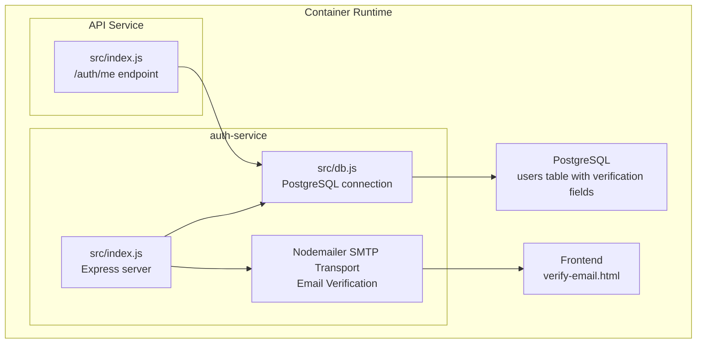

**Diagram sources**
- [index.js:1-273](file://services/auth-service/src/index.js#L1-L273)
- [index.js:106-121](file://services/api-service/src/index.js#L106-L121)
- [db.js:1-13](file://services/auth-service/src/db.js#L1-L13)
- [verify-email.html:1-148](file://frontend/verify-email.html#L1-L148)

**Section sources**
- [docker-compose.yml:59-79](file://docker-compose.yml#L59-L79)
- [README.md:12-23](file://README.md#L12-L23)

## Core Components
- Express server with JSON body parsing and CORS disabled for simplicity.
- PostgreSQL client configured via DATABASE_URL environment variable.
- JWT secret sourced from JWT_SECRET environment variable.
- Nodemailer integration for email verification with configurable SMTP settings.
- Five primary routes:
  - POST /auth/register: Registers a new user and sends verification email.
  - GET /auth/verify-email: Verifies user email using token.
  - POST /auth/login: Authenticates a user after email verification.
  - POST /auth/resend-verification: Resends verification email to pending users.
  - GET /auth/verify: Verifies a JWT passed in Authorization header.
- **New**: GET /auth/me: Retrieves authenticated user information (in API service).

Key implementation references:
- Route handlers and middleware: [index.js:80-273](file://services/auth-service/src/index.js#L80-L273)
- Database connection: [db.js:1-13](file://services/auth-service/src/db.js#L1-L13)
- Dependencies: [package.json:9-16](file://services/auth-service/package.json#L9-L16)

**Section sources**
- [index.js:80-273](file://services/auth-service/src/index.js#L80-L273)
- [db.js:1-13](file://services/auth-service/src/db.js#L1-L13)
- [package.json:1-19](file://services/auth-service/package.json#L1-L19)

## Architecture Overview
The Authentication Service participates in a multi-service deployment orchestrated by Docker Compose. Traefik routes requests to the auth-service for /auth endpoints. The service relies on a shared JWT_SECRET, SMTP configuration for email verification, and a PostgreSQL instance initialized by init-db.sql. The frontend supports both remote authentication via the auth-service and local demo mode.

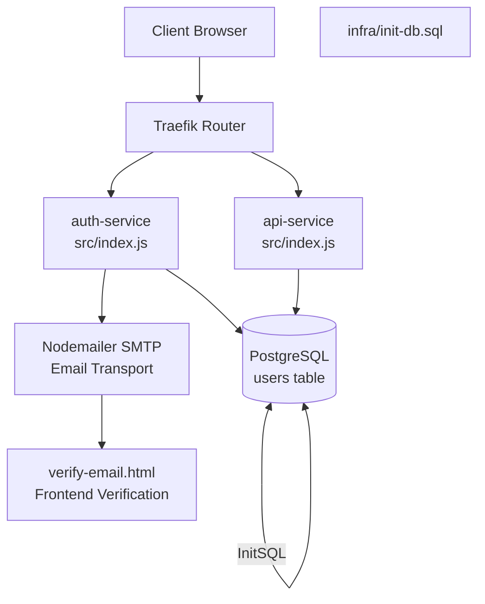

**Diagram sources**
- [docker-compose.yml:4-137](file://docker-compose.yml#L4-L137)
- [index.js:80-273](file://services/auth-service/src/index.js#L80-L273)
- [index.js:106-121](file://services/api-service/src/index.js#L106-L121)
- [init-db.sql:1-46](file://infra/init-db.sql#L1-L46)
- [verify-email.html:1-148](file://frontend/verify-email.html#L1-L148)

**Section sources**
- [docker-compose.yml:59-79](file://docker-compose.yml#L59-L79)
- [README.md:34-43](file://README.md#L34-L43)

## Detailed Component Analysis

### JWT-Based Authentication Implementation
- Secret Management: JWT_SECRET is loaded from environment variables. In development, it defaults to a dev value; in production, it should be set securely.
- Token Issuance: On successful login, a JWT is signed with claims including subject, user ID, and role, with an expiration of 1 hour.
- Token Verification: The verify endpoint extracts the Bearer token from the Authorization header and validates it against the shared secret.

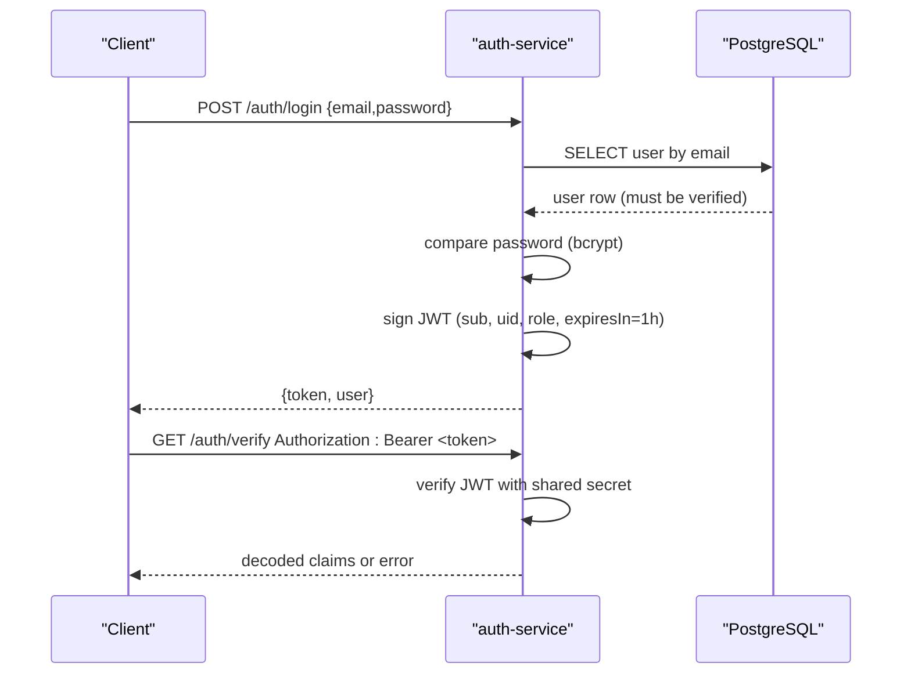

**Diagram sources**
- [index.js:160-206](file://services/auth-service/src/index.js#L160-L206)

**Section sources**
- [index.js:190-200](file://services/auth-service/src/index.js#L190-L200)
- [index.js:242-258](file://services/auth-service/src/index.js#L242-L258)

### User Registration Workflow
- Input Validation: Rejects missing email or password.
- Uniqueness Check: Queries users by email; returns conflict if found and verified.
- Token Generation: Generates UUID verification token for new users.
- Password Hashing: Uses bcryptjs to hash the password with a salt factor.
- Persistence: Inserts a new user record with verification fields and hashed password.
- Email Sending: Sends verification email with token to user's email address.
- Response: Returns success with user identifiers and verification instructions.

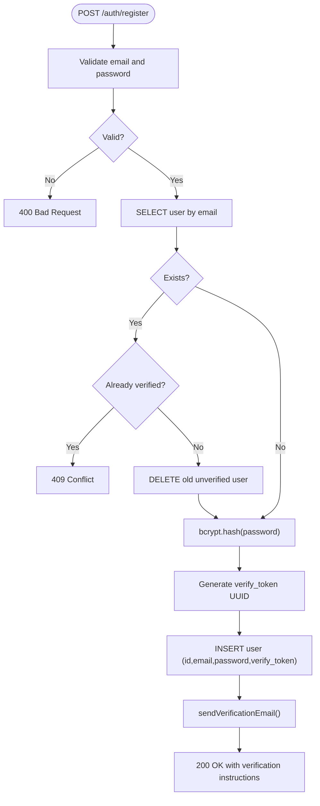

**Diagram sources**
- [index.js:80-127](file://services/auth-service/src/index.js#L80-L127)

**Section sources**
- [index.js:80-127](file://services/auth-service/src/index.js#L80-L127)

### Email Verification Workflow
- Token Validation: Validates verification token from query parameters.
- User Lookup: Finds user by verification token and ensures they are unverified.
- Verification Process: Marks user as verified and clears verification token.
- Success Response: Confirms email verification completion.
- Error Handling: Handles invalid tokens and server errors gracefully.

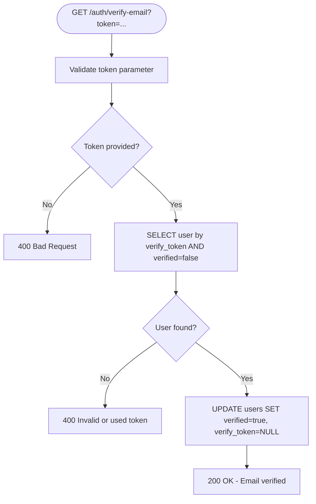

**Diagram sources**
- [index.js:129-158](file://services/auth-service/src/index.js#L129-L158)

**Section sources**
- [index.js:129-158](file://services/auth-service/src/index.js#L129-L158)

### Login Workflow
- Input Validation: Rejects missing credentials.
- Lookup: Finds user by email.
- Verification Check: Ensures user has completed email verification.
- Authentication: Compares provided password with stored hash.
- Token Generation: Issues a signed JWT with subject, user ID, and role.
- Response: Returns the token and user information.

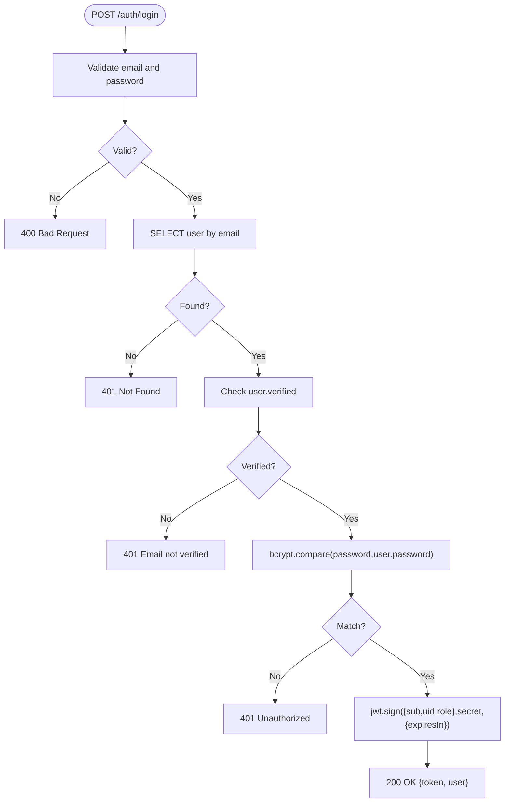

**Diagram sources**
- [index.js:160-206](file://services/auth-service/src/index.js#L160-L206)

**Section sources**
- [index.js:160-206](file://services/auth-service/src/index.js#L160-L206)

### Role-Based Access Control (RBAC)
- Role Field: The users table includes a role field with default USER.
- First Account: The README indicates that the first account created receives ADMIN privileges.
- Token Claims: Login includes role in JWT claims for downstream services to enforce policies.

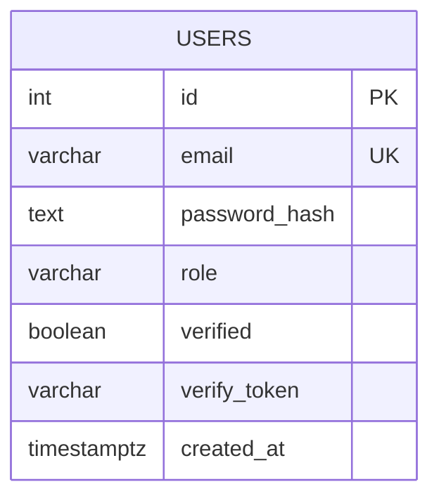

**Diagram sources**
- [init-db.sql:3-11](file://infra/init-db.sql#L3-L11)

**Section sources**
- [init-db.sql:3-11](file://infra/init-db.sql#L3-L11)
- [README.md:32](file://README.md#L32)

### Database Schema for User Management
The initialization script defines:
- users: id, email, password_hash, role, verified, verify_token, created_at
- refresh_tokens: id, user_id, token_hash, expires_at (for optional refresh tokens)
- Indexes on user_id and token_hash for efficient lookup
- Additional tables for interpretation sessions and translations

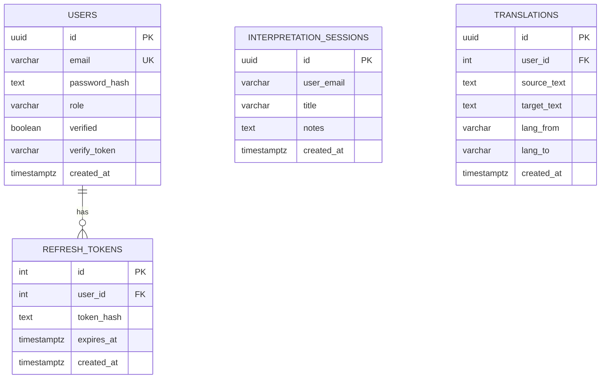

**Diagram sources**
- [init-db.sql:1-46](file://infra/init-db.sql#L1-L46)

**Section sources**
- [init-db.sql:1-46](file://infra/init-db.sql#L1-L46)

### API Endpoints and Schemas
- POST /auth/register
  - Request: { email, password }
  - Response: { message, userId, email }
  - Status Codes: 200, 400, 409, 500
- GET /auth/verify-email
  - Query: token (verification token)
  - Response: { message }
  - Status Codes: 200, 400, 500
- POST /auth/login
  - Request: { email, password }
  - Response: { token, user: { email, role } }
  - Status Codes: 200, 400, 401, 500
- POST /auth/resend-verification
  - Request: { email }
  - Response: { message }
  - Status Codes: 200, 400, 500
- GET /auth/verify
  - Headers: Authorization: Bearer <token>
  - Response: Decoded JWT claims or { message }
  - Status Codes: 200, 401
- **New**: GET /auth/me
  - Headers: Authorization: Bearer <token>
  - Response: Decoded JWT claims with user information
  - Status Codes: 200, 401

Note: The verify endpoint reads Authorization header and verifies the JWT using the shared secret.

**Section sources**
- [index.js:80-273](file://services/auth-service/src/index.js#L80-L273)
- [index.js:106-121](file://services/api-service/src/index.js#L106-L121)

### Authentication Middleware
- Header Parsing: Extracts Authorization header and ensures it starts with "Bearer ".
- Token Verification: Validates JWT signature and expiration using the shared secret.
- Error Handling: Returns 401 for malformed or invalid tokens.

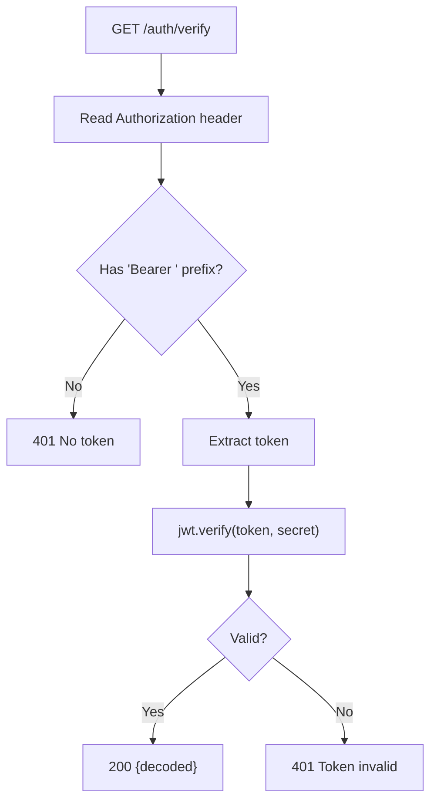

**Diagram sources**
- [index.js:242-258](file://services/auth-service/src/index.js#L242-L258)

**Section sources**
- [index.js:242-258](file://services/auth-service/src/index.js#L242-L258)

## Email Verification System

### SMTP Configuration and Nodemailer Integration
The authentication service includes comprehensive email verification functionality powered by Nodemailer with flexible SMTP configuration:

- **Production SMTP**: Configurable via SMTP_HOST, SMTP_PORT, SMTP_USER, and SMTP_PASS environment variables.
- **Development Testing**: Automatic fallback to Ethereal SMTP for testing without real email delivery.
- **Email Templates**: Custom HTML templates with responsive design for verification emails.
- **Security**: Tokens are UUID-based and automatically cleaned up after verification.

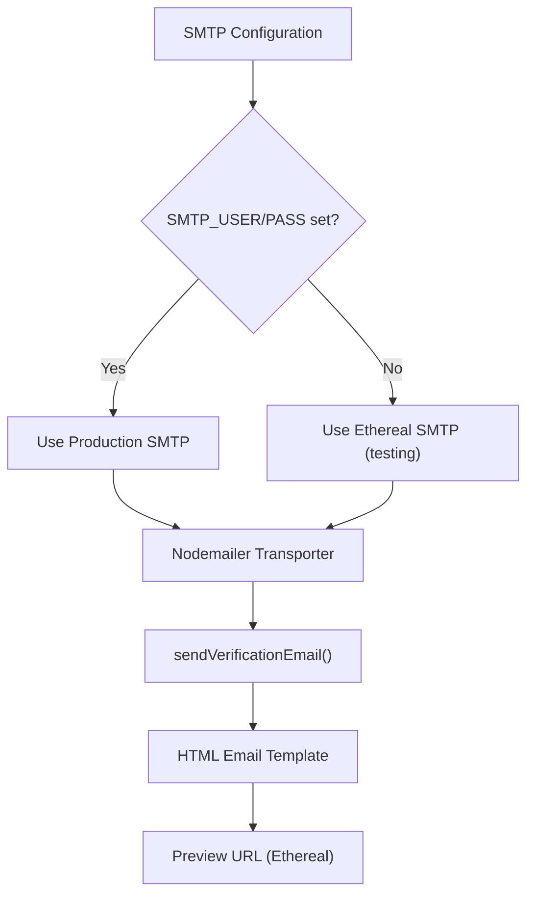

**Diagram sources**
- [index.js:14-47](file://services/auth-service/src/index.js#L14-L47)
- [index.js:49-78](file://services/auth-service/src/index.js#L49-L78)

**Section sources**
- [index.js:14-47](file://services/auth-service/src/index.js#L14-L47)
- [index.js:49-78](file://services/auth-service/src/index.js#L49-L78)

### Verification Token Management
The system implements robust token management for email verification:

- **Token Generation**: UUID-based verification tokens generated during registration.
- **Token Storage**: Secure storage in database with automatic cleanup after verification.
- **Token Expiration**: Tokens expire after 24 hours (implicit through verification process).
- **Duplicate Prevention**: Automatic cleanup of previous unverified registrations.

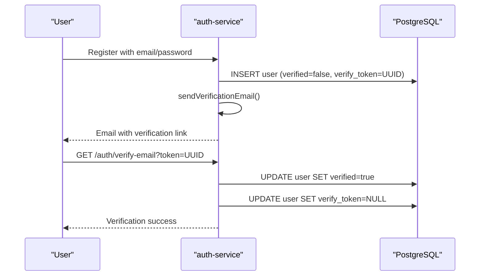

**Diagram sources**
- [index.js:80-127](file://services/auth-service/src/index.js#L80-L127)
- [index.js:129-158](file://services/auth-service/src/index.js#L129-L158)

**Section sources**
- [index.js:80-127](file://services/auth-service/src/index.js#L80-L127)
- [index.js:129-158](file://services/auth-service/src/index.js#L129-L158)

### Frontend Verification Page
The frontend includes a dedicated verification page that handles the verification process:

- **Token Extraction**: Automatically extracts verification token from URL query parameters.
- **API Integration**: Calls backend verification endpoint with the token.
- **User Feedback**: Provides clear success/error messaging with visual indicators.
- **Navigation**: Offers navigation back to home page after verification.

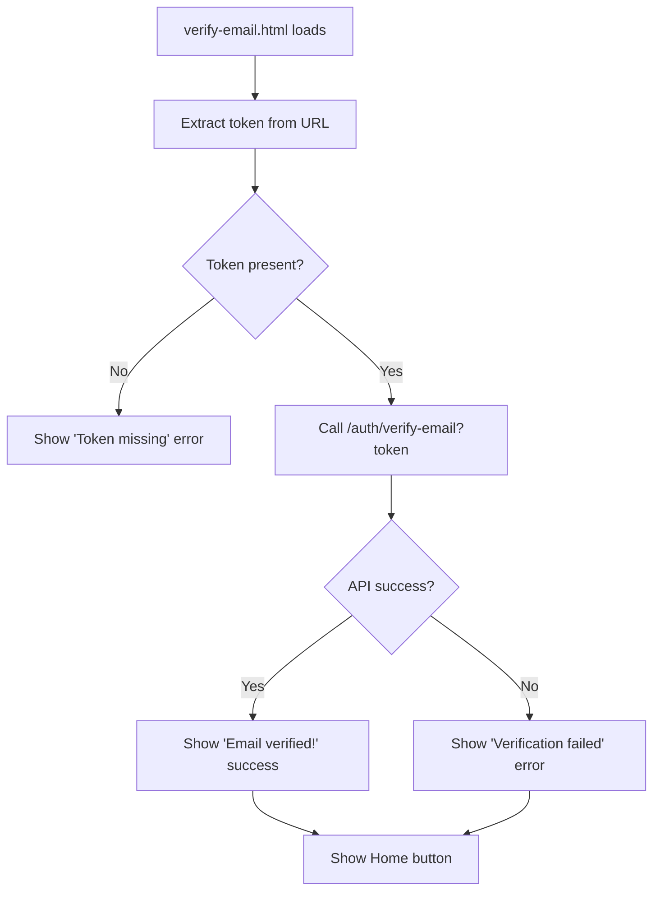

**Diagram sources**
- [verify-email.html:101-144](file://frontend/verify-email.html#L101-L144)

**Section sources**
- [verify-email.html:1-148](file://frontend/verify-email.html#L1-148)

## Frontend Authentication System

### Enhanced Authentication Chrome Rendering
The frontend authentication system has been significantly improved with a streamlined `renderAuthChrome()` function that provides better user experience for authenticated and unauthenticated states.

**Key Features:**
- **Streamlined Logic**: Simplified conditional rendering for login/logout buttons
- **Enhanced State Management**: Improved handling of user account panels and navigation
- **Demo Mode Support**: Special handling for local authentication mode (`?local=1`)
- **Accessibility**: Proper ARIA attributes and keyboard navigation support
- **Demo Access Locking**: Buttons are locked until user is authenticated

### Comprehensive Logging Capabilities
The frontend authentication system now includes extensive console logging for debugging and monitoring authentication flows.

**Logging Features:**
- **Registration Flow**: Console logs for registration attempts and responses
- **Login Flow**: Detailed logging for login requests, responses, and errors
- **Session Validation**: Logging for server-side session validation
- **Demo Access**: Debug information for local authentication mode

### Demo Access and Local Authentication
The frontend supports both remote authentication and local demo mode for testing and development purposes.

**Local Authentication Features:**
- **Demo Accounts**: Pre-configured demo accounts for testing
- **Local Storage**: Session persistence using localStorage instead of JWT tokens
- **Role Simulation**: Automatic role assignment for demo users
- **Mode Switching**: Toggle between local and remote authentication using `?local=1`

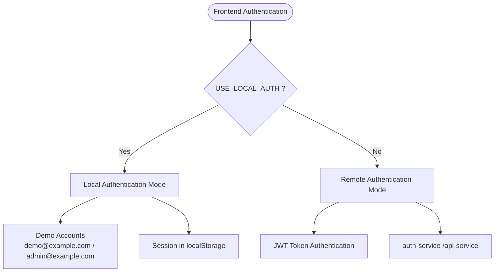

**Diagram sources**
- [script.js:6](file://frontend/script.js#L6)
- [script.js:97-111](file://frontend/script.js#L97-L111)
- [script.js:172-177](file://frontend/script.js#L172-L177)

**Section sources**
- [script.js:350-383](file://frontend/script.js#L350-L383)
- [script.js:220-235](file://frontend/script.js#L220-L235)
- [script.js:237-251](file://frontend/script.js#L237-L251)
- [script.js:97-111](file://frontend/script.js#L97-L111)

## Dependency Analysis
External libraries used by the Authentication Service:
- bcryptjs: Password hashing and comparison
- jsonwebtoken: JWT signing and verification
- nodemailer: Email sending with SMTP support
- pg: PostgreSQL client
- uuid: Unique identifier generation during registration
- cors: Cross-origin allowance (present but not enabled in current implementation)

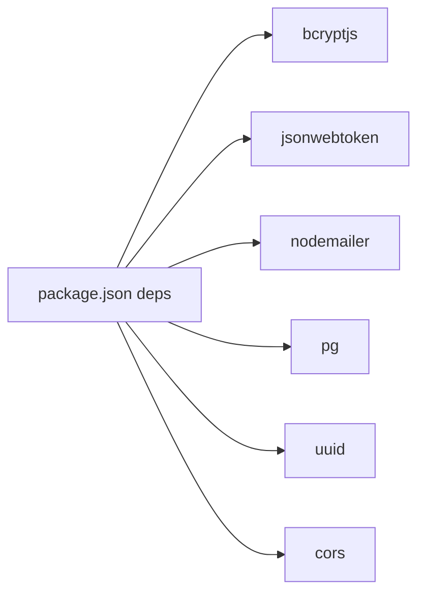

**Diagram sources**
- [package.json:9-16](file://services/auth-service/package.json#L9-L16)

**Section sources**
- [package.json:1-19](file://services/auth-service/package.json#L1-L19)

## Performance Considerations
- Password hashing cost: bcryptjs uses a fixed salt factor in the current implementation. Consider tuning for production workloads.
- Database queries: Single-row lookups by email and verification token are efficient with proper indexing.
- Token lifetime: Short-lived tokens reduce risk and require clients to manage refresh strategies.
- Connection pooling: The PostgreSQL pool is configured via DATABASE_URL; ensure appropriate pool sizing for load.
- **Email Delivery**: SMTP configuration affects performance; consider using reliable SMTP providers for production.
- **Frontend Optimization**: Local authentication mode reduces network overhead for demo purposes.
- **Email Queue**: Consider implementing email queueing for high-volume scenarios.

## Troubleshooting Guide
Common issues and resolutions:
- Missing DATABASE_URL: The service exits early if DATABASE_URL is not set.
  - Check environment configuration in docker-compose.
- JWT_SECRET not set or mismatch: Ensure both auth-service and api-service share the same secret.
- 401 Unauthorized on login: Verify email/password correctness and that the user exists and is verified.
- 409 Conflict on register: Email already exists and is verified; choose another email.
- 401 on verify: Missing or malformed Authorization header; ensure "Bearer <token>" format.
- **Email Issues**:
  - SMTP configuration errors: Check SMTP_HOST, SMTP_PORT, SMTP_USER, SMTP_PASS environment variables.
  - Email not delivered: Verify SMTP credentials and network connectivity.
  - Verification failures: Ensure token is valid and not expired.
- **Frontend Issues**: 
  - Local authentication mode not working: Check `?local=1` parameter in URL.
  - Demo accounts not loading: Verify localStorage permissions.
  - Console errors: Enable browser developer tools for detailed logging.

Operational checks:
- Confirm auth-service health endpoint responds.
- Validate PostgreSQL connectivity and schema initialization.
- **Email Configuration**: Test SMTP connection and verify email delivery.
- **Frontend Checks**: Verify authentication chrome renders correctly for both authenticated and unauthenticated states.

**Section sources**
- [db.js:3-7](file://services/auth-service/src/db.js#L3-L7)
- [docker-compose.yml:61-64](file://docker-compose.yml#L61-L64)
- [index.js:260-273](file://services/auth-service/src/index.js#L260-L273)
- [script.js:350-383](file://frontend/script.js#L350-L383)

## Conclusion
The Authentication Service provides a comprehensive foundation for user registration, login, JWT verification, and email verification workflows. It leverages bcryptjs for secure password handling, Nodemailer for email verification, a shared JWT secret for token validation, and a PostgreSQL-backed schema supporting roles and optional refresh tokens. The enhanced frontend authentication system now includes comprehensive logging, streamlined chrome rendering, demo access capabilities, and a complete email verification system with SMTP configuration and token management. For production, ensure secure secret management, implement proper SMTP configuration, consider adding rate limiting and audit logging, and implement token refresh mechanisms. The dual-mode authentication system (remote and local) provides flexibility for both production deployments and development/testing scenarios with enhanced security through mandatory email verification.