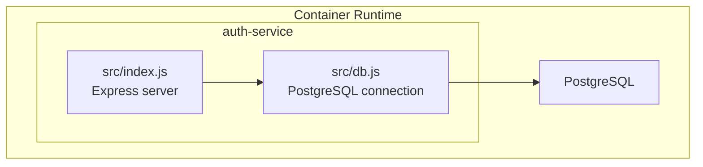
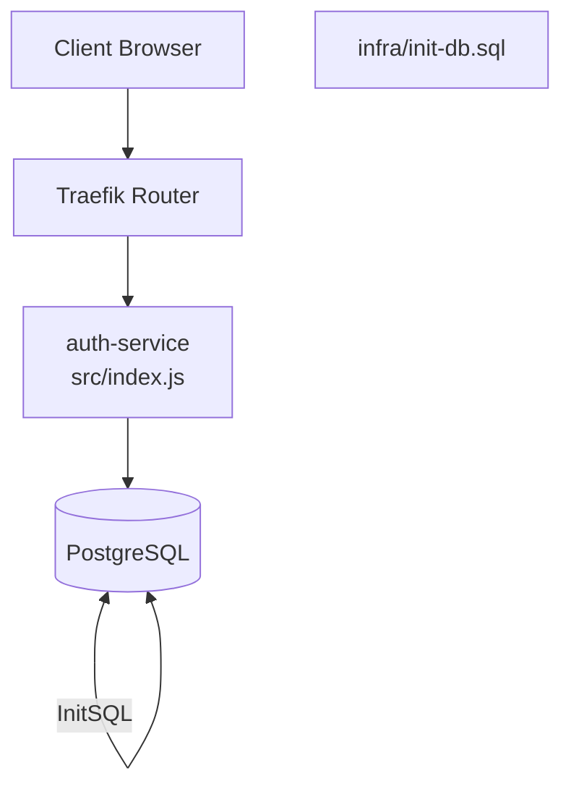
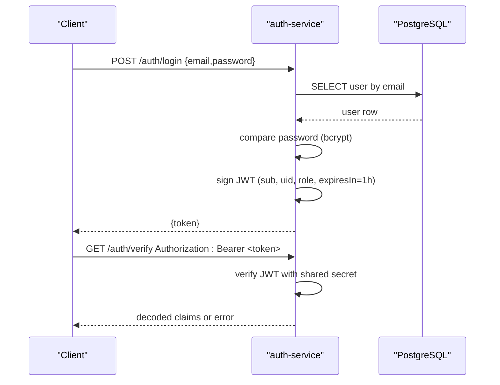
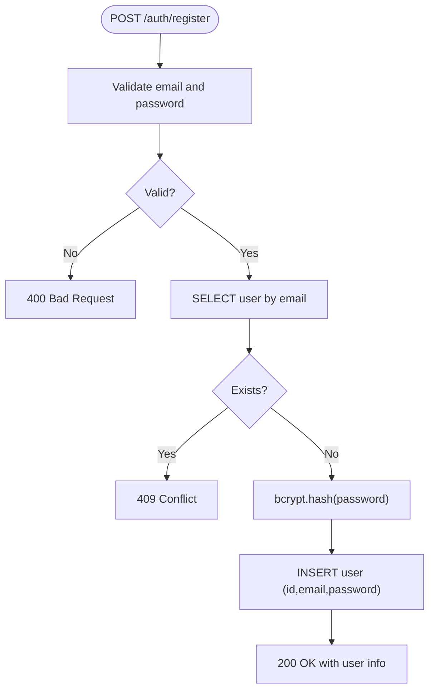
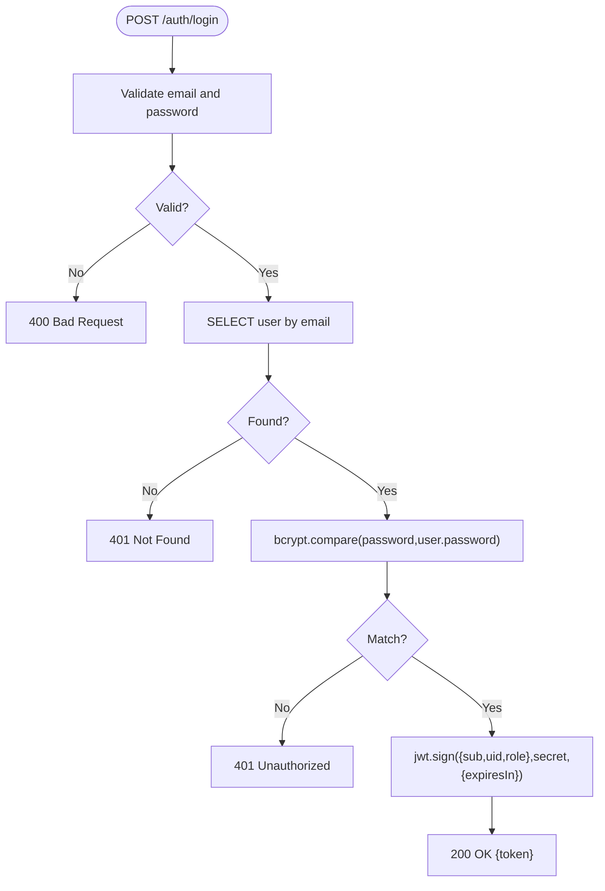
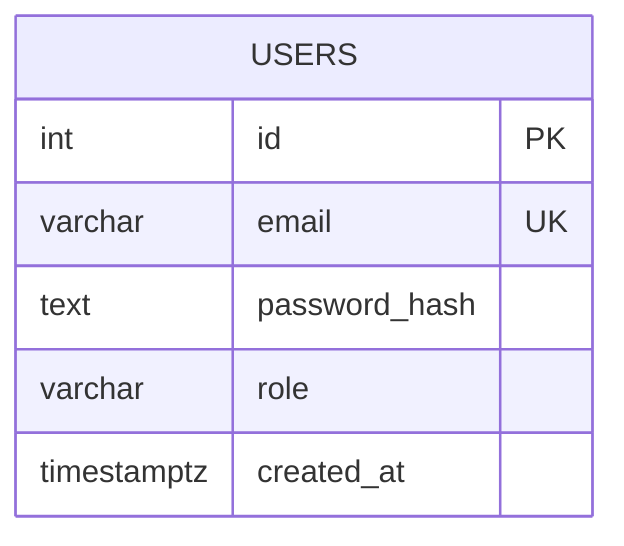
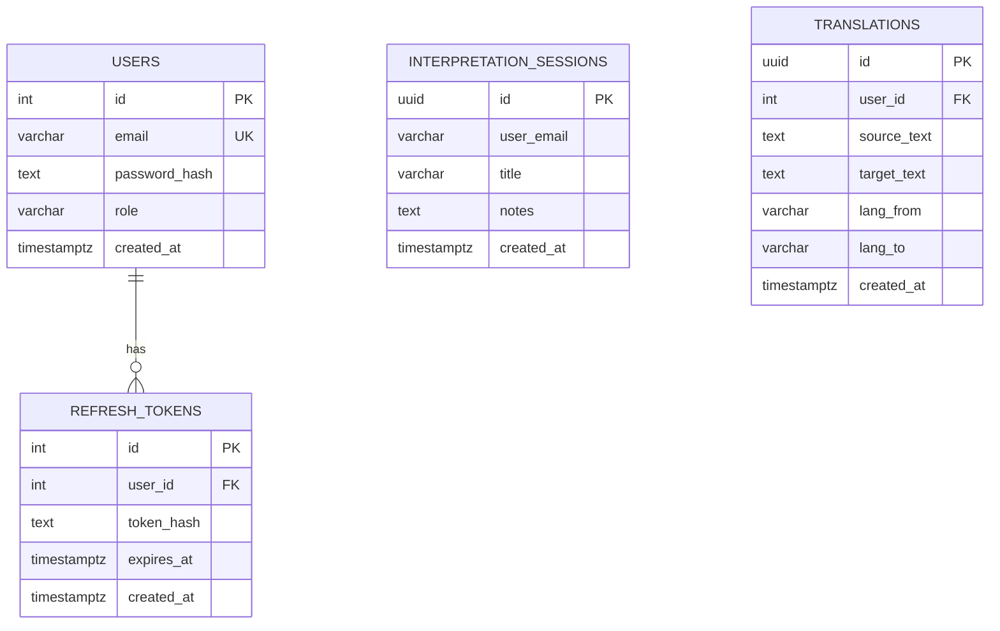
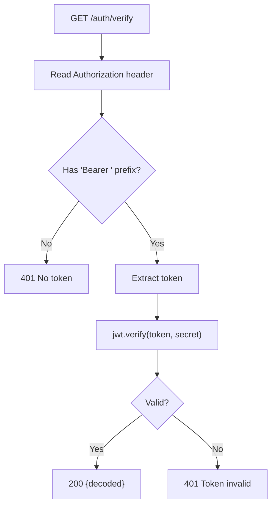
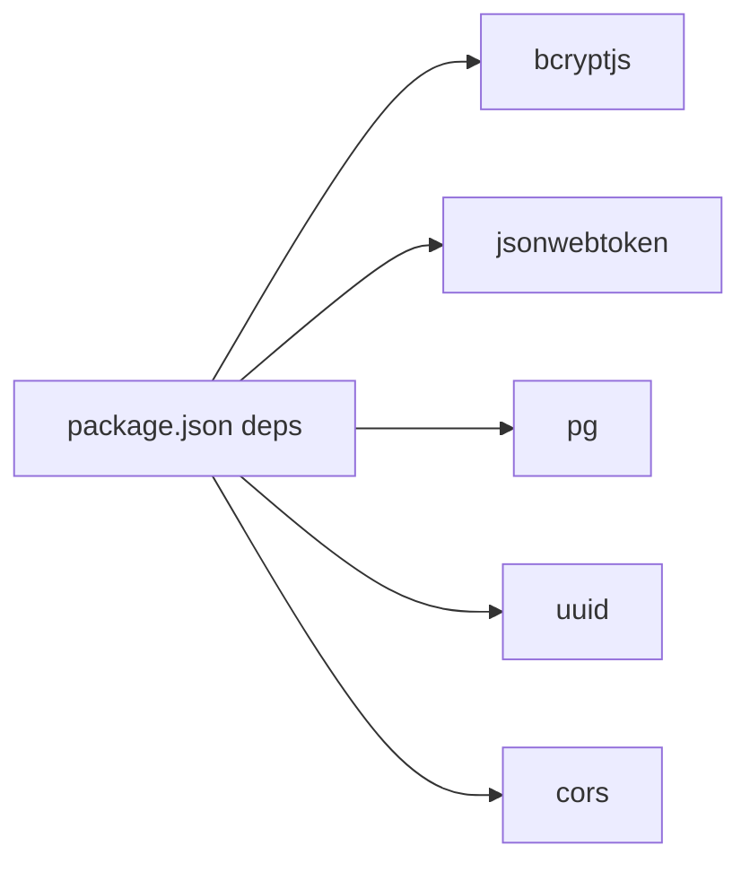

# Authentication Service

<cite>
**Referenced Files in This Document**
- [package.json](file://services/auth-service/package.json)
- [index.js](file://services/auth-service/src/index.js)
- [db.js](file://services/auth-service/src/db.js)
- [docker-compose.yml](file://docker-compose.yml)
- [init-db.sql](file://infra/init-db.sql)
- [README.md](file://README.md)
</cite>

## Table of Contents
1. [Introduction](#introduction)
2. [Project Structure](#project-structure)
3. [Core Components](#core-components)
4. [Architecture Overview](#architecture-overview)
5. [Detailed Component Analysis](#detailed-component-analysis)
6. [Dependency Analysis](#dependency-analysis)
7. [Performance Considerations](#performance-considerations)
8. [Troubleshooting Guide](#troubleshooting-guide)
9. [Conclusion](#conclusion)

## Introduction
This document describes the Authentication Service responsible for user registration, login, and JWT-based authentication. It explains the JWT token generation and verification flows, password hashing with bcryptjs, database schema for user management, and integration with the API gateway and frontend. It also covers environment configuration, security considerations, and operational guidance.

## Project Structure
The Authentication Service is implemented as a Node.js/Express application packaged as a containerized microservice. It exposes three primary endpoints under the /auth prefix and integrates with a shared JWT secret and a PostgreSQL database initialized by the provided SQL schema.

**Diagram sources**
- [index.js:1-124](file://services/auth-service/src/index.js#L1-L124)
- [db.js:1-13](file://services/auth-service/src/db.js#L1-L13)

**Section sources**
- [docker-compose.yml:59-79](file://docker-compose.yml#L59-L79)
- [README.md:12-23](file://README.md#L12-L23)

## Core Components
- Express server with JSON body parsing and CORS disabled for simplicity.
- PostgreSQL client configured via DATABASE_URL environment variable.
- JWT secret sourced from JWT_SECRET environment variable.
- Three primary routes:
  - POST /auth/register: Registers a new user after validating input and checking uniqueness.
  - POST /auth/login: Authenticates a user and issues a signed JWT.
  - GET /auth/verify: Verifies a JWT passed in Authorization header.

Key implementation references:
- Route handlers and middleware: [index.js:10-124](file://services/auth-service/src/index.js#L10-L124)
- Database connection: [db.js:1-13](file://services/auth-service/src/db.js#L1-L13)
- Dependencies: [package.json:9-16](file://services/auth-service/package.json#L9-L16)

**Section sources**
- [index.js:10-124](file://services/auth-service/src/index.js#L10-L124)
- [db.js:1-13](file://services/auth-service/src/db.js#L1-L13)
- [package.json:1-18](file://services/auth-service/package.json#L1-L18)

## Architecture Overview
The Authentication Service participates in a multi-service deployment orchestrated by Docker Compose. Traefik routes requests to the auth-service for /auth endpoints. The service relies on a shared JWT_SECRET and a PostgreSQL instance initialized by init-db.sql.

**Diagram sources**
- [docker-compose.yml:4-137](file://docker-compose.yml#L4-L137)
- [index.js:10-124](file://services/auth-service/src/index.js#L10-L124)
- [init-db.sql:1-44](file://infra/init-db.sql#L1-L44)

**Section sources**
- [docker-compose.yml:59-79](file://docker-compose.yml#L59-L79)
- [README.md:34-43](file://README.md#L34-L43)

## Detailed Component Analysis

### JWT-Based Authentication Implementation
- Secret Management: JWT_SECRET is loaded from environment variables. In development, it defaults to a dev value; in production, it should be set securely.
- Token Issuance: On successful login, a JWT is signed with claims including subject, user ID, and role, with an expiration of 1 hour.
- Token Verification: The verify endpoint extracts the Bearer token from the Authorization header and validates it against the shared secret.

**Diagram sources**
- [index.js:53-112](file://services/auth-service/src/index.js#L53-L112)

**Section sources**
- [index.js:78-88](file://services/auth-service/src/index.js#L78-L88)
- [index.js:97-112](file://services/auth-service/src/index.js#L97-L112)

### User Registration Workflow
- Input Validation: Rejects missing email or password.
- Uniqueness Check: Queries users by email; returns conflict if found.
- Password Hashing: Uses bcryptjs to hash the password with a salt factor.
- Persistence: Inserts a new user record with a generated UUID and hashed password.
- Response: Returns success with user identifiers.

**Diagram sources**
- [index.js:13-50](file://services/auth-service/src/index.js#L13-L50)

**Section sources**
- [index.js:13-50](file://services/auth-service/src/index.js#L13-L50)

### Login Workflow
- Input Validation: Rejects missing credentials.
- Lookup: Finds user by email.
- Authentication: Compares provided password with stored hash.
- Token Generation: Issues a signed JWT with subject, user ID, and role.
- Response: Returns the token.

**Diagram sources**
- [index.js:53-94](file://services/auth-service/src/index.js#L53-L94)

**Section sources**
- [index.js:53-94](file://services/auth-service/src/index.js#L53-L94)

### Role-Based Access Control (RBAC)
- Role Field: The users table includes a role field with default USER.
- First Account: The README indicates that the first account created receives ADMIN privileges.
- Token Claims: Login includes role in JWT claims for downstream services to enforce policies.

**Diagram sources**
- [init-db.sql:3-9](file://infra/init-db.sql#L3-L9)

**Section sources**
- [init-db.sql:3-9](file://infra/init-db.sql#L3-L9)
- [README.md](file://README.md#L32)

### Database Schema for User Management
The initialization script defines:
- users: id, email, password_hash, role, created_at
- refresh_tokens: id, user_id, token_hash, expires_at (for optional refresh tokens)
- Indexes on user_id and token_hash for efficient lookup
- Additional tables for interpretation sessions and translations

**Diagram sources**
- [init-db.sql:1-44](file://infra/init-db.sql#L1-L44)

**Section sources**
- [init-db.sql:1-44](file://infra/init-db.sql#L1-L44)

### API Endpoints and Schemas
- POST /auth/register
  - Request: { email, password }
  - Response: { message, userId, email }
  - Status Codes: 200, 400, 409, 500
- POST /auth/login
  - Request: { email, password }
  - Response: { token }
  - Status Codes: 200, 400, 401, 500
- GET /auth/verify
  - Headers: Authorization: Bearer <token>
  - Response: Decoded JWT claims or { message }
  - Status Codes: 200, 401

Note: The verify endpoint reads Authorization header and verifies the JWT using the shared secret.

**Section sources**
- [index.js:13-112](file://services/auth-service/src/index.js#L13-L112)

### Authentication Middleware
- Header Parsing: Extracts Authorization header and ensures it starts with "Bearer ".
- Token Verification: Validates JWT signature and expiration using the shared secret.
- Error Handling: Returns 401 for malformed or invalid tokens.

**Diagram sources**
- [index.js:97-112](file://services/auth-service/src/index.js#L97-L112)

**Section sources**
- [index.js:97-112](file://services/auth-service/src/index.js#L97-L112)

## Dependency Analysis
External libraries used by the Authentication Service:
- bcryptjs: Password hashing and comparison
- jsonwebtoken: JWT signing and verification
- pg: PostgreSQL client
- uuid: Unique identifier generation during registration
- cors: Cross-origin allowance (present but not enabled in current implementation)

**Diagram sources**
- [package.json:9-16](file://services/auth-service/package.json#L9-L16)

**Section sources**
- [package.json:1-18](file://services/auth-service/package.json#L1-L18)

## Performance Considerations
- Password hashing cost: bcryptjs uses a fixed salt factor in the current implementation. Consider tuning for production workloads.
- Database queries: Single-row lookups by email are efficient with proper indexing.
- Token lifetime: Short-lived tokens reduce risk and require clients to manage refresh strategies.
- Connection pooling: The PostgreSQL pool is configured via DATABASE_URL; ensure appropriate pool sizing for load.

[No sources needed since this section provides general guidance]

## Troubleshooting Guide
Common issues and resolutions:
- Missing DATABASE_URL: The service exits early if DATABASE_URL is not set.
  - Check environment configuration in docker-compose.
- JWT_SECRET not set or mismatch: Ensure both auth-service and api-service share the same secret.
- 401 Unauthorized on login: Verify email/password correctness and that the user exists.
- 409 Conflict on register: Email already exists; choose another email.
- 401 on verify: Missing or malformed Authorization header; ensure "Bearer <token>" format.

Operational checks:
- Confirm auth-service health endpoint responds.
- Validate PostgreSQL connectivity and schema initialization.

**Section sources**
- [db.js:3-7](file://services/auth-service/src/db.js#L3-L7)
- [docker-compose.yml:61-64](file://docker-compose.yml#L61-L64)
- [index.js:115-117](file://services/auth-service/src/index.js#L115-L117)

## Conclusion
The Authentication Service provides a minimal yet robust foundation for user registration, login, and JWT verification. It leverages bcryptjs for secure password handling, a shared JWT secret for token validation, and a PostgreSQL-backed schema supporting roles and optional refresh tokens. For production, ensure secure secret management, implement token refresh, and consider adding rate limiting and audit logging.