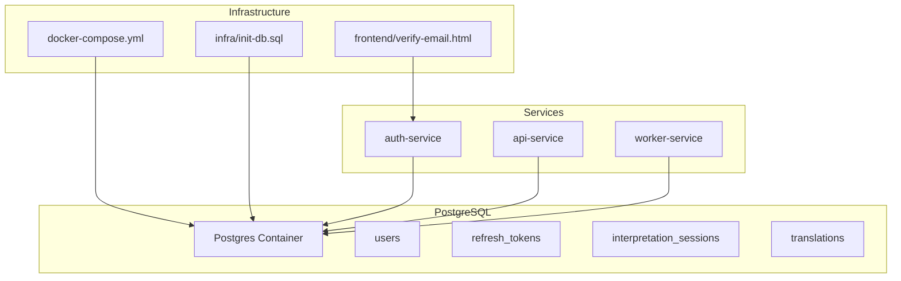
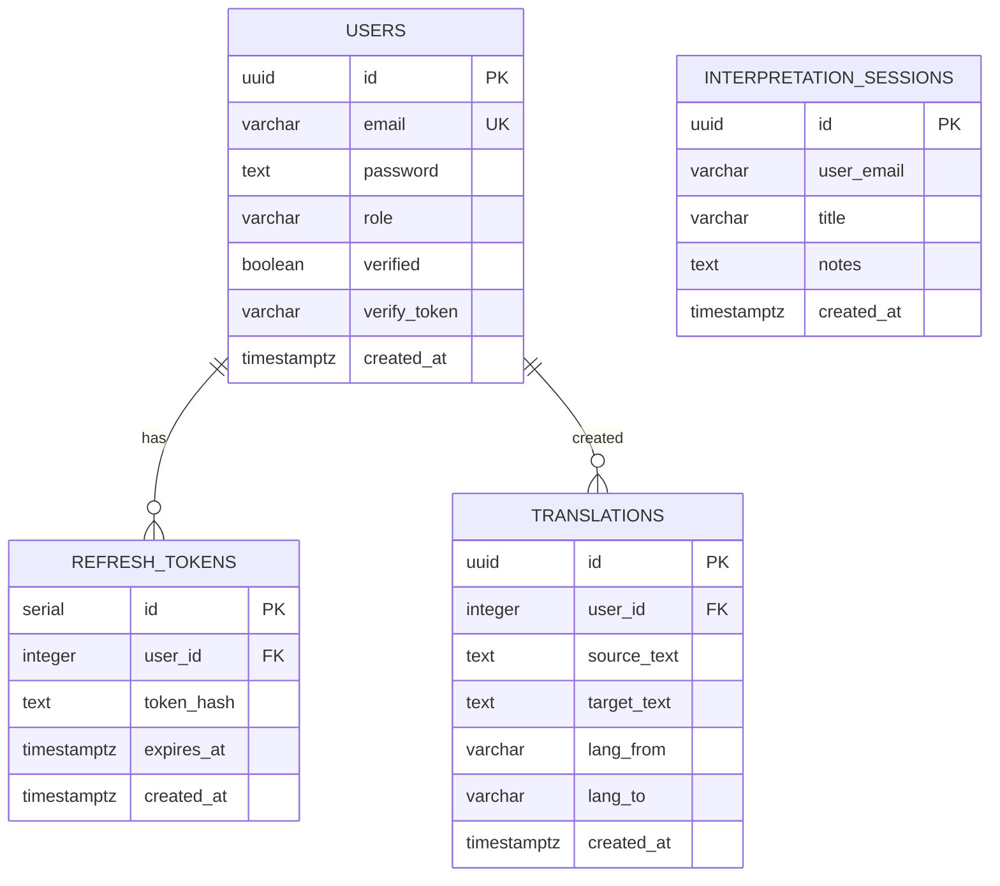
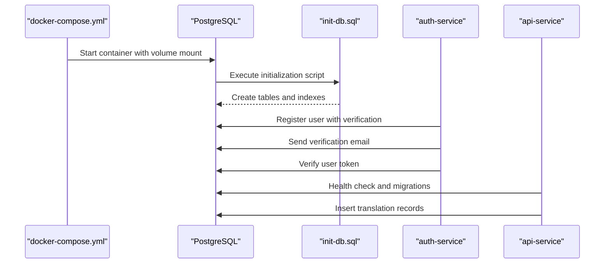
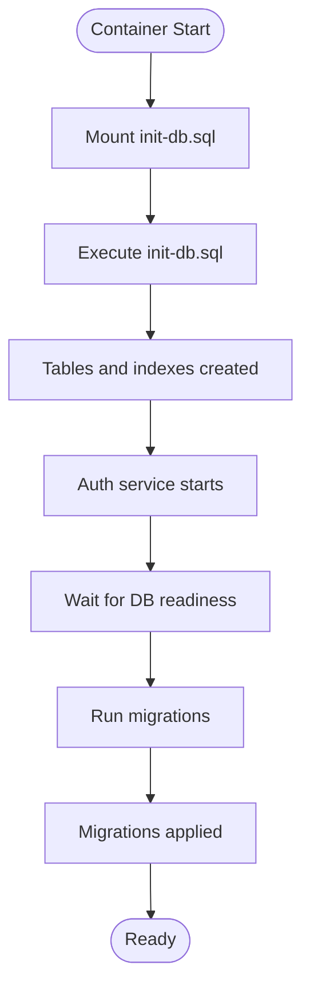
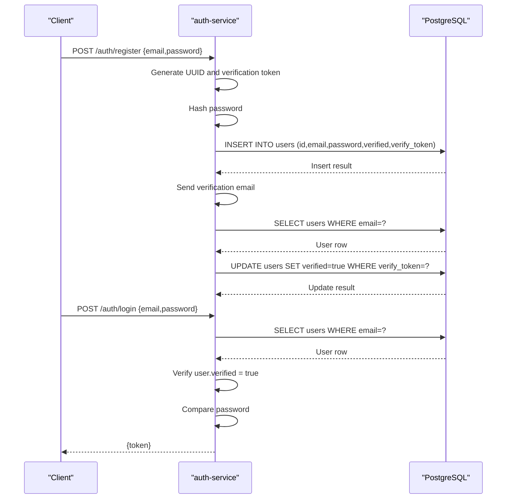
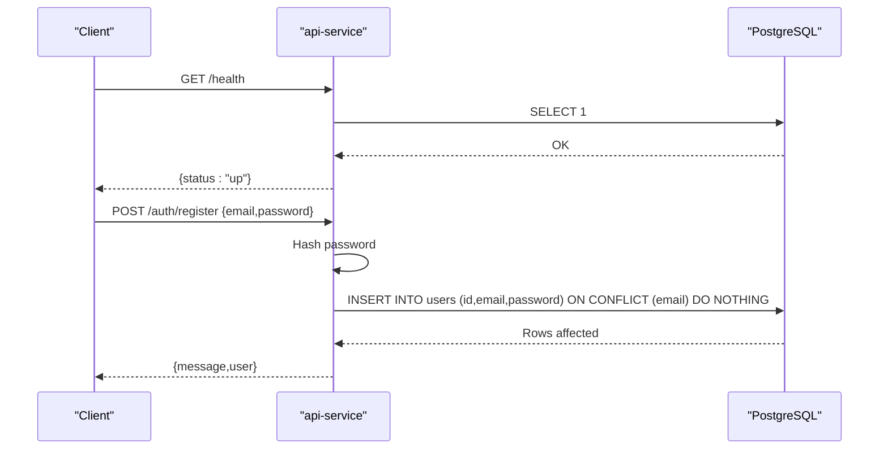
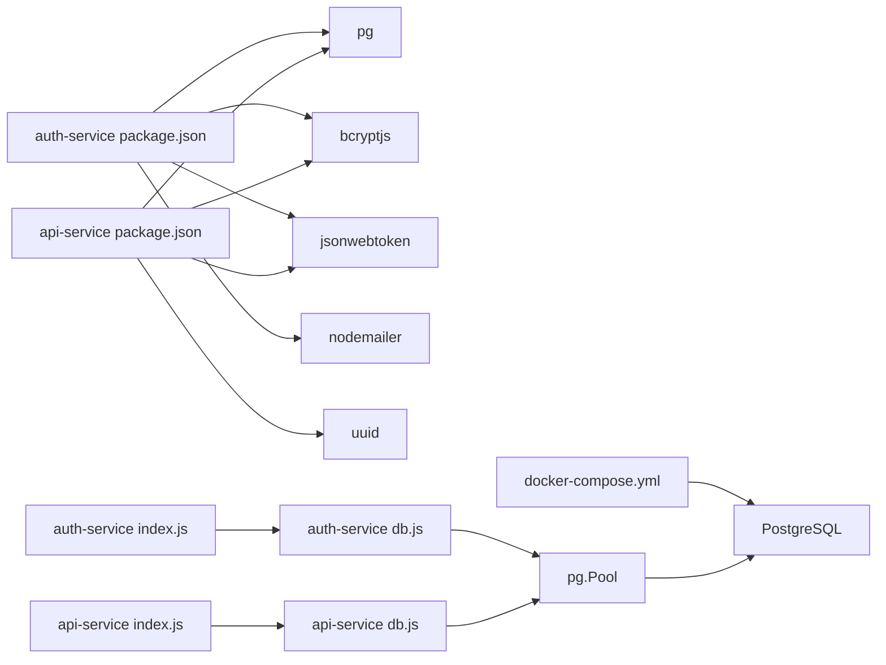

# Database Design

<cite>
**Referenced Files in This Document**
- [init-db.sql](file://infra/init-db.sql)
- [docker-compose.yml](file://docker-compose.yml)
- [api-service db.js](file://services/api-service/src/db.js)
- [api-service index.js](file://services/api-service/src/index.js)
- [auth-service db.js](file://services/auth-service/src/db.js)
- [auth-service index.js](file://services/auth-service/src/index.js)
- [api-service package.json](file://services/api-service/package.json)
- [auth-service package.json](file://services/auth-service/package.json)
- [verify-email.html](file://frontend/verify-email.html)
</cite>

## Update Summary
**Changes Made**
- Updated users table schema to reflect UUID primary keys and verification status tracking
- Added documentation for email verification functionality with token management
- Updated data model diagrams to show UUID-based relationships
- Clarified mixed schema evolution between initial provisioning and API migrations
- Enhanced security considerations for password storage and verification tokens

## Table of Contents
1. [Introduction](#introduction)
2. [Project Structure](#project-structure)
3. [Core Components](#core-components)
4. [Architecture Overview](#architecture-overview)
5. [Detailed Component Analysis](#detailed-component-analysis)
6. [Dependency Analysis](#dependency-analysis)
7. [Performance Considerations](#performance-considerations)
8. [Security and Compliance](#security-and-compliance)
9. [Troubleshooting Guide](#troubleshooting-guide)
10. [Conclusion](#conclusion)
11. [Appendices](#appendices)

## Introduction
This document describes the PostgreSQL database design for the SignVue application. The schema has evolved to support modern authentication patterns with UUID primary keys, email verification workflows, and enhanced security measures. It covers the initial schema, entity relationships, table definitions, indexes, constraints, and data access patterns. It also documents initialization, schema evolution strategies, and operational considerations such as performance and recovery.

## Project Structure
The database schema is initialized during the first run of the PostgreSQL container via a SQL script mounted into the container. Three services connect to the database:
- Authentication service: handles user registration, email verification, login, and JWT token management
- API service: performs health checks, runs migrations, manages translation records, and session metadata
- Worker service: processes background tasks via RabbitMQ integration

**Diagram sources**
- [docker-compose.yml:40-57](file://docker-compose.yml#L40-L57)
- [init-db.sql:1-46](file://infra/init-db.sql#L1-L46)
- [auth-service index.js:129-158](file://services/auth-service/src/index.js#L129-L158)
- [api-service index.js:123-131](file://services/api-service/src/index.js#L123-L131)
- [verify-email.html:101-144](file://frontend/verify-email.html#L101-L144)

**Section sources**
- [docker-compose.yml:40-57](file://docker-compose.yml#L40-L57)
- [init-db.sql:1-46](file://infra/init-db.sql#L1-L46)

## Core Components
This section defines the database entities and their attributes, constraints, and indexes.

- users
  - Purpose: Stores user account information with email verification capabilities.
  - Primary key: id (UUID)
  - Columns:
    - id: UUID (primary key)
    - email: VARCHAR(255), NOT NULL, UNIQUE
    - password: TEXT, NOT NULL
    - role: VARCHAR(20), NOT NULL, DEFAULT 'USER'
    - verified: BOOLEAN, NOT NULL, DEFAULT false
    - verify_token: VARCHAR(255)
    - created_at: TIMESTAMPTZ, NOT NULL, DEFAULT NOW()
  - Constraints:
    - Unique constraint on email
    - Not-null constraints on email, password
    - Default role set to USER
  - Notes:
    - Uses UUID as primary key for improved scalability and security
    - Includes verification status tracking with token management
    - Password stored as plain text for demonstration purposes (should be hashed)

- refresh_tokens
  - Purpose: Stores refresh tokens for authentication.
  - Primary key: id (SERIAL)
  - Columns:
    - id: SERIAL (primary key)
    - user_id: INTEGER, NOT NULL, references users(id) ON DELETE CASCADE
    - token_hash: TEXT, NOT NULL
    - expires_at: TIMESTAMPTZ, NOT NULL
    - created_at: TIMESTAMPTZ, NOT NULL, DEFAULT NOW()
  - Indexes:
    - idx_refresh_tokens_user(user_id)
    - idx_refresh_tokens_hash(token_hash)
  - Constraints:
    - Foreign key constraint referencing users(id) with ON DELETE CASCADE

- interpretation_sessions
  - Purpose: Stores session-level metadata for interpretation work.
  - Primary key: id (UUID)
  - Columns:
    - id: UUID (primary key)
    - user_email: VARCHAR(255), NOT NULL
    - title: VARCHAR(200), NOT NULL
    - notes: TEXT, NOT NULL, DEFAULT ''
    - created_at: TIMESTAMPTZ, NOT NULL, DEFAULT NOW()
  - Indexes:
    - idx_interpretation_sessions_user(user_email)
  - Constraints:
    - Not-null constraints on user_email, title

- translations
  - Purpose: Stores translation records linked to users.
  - Primary key: id (UUID)
  - Columns:
    - id: UUID (primary key)
    - user_id: INTEGER, references users(id) ON DELETE SET NULL
    - source_text: TEXT, NOT NULL, DEFAULT ''
    - target_text: TEXT, NOT NULL, DEFAULT ''
    - lang_from: VARCHAR(32), NOT NULL, DEFAULT ''
    - lang_to: VARCHAR(32), NOT NULL, DEFAULT ''
    - created_at: TIMESTAMPTZ, NOT NULL, DEFAULT NOW()
  - Indexes:
    - idx_translations_user(user_id)
    - idx_translations_created(created_at DESC)
  - Constraints:
    - Foreign key constraint referencing users(id) with ON DELETE SET NULL
    - Not-null constraints on source_text, target_text, lang_from, lang_to

Data model diagram

**Diagram sources**
- [init-db.sql:3-45](file://infra/init-db.sql#L3-L45)

**Section sources**
- [init-db.sql:3-45](file://infra/init-db.sql#L3-L45)

## Architecture Overview
The database is provisioned by mounting an initialization script into the PostgreSQL container. Services connect using connection strings configured via environment variables. The authentication service manages the complete user lifecycle including email verification, while the API service handles data operations and session management.

**Diagram sources**
- [docker-compose.yml:40-57](file://docker-compose.yml#L40-L57)
- [init-db.sql:1-46](file://infra/init-db.sql#L1-L46)
- [auth-service index.js:80-127](file://services/auth-service/src/index.js#L80-L127)
- [auth-service index.js:129-158](file://services/auth-service/src/index.js#L129-L158)
- [api-service index.js:16-24](file://services/api-service/src/index.js#L16-L24)

## Detailed Component Analysis

### Initialization and Schema Evolution
- Initial schema provisioning:
  - The PostgreSQL container is started with a mounted SQL script that creates tables and indexes.
  - The script defines users with UUID primary keys, verification status tracking, and enhanced password storage.
  - The refresh_tokens table maintains SERIAL ID for backward compatibility with existing authentication flows.
  - The interpretation_sessions and translations tables use UUID primary keys for improved scalability.

- Runtime migrations (API service):
  - On startup, the API service waits for the database to be ready and then executes migrations to ensure required tables exist.
  - The API service migration script creates users with TEXT id, interpretation_sessions with UUID, and translations with UUID user_id.
  - This creates a mixed schema where initial provisioning uses different data types than runtime migrations.

- Discrepancy between initial schema and API migrations:
  - The initial schema uses UUID for users.id and TEXT for password.
  - The API migration script uses TEXT for users.id and UUID for translations.user_id.
  - This inconsistency should be resolved to maintain a single source of truth for schema definitions.

**Diagram sources**
- [docker-compose.yml:46-48](file://docker-compose.yml#L46-L48)
- [init-db.sql:1-46](file://infra/init-db.sql#L1-L46)
- [api-service db.js:14-78](file://services/api-service/src/db.js#L14-L78)
- [api-service db.js:29-78](file://services/api-service/src/db.js#L29-L78)

**Section sources**
- [docker-compose.yml:46-48](file://docker-compose.yml#L46-L48)
- [init-db.sql:1-46](file://infra/init-db.sql#L1-L46)
- [api-service db.js:14-78](file://services/api-service/src/db.js#L14-L78)

### Data Access Patterns

#### Authentication Service
- Registration with Email Verification:
  - Validates presence of email and password.
  - Generates UUID for user id and verification token.
  - Hashes password and inserts a new user record with verified=false.
  - Sends verification email with token to user's email address.
  - Handles re-registration attempts by deleting unverified users.
- Email Verification:
  - Processes verification tokens from email links.
  - Updates user verified status to true upon successful verification.
  - Removes verification token after successful verification.
- Login with Verification Check:
  - Retrieves user by email.
  - Verifies user is marked as verified.
  - Compares password hash.
  - Issues a signed JWT token with enhanced claims.

**Diagram sources**
- [auth-service index.js:80-127](file://services/auth-service/src/index.js#L80-L127)
- [auth-service index.js:129-158](file://services/auth-service/src/index.js#L129-L158)
- [auth-service index.js:160-206](file://services/auth-service/src/index.js#L160-L206)

**Section sources**
- [auth-service index.js:80-206](file://services/auth-service/src/index.js#L80-L206)

#### API Service
- Health check:
  - Executes a simple query to verify database connectivity.
- Registration (alternative path):
  - Uses PostgreSQL gen_random_uuid() function for UUID generation.
  - Uses upsert-like insert with conflict handling on email.
- Translation operations:
  - The API service inserts translation records into the translations table.
  - The initial schema defines translations.user_id as INTEGER, while the API migration script defines it as UUID.

**Diagram sources**
- [api-service index.js:16-24](file://services/api-service/src/index.js#L16-L24)
- [api-service index.js:26-59](file://services/api-service/src/index.js#L26-L59)

**Section sources**
- [api-service index.js:16-59](file://services/api-service/src/index.js#L16-L59)

### Data Validation Rules and Business Logic Enforcement
- Email uniqueness:
  - Enforced by a unique constraint on users.email in the initial schema.
  - The API service uses an upsert pattern with conflict handling on email to prevent duplicates.
- Password storage:
  - The initial schema stores password as TEXT (should be hashed).
  - The API migration script uses password as TEXT. This should be aligned with the initial schema definition.
- Role defaults:
  - The initial schema sets a default role for users.
- Verification workflow:
  - Users must be verified before login access.
  - Verification tokens are single-use and expire after successful verification.
- Session metadata:
  - interpretation_sessions enforces not-null constraints on user_email and title.
- Translation ownership:
  - translations references users with ON DELETE SET NULL, allowing deletion of users while preserving translations.

**Section sources**
- [init-db.sql:4-10](file://infra/init-db.sql#L4-L10)
- [init-db.sql:22-28](file://infra/init-db.sql#L22-L28)
- [init-db.sql:32-40](file://infra/init-db.sql#L32-L40)
- [auth-service index.js:178-182](file://services/auth-service/src/index.js#L178-L182)
- [api-service db.js:32-37](file://services/api-service/src/db.js#L32-L37)

## Dependency Analysis
- External dependencies:
  - PostgreSQL client library (pg) is used by both services.
  - Environment variables provide the database connection string.
  - Bcrypt for password hashing, JWT for token management.
- Service-to-database dependencies:
  - Both services depend on the availability of the PostgreSQL container.
  - The API service performs a readiness check and applies migrations before serving requests.
  - The authentication service manages email verification workflows.

**Diagram sources**
- [auth-service package.json:9-16](file://services/auth-service/package.json#L9-L16)
- [api-service package.json:9-16](file://services/api-service/package.json#L9-L16)
- [auth-service index.js:1-6](file://services/auth-service/src/index.js#L1-L6)
- [api-service index.js:1-6](file://services/api-service/src/index.js#L1-L6)
- [auth-service db.js:1-13](file://services/auth-service/src/db.js#L1-L13)
- [api-service db.js:1-12](file://services/api-service/src/db.js#L1-L12)
- [docker-compose.yml:40-57](file://docker-compose.yml#L40-L57)

**Section sources**
- [auth-service package.json:9-16](file://services/auth-service/package.json#L9-L16)
- [api-service package.json:9-16](file://services/api-service/package.json#L9-L16)
- [auth-service db.js:1-13](file://services/auth-service/src/db.js#L1-L13)
- [api-service db.js:1-12](file://services/api-service/src/db.js#L1-L12)
- [docker-compose.yml:40-57](file://docker-compose.yml#L40-L57)

## Performance Considerations
- Indexes:
  - refresh_tokens: indexes on user_id and token_hash support lookups by user and token.
  - interpretation_sessions: index on user_email supports filtering by user.
  - translations: indexes on user_id and created_at support user-scoped queries and time-based sorting.
- Data types:
  - UUIDs for primary keys improve distribution and reduce contention.
  - TIMESTAMPTZ ensures timezone-aware timestamps.
- Query patterns:
  - Favor indexed columns in WHERE clauses and ORDER BY clauses.
  - Use LIMIT for pagination on time-series data (e.g., translations ordered by created_at).
- Connection management:
  - Use connection pooling to minimize overhead.
- Migration alignment:
  - Align migration scripts with the initial schema to avoid redundant or conflicting indexes.

## Security and Compliance
- Password Security:
  - Current implementation stores passwords as plain text in the initial schema.
  - Should be updated to store hashed passwords using bcrypt.
  - Authentication service already implements bcrypt hashing for demonstration.
- Email Verification:
  - Implements comprehensive email verification workflow.
  - Verification tokens are single-use and automatically invalidated after successful verification.
  - Supports token regeneration for resend verification functionality.
- Token Management:
  - JWT tokens include user claims and expiration.
  - Refresh tokens use hashed tokens for security.
- Data Protection:
  - UUID primary keys provide better privacy protection.
  - Verification status prevents unauthorized access until email verification completes.

**Section sources**
- [init-db.sql:6](file://infra/init-db.sql#L6)
- [auth-service index.js:99-111](file://services/auth-service/src/index.js#L99-L111)
- [auth-service index.js:129-158](file://services/auth-service/src/index.js#L129-L158)

## Troubleshooting Guide
- Missing DATABASE_URL:
  - Both services exit if the DATABASE_URL environment variable is missing.
- Database readiness:
  - The API service waits for the database to respond before proceeding.
- Migration failures:
  - Ensure the initial schema and migration scripts are consistent.
  - Resolve discrepancies between UUID and TEXT data types.
- Token verification:
  - Authentication relies on JWT verification; ensure the JWT_SECRET is consistent across services.
- Email verification issues:
  - Verify SMTP configuration for email delivery.
  - Check that verification tokens are properly generated and stored.
  - Ensure frontend configuration points to correct API base URL.

**Section sources**
- [auth-service db.js:3-7](file://services/auth-service/src/db.js#L3-L7)
- [api-service db.js:3-8](file://services/api-service/src/db.js#L3-L8)
- [api-service db.js:14-27](file://services/api-service/src/db.js#L14-L27)
- [verify-email.html:88-94](file://frontend/verify-email.html#L88-L94)

## Conclusion
The SignVue database design centers on four core tables with clear relationships and indexes. The schema has evolved to support modern authentication patterns with UUID primary keys, email verification workflows, and enhanced security measures. The initial schema and API migrations define the structure, but discrepancies exist in user identifiers and password fields that should be reconciled. Operational practices include containerized initialization, service-side migrations, health checks, and comprehensive email verification workflows. Performance and reliability are supported by indexes, UUID primary keys, connection pooling, and robust security measures.

## Appendices

### Sample Data Examples
- users
  - Example row: id="550e8400-e29b-41d4-a716-446655440000", email="user@example.com", password="<hashed>", role="USER", verified=false, verify_token="a1b2c3d4-e5f6-7890-abcd-ef1234567890", created_at="<timestamp>"
- refresh_tokens
  - Example row: id=1, user_id=1, token_hash="<hash>", expires_at="<timestamp>", created_at="<timestamp>"
- interpretation_sessions
  - Example row: id="550e8400-e29b-41d4-a716-446655440001", user_email="user@example.com", title="Session 1", notes="", created_at="<timestamp>"
- translations
  - Example row: id="550e8400-e29b-41d4-a716-446655440002", user_id=1, source_text="Hello", target_text="Bonjour", lang_from="en", lang_to="fr", created_at="<timestamp>"

### Backup and Recovery Procedures
- Backups:
  - Use logical backups (e.g., pg_dump) for schema and data.
  - Use physical backups (e.g., tar of data directory) for point-in-time recovery.
- Recovery:
  - Restore from the latest backup and replay transactions if applicable.
  - Validate service connectivity after restore.
  - Ensure email verification tokens are properly handled during restoration.