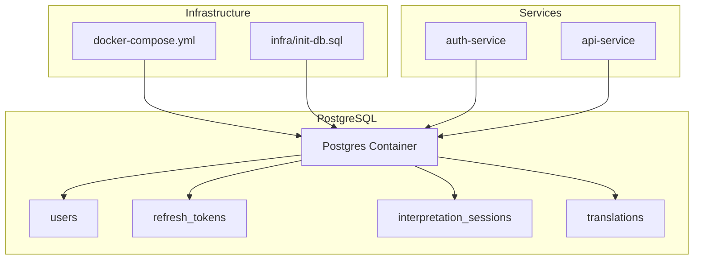
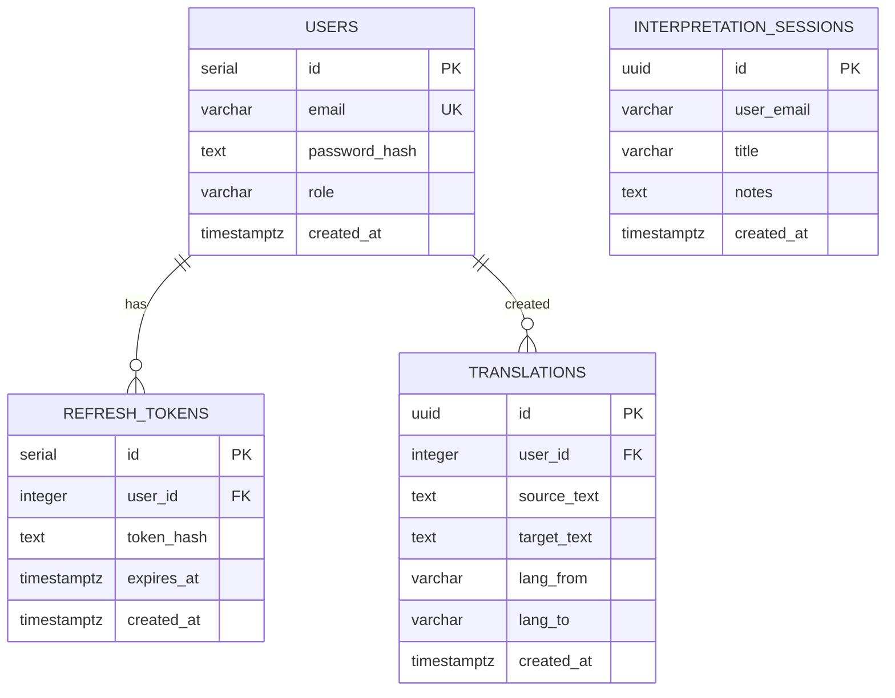
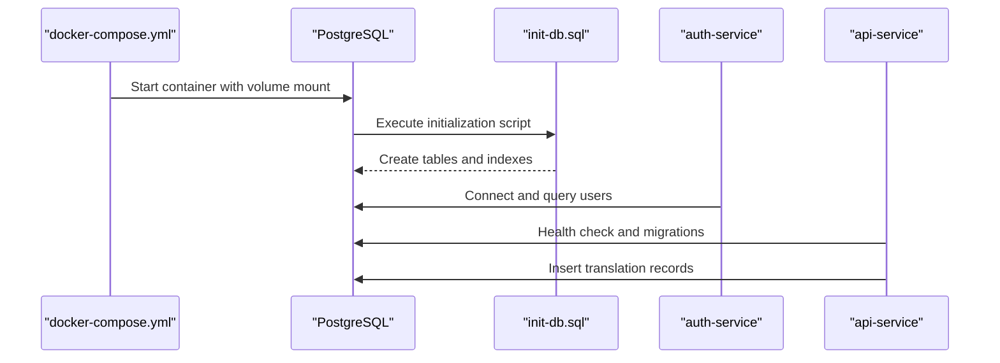
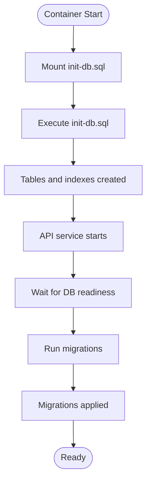
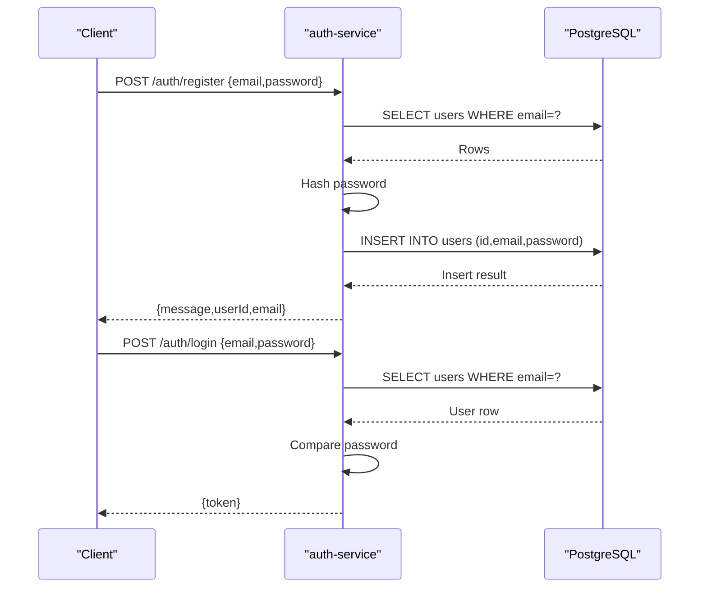
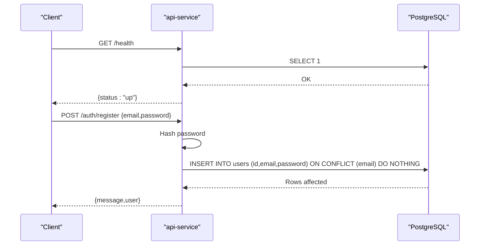
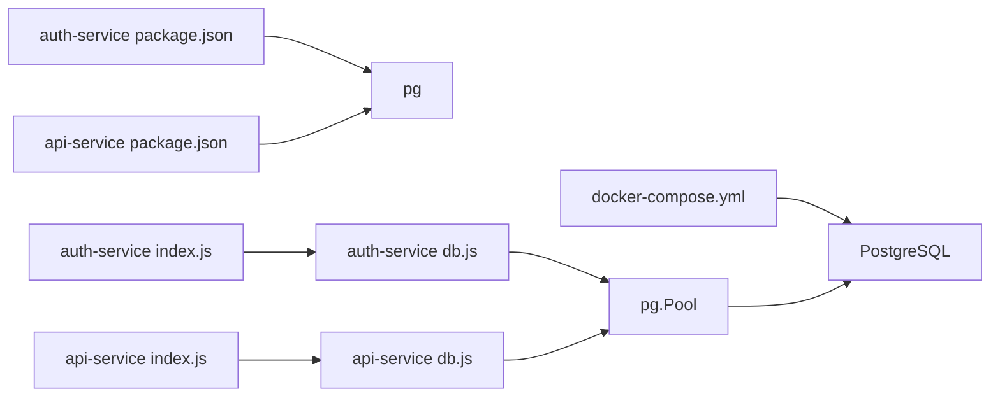

# Database Design

<cite>
**Referenced Files in This Document**
- [init-db.sql](file://infra/init-db.sql)
- [docker-compose.yml](file://docker-compose.yml)
- [api-service db.js](file://services/api-service/src/db.js)
- [api-service index.js](file://services/api-service/src/index.js)
- [auth-service db.js](file://services/auth-service/src/db.js)
- [auth-service index.js](file://services/auth-service/src/index.js)
- [api-service package.json](file://services/api-service/package.json)
- [auth-service package.json](file://services/auth-service/package.json)
</cite>

## Table of Contents
1. [Introduction](#introduction)
2. [Project Structure](#project-structure)
3. [Core Components](#core-components)
4. [Architecture Overview](#architecture-overview)
5. [Detailed Component Analysis](#detailed-component-analysis)
6. [Dependency Analysis](#dependency-analysis)
7. [Performance Considerations](#performance-considerations)
8. [Troubleshooting Guide](#troubleshooting-guide)
9. [Conclusion](#conclusion)
10. [Appendices](#appendices)

## Introduction
This document describes the PostgreSQL database design for the SignVue application. It covers the initial schema, entity relationships, table definitions, indexes, constraints, and data access patterns. It also documents initialization, schema evolution strategies, and operational considerations such as performance and recovery.

## Project Structure
The database schema is initialized during the first run of the PostgreSQL container via a SQL script mounted into the container. Two services connect to the database:
- Authentication service: handles user registration and login, and interacts with the users table.
- API service: performs health checks, runs migrations, and manages translation records and session metadata.

**Diagram sources**
- [docker-compose.yml:40-57](file://docker-compose.yml#L40-L57)
- [init-db.sql:1-44](file://infra/init-db.sql#L1-L44)
- [auth-service index.js:12-50](file://services/auth-service/src/index.js#L12-L50)
- [api-service index.js:123-131](file://services/api-service/src/index.js#L123-L131)

**Section sources**
- [docker-compose.yml:40-57](file://docker-compose.yml#L40-L57)
- [init-db.sql:1-44](file://infra/init-db.sql#L1-L44)

## Core Components
This section defines the database entities and their attributes, constraints, and indexes.

- users
  - Purpose: Stores user account information.
  - Primary key: id (SERIAL)
  - Columns:
    - id: SERIAL (primary key)
    - email: VARCHAR(255), NOT NULL, UNIQUE
    - password_hash: TEXT, NOT NULL
    - role: VARCHAR(20), NOT NULL, DEFAULT 'USER'
    - created_at: TIMESTAMPTZ, NOT NULL, DEFAULT NOW()
  - Constraints:
    - Unique constraint on email
    - Not-null constraints on email, password_hash, role
  - Notes:
    - The initial schema defines id as SERIAL and password_hash as TEXT.
    - The API service migration script defines users with id as TEXT and password as TEXT. This discrepancy should be reconciled.

- refresh_tokens
  - Purpose: Stores refresh tokens for authentication.
  - Primary key: id (SERIAL)
  - Columns:
    - id: SERIAL (primary key)
    - user_id: INTEGER, NOT NULL, references users(id) ON DELETE CASCADE
    - token_hash: TEXT, NOT NULL
    - expires_at: TIMESTAMPTZ, NOT NULL
    - created_at: TIMESTAMPTZ, NOT NULL, DEFAULT NOW()
  - Indexes:
    - idx_refresh_tokens_user(user_id)
    - idx_refresh_tokens_hash(token_hash)
  - Constraints:
    - Foreign key constraint referencing users(id) with ON DELETE CASCADE

- interpretation_sessions
  - Purpose: Stores session-level metadata for interpretation work.
  - Primary key: id (UUID)
  - Columns:
    - id: UUID (primary key)
    - user_email: VARCHAR(255), NOT NULL
    - title: VARCHAR(200), NOT NULL
    - notes: TEXT, NOT NULL, DEFAULT ''
    - created_at: TIMESTAMPTZ, NOT NULL, DEFAULT NOW()
  - Indexes:
    - idx_interpretation_sessions_user(user_email)
  - Constraints:
    - Not-null constraints on user_email, title

- translations
  - Purpose: Stores translation records linked to users.
  - Primary key: id (UUID)
  - Columns:
    - id: UUID (primary key)
    - user_id: INTEGER, references users(id) ON DELETE SET NULL
    - source_text: TEXT, NOT NULL, DEFAULT ''
    - target_text: TEXT, NOT NULL, DEFAULT ''
    - lang_from: VARCHAR(32), NOT NULL, DEFAULT ''
    - lang_to: VARCHAR(32), NOT NULL, DEFAULT ''
    - created_at: TIMESTAMPTZ, NOT NULL, DEFAULT NOW()
  - Indexes:
    - idx_translations_user(user_id)
    - idx_translations_created(created_at DESC)
  - Constraints:
    - Foreign key constraint referencing users(id) with ON DELETE SET NULL
    - Not-null constraints on source_text, target_text, lang_from, lang_to

Data model diagram

**Diagram sources**
- [init-db.sql:3-43](file://infra/init-db.sql#L3-L43)

**Section sources**
- [init-db.sql:3-43](file://infra/init-db.sql#L3-L43)

## Architecture Overview
The database is provisioned by mounting an initialization script into the PostgreSQL container. Services connect using connection strings configured via environment variables. The API service performs runtime migrations and health checks against the database.

**Diagram sources**
- [docker-compose.yml:40-57](file://docker-compose.yml#L40-L57)
- [init-db.sql:1-44](file://infra/init-db.sql#L1-L44)
- [auth-service index.js:20-38](file://services/auth-service/src/index.js#L20-L38)
- [api-service index.js:16-24](file://services/api-service/src/index.js#L16-L24)

## Detailed Component Analysis

### Initialization and Schema Evolution
- Initial schema provisioning:
  - The PostgreSQL container is started with a mounted SQL script that creates tables and indexes.
  - The script defines users, refresh_tokens, interpretation_sessions, and translations with appropriate constraints and indexes.

- Runtime migrations (API service):
  - On startup, the API service waits for the database to be ready and then executes migrations to ensure required tables exist.
  - The API service migration script creates users, interpretation_sessions, and translations with different column types compared to the initial schema (e.g., users.id as TEXT, translations.user_id as UUID).

- Discrepancy between initial schema and API migrations:
  - The initial schema uses SERIAL for users.id and TEXT for password_hash.
  - The API migration script uses TEXT for users.id and TEXT for password.
  - This inconsistency should be resolved to maintain a single source of truth for schema definitions.

**Diagram sources**
- [docker-compose.yml:46-48](file://docker-compose.yml#L46-L48)
- [init-db.sql:1-44](file://infra/init-db.sql#L1-L44)
- [api-service db.js:14-27](file://services/api-service/src/db.js#L14-L27)
- [api-service db.js:29-78](file://services/api-service/src/db.js#L29-L78)

**Section sources**
- [docker-compose.yml:46-48](file://docker-compose.yml#L46-L48)
- [init-db.sql:1-44](file://infra/init-db.sql#L1-L44)
- [api-service db.js:14-78](file://services/api-service/src/db.js#L14-L78)

### Data Access Patterns

#### Authentication Service
- Registration:
  - Validates presence of email and password.
  - Checks for existing user by email.
  - Hashes password and inserts a new user record.
- Login:
  - Retrieves user by email.
  - Compares password hash.
  - Issues a signed JWT token.

**Diagram sources**
- [auth-service index.js:12-50](file://services/auth-service/src/index.js#L12-L50)
- [auth-service index.js:52-94](file://services/auth-service/src/index.js#L52-L94)

**Section sources**
- [auth-service index.js:12-94](file://services/auth-service/src/index.js#L12-L94)

#### API Service
- Health check:
  - Executes a simple query to verify database connectivity.
- Registration (alternative path):
  - Uses a UUID generator and upsert-like insert with conflict handling on email.
- Translation operations:
  - The API service inserts translation records into the translations table.
  - The initial schema defines translations.user_id as INTEGER, while the API migration script defines it as UUID.

**Diagram sources**
- [api-service index.js:16-24](file://services/api-service/src/index.js#L16-L24)
- [api-service index.js:26-59](file://services/api-service/src/index.js#L26-L59)

**Section sources**
- [api-service index.js:16-59](file://services/api-service/src/index.js#L16-L59)

### Data Validation Rules and Business Logic Enforcement
- Email uniqueness:
  - Enforced by a unique constraint on users.email in the initial schema.
  - The API service uses an upsert pattern with conflict handling on email to prevent duplicates.
- Password storage:
  - The initial schema stores password_hash as TEXT.
  - The API migration script uses password as TEXT. This should be aligned with the initial schema definition.
- Role defaults:
  - The initial schema sets a default role for users.
- Session metadata:
  - interpretation_sessions enforces not-null constraints on user_email and title.
- Translation ownership:
  - translations references users with ON DELETE SET NULL, allowing deletion of users while preserving translations.

**Section sources**
- [init-db.sql:4-8](file://infra/init-db.sql#L4-L8)
- [init-db.sql:22-28](file://infra/init-db.sql#L22-L28)
- [init-db.sql:32-40](file://infra/init-db.sql#L32-L40)
- [api-service index.js:37-43](file://services/api-service/src/index.js#L37-L43)
- [api-service db.js:32-37](file://services/api-service/src/db.js#L32-L37)

## Dependency Analysis
- External dependencies:
  - PostgreSQL client library (pg) is used by both services.
  - Environment variables provide the database connection string.
- Service-to-database dependencies:
  - Both services depend on the availability of the PostgreSQL container.
  - The API service performs a readiness check and applies migrations before serving requests.

**Diagram sources**
- [auth-service package.json:9-16](file://services/auth-service/package.json#L9-L16)
- [api-service package.json:9-16](file://services/api-service/package.json#L9-L16)
- [auth-service index.js:1-10](file://services/auth-service/src/index.js#L1-L10)
- [api-service index.js:1-15](file://services/api-service/src/index.js#L1-L15)
- [auth-service db.js:1-13](file://services/auth-service/src/db.js#L1-L13)
- [api-service db.js:1-12](file://services/api-service/src/db.js#L1-L12)
- [docker-compose.yml:40-57](file://docker-compose.yml#L40-L57)

**Section sources**
- [auth-service package.json:9-16](file://services/auth-service/package.json#L9-L16)
- [api-service package.json:9-16](file://services/api-service/package.json#L9-L16)
- [auth-service db.js:1-13](file://services/auth-service/src/db.js#L1-L13)
- [api-service db.js:1-12](file://services/api-service/src/db.js#L1-L12)
- [docker-compose.yml:40-57](file://docker-compose.yml#L40-L57)

## Performance Considerations
- Indexes:
  - refresh_tokens: indexes on user_id and token_hash support lookups by user and token.
  - interpretation_sessions: index on user_email supports filtering by user.
  - translations: indexes on user_id and created_at support user-scoped queries and time-based sorting.
- Data types:
  - UUIDs for primary keys improve distribution and reduce contention.
  - TIMESTAMPTZ ensures timezone-aware timestamps.
- Query patterns:
  - Favor indexed columns in WHERE clauses and ORDER BY clauses.
  - Use LIMIT for pagination on time-series data (e.g., translations ordered by created_at).
- Connection management:
  - Use connection pooling to minimize overhead.
- Migration alignment:
  - Align migration scripts with the initial schema to avoid redundant or conflicting indexes.

[No sources needed since this section provides general guidance]

## Troubleshooting Guide
- Missing DATABASE_URL:
  - Both services exit if the DATABASE_URL environment variable is missing.
- Database readiness:
  - The API service waits for the database to respond before proceeding.
- Migration failures:
  - Ensure the initial schema and migration scripts are consistent.
- Token verification:
  - Authentication relies on JWT verification; ensure the JWT_SECRET is consistent across services.

**Section sources**
- [auth-service db.js:3-7](file://services/auth-service/src/db.js#L3-L7)
- [api-service db.js:3-8](file://services/api-service/src/db.js#L3-L8)
- [api-service db.js:14-27](file://services/api-service/src/db.js#L14-L27)

## Conclusion
The SignVue database design centers on four core tables with clear relationships and indexes. The initial schema and API migrations define the structure, but a discrepancy exists in user identifiers and password fields that should be reconciled. Operational practices include containerized initialization, service-side migrations, and health checks. Performance and reliability are supported by indexes, UUID primary keys, and connection pooling.

[No sources needed since this section summarizes without analyzing specific files]

## Appendices

### Sample Data Examples
- users
  - Example row: id=1, email="user@example.com", password_hash="<hashed>", role="USER", created_at="<timestamp>"
- refresh_tokens
  - Example row: id=1, user_id=1, token_hash="<hash>", expires_at="<timestamp>", created_at="<timestamp>"
- interpretation_sessions
  - Example row: id="550e8400-e29b-41d4-a716-446655440000", user_email="user@example.com", title="Session 1", notes="", created_at="<timestamp>"
- translations
  - Example row: id="550e8400-e29b-41d4-a716-446655440001", user_id=1, source_text="Hello", target_text="Bonjour", lang_from="en", lang_to="fr", created_at="<timestamp>"

[No sources needed since this section provides general guidance]

### Backup and Recovery Procedures
- Backups:
  - Use logical backups (e.g., pg_dump) for schema and data.
  - Use physical backups (e.g., tar of data directory) for point-in-time recovery.
- Recovery:
  - Restore from the latest backup and replay transactions if applicable.
  - Validate service connectivity after restore.

[No sources needed since this section provides general guidance]