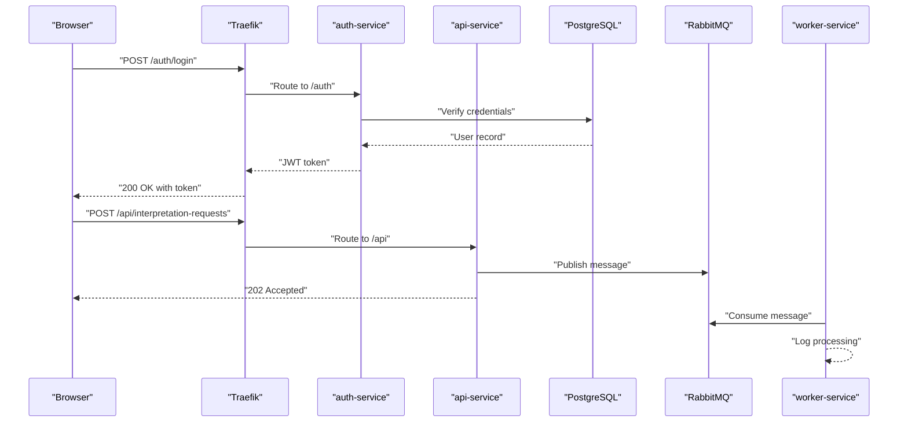
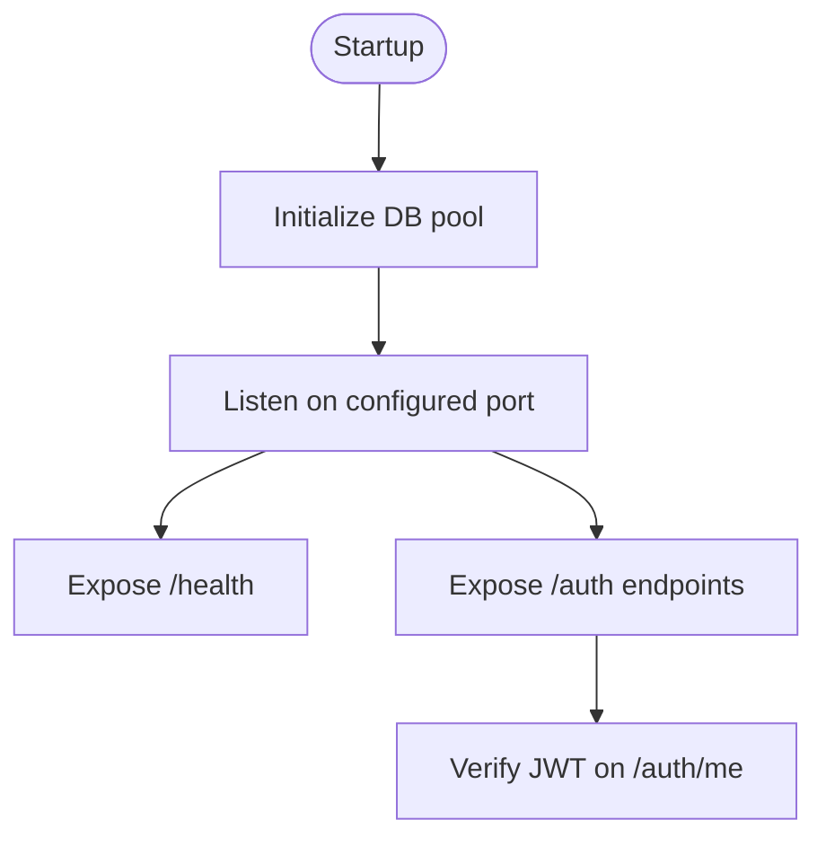
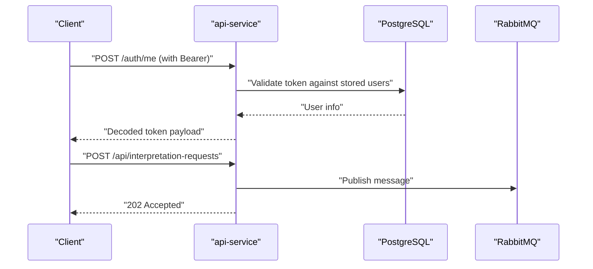
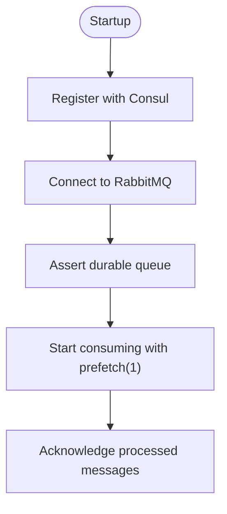
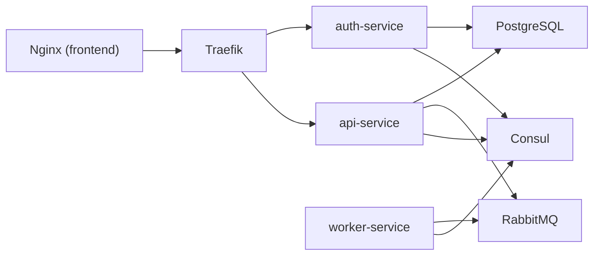
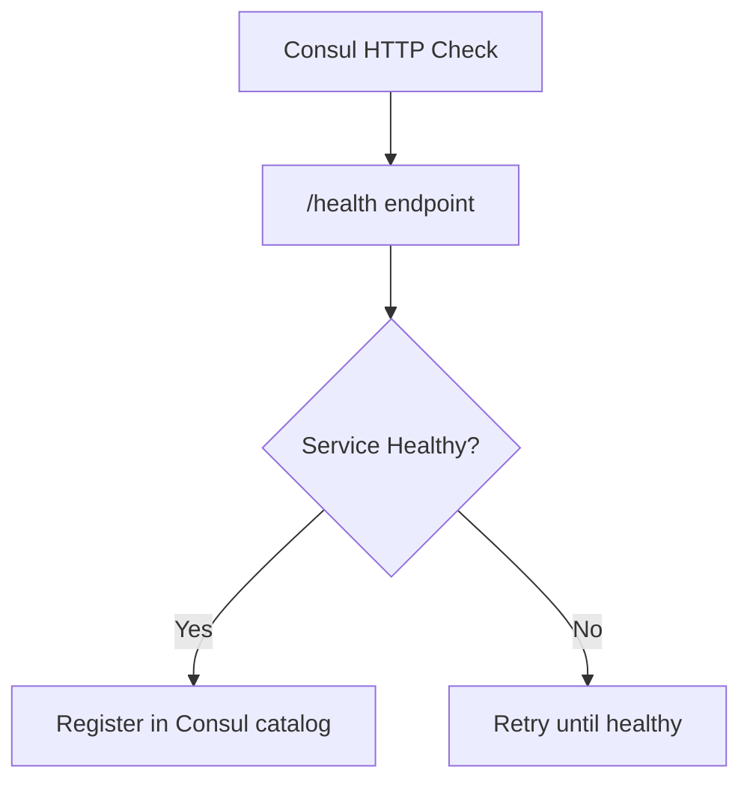

# Deployment and Operations

<cite>
**Referenced Files in This Document**
- [README.md](file://README.md)
- [docker-compose.yml](file://docker-compose.yml)
- [services/api-service/src/index.js](file://services/api-service/src/index.js)
- [services/api-service/src/db.js](file://services/api-service/src/db.js)
- [services/api-service/Dockerfile](file://services/api-service/Dockerfile)
- [services/api-service/package.json](file://services/api-service/package.json)
- [services/auth-service/src/index.js](file://services/auth-service/src/index.js)
- [services/auth-service/src/db.js](file://services/auth-service/src/db.js)
- [services/auth-service/Dockerfile](file://services/auth-service/Dockerfile)
- [services/auth-service/package.json](file://services/auth-service/package.json)
- [services/worker-service/src/index.js](file://services/worker-service/src/index.js)
- [services/worker-service/Dockerfile](file://services/worker-service/Dockerfile)
- [services/worker-service/package.json](file://services/worker-service/package.json)
- [infra/init-db.sql](file://infra/init-db.sql)
- [frontend/config.js](file://frontend/config.js)
- [frontend/script.js](file://frontend/script.js)
</cite>

## Table of Contents
1. [Introduction](#introduction)
2. [Project Structure](#project-structure)
3. [Core Components](#core-components)
4. [Architecture Overview](#architecture-overview)
5. [Detailed Component Analysis](#detailed-component-analysis)
6. [Dependency Analysis](#dependency-analysis)
7. [Production Deployment Strategies](#production-deployment-strategies)
8. [Environment Configuration Management](#environment-configuration-management)
9. [Scaling Considerations](#scaling-considerations)
10. [Monitoring and Logging](#monitoring-and-logging)
11. [Health Checks and Service Discovery](#health-checks-and-service-discovery)
12. [Security Hardening](#security-hardening)
13. [Backup and Disaster Recovery](#backup-and-disaster-recovery)
14. [CI/CD Pipeline Integration](#cicd-pipeline-integration)
15. [Operational Runbooks](#operational-runbooks)
16. [Alerting and Incident Response](#alerting-and-incident-response)
17. [Troubleshooting Guide](#troubleshooting-guide)
18. [Performance Optimization](#performance-optimization)
19. [Maintenance Procedures](#maintenance-procedures)
20. [Conclusion](#conclusion)

## Introduction
This document provides a comprehensive deployment and operations guide for the SignVue microservices system. It covers production deployment strategies, environment configuration management, scaling considerations, monitoring and logging, health checks, service discovery, security hardening, backup and disaster recovery, CI/CD integration, operational runbooks, alerting, and incident response procedures. The guide leverages the existing Docker Compose setup and service implementations to define repeatable, reliable, and secure operations for both development and production environments.

## Project Structure
The repository follows a clear separation of concerns:
- Frontend static assets served by Nginx
- Three Node.js microservices: auth-service, api-service, worker-service
- Supporting infrastructure: Consul (service registry and discovery), RabbitMQ (message broker), PostgreSQL (database)
- Docker Compose orchestrates all services on a single network

```mermaid
graph TB
subgraph "Networking"
net["signvue-net"]
end
subgraph "Infrastructure"
consul["Consul"]
rabbitmq["RabbitMQ"]
postgres["PostgreSQL"]
end
subgraph "Services"
authsvc["auth-service"]
ap svc["api-service"]
workersvc["worker-service"]
end
subgraph "Edge"
traefik["Traefik"]
frontend["Nginx (frontend)"]
end
traefik --> authsvc
traefik --> ap svc
frontend --> traefik
ap svc --> postgres
authsvc --> postgres
workersvc --> rabbitmq
workersvc --> consul
ap svc --> consul
authsvc --> consul
consul --> net
rabbitmq --> net
postgres --> net
traefik --> net
frontend --> net
```

**Diagram sources**
- [docker-compose.yml:3-137](file://docker-compose.yml#L3-L137)

**Section sources**
- [README.md:1-111](file://README.md#L1-L111)
- [docker-compose.yml:1-137](file://docker-compose.yml#L1-L137)

## Core Components
- Traefik: Reverse proxy and entrypoint routing HTTP traffic to services based on host/path prefixes.
- Consul: Service registry and discovery; services register themselves with HTTP health checks.
- RabbitMQ: Message broker for asynchronous processing; worker-service consumes a durable queue.
- PostgreSQL: Relational database storing users, sessions, and translation records.
- auth-service: JWT-based authentication, registration, login, and verification endpoints.
- api-service: Business CRUD endpoints for sessions, JWT verification, and publishing interpretation requests to RabbitMQ.
- worker-service: Consumes messages from the RabbitMQ queue and logs processing events.
- frontend: Static Nginx serving the SPA; communicates with backend APIs.

Key runtime characteristics:
- Services expose health endpoints for readiness/liveness.
- Database connections are managed via connection pools with startup waits and migrations.
- JWT secrets are shared between auth-service and api-service.

**Section sources**
- [README.md:7-31](file://README.md#L7-L31)
- [docker-compose.yml:4-137](file://docker-compose.yml#L4-L137)
- [services/api-service/src/index.js:16-24](file://services/api-service/src/index.js#L16-L24)
- [services/auth-service/src/index.js:114-117](file://services/auth-service/src/index.js#L114-L117)
- [services/worker-service/src/index.js:14-17](file://services/worker-service/src/index.js#L14-L17)
- [services/api-service/src/db.js:14-27](file://services/api-service/src/db.js#L14-L27)
- [infra/init-db.sql:1-44](file://infra/init-db.sql#L1-L44)

## Architecture Overview
The system routes external traffic through Traefik to services, with Consul managing service registration and health checks. Asynchronous workloads are decoupled via RabbitMQ, while PostgreSQL persists state. The frontend proxies API calls through Traefik to the appropriate backend service.



**Diagram sources**
- [docker-compose.yml:70-130](file://docker-compose.yml#L70-L130)
- [services/api-service/src/index.js:26-104](file://services/api-service/src/index.js#L26-L104)
- [services/worker-service/src/index.js:45-81](file://services/worker-service/src/index.js#L45-L81)

## Detailed Component Analysis

### auth-service
Responsibilities:
- Registration and login with hashed passwords
- JWT issuance with roles
- Verification endpoint for tokens
- Health endpoint for Consul integration

Operational notes:
- Uses PostgreSQL via connection pool
- Exposes a simple health endpoint suitable for Consul checks
- No explicit CORS configuration; defaults apply



**Diagram sources**
- [services/auth-service/src/index.js:114-124](file://services/auth-service/src/index.js#L114-L124)
- [services/auth-service/src/db.js:1-13](file://services/auth-service/src/db.js#L1-L13)

**Section sources**
- [services/auth-service/src/index.js:1-124](file://services/auth-service/src/index.js#L1-L124)
- [services/auth-service/src/db.js:1-13](file://services/auth-service/src/db.js#L1-L13)
- [services/auth-service/Dockerfile:1-8](file://services/auth-service/Dockerfile#L1-L8)
- [services/auth-service/package.json:1-18](file://services/auth-service/package.json#L1-L18)

### api-service
Responsibilities:
- Session CRUD and admin stats
- JWT verification for protected routes
- Publishing interpretation requests to RabbitMQ
- Database initialization and migrations

Operational notes:
- Waits for database readiness before starting
- Performs lightweight migrations at startup
- Health check validates database connectivity
- Depends on auth-service for token verification



**Diagram sources**
- [services/api-service/src/index.js:106-121](file://services/api-service/src/index.js#L106-L121)
- [services/api-service/src/index.js:123-133](file://services/api-service/src/index.js#L123-L133)
- [services/api-service/src/db.js:29-78](file://services/api-service/src/db.js#L29-L78)

**Section sources**
- [services/api-service/src/index.js:1-133](file://services/api-service/src/index.js#L1-L133)
- [services/api-service/src/db.js:1-84](file://services/api-service/src/db.js#L1-L84)
- [services/api-service/Dockerfile:1-8](file://services/api-service/Dockerfile#L1-L8)
- [services/api-service/package.json:1-19](file://services/api-service/package.json#L1-L19)

### worker-service
Responsibilities:
- Consumes RabbitMQ messages from a durable queue
- Registers itself with Consul for discovery and health checks
- Logs processing events and acknowledges messages

Operational notes:
- Prefetch ensures single-consumption fairness
- Uses durable queues and manual acknowledgments for reliability
- Health endpoint reports service and queue status



**Diagram sources**
- [services/worker-service/src/index.js:19-43](file://services/worker-service/src/index.js#L19-L43)
- [services/worker-service/src/index.js:45-81](file://services/worker-service/src/index.js#L45-L81)

**Section sources**
- [services/worker-service/src/index.js:1-88](file://services/worker-service/src/index.js#L1-L88)
- [services/worker-service/Dockerfile:1-8](file://services/worker-service/Dockerfile#L1-L8)
- [services/worker-service/package.json:1-14](file://services/worker-service/package.json#L1-L14)

### Infrastructure Services
- Consul: Dev agent with UI; services register with HTTP health checks
- RabbitMQ: Management plugin enabled; default credentials for dev
- PostgreSQL: Initialized with schema and migrations; healthcheck configured

**Section sources**
- [docker-compose.yml:20-57](file://docker-compose.yml#L20-L57)
- [infra/init-db.sql:1-44](file://infra/init-db.sql#L1-L44)

## Dependency Analysis
The services depend on infrastructure components and each other as follows:



**Diagram sources**
- [docker-compose.yml:59-130](file://docker-compose.yml#L59-L130)

**Section sources**
- [docker-compose.yml:59-130](file://docker-compose.yml#L59-L130)

## Production Deployment Strategies
- Orchestration: Prefer container orchestration platforms (e.g., Kubernetes) for production, deploying one service per pod with resource limits and autoscaling policies.
- Network segmentation: Use separate namespaces/virtual networks for services and infrastructure.
- Secrets management: Store JWT_SECRET, DATABASE_URL, and RabbitMQ credentials in a secrets manager; inject via environment variables or mounted files.
- Rolling updates: Configure rolling deployments with readiness probes to avoid downtime.
- Blue/green or canary releases: Gradually shift traffic to minimize risk.
- Immutable artifacts: Build images deterministically and pin digests in manifests.

[No sources needed since this section provides general guidance]

## Environment Configuration Management
- Shared secrets:
  - JWT_SECRET: Required by both auth-service and api-service
  - DATABASE_URL: Connection string for PostgreSQL
  - RABBITMQ_URL: Connection string for RabbitMQ
- Service-specific:
  - PORT: Listening port for each service
  - CONSUL_HOST: Service discovery host for worker-service
- Compose overrides: Use environment files or override files for dev vs prod.

**Section sources**
- [README.md:92-95](file://README.md#L92-L95)
- [docker-compose.yml:61-116](file://docker-compose.yml#L61-L116)
- [services/api-service/src/db.js:3-8](file://services/api-service/src/db.js#L3-L8)
- [services/auth-service/src/db.js:3-7](file://services/auth-service/src/db.js#L3-L7)

## Scaling Considerations
- Stateless services: auth-service and api-service are stateless; scale horizontally behind load balancers.
- Queue-driven processing: worker-service scales by adding replicas; RabbitMQ queue distribution is handled by the broker.
- Database scaling: Use read replicas for reporting/admin queries; keep primary for writes.
- Horizontal Pod Autoscaler (Kubernetes): Scale based on CPU/memory or custom metrics (e.g., queue length).
- Network policies: Restrict cross-service traffic to reduce contention.

**Section sources**
- [services/worker-service/src/index.js:56-75](file://services/worker-service/src/index.js#L56-L75)
- [docker-compose.yml:88-94](file://docker-compose.yml#L88-L94)

## Monitoring and Logging
- Centralized logging: Ship service logs to a centralized collector (e.g., ELK, Loki, Cloud Logging).
- Metrics: Expose Prometheus-compatible metrics endpoints for latency, throughput, and error rates.
- Tracing: Add distributed tracing (e.g., OpenTelemetry) to track requests across services.
- Frontend monitoring: Track client-side errors and performance via SDKs.
- Infrastructure metrics: Monitor CPU, memory, disk, and network utilization for containers and VMs.

[No sources needed since this section provides general guidance]

## Health Checks and Service Discovery
- Health endpoints:
  - auth-service: /health returning service status
  - api-service: /health validating DB connectivity
  - worker-service: /health reporting service and queue status
- Consul integration:
  - Services register themselves with HTTP health checks
  - Traefik integrates with Docker provider for dynamic routing
- Readiness probes: Ensure dependent services (DB, MQ) are ready before accepting traffic.



**Diagram sources**
- [services/auth-service/src/index.js:114-117](file://services/auth-service/src/index.js#L114-L117)
- [services/api-service/src/index.js:16-24](file://services/api-service/src/index.js#L16-L24)
- [services/worker-service/src/index.js:14-17](file://services/worker-service/src/index.js#L14-L17)

**Section sources**
- [README.md:22-22](file://README.md#L22-L22)
- [docker-compose.yml:70-130](file://docker-compose.yml#L70-L130)

## Security Hardening
- Secrets:
  - Rotate JWT_SECRET regularly; enforce minimum entropy
  - Use strong database and RabbitMQ credentials; disable default users in production
- Transport security:
  - Enable TLS termination at Traefik; enforce HTTPS redirects
  - Use private registries and image signing
- Access control:
  - Network policies to restrict inter-service traffic
  - Principle of least privilege for service accounts
- Authentication:
  - Enforce bearer token validation on all protected endpoints
  - Rate-limit authentication endpoints to prevent brute force
- Secrets injection:
  - Mount secrets as files or use secret managers; avoid embedding in images

**Section sources**
- [README.md:92-95](file://README.md#L92-L95)
- [docker-compose.yml:34-37](file://docker-compose.yml#L34-L37)

## Backup and Disaster Recovery
- Database backups:
  - Schedule regular logical backups of PostgreSQL
  - Test restore procedures periodically
- Message persistence:
  - Ensure durable queues and persistent messages in RabbitMQ
- Artifact storage:
  - Back up container images and configuration files
- DR plan:
  - Define RTO/RPO targets
  - Practice failover drills across regions/zones

[No sources needed since this section provides general guidance]

## CI/CD Pipeline Integration
- Build:
  - Build services with pinned dependencies and minimal base images
  - Scan images for vulnerabilities
- Test:
  - Unit and integration tests in CI; health check validation
- Deploy:
  - Automated rollout with rollback on failure
  - Canary or blue/green strategy
- GitOps:
  - Manage infrastructure and deployments via declarative manifests

[No sources needed since this section provides general guidance]

## Operational Runbooks
- Startup sequence:
  - Start Consul and RabbitMQ
  - Start PostgreSQL and wait for health
  - Start auth-service and api-service
  - Start worker-service
  - Start Traefik and frontend
- Communication testing:
  - Verify JWT issuance and validation
  - Publish an interpretation request and confirm worker logs
- Recovery steps:
  - Restart unhealthy services
  - Re-register services with Consul if needed
  - Drain queues and restart consumers if required

**Section sources**
- [README.md:51-91](file://README.md#L51-L91)
- [docker-compose.yml:59-130](file://docker-compose.yml#L59-L130)

## Alerting and Incident Response
- Alerts:
  - Service health failures, queue backlog growth, DB connection errors
  - Frontend error rate and latency spikes
- Escalation:
  - On-call rotation with defined escalation paths
- Postmortems:
  - Document root causes and remediation steps

[No sources needed since this section provides general guidance]

## Troubleshooting Guide
Common issues and resolutions:
- Database not ready:
  - api-service waits for DB readiness; verify connection string and credentials
- JWT verification failures:
  - Confirm JWT_SECRET matches between auth-service and api-service
- RabbitMQ connectivity:
  - Validate RABBITMQ_URL and queue existence
- Frontend API base URL:
  - Ensure frontend resolves to the correct backend base URL

**Section sources**
- [services/api-service/src/db.js:14-27](file://services/api-service/src/db.js#L14-L27)
- [README.md:92-95](file://README.md#L92-L95)
- [frontend/config.js:1-18](file://frontend/config.js#L1-L18)
- [frontend/script.js:23-34](file://frontend/script.js#L23-L34)

## Performance Optimization
- Database:
  - Use connection pooling; optimize queries and indexes
  - Separate reporting queries to read replicas
- Messaging:
  - Tune prefetch count and worker concurrency
  - Monitor queue depth and consumer lag
- Caching:
  - Cache frequently accessed user metadata
- CDN and static assets:
  - Serve frontend via CDN for global performance

[No sources needed since this section provides general guidance]

## Maintenance Procedures
- Regular patching:
  - OS, container base images, and application dependencies
- Schema changes:
  - Apply migrations during maintenance windows
- Rotation:
  - Rotate secrets and certificates
- Capacity planning:
  - Monitor resource usage and plan growth

[No sources needed since this section provides general guidance]

## Conclusion
This guide consolidates production-grade deployment and operations practices for the SignVue microservices system. By leveraging the existing Compose setup, implementing robust configuration management, health checks, and service discovery, and adopting security hardening, monitoring, and CI/CD practices, teams can reliably operate the system at scale with predictable outcomes.