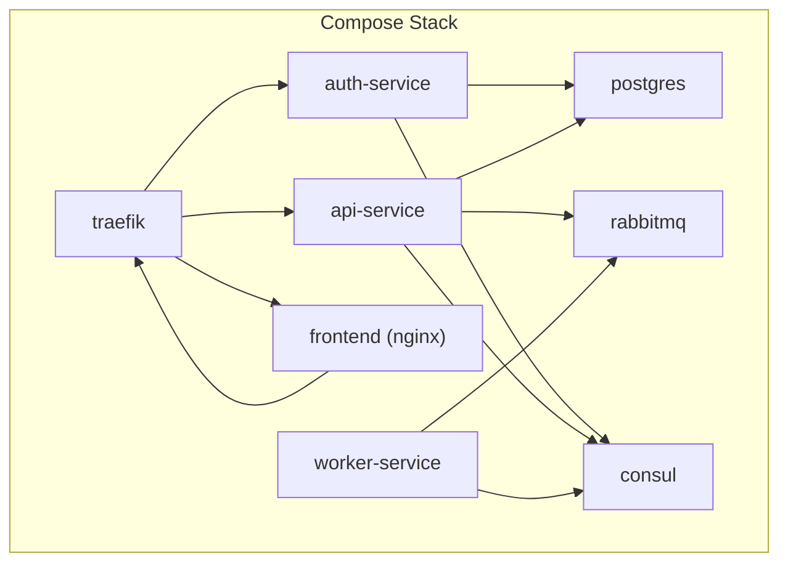
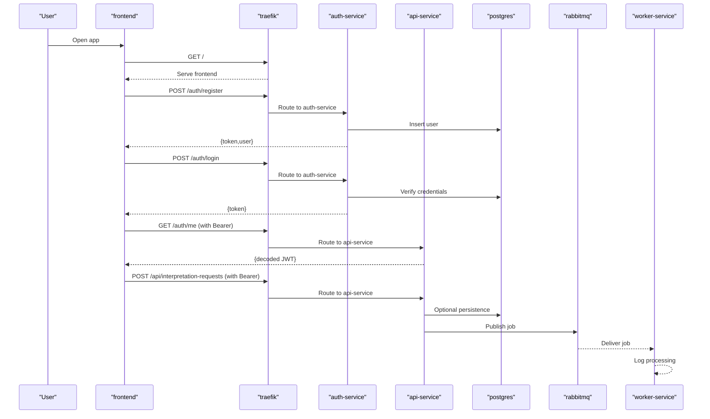
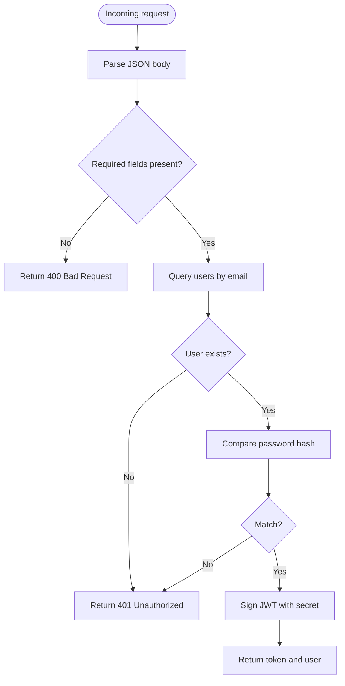
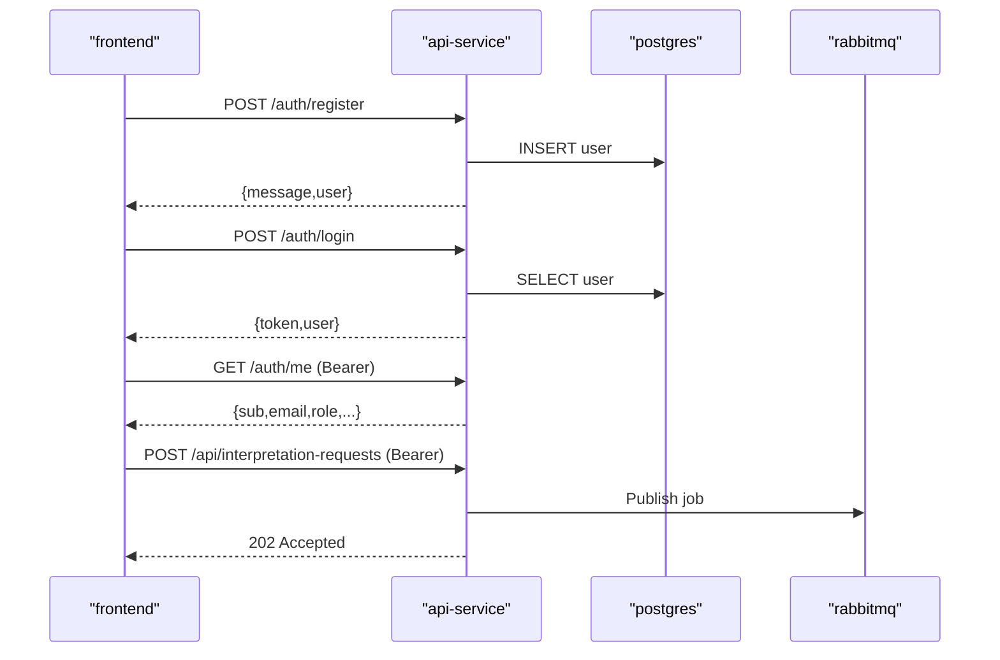
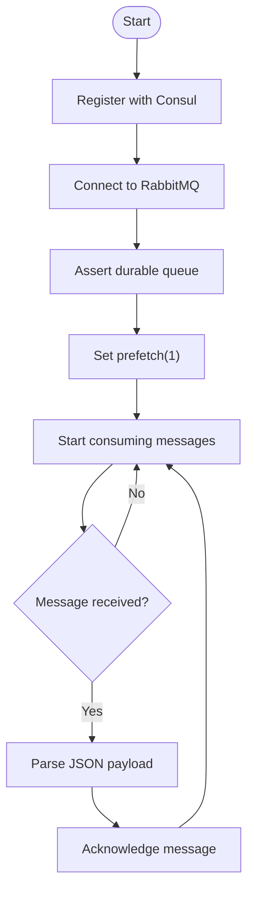
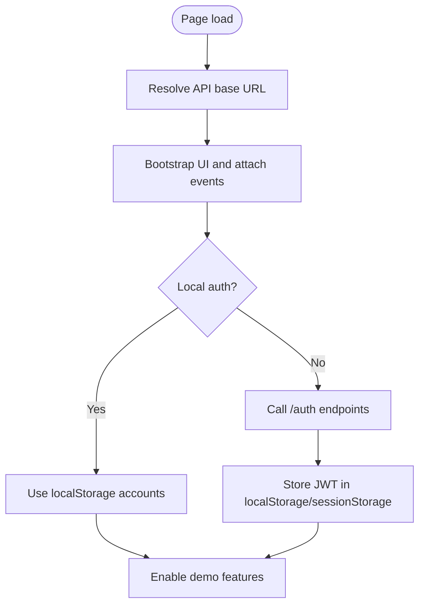
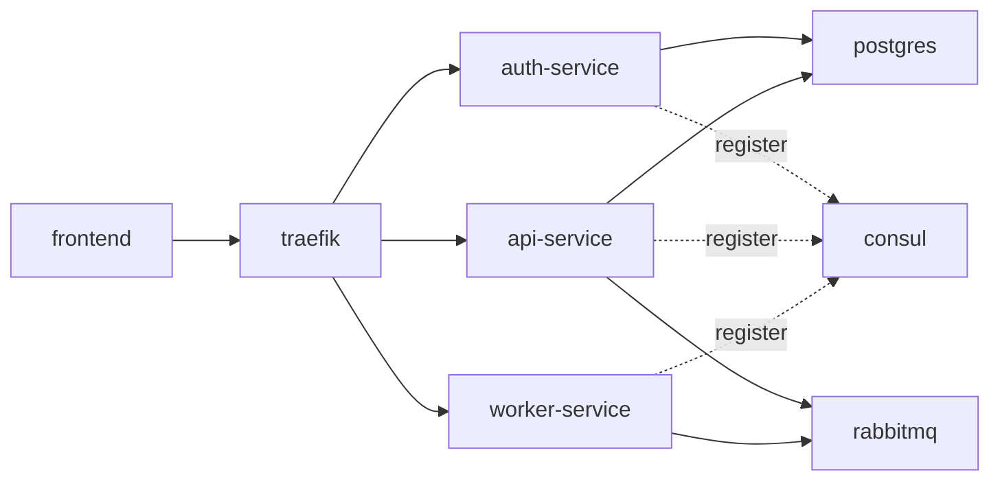

# Development Guide

<cite>
**Referenced Files in This Document**
- [README.md](file://README.md)
- [docker-compose.yml](file://docker-compose.yml)
- [services/auth-service/src/index.js](file://services/auth-service/src/index.js)
- [services/auth-service/src/db.js](file://services/auth-service/src/db.js)
- [services/auth-service/package.json](file://services/auth-service/package.json)
- [services/api-service/src/index.js](file://services/api-service/src/index.js)
- [services/api-service/src/db.js](file://services/api-service/src/db.js)
- [services/api-service/package.json](file://services/api-service/package.json)
- [services/worker-service/src/index.js](file://services/worker-service/src/index.js)
- [services/worker-service/package.json](file://services/worker-service/package.json)
- [frontend/index.html](file://frontend/index.html)
- [frontend/config.js](file://frontend/config.js)
- [frontend/script.js](file://frontend/script.js)
- [frontend/style.css](file://frontend/style.css)
- [infra/init-db.sql](file://infra/init-db.sql)
</cite>

## Table of Contents
1. [Introduction](#introduction)
2. [Project Structure](#project-structure)
3. [Core Components](#core-components)
4. [Architecture Overview](#architecture-overview)
5. [Detailed Component Analysis](#detailed-component-analysis)
6. [Dependency Analysis](#dependency-analysis)
7. [Performance Considerations](#performance-considerations)
8. [Troubleshooting Guide](#troubleshooting-guide)
9. [Contribution Guidelines](#contribution-guidelines)
10. [Build and Environment Setup](#build-and-environment-setup)
11. [Testing Strategies](#testing-strategies)
12. [Debugging Approaches](#debugging-approaches)
13. [Best Practices and Optimization](#best-practices-and-optimization)
14. [Conclusion](#conclusion)

## Introduction
This guide helps contributors develop, debug, and extend the SignVue microservices project locally. It covers environment setup, code organization, development workflow, testing, debugging, and best practices. The project demonstrates REST APIs, JWT authentication, asynchronous messaging with RabbitMQ, service discovery with Consul, reverse proxy routing via Traefik, and a static frontend consuming the backend.

## Project Structure
The repository is organized into:
- backend: shared backend logic and configuration
- frontend: static UI assets and client-side JavaScript
- infra: database initialization scripts
- services: individual microservices (auth-service, api-service, worker-service)
- docker-compose.yml: orchestrated deployment of all components
- README.md: overview, API, and deployment checklist

**Diagram sources**
- [docker-compose.yml:1-137](file://docker-compose.yml#L1-L137)

**Section sources**
- [README.md:1-111](file://README.md#L1-L111)
- [docker-compose.yml:1-137](file://docker-compose.yml#L1-L137)

## Core Components
- auth-service: handles registration, login, and JWT verification; connects to PostgreSQL
- api-service: exposes REST endpoints for sessions and interpretation requests; publishes jobs to RabbitMQ; connects to PostgreSQL
- worker-service: consumes RabbitMQ jobs and logs processing
- frontend: static UI served by Nginx; communicates with auth-service and api-service via Traefik
- infra/init-db.sql: initializes database schema for users, sessions, translations, and refresh tokens

Key runtime characteristics:
- auth-service and api-service expose health endpoints
- worker-service registers itself with Consul via HTTP checks
- Traefik routes traffic to services based on host and path prefixes

**Section sources**
- [services/auth-service/src/index.js:1-124](file://services/auth-service/src/index.js#L1-L124)
- [services/api-service/src/index.js:1-133](file://services/api-service/src/index.js#L1-L133)
- [services/worker-service/src/index.js:1-88](file://services/worker-service/src/index.js#L1-L88)
- [infra/init-db.sql:1-44](file://infra/init-db.sql#L1-L44)
- [docker-compose.yml:59-131](file://docker-compose.yml#L59-L131)

## Architecture Overview
High-level flow:
1. User accesses frontend via Traefik.
2. Frontend calls auth-service for registration/login and receives JWT.
3. Frontend calls api-service with Authorization: Bearer <token>.
4. api-service validates JWT and persists data to PostgreSQL.
5. api-service publishes interpretation requests to RabbitMQ.
6. worker-service consumes RabbitMQ messages and logs processing.

**Diagram sources**
- [services/auth-service/src/index.js:13-94](file://services/auth-service/src/index.js#L13-L94)
- [services/api-service/src/index.js:26-121](file://services/api-service/src/index.js#L26-L121)
- [services/worker-service/src/index.js:45-81](file://services/worker-service/src/index.js#L45-L81)
- [docker-compose.yml:59-131](file://docker-compose.yml#L59-L131)

## Detailed Component Analysis

### Authentication Service
Responsibilities:
- Registration: hashes passwords and inserts user into database
- Login: verifies credentials and issues JWT
- Verification: validates incoming JWTs
- Health: responds to health checks

**Diagram sources**
- [services/auth-service/src/index.js:13-94](file://services/auth-service/src/index.js#L13-L94)

**Section sources**
- [services/auth-service/src/index.js:1-124](file://services/auth-service/src/index.js#L1-L124)
- [services/auth-service/src/db.js:1-13](file://services/auth-service/src/db.js#L1-L13)
- [services/auth-service/package.json:1-18](file://services/auth-service/package.json#L1-L18)

### API Service
Responsibilities:
- Exposes REST endpoints for sessions and interpretation requests
- Validates JWT from Authorization header
- Publishes interpretation requests to RabbitMQ
- Performs database migrations and waits for DB readiness

**Diagram sources**
- [services/api-service/src/index.js:26-121](file://services/api-service/src/index.js#L26-L121)
- [services/api-service/src/db.js:14-78](file://services/api-service/src/db.js#L14-L78)
- [services/api-service/package.json:1-19](file://services/api-service/package.json#L1-L19)

**Section sources**
- [services/api-service/src/index.js:1-133](file://services/api-service/src/index.js#L1-L133)
- [services/api-service/src/db.js:1-84](file://services/api-service/src/db.js#L1-L84)
- [services/api-service/package.json:1-19](file://services/api-service/package.json#L1-L19)

### Worker Service
Responsibilities:
- Registers itself with Consul for service discovery
- Consumes RabbitMQ messages from a durable queue
- Logs job details upon successful processing

**Diagram sources**
- [services/worker-service/src/index.js:19-81](file://services/worker-service/src/index.js#L19-L81)

**Section sources**
- [services/worker-service/src/index.js:1-88](file://services/worker-service/src/index.js#L1-L88)
- [services/worker-service/package.json:1-14](file://services/worker-service/package.json#L1-L14)

### Frontend
Responsibilities:
- Provides static UI served by Nginx
- Manages authentication state and JWT storage
- Sends requests to auth-service and api-service via Traefik
- Supports a local demo mode using localStorage

**Diagram sources**
- [frontend/config.js:1-18](file://frontend/config.js#L1-L18)
- [frontend/script.js:557-725](file://frontend/script.js#L557-L725)
- [frontend/index.html:1-222](file://frontend/index.html#L1-L222)

**Section sources**
- [frontend/config.js:1-18](file://frontend/config.js#L1-L18)
- [frontend/script.js:1-725](file://frontend/script.js#L1-L725)
- [frontend/style.css:1-800](file://frontend/style.css#L1-L800)
- [frontend/index.html:1-222](file://frontend/index.html#L1-L222)

## Dependency Analysis
Runtime dependencies and relationships:
- auth-service and api-service depend on PostgreSQL for persistence
- api-service publishes to RabbitMQ; worker-service consumes
- Traefik routes external traffic to services based on host/path
- Consul is used for service registration and health checks

**Diagram sources**
- [docker-compose.yml:59-131](file://docker-compose.yml#L59-L131)

**Section sources**
- [docker-compose.yml:1-137](file://docker-compose.yml#L1-L137)

## Performance Considerations
- Asynchronous processing: Offload heavy work to worker-service via RabbitMQ to keep API responsive
- Health checks: Ensure services report health to Consul and Traefik for proper routing
- Database readiness: api-service waits for PostgreSQL before serving requests
- Frontend responsiveness: Avoid blocking UI during network calls; debounce or batch requests where appropriate
- Logging: Keep worker logs minimal and structured for observability without impacting throughput

[No sources needed since this section provides general guidance]

## Troubleshooting Guide
Common issues and remedies:
- Services fail to start due to missing environment variables:
  - Ensure JWT_SECRET is set consistently across auth-service and api-service
  - Verify DATABASE_URL for PostgreSQL connectivity
- RabbitMQ connectivity:
  - Confirm RABBITMQ_URL and that RabbitMQ is healthy
- Frontend cannot reach backend:
  - Set meta tag or window override for API base URL
  - Use local demo mode by appending ?local=1 to bypass remote auth
- Service discovery:
  - Check Consul UI for registered services and health statuses

**Section sources**
- [services/auth-service/src/index.js:10-11](file://services/auth-service/src/index.js#L10-L11)
- [services/api-service/src/index.js:13-14](file://services/api-service/src/index.js#L13-L14)
- [services/api-service/src/db.js:3-8](file://services/api-service/src/db.js#L3-L8)
- [services/worker-service/src/index.js:7-12](file://services/worker-service/src/index.js#L7-L12)
- [frontend/config.js:1-18](file://frontend/config.js#L1-L18)
- [frontend/script.js:23-34](file://frontend/script.js#L23-L34)

## Contribution Guidelines
Workflow:
- Fork and branch from the default branch
- Make focused commits with clear messages
- Run local tests and lint checks before opening a pull request
- Reference related issues and update documentation as needed
- Keep PRs small and self-contained

Review standards:
- Ensure code clarity, maintainability, and adherence to existing patterns
- Verify environment variables and secrets are not committed
- Confirm Docker Compose builds and runs all services successfully

[No sources needed since this section provides general guidance]

## Build and Environment Setup
Local setup steps:
1. Start supporting infrastructure:
   - docker compose up -d consul rabbitmq postgres
2. Start microservices:
   - docker compose up -d auth-service api-service worker-service
3. Start reverse proxy and frontend:
   - docker compose up -d traefik frontend
4. Access:
   - Application: http://localhost:9080
   - Traefik dashboard: http://localhost:9081
   - Consul UI: http://localhost:8500
   - RabbitMQ management: http://localhost:15672

Environment variables:
- JWT_SECRET: shared secret for JWT signing
- DATABASE_URL: PostgreSQL connection string
- RABBITMQ_URL: AMQP connection string
- CONSUL_HOST: Consul agent address

**Section sources**
- [README.md:51-95](file://README.md#L51-L95)
- [docker-compose.yml:61-116](file://docker-compose.yml#L61-L116)

## Testing Strategies
Recommended approaches:
- Unit tests for business logic (e.g., JWT verification, password hashing)
- Integration tests validating end-to-end flows:
  - Registration → Login → JWT verification → API access
  - Interpretation request → RabbitMQ publish → worker consumption
- Manual smoke tests:
  - Verify Traefik routing and health endpoints
  - Confirm Consul service registration and health checks
- Database migration tests:
  - Ensure init-db.sql and service migrations create expected tables and indexes

[No sources needed since this section provides general guidance]

## Debugging Approaches
- Observe logs:
  - docker compose logs -f <service>
- Inspect service health:
  - GET /health on each service
- Validate JWT:
  - Use a JWT debugger to inspect claims and signature
- Frontend debugging:
  - Check API base URL resolution and token storage
  - Use browser devtools to monitor network requests and responses

**Section sources**
- [services/auth-service/src/index.js:114-117](file://services/auth-service/src/index.js#L114-L117)
- [services/api-service/src/index.js:16-24](file://services/api-service/src/index.js#L16-L24)
- [services/worker-service/src/index.js:14-17](file://services/worker-service/src/index.js#L14-L17)

## Best Practices and Optimization
- Security:
  - Rotate JWT_SECRET in production
  - Sanitize and validate all inputs
  - Use HTTPS in production deployments
- Observability:
  - Add structured logging and metrics
  - Monitor RabbitMQ queue depth and consumer lag
- Reliability:
  - Implement idempotent message processing in worker-service
  - Use database transactions for critical writes
- Scalability:
  - Scale services independently based on load
  - Use durable queues and acknowledgments in RabbitMQ

[No sources needed since this section provides general guidance]

## Conclusion
This guide outlines how to develop, test, and extend SignVue’s microservices locally. By following the setup, workflow, and best practices described here, contributors can confidently add new features, integrate additional services, and maintain high code quality.