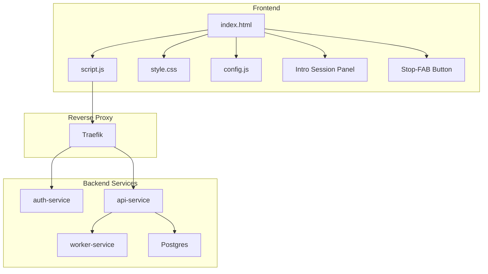
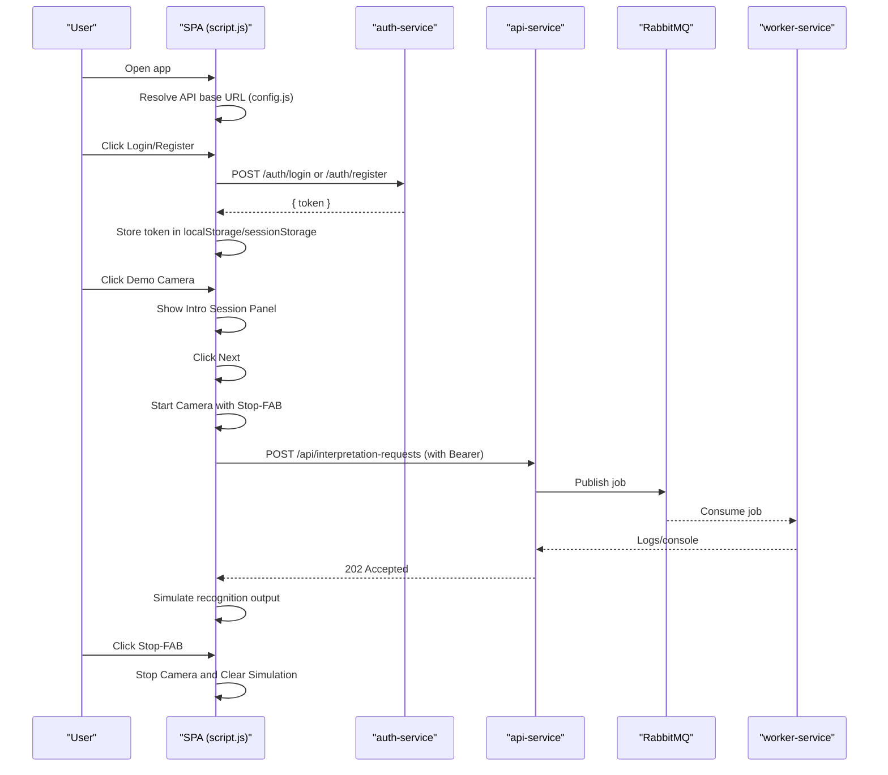
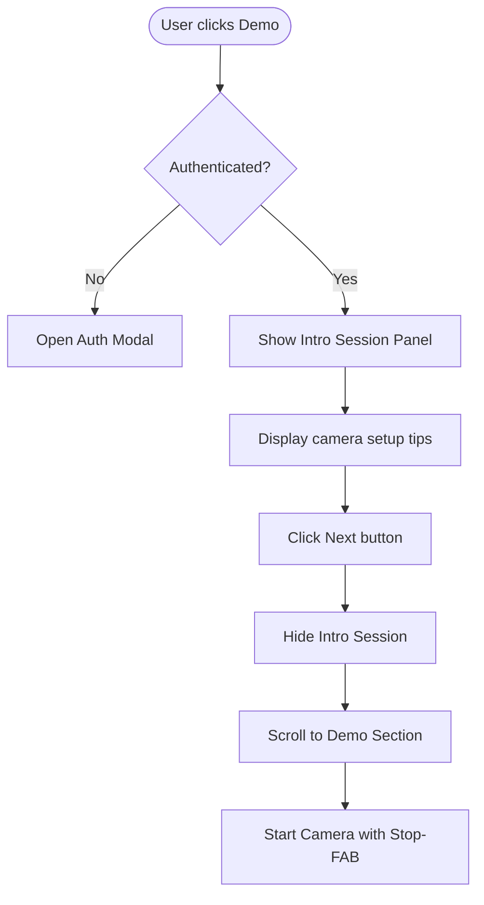
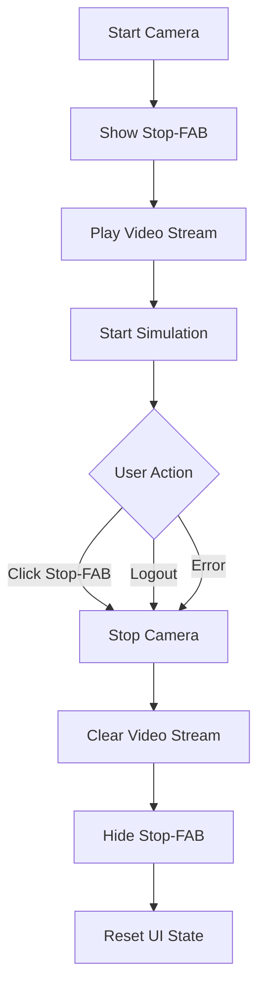
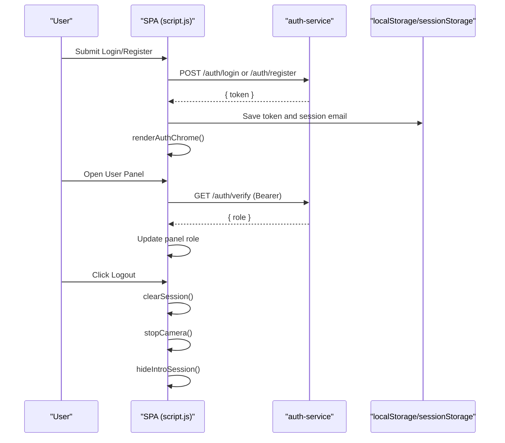
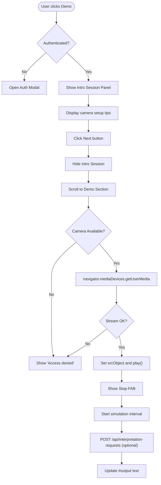
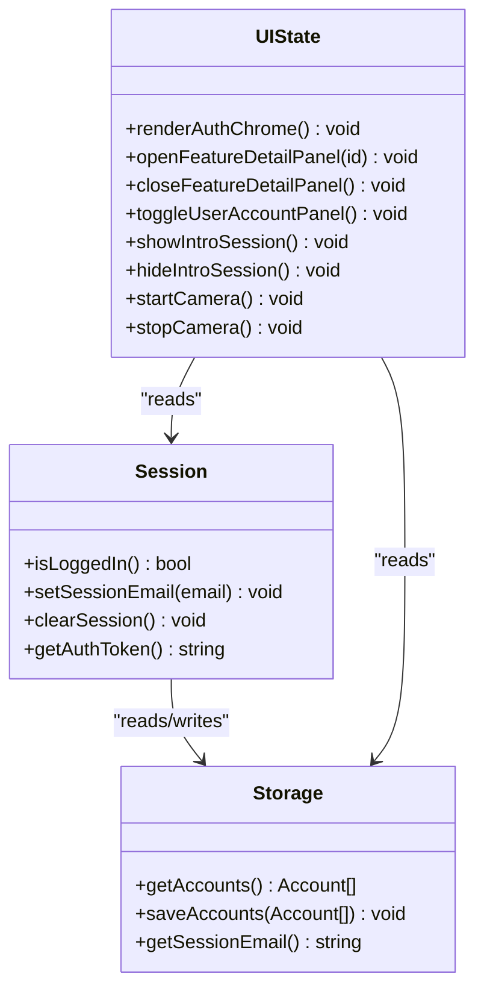
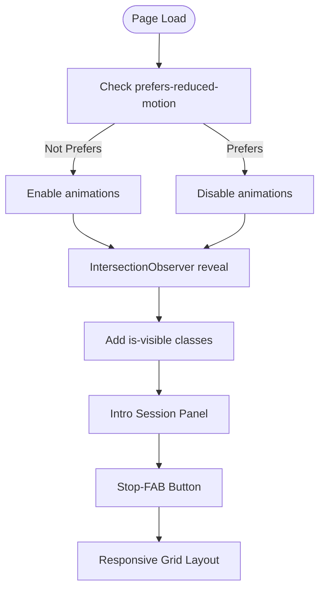
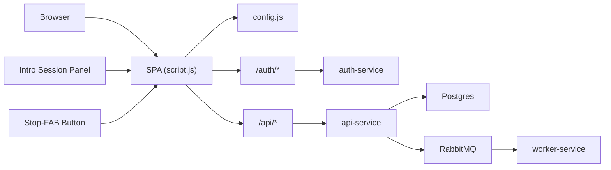

# Frontend Application

<cite>
**Referenced Files in This Document**
- [index.html](file://frontend/index.html)
- [script.js](file://frontend/script.js)
- [style.css](file://frontend/style.css)
- [config.js](file://frontend/config.js)
- [docker-compose.yml](file://docker-compose.yml)
- [README.md](file://README.md)
- [auth-service/src/index.js](file://services/auth-service/src/index.js)
- [api-service/src/index.js](file://services/api-service/src/index.js)
- [infra/init-db.sql](file://infra/init-db.sql)
</cite>

## Update Summary
**Changes Made**
- Added comprehensive introduction session system with tutorial guidance
- Enhanced camera control with stop functionality for improved user experience
- Improved authentication flow with automatic session management
- Updated demo camera interface with intro-session panel and stop-fab button
- Enhanced user onboarding experience with guided tutorial

## Table of Contents
1. [Introduction](#introduction)
2. [Project Structure](#project-structure)
3. [Core Components](#core-components)
4. [Architecture Overview](#architecture-overview)
5. [Detailed Component Analysis](#detailed-component-analysis)
6. [Dependency Analysis](#dependency-analysis)
7. [Performance Considerations](#performance-considerations)
8. [Troubleshooting Guide](#troubleshooting-guide)
9. [Conclusion](#conclusion)
10. [Appendices](#appendices)

## Introduction
This document describes the Frontend Single Page Application for SignVue, focusing on the web UI architecture, authentication flow, webcam integration for sign language detection, and the demo interface. It explains state management patterns, user interaction handling, responsive design, backend integration via Traefik routing, localStorage usage for offline functionality, and configuration management. It also covers browser compatibility, accessibility considerations, and performance optimization techniques.

**Updated** Added comprehensive introduction session system with tutorial guidance, enhanced camera control with stop functionality, and improved user onboarding experience.

## Project Structure
The frontend is a static SPA served by Nginx and integrated with a microservices backend orchestrated by Traefik. The SPA consists of:
- index.html: markup for the UI, including authentication modal, feature cards, intro-session panel, and demo camera area
- script.js: client-side logic for authentication, session management, webcam access, demo simulation, intro-session handling, and UI interactions
- style.css: responsive styles, animations, component layouts, and new intro-session and stop-fab styling
- config.js: runtime configuration resolution for the API base URL

**Diagram sources**
- [docker-compose.yml:118-131](file://docker-compose.yml#L118-L131)
- [index.html:17-246](file://frontend/index.html#L17-L246)
- [script.js:23-34](file://frontend/script.js#L23-L34)

**Section sources**
- [docker-compose.yml:118-131](file://docker-compose.yml#L118-L131)
- [index.html:17-246](file://frontend/index.html#L17-L246)
- [script.js:23-34](file://frontend/script.js#L23-L34)

## Core Components
- Authentication and session management: login/register forms, JWT handling, user panel, and role display
- Introduction session panel: guided tutorial with camera setup instructions and next-step progression
- Demo camera interface: webcam access, video preview, stop-fab button for camera termination, and simulated recognition output
- Feature cards: expandable detail panels with animated reveal
- Responsive navigation and accessibility: mobile-friendly navigation, keyboard support, and reduced motion preferences
- Configuration and routing: API base URL resolution and Traefik routing rules

Key responsibilities:
- script.js orchestrates UI state, user actions, intro-session flow, and API interactions
- style.css defines responsive layouts, animations, accessibility attributes, and new intro-session/styling
- config.js resolves the API base URL from meta tag or global override
- index.html provides the DOM structure with intro-session panel and stop-fab button

**Updated** Added intro-session panel with instructional content and stop-fab button for camera termination.

**Section sources**
- [script.js:169-174](file://frontend/script.js#L169-L174)
- [script.js:416-462](file://frontend/script.js#L416-L462)
- [script.js:464-475](file://frontend/script.js#L464-L475)
- [script.js:605-629](file://frontend/script.js#L605-L629)
- [style.css:316-482](file://frontend/style.css#L316-L482)
- [style.css:934-963](file://frontend/style.css#L934-L963)
- [style.css:965-1037](file://frontend/style.css#L965-L1037)
- [config.js:7-17](file://frontend/config.js#L7-L17)
- [index.html:19-57](file://frontend/index.html#L19-L57)

## Architecture Overview
The SPA communicates with backend services through Traefik, which routes requests to auth-service and api-service based on host and path prefixes. The frontend uses localStorage for offline sessions and sessionStorage for server-backed sessions. The demo camera flow triggers an interpretation request to the backend queue and includes an intro-session tutorial.

**Diagram sources**
- [config.js:7-17](file://frontend/config.js#L7-L17)
- [script.js:176-182](file://frontend/script.js#L176-L182)
- [script.js:217-232](file://frontend/script.js#L217-L232)
- [script.js:429-435](file://frontend/script.js#L429-L435)
- [script.js:464-475](file://frontend/script.js#L464-L475)
- [script.js:616-622](file://frontend/script.js#L616-L622)
- [docker-compose.yml:70-105](file://docker-compose.yml#L70-L105)

**Section sources**
- [README.md:17-23](file://README.md#L17-L23)
- [docker-compose.yml:70-105](file://docker-compose.yml#L70-L105)
- [script.js:176-182](file://frontend/script.js#L176-L182)
- [script.js:217-232](file://frontend/script.js#L217-L232)
- [script.js:429-435](file://frontend/script.js#L429-L435)
- [script.js:464-475](file://frontend/script.js#L464-L475)
- [script.js:616-622](file://frontend/script.js#L616-L622)

## Detailed Component Analysis

### Introduction Session System
The SPA now includes a comprehensive introduction session system designed to guide users through the camera setup process:
- Intro session panel appears before camera access
- Provides step-by-step instructions for optimal camera positioning
- Includes practical tips for lighting, distance, and clothing considerations
- Features a "Suivant" (Next) button to progress to the demo camera
- Smooth scrolling transition to the demo section

**Diagram sources**
- [script.js:464-475](file://frontend/script.js#L464-L475)
- [script.js:616-622](file://frontend/script.js#L616-L622)
- [index.html:143-162](file://frontend/index.html#L143-L162)

**Section sources**
- [script.js:464-475](file://frontend/script.js#L464-L475)
- [script.js:616-622](file://frontend/script.js#L616-L622)
- [index.html:143-162](file://frontend/index.html#L143-L162)
- [style.css:965-1037](file://frontend/style.css#L965-L1037)

### Enhanced Camera Control with Stop Functionality
The demo camera interface now includes a dedicated stop-fab button for improved camera control:
- Red stop-fab button positioned at bottom-right of video container
- Hover effects with scaling and shadow enhancement
- Hidden state when camera is inactive
- Automatic activation when camera starts
- Comprehensive cleanup of camera streams and simulations

**Diagram sources**
- [script.js:416-462](file://frontend/script.js#L416-L462)
- [script.js:608-614](file://frontend/script.js#L608-L614)
- [index.html:178-183](file://frontend/index.html#L178-L183)

**Section sources**
- [script.js:416-462](file://frontend/script.js#L416-L462)
- [script.js:608-614](file://frontend/script.js#L608-L614)
- [index.html:178-183](file://frontend/index.html#L178-L183)
- [style.css:934-963](file://frontend/style.css#L934-L963)

### Authentication Flow
The SPA supports two modes:
- Server-backed JWT mode: authenticates against auth-service, stores JWT in localStorage, and verifies sessions on boot
- Local storage mode (?local=1): uses localStorage for accounts and session without backend

Key flows:
- Login/Register forms submit credentials to backend endpoints
- On success, the SPA stores the JWT and sets the session email
- The user panel displays the email and role (fetched via /auth/verify in server-backed mode)
- Logout clears session, stops camera stream, and hides intro-session panel

**Diagram sources**
- [script.js:184-232](file://frontend/script.js#L184-L232)
- [script.js:121-142](file://frontend/script.js#L121-L142)
- [script.js:347-380](file://frontend/script.js#L347-L380)
- [auth-service/src/index.js:52-94](file://services/auth-service/src/index.js#L52-L94)

**Section sources**
- [script.js:169-174](file://frontend/script.js#L169-L174)
- [script.js:184-232](file://frontend/script.js#L184-L232)
- [script.js:121-142](file://frontend/script.js#L121-L142)
- [script.js:347-380](file://frontend/script.js#L347-L380)
- [auth-service/src/index.js:52-94](file://services/auth-service/src/index.js#L52-L94)

### Demo Camera and Recognition Simulation
The demo camera integrates with the webcam and simulates recognition output:
- Requires authentication to start
- Shows intro-session panel with camera setup instructions
- Requests camera permission and starts the video stream
- Displays a placeholder until playback begins
- Shows stop-fab button for camera termination
- Starts a periodic simulation of recognized words
- Sends an interpretation request to the backend when started

**Diagram sources**
- [script.js:409-441](file://frontend/script.js#L409-L441)
- [script.js:398-407](file://frontend/script.js#L398-L407)
- [script.js:429-435](file://frontend/script.js#L429-L435)

**Section sources**
- [script.js:409-441](file://frontend/script.js#L409-L441)
- [script.js:398-407](file://frontend/script.js#L398-L407)
- [script.js:429-435](file://frontend/script.js#L429-L435)

### State Management Patterns
- Session state: stored in localStorage (local mode) or sessionStorage (server-backed), with migration logic
- Tokens: JWT stored in localStorage for server-backed mode
- UI state: toggled via CSS classes and aria-* attributes for accessibility
- Feature detail panels: controlled by dataset and selection state
- Intro-session state: managed separately from main UI state
- Reduced motion: respects user preference to disable animations

**Diagram sources**
- [script.js:94-112](file://frontend/script.js#L94-L112)
- [script.js:144-158](file://frontend/script.js#L144-L158)
- [script.js:347-380](file://frontend/script.js#L347-L380)
- [script.js:588-603](file://frontend/script.js#L588-L603)
- [script.js:464-475](file://frontend/script.js#L464-L475)
- [script.js:451-462](file://frontend/script.js#L451-L462)

**Section sources**
- [script.js:94-112](file://frontend/script.js#L94-L112)
- [script.js:144-158](file://frontend/script.js#L144-L158)
- [script.js:347-380](file://frontend/script.js#L347-L380)
- [script.js:588-603](file://frontend/script.js#L588-L603)
- [script.js:464-475](file://frontend/script.js#L464-L475)
- [script.js:451-462](file://frontend/script.js#L451-L462)

### Responsive Design and Accessibility
- Responsive layout: CSS Grid and Flexbox for adaptive sections
- Animations: CSS keyframes with reduced motion support
- Accessibility: ARIA attributes, focus management, keyboard navigation, and screen reader-friendly labels
- Navigation: Mobile hamburger menu with aria-expanded toggling
- Intro-session panel: Full-width responsive design with grid layout
- Stop-fab button: Accessible floating action button with hover states

**Diagram sources**
- [style.css:573-598](file://frontend/style.css#L573-L598)
- [script.js:655-692](file://frontend/script.js#L655-L692)
- [style.css:965-1037](file://frontend/style.css#L965-L1037)
- [style.css:934-963](file://frontend/style.css#L934-L963)

**Section sources**
- [style.css:573-598](file://frontend/style.css#L573-L598)
- [script.js:655-692](file://frontend/script.js#L655-L692)
- [style.css:965-1037](file://frontend/style.css#L965-L1037)
- [style.css:934-963](file://frontend/style.css#L934-L963)

### Configuration Management
The API base URL is resolved from:
- window.__SIGNVUE_API_BASE__ override
- meta[name="signvue-api-base"] content
- Default fallback to a hosted backend

This allows flexible deployment targets without code changes.

**Section sources**
- [config.js:7-17](file://frontend/config.js#L7-L17)
- [index.html:6-7](file://frontend/index.html#L6-L7)
- [script.js:23-34](file://frontend/script.js#L23-L34)

## Dependency Analysis
- Frontend depends on Traefik routing for auth-service (/auth) and api-service (/api)
- Backend services depend on Postgres for persistence and RabbitMQ for asynchronous jobs
- The SPA uses localStorage/sessionStorage for offline/local mode and JWT for server-backed mode
- New dependencies: intro-session panel and stop-fab button components

**Diagram sources**
- [docker-compose.yml:70-105](file://docker-compose.yml#L70-L105)
- [script.js:176-182](file://frontend/script.js#L176-L182)
- [auth-service/src/index.js:12-94](file://services/auth-service/src/index.js#L12-L94)
- [api-service/src/index.js:16-121](file://services/api-service/src/index.js#L16-L121)

**Section sources**
- [docker-compose.yml:70-105](file://docker-compose.yml#L70-L105)
- [script.js:176-182](file://frontend/script.js#L176-L182)
- [auth-service/src/index.js:12-94](file://services/auth-service/src/index.js#L12-L94)
- [api-service/src/index.js:16-121](file://services/api-service/src/index.js#L16-L121)

## Performance Considerations
- Animation budget: reduced motion preference disables heavy animations
- Lazy initialization: IntersectionObserver defers reveal animations until elements are near viewport
- Minimal DOM updates: toggling CSS classes and dataset attributes reduces reflows
- Efficient event handling: delegated listeners and requestAnimationFrame for UI updates
- Camera optimization: explicit play() and track stopping on logout to release resources
- Intro-session optimization: smooth scrolling and conditional rendering based on user state

**Updated** Added intro-session optimization and stop-fab button performance considerations.

[No sources needed since this section provides general guidance]

## Troubleshooting Guide
Common issues and resolutions:
- Camera access denied: ensure HTTPS or localhost origin and that the user grants permission
- API base URL mismatch: verify meta tag or window override for the API base
- Network errors during login/register: confirm backend services are healthy and Traefik routes are configured
- Session not persisting: check localStorage/sessionStorage availability and browser privacy settings
- Demo locked behind authentication: click "Connexion" to open the modal and log in
- Intro-session not appearing: ensure user is authenticated and JavaScript is enabled
- Stop-fab not working: check browser compatibility with mediaDevices API and camera permissions

**Updated** Added troubleshooting for intro-session and stop-fab functionality.

**Section sources**
- [script.js:437-440](file://frontend/script.js#L437-L440)
- [config.js:7-17](file://frontend/config.js#L7-L17)
- [script.js:484-506](file://frontend/script.js#L484-L506)
- [script.js:509-541](file://frontend/script.js#L509-L541)

## Conclusion
The SignVue frontend delivers a responsive, accessible SPA with robust authentication, seamless webcam integration, and a simulated recognition pipeline. Its modular architecture, clear state management, and Traefik-driven routing enable easy deployment and maintenance across environments. The addition of the comprehensive introduction session system, enhanced camera control with stop functionality, and improved user onboarding experience significantly enhances the overall user experience. The combination of server-backed JWT and local storage modes provides flexibility for development and production scenarios.

**Updated** Enhanced conclusion to reflect the new introduction session system and improved user experience features.

[No sources needed since this section summarizes without analyzing specific files]

## Appendices

### API Endpoints Used by the SPA
- POST /auth/register — registers a new user
- POST /auth/login — authenticates and returns a JWT
- GET /auth/verify — verifies JWT and returns decoded payload
- GET /auth/me — returns current user profile
- POST /api/interpretation-requests — submits a recognition request

**Updated** Added /auth/me endpoint for improved session management.

**Section sources**
- [auth-service/src/index.js:12-94](file://services/auth-service/src/index.js#L12-L94)
- [api-service/src/index.js:26-121](file://services/api-service/src/index.js#L26-L121)

### Data Model References
- Users table with email, password hash, role, timestamps
- Refresh tokens table for optional refresh token management
- Interpretation sessions and translations tables for historical data

**Section sources**
- [infra/init-db.sql:3-44](file://infra/init-db.sql#L3-L44)