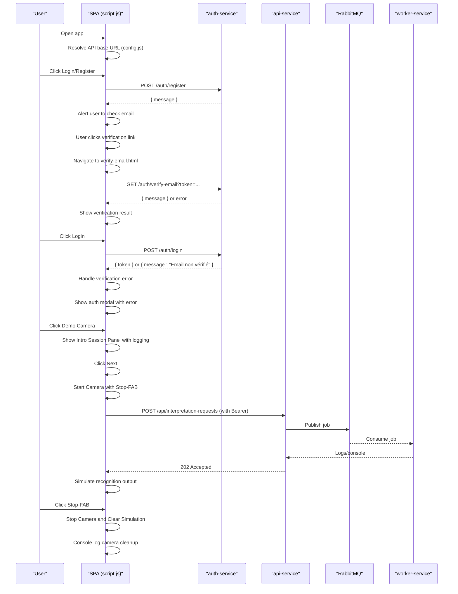
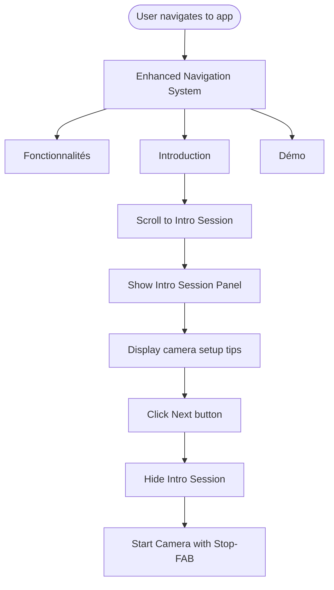
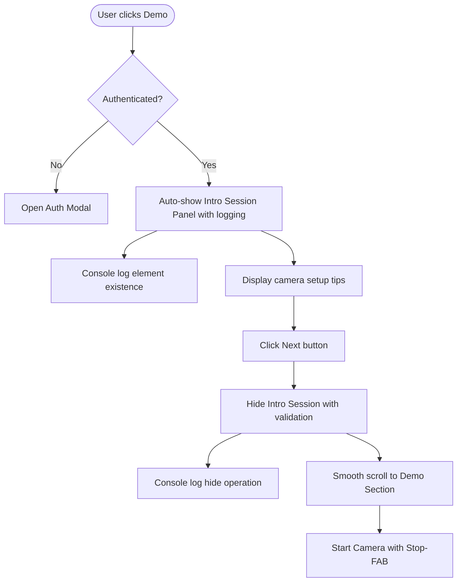
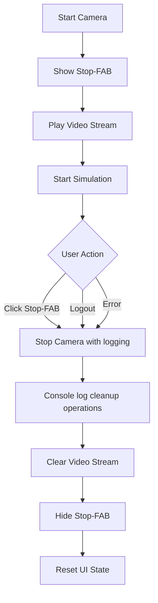
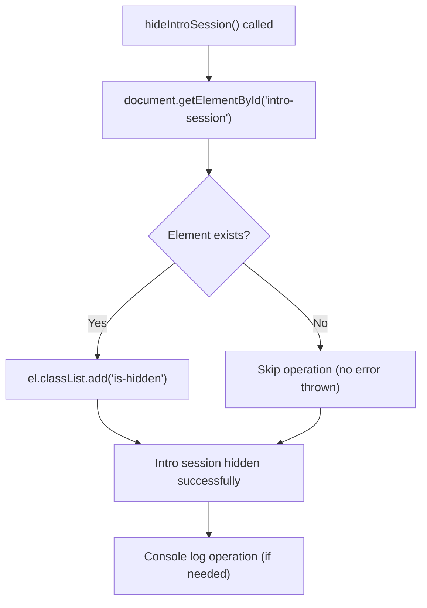
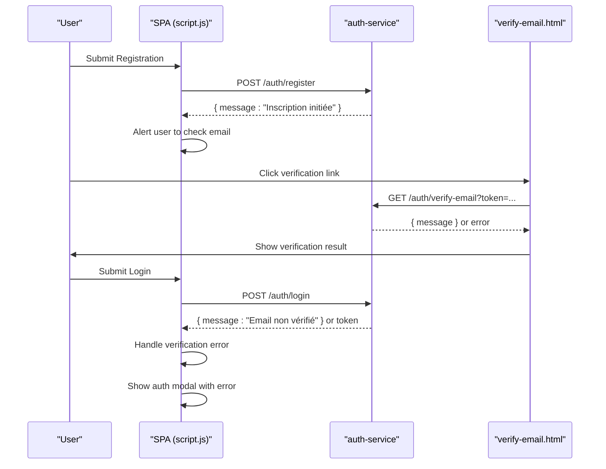
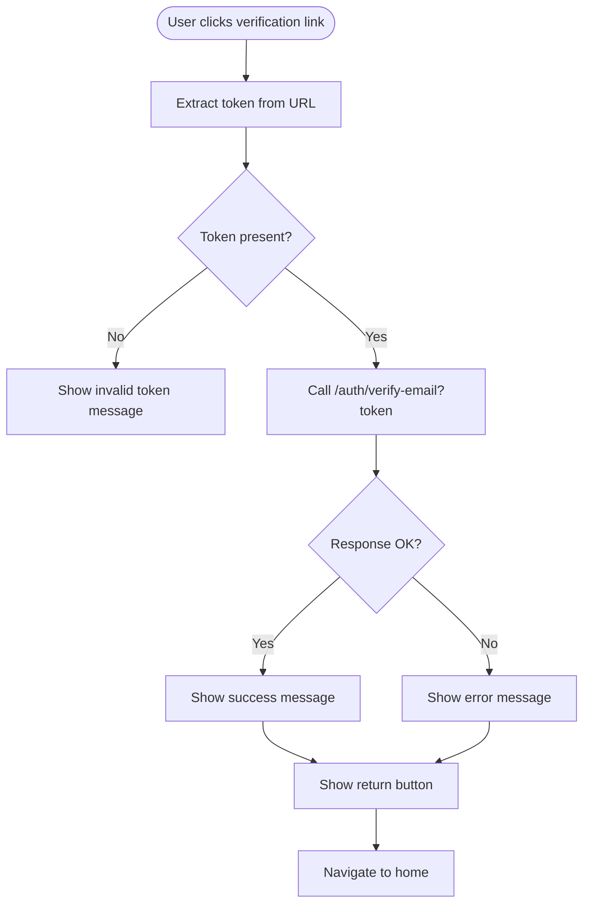
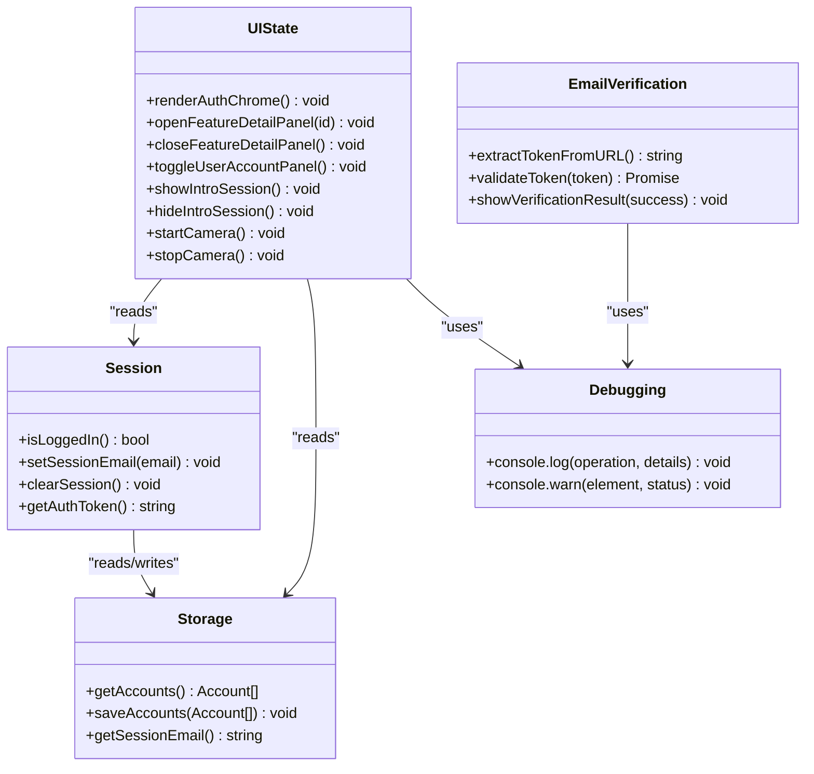
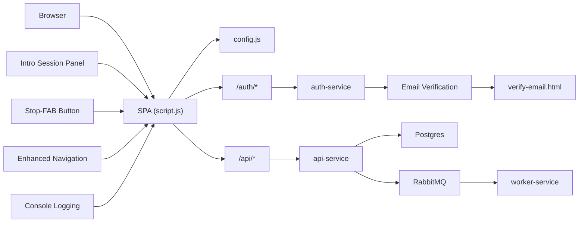

# Frontend Application

<cite>
**Referenced Files in This Document**
- [index.html](file://frontend/index.html)
- [script.js](file://frontend/script.js)
- [style.css](file://frontend/style.css)
- [config.js](file://frontend/config.js)
- [verify-email.html](file://frontend/verify-email.html)
- [docker-compose.yml](file://docker-compose.yml)
- [README.md](file://README.md)
- [services/auth-service/src/index.js](file://services/auth-service/src/index.js)
- [services/api-service/src/index.js](file://services/api-service/src/index.js)
- [infra/init-db.sql](file://infra/init-db.sql)
</cite>

## Update Summary
**Changes Made**
- Added new verification page (verify-email.html) for email verification workflow
- Modified registration flow to prevent immediate session creation after registration
- Enhanced authentication system with email verification requirement
- Updated error handling for unverified accounts during login
- Added comprehensive email verification endpoint integration
- Enhanced frontend authentication flow with proper error handling

## Table of Contents
1. [Introduction](#introduction)
2. [Project Structure](#project-structure)
3. [Core Components](#core-components)
4. [Architecture Overview](#architecture-overview)
5. [Detailed Component Analysis](#detailed-component-analysis)
6. [Dependency Analysis](#dependency-analysis)
7. [Performance Considerations](#performance-considerations)
8. [Troubleshooting Guide](#troubleshooting-guide)
9. [Conclusion](#conclusion)
10. [Appendices](#appendices)

## Introduction
This document describes the Frontend Single Page Application for SignVue, focusing on the web UI architecture, authentication flow with email verification, webcam integration for sign language detection, and the demo interface. It explains state management patterns, user interaction handling, responsive design, backend integration via Traefik routing, localStorage usage for offline functionality, and configuration management. It also covers browser compatibility, accessibility considerations, and performance optimization techniques.

**Updated** Added comprehensive email verification workflow with new verification page and enhanced authentication system with proper error handling for unverified accounts.

## Project Structure
The frontend is a static SPA served by Nginx and integrated with a microservices backend orchestrated by Traefik. The SPA consists of:
- index.html: markup for the UI, including authentication modal, feature cards, intro-session panel, and demo camera area
- script.js: client-side logic for authentication, session management, webcam access, demo simulation, intro-session handling, and UI interactions
- style.css: responsive styles, animations, component layouts, and new intro-session and stop-fab styling
- config.js: runtime configuration resolution for the API base URL
- verify-email.html: new verification page for email verification workflow

```mermaid
graph TB
subgraph "Frontend"
HTML["index.html"]
JS["script.js"]
CSS["style.css"]
CFG["config.js"]
VERIF["verify-email.html"]
INTRO["Intro Session Panel"]
STOPFAB["Stop-FAB Button"]
AUTHLOGIC["Enhanced Auth Logic"]
DEBUGLOGS["Console Debugging"]
NAVIGATION["Enhanced Navigation"]
END
subgraph "Reverse Proxy"
TRAEFIK["Traefik"]
END
subgraph "Backend Services"
AUTH["auth-service"]
API["api-service"]
WORKER["worker-service"]
PG["Postgres"]
END
HTML --> JS
HTML --> CSS
HTML --> CFG
HTML --> INTRO
HTML --> STOPFAB
HTML --> NAVIGATION
JS --> AUTHLOGIC
AUTHLOGIC --> DEBUGLOGS
JS --> TRAEFIK
VERIF --> AUTH
TRAEFIK --> AUTH
TRAEFIK --> API
API --> PG
API --> WORKER
```

**Diagram sources**
- [docker-compose.yml:118-131](file://docker-compose.yml#L118-L131)
- [index.html:17-247](file://frontend/index.html#L17-L247)
- [script.js:23-34](file://frontend/script.js#L23-L34)
- [verify-email.html:1-148](file://frontend/verify-email.html#L1-L148)

**Section sources**
- [docker-compose.yml:118-131](file://docker-compose.yml#L118-L131)
- [index.html:17-247](file://frontend/index.html#L17-L247)
- [script.js:23-34](file://frontend/script.js#L23-L34)
- [verify-email.html:1-148](file://frontend/verify-email.html#L1-L148)

## Core Components
- Authentication and session management: login/register forms, JWT handling, user panel, and role display with enhanced debugging and email verification workflow
- Email verification system: new verification page with token validation and user feedback
- Introduction session panel: guided tutorial with camera setup instructions and next-step progression
- Demo camera interface: webcam access, video preview, stop-fab button for camera termination, and simulated recognition output
- Feature cards: expandable detail panels with animated reveal and enhanced error handling
- Responsive navigation and accessibility: mobile-friendly navigation, keyboard support, and reduced motion preferences with enhanced navigation system
- Configuration and routing: API base URL resolution and Traefik routing rules

Key responsibilities:
- script.js orchestrates UI state, user actions, intro-session flow, API interactions, and email verification workflow with comprehensive logging
- style.css defines responsive layouts, animations, accessibility attributes, and new intro-session/stopping styling
- config.js resolves the API base URL from meta tag or global override
- index.html provides the DOM structure with intro-session panel, stop-fab button, and enhanced navigation system
- verify-email.html handles email verification with token validation and user feedback

**Updated** Enhanced introduction session panel with automatic display logic and smooth scrolling navigation. Improved authentication debugging with console logs and enhanced error handling. Added new Introduction link to navigation system for better user experience. Integrated comprehensive email verification workflow with new verification page.

**Section sources**
- [script.js:169-174](file://frontend/script.js#L169-L174)
- [script.js:416-462](file://frontend/script.js#L416-L462)
- [script.js:464-475](file://frontend/script.js#L464-L475)
- [script.js:605-629](file://frontend/script.js#L605-L629)
- [script.js:187-218](file://frontend/script.js#L187-L218)
- [style.css:316-482](file://frontend/style.css#L316-L482)
- [style.css:934-963](file://frontend/style.css#L934-L963)
- [style.css:965-1037](file://frontend/style.css#L965-L1037)
- [config.js:7-17](file://frontend/config.js#L7-L17)
- [index.html:19-57](file://frontend/index.html#L19-L57)
- [verify-email.html:1-148](file://frontend/verify-email.html#L1-L148)

## Architecture Overview
The SPA communicates with backend services through Traefik, which routes requests to auth-service and api-service based on host and path prefixes. The frontend uses localStorage for offline sessions and sessionStorage for server-backed sessions. The demo camera flow triggers an interpretation request to the backend queue and includes an intro-session tutorial. The email verification workflow integrates with the authentication system to ensure proper account activation.



**Diagram sources**
- [config.js:7-17](file://frontend/config.js#L7-L17)
- [script.js:176-182](file://frontend/script.js#L176-L182)
- [script.js:217-232](file://frontend/script.js#L217-L232)
- [script.js:429-435](file://frontend/script.js#L429-L435)
- [script.js:464-475](file://frontend/script.js#L464-L475)
- [script.js:616-622](file://frontend/script.js#L616-L622)
- [verify-email.html:101-142](file://frontend/verify-email.html#L101-L142)
- [services/auth-service/src/index.js:129-158](file://services/auth-service/src/index.js#L129-L158)
- [services/auth-service/src/index.js:160-206](file://services/auth-service/src/index.js#L160-L206)

**Section sources**
- [README.md:17-23](file://README.md#L17-L23)
- [docker-compose.yml:70-105](file://docker-compose.yml#L70-L105)
- [script.js:176-182](file://frontend/script.js#L176-L182)
- [script.js:217-232](file://frontend/script.js#L217-L232)
- [script.js:429-435](file://frontend/script.js#L429-L435)
- [script.js:464-475](file://frontend/script.js#L464-L475)
- [script.js:616-622](file://frontend/script.js#L616-L622)
- [verify-email.html:101-142](file://frontend/verify-email.html#L101-L142)
- [services/auth-service/src/index.js:129-158](file://services/auth-service/src/index.js#L129-L158)
- [services/auth-service/src/index.js:160-206](file://services/auth-service/src/index.js#L160-L206)

## Detailed Component Analysis

### Enhanced Navigation System with Introduction Link
The SPA now includes an enhanced navigation system with a new Introduction link for improved user experience:
- New "Introduction" navigation item linking to the intro-session section (#intro-session)
- Smooth scrolling to the introduction panel when clicked
- Consistent styling with other navigation items
- Improved accessibility with proper ARIA attributes
- Better user onboarding experience with direct access to tutorial content



**Diagram sources**
- [index.html:25-29](file://frontend/index.html#L25-L29)
- [script.js:464-475](file://frontend/script.js#L464-L475)
- [script.js:616-622](file://frontend/script.js#L616-L622)

**Section sources**
- [index.html:25-29](file://frontend/index.html#L25-L29)
- [script.js:464-475](file://frontend/script.js#L464-L475)
- [script.js:616-622](file://frontend/script.js#L616-L622)

### Enhanced Introduction Session System
The SPA now includes a comprehensive introduction session system designed to guide users through the camera setup process with improved user experience:
- Auto-display logic: Introduction session automatically appears when users are logged in
- Step-by-step instructions for optimal camera positioning with practical tips for lighting, distance, and clothing considerations
- "Suivant" (Next) button to progress to the demo camera with smooth scrolling transition
- Automatic scrolling to demo section after clicking next
- Responsive design with grid layout for optimal mobile experience
- Comprehensive console logging for debugging and monitoring
- Enhanced DOM element access with proper validation in hideIntroSession() function



**Diagram sources**
- [script.js:464-475](file://frontend/script.js#L464-L475)
- [script.js:616-622](file://frontend/script.js#L616-L622)
- [index.html:143-162](file://frontend/index.html#L143-L162)

**Section sources**
- [script.js:464-475](file://frontend/script.js#L464-L475)
- [script.js:616-622](file://frontend/script.js#L616-L622)
- [index.html:143-162](file://frontend/index.html#L143-L162)
- [style.css:965-1037](file://frontend/style.css#L965-L1037)

### Enhanced Camera Control with Stop Functionality
The demo camera interface now includes a dedicated stop-fab button for improved camera control:
- Red stop-fab button positioned at bottom-right of video container
- Hover effects with scaling and shadow enhancement
- Hidden state when camera is inactive
- Automatic activation when camera starts
- Comprehensive cleanup of camera streams and simulations with console logging
- Enhanced error handling for camera access failures



**Diagram sources**
- [script.js:416-462](file://frontend/script.js#L416-L462)
- [script.js:608-614](file://frontend/script.js#L608-L614)
- [index.html:178-183](file://frontend/index.html#L178-L183)

**Section sources**
- [script.js:416-462](file://frontend/script.js#L416-L462)
- [script.js:608-614](file://frontend/script.js#L608-L614)
- [index.html:178-183](file://frontend/index.html#L178-L183)
- [style.css:934-963](file://frontend/style.css#L934-L963)

### Enhanced DOM Element Access in hideIntroSession() Function
The hideIntroSession() function has been improved with better DOM element access and validation:
- Proper element existence checking before manipulation
- Robust error handling for missing DOM elements
- Consistent with other DOM manipulation functions in the codebase
- Enhanced debugging capabilities with console logging
- Improved reliability in intro-session panel management



**Diagram sources**
- [script.js:471-476](file://frontend/script.js#L471-L476)

**Section sources**
- [script.js:471-476](file://frontend/script.js#L471-L476)

### Enhanced Authentication Flow with Email Verification
The SPA now includes comprehensive email verification workflow integrated into the authentication system:
- Registration flow prevents immediate session creation after registration
- Users receive verification emails with unique tokens
- Verification page validates tokens and provides user feedback
- Login flow rejects unverified accounts with clear error messages
- Enhanced error handling for verification-related authentication failures
- Improved user experience with clear messaging about verification requirements



**Diagram sources**
- [script.js:187-218](file://frontend/script.js#L187-L218)
- [verify-email.html:101-142](file://frontend/verify-email.html#L101-L142)
- [services/auth-service/src/index.js:80-127](file://services/auth-service/src/index.js#L80-L127)
- [services/auth-service/src/index.js:129-158](file://services/auth-service/src/index.js#L129-L158)
- [services/auth-service/src/index.js:160-206](file://services/auth-service/src/index.js#L160-L206)

**Section sources**
- [script.js:169-174](file://frontend/script.js#L169-L174)
- [script.js:187-218](file://frontend/script.js#L187-L218)
- [script.js:121-142](file://frontend/script.js#L121-L142)
- [script.js:347-380](file://frontend/script.js#L347-L380)
- [verify-email.html:101-142](file://frontend/verify-email.html#L101-L142)
- [services/auth-service/src/index.js:80-127](file://services/auth-service/src/index.js#L80-L127)
- [services/auth-service/src/index.js:129-158](file://services/auth-service/src/index.js#L129-L158)
- [services/auth-service/src/index.js:160-206](file://services/auth-service/src/index.js#L160-L206)

### Email Verification Workflow
The SPA now includes a dedicated verification page for email verification:
- Token extraction from URL query parameters
- API call to verify email with token validation
- Success/failure state management with visual feedback
- Error handling for invalid or expired tokens
- User-friendly messaging for all verification outcomes
- Automatic navigation button for successful verification



**Diagram sources**
- [verify-email.html:101-142](file://frontend/verify-email.html#L101-L142)
- [services/auth-service/src/index.js:129-158](file://services/auth-service/src/index.js#L129-L158)

**Section sources**
- [verify-email.html:1-148](file://frontend/verify-email.html#L1-L148)
- [services/auth-service/src/index.js:129-158](file://services/auth-service/src/index.js#L129-L158)

### Demo Camera and Recognition Simulation
The demo camera integrates with the webcam and simulates recognition output:
- Requires authentication to start with enhanced debugging
- Shows intro-session panel with camera setup instructions and comprehensive logging
- Requests camera permission and starts the video stream with error handling
- Displays a placeholder until playback begins
- Shows stop-fab button for camera termination
- Starts a periodic simulation of recognized words
- Sends an interpretation request to the backend when started


**Diagram sources**
- [script.js:409-441](file://frontend/script.js#L409-L441)
- [script.js:398-407](file://frontend/script.js#L398-L407)
- [script.js:429-435](file://frontend/script.js#L429-L435)

**Section sources**
- [script.js:409-441](file://frontend/script.js#L409-L441)
- [script.js:398-407](file://frontend/script.js#L398-L407)
- [script.js:429-435](file://frontend/script.js#L429-L435)

### State Management Patterns
- Session state: stored in localStorage (local mode) or sessionStorage (server-backed), with migration logic
- Tokens: JWT stored in localStorage for server-backed mode
- UI state: toggled via CSS classes and aria-* attributes for accessibility
- Feature detail panels: controlled by dataset and selection state with enhanced error handling
- Intro-session state: managed separately from main UI state with automatic display logic and improved DOM access
- Email verification state: managed through URL parameters and API responses
- Reduced motion: respects user preference to disable animations
- Console logging: comprehensive debugging information for all major operations



**Diagram sources**
- [script.js:94-112](file://frontend/script.js#L94-L112)
- [script.js:144-158](file://frontend/script.js#L144-L158)
- [script.js:347-380](file://frontend/script.js#L347-L380)
- [script.js:588-603](file://frontend/script.js#L588-L603)
- [script.js:464-475](file://frontend/script.js#L464-L475)
- [script.js:451-462](file://frontend/script.js#L451-L462)
- [verify-email.html:101-142](file://frontend/verify-email.html#L101-L142)

**Section sources**
- [script.js:94-112](file://frontend/script.js#L94-L112)
- [script.js:144-158](file://frontend/script.js#L144-L158)
- [script.js:347-380](file://frontend/script.js#L347-L380)
- [script.js:588-603](file://frontend/script.js#L588-L603)
- [script.js:464-475](file://frontend/script.js#L464-L475)
- [script.js:451-462](file://frontend/script.js#L451-L462)
- [script.js:471-476](file://frontend/script.js#L471-L476)
- [verify-email.html:101-142](file://frontend/verify-email.html#L101-L142)

### Responsive Design and Accessibility
- Responsive layout: CSS Grid and Flexbox for adaptive sections
- Animations: CSS keyframes with reduced motion support
- Accessibility: ARIA attributes, focus management, keyboard navigation, and screen reader-friendly labels
- Navigation: Mobile hamburger menu with aria-expanded toggling and enhanced navigation system
- Intro-session panel: Full-width responsive design with grid layout
- Stop-fab button: Accessible floating action button with hover states
- Email verification page: Centered card layout with clear visual feedback
- Console debugging: Comprehensive logging for accessibility testing and debugging


**Diagram sources**
- [style.css:573-598](file://frontend/style.css#L573-L598)
- [script.js:655-692](file://frontend/script.js#L655-L692)
- [style.css:965-1037](file://frontend/style.css#L965-L1037)
- [style.css:934-963](file://frontend/style.css#L934-L963)

**Section sources**
- [style.css:573-598](file://frontend/style.css#L573-L598)
- [script.js:655-692](file://frontend/script.js#L655-L692)
- [style.css:965-1037](file://frontend/style.css#L965-L1037)
- [style.css:934-963](file://frontend/style.css#L934-L963)

### Configuration Management
The API base URL is resolved from:
- window.__SIGNVUE_API_BASE__ override
- meta[name="signvue-api-base"] content
- Default fallback to a hosted backend

This allows flexible deployment targets without code changes.

**Section sources**
- [config.js:7-17](file://frontend/config.js#L7-L17)
- [index.html:6-7](file://frontend/index.html#L6-L7)
- [script.js:23-34](file://frontend/script.js#L23-L34)

## Dependency Analysis
- Frontend depends on Traefik routing for auth-service (/auth) and api-service (/api)
- Backend services depend on Postgres for persistence and RabbitMQ for asynchronous jobs
- The SPA uses localStorage/sessionStorage for offline/local mode and JWT for server-backed mode
- New dependencies: intro-session panel, stop-fab button, enhanced navigation system components, and email verification workflow
- Enhanced debugging infrastructure with comprehensive console logging
- Email verification system with dedicated verification page and API integration



**Diagram sources**
- [docker-compose.yml:70-105](file://docker-compose.yml#L70-L105)
- [script.js:176-182](file://frontend/script.js#L176-L182)
- [auth-service/src/index.js:12-94](file://services/auth-service/src/index.js#L12-L94)
- [api-service/src/index.js:16-121](file://services/api-service/src/index.js#L16-L121)
- [verify-email.html:1-148](file://frontend/verify-email.html#L1-L148)

**Section sources**
- [docker-compose.yml:70-105](file://docker-compose.yml#L70-L105)
- [script.js:176-182](file://frontend/script.js#L176-L182)
- [auth-service/src/index.js:12-94](file://services/auth-service/src/index.js#L12-L94)
- [api-service/src/index.js:16-121](file://services/api-service/src/index.js#L16-L121)
- [verify-email.html:1-148](file://frontend/verify-email.html#L1-L148)

## Performance Considerations
- Animation budget: reduced motion preference disables heavy animations
- Lazy initialization: IntersectionObserver defers reveal animations until elements are near viewport
- Minimal DOM updates: toggling CSS classes and dataset attributes reduces reflows
- Efficient event handling: delegated listeners and requestAnimationFrame for UI updates
- Camera optimization: explicit play() and track stopping on logout to release resources
- Intro-session optimization: smooth scrolling and conditional rendering based on user state
- Console logging optimization: selective logging for debugging without performance impact
- Session validation optimization: efficient /auth/me endpoint usage for reliable session management
- Enhanced DOM access optimization: improved element validation reduces unnecessary operations
- Email verification optimization: minimal API calls and efficient token validation
- Database optimization: proper indexing on user verification fields

**Updated** Enhanced introduction session optimization with automatic display logic and smooth scrolling navigation. Improved authentication performance with streamlined session validation. Enhanced DOM element access optimization in hideIntroSession() function with better error handling. Optimized email verification workflow with efficient token validation and minimal API calls.

## Troubleshooting Guide
Common issues and resolutions:
- Camera access denied: ensure HTTPS or localhost origin and that the user grants permission
- API base URL mismatch: verify meta tag or window override for the API base
- Network errors during login/register: confirm backend services are healthy and Traefik routes are configured
- Session not persisting: check localStorage/sessionStorage availability and browser privacy settings
- Demo locked behind authentication: click "Connexion" to open the modal and log in
- Intro-session not appearing: ensure user is authenticated and JavaScript is enabled
- Stop-fab not working: check browser compatibility with mediaDevices API and camera permissions
- Authentication failures: check console logs for detailed error information
- Session validation issues: verify /auth/me endpoint is accessible and JWT is properly formatted
- Email verification failures: check token validity and backend email service configuration
- Unverified account login attempts: ensure user has completed email verification process
- Verification page errors: check token parameter and backend verification endpoint
- Console debugging: use browser developer tools to monitor authentication and UI state changes
- Navigation issues: verify Introduction link exists and points to correct section ID
- DOM element access errors: check if intro-session element exists in DOM before manipulation

**Updated** Enhanced troubleshooting for introduction session and stop-fab functionality. Added authentication debugging guidance and console logging troubleshooting steps. Added navigation system troubleshooting for Introduction link issues. Added email verification troubleshooting for token validation and verification page issues.

**Section sources**
- [script.js:437-440](file://frontend/script.js#L437-L440)
- [config.js:7-17](file://frontend/config.js#L7-L17)
- [script.js:484-506](file://frontend/script.js#L484-L506)
- [script.js:509-541](file://frontend/script.js#L509-L541)
- [index.html:25-29](file://frontend/index.html#L25-L29)
- [verify-email.html:101-142](file://frontend/verify-email.html#L101-L142)

## Conclusion
The SignVue frontend delivers a responsive, accessible SPA with robust authentication, seamless webcam integration, and a simulated recognition pipeline. Its modular architecture, clear state management, and Traefik-driven routing enable easy deployment and maintenance across environments. The addition of the comprehensive introduction session system, enhanced camera control with stop functionality, and improved user onboarding experience significantly enhances the overall user experience. The integration of email verification workflow ensures proper account activation and security. The combination of server-backed JWT and local storage modes provides flexibility for development and production scenarios. The enhanced debugging capabilities with comprehensive console logging provide excellent developer experience and troubleshooting support. The new Introduction link in the navigation system improves user accessibility and onboarding experience. The email verification system adds an extra layer of security and user experience improvement.

**Updated** Enhanced conclusion to reflect the new introduction session system with automatic display logic, improved authentication debugging, streamlined user experience features, enhanced navigation system with new Introduction link for better user accessibility, and comprehensive email verification workflow integration.

## Appendices

### API Endpoints Used by the SPA
- POST /auth/register — registers a new user with email verification
- POST /auth/login — authenticates and returns a JWT (rejects unverified accounts)
- GET /auth/verify — verifies JWT and returns decoded payload
- GET /auth/me — returns current user profile for session validation
- GET /auth/verify-email — validates email verification token
- POST /auth/resend-verification — resends verification email
- POST /api/interpretation-requests — submits a recognition request

**Updated** Added /auth/verify-email endpoint for email verification workflow and /auth/resend-verification for verification email resend functionality.

**Section sources**
- [auth-service/src/index.js:80-127](file://services/auth-service/src/index.js#L80-L127)
- [auth-service/src/index.js:129-158](file://services/auth-service/src/index.js#L129-L158)
- [auth-service/src/index.js:208-240](file://services/auth-service/src/index.js#L208-L240)
- [api-service/src/index.js:26-121](file://services/api-service/src/index.js#L26-L121)

### Data Model References
- Users table with email, password hash, role, verification status, verification token, timestamps
- Refresh tokens table for optional refresh token management
- Interpretation sessions and translations tables for historical data

**Section sources**
- [infra/init-db.sql:3-44](file://infra/init-db.sql#L3-L44)

### Enhanced Console Logging Reference
The SPA includes comprehensive console logging for debugging and monitoring:
- Authentication flows: detailed request/response logging including verification workflow
- UI state changes: element existence checks and state transitions
- Camera operations: start/stop and error handling logging
- Session management: validation and cleanup operations
- Email verification: token extraction, API calls, and result handling
- Error handling: detailed error messages and debugging information
- Navigation system: element access validation and smooth scrolling operations
- DOM manipulation: enhanced element access with proper validation

**Section sources**
- [script.js:220-235](file://frontend/script.js#L220-L235)
- [script.js:460-475](file://frontend/script.js#L460-L475)
- [script.js:441-445](file://frontend/script.js#L441-L445)
- [script.js:710-712](file://frontend/script.js#L710-L712)
- [script.js:471-476](file://frontend/script.js#L471-L476)
- [verify-email.html:101-142](file://frontend/verify-email.html#L101-L142)

### Email Verification Workflow Details
The email verification system includes:
- Token-based verification with 24-hour expiration
- User-friendly verification page with visual feedback
- Comprehensive error handling for invalid/expired tokens
- Integration with registration and login flows
- Resend verification functionality for unverified accounts
- Database schema supporting verification tokens and status

**Section sources**
- [verify-email.html:1-148](file://frontend/verify-email.html#L1-L148)
- [services/auth-service/src/index.js:49-78](file://services/auth-service/src/index.js#L49-L78)
- [services/auth-service/src/index.js:129-158](file://services/auth-service/src/index.js#L129-L158)
- [services/auth-service/src/index.js:208-240](file://services/auth-service/src/index.js#L208-L240)
- [infra/init-db.sql:3-11](file://infra/init-db.sql#L3-L11)