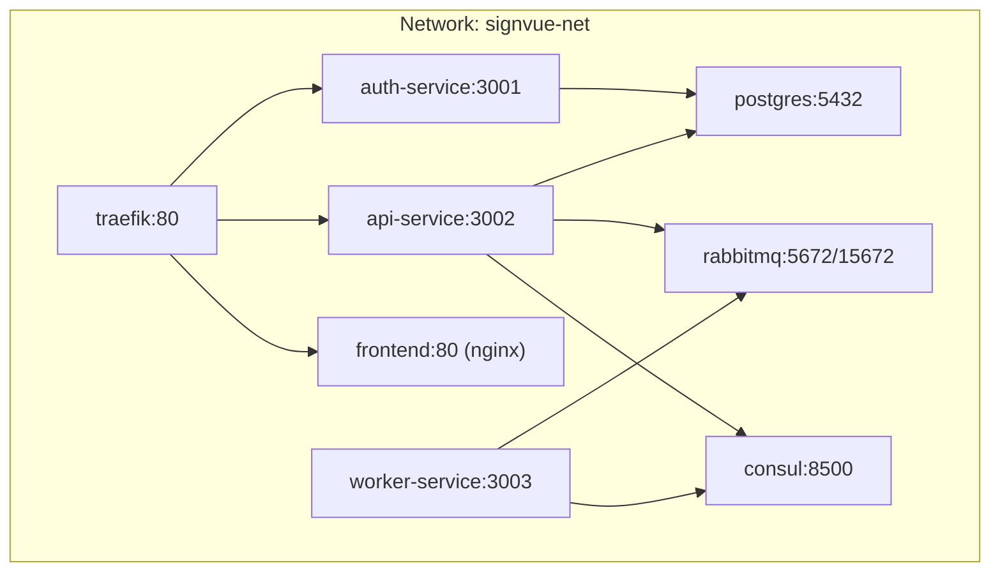
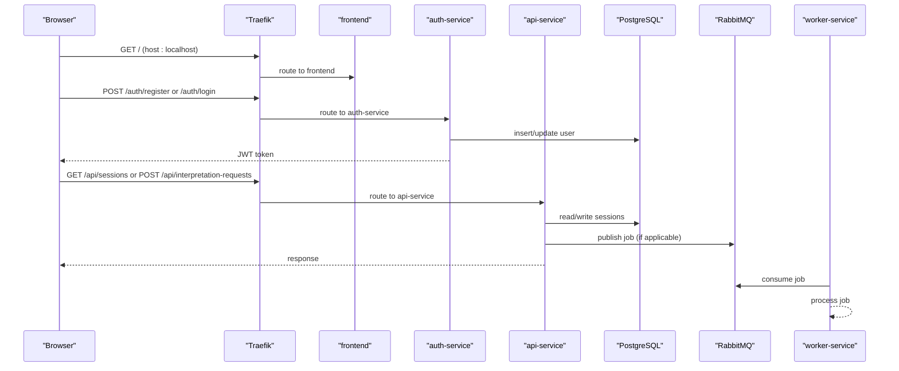
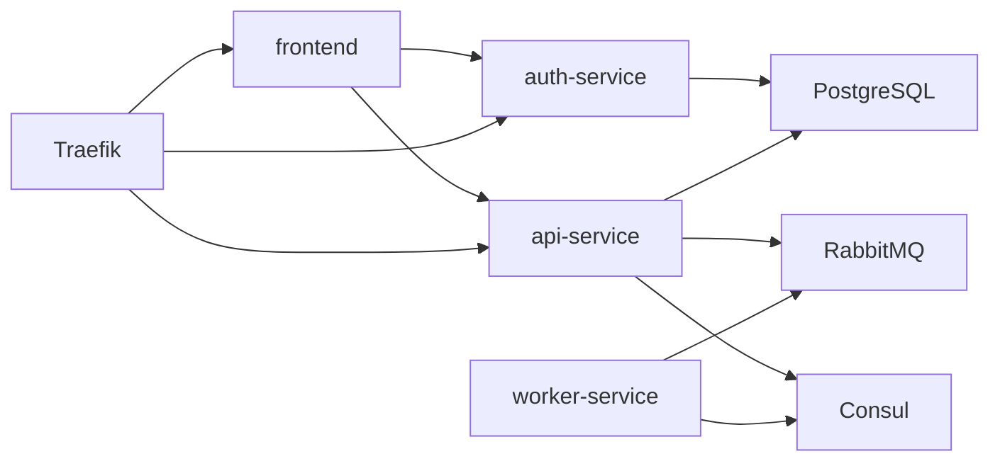

# Getting Started

<cite>
**Referenced Files in This Document**
- [README.md](file://README.md)
- [docker-compose.yml](file://docker-compose.yml)
- [init-db.sql](file://infra/init-db.sql)
- [config.js](file://frontend/config.js)
- [index.html](file://frontend/index.html)
- [script.js](file://frontend/script.js)
- [auth-service/src/index.js](file://services/auth-service/src/index.js)
- [auth-service/src/db.js](file://services/auth-service/src/db.js)
- [api-service/src/index.js](file://services/api-service/src/index.js)
- [api-service/src/db.js](file://services/api-service/src/db.js)
- [worker-service/src/index.js](file://services/worker-service/src/index.js)
- [worker-service/Dockerfile](file://services/worker-service/Dockerfile)
- [services/auth-service/package.json](file://services/auth-service/package.json)
- [services/api-service/package.json](file://services/api-service/package.json)
- [services/worker-service/package.json](file://services/worker-service/package.json)
</cite>

## Table of Contents
1. [Introduction](#introduction)
2. [Project Structure](#project-structure)
3. [Core Components](#core-components)
4. [Architecture Overview](#architecture-overview)
5. [Detailed Component Analysis](#detailed-component-analysis)
6. [Dependency Analysis](#dependency-analysis)
7. [Performance Considerations](#performance-considerations)
8. [Troubleshooting Guide](#troubleshooting-guide)
9. [Conclusion](#conclusion)
10. [Appendices](#appendices)

## Introduction
This guide helps you quickly set up and run the SignVue microservices demo locally using Docker Compose. It covers prerequisites, step-by-step installation, environment configuration, service startup order, verification steps, and basic usage. It also explains how to run the frontend in local mode for development and outlines the deployment workflow from preparation to testing.

## Project Structure
SignVue is organized into:
- Frontend static assets served by Nginx
- Three microservices: auth-service, api-service, worker-service
- Supporting infrastructure: Consul (service discovery), RabbitMQ (message broker), PostgreSQL (database)
- A shared Docker network for inter-service communication

**Diagram sources**
- [docker-compose.yml:3-137](file://docker-compose.yml#L3-L137)

**Section sources**
- [README.md:100-111](file://README.md#L100-L111)
- [docker-compose.yml:3-137](file://docker-compose.yml#L3-L137)

## Core Components
- Traefik reverse proxy routes traffic to services based on host and path.
- Consul registers services and exposes a UI for monitoring.
- RabbitMQ provides asynchronous messaging; the worker consumes jobs.
- PostgreSQL stores users, sessions, and translation records.
- Frontend serves static assets and communicates with auth and api services.
- Services:
  - auth-service: handles registration, login, JWT issuance, and verification.
  - api-service: exposes business endpoints, manages sessions, publishes interpretation requests to RabbitMQ, and performs DB migrations.
  - worker-service: registers with Consul, connects to RabbitMQ, and processes jobs.

Key environment variables:
- JWT_SECRET: shared secret used by auth-service and api-service for signing/verifying JWTs.
- DATABASE_URL: connection string for PostgreSQL.
- RABBITMQ_URL: connection string for RabbitMQ.
- CONSUL_HOST: host for Consul agent.
- PORT: service listening port.

**Section sources**
- [README.md:92-95](file://README.md#L92-L95)
- [docker-compose.yml:61-112](file://docker-compose.yml#L61-L112)
- [services/auth-service/src/index.js](file://services/auth-service/src/index.js#L10)
- [services/api-service/src/index.js:13-14](file://services/api-service/src/index.js#L13-L14)
- [services/api-service/src/db.js](file://services/api-service/src/db.js#L3)
- [services/auth-service/src/db.js](file://services/auth-service/src/db.js#L3)
- [services/worker-service/src/index.js:7-11](file://services/worker-service/src/index.js#L7-L11)

## Architecture Overview
The system uses Traefik as the single entrypoint. Requests are routed to auth-service for authentication, api-service for business operations, and the frontend for static content. Consul registers services and exposes health checks; RabbitMQ queues asynchronous work handled by worker-service.

**Diagram sources**
- [docker-compose.yml:70-130](file://docker-compose.yml#L70-L130)
- [services/auth-service/src/index.js:13-94](file://services/auth-service/src/index.js#L13-L94)
- [services/api-service/src/index.js:26-121](file://services/api-service/src/index.js#L26-L121)
- [services/worker-service/src/index.js:45-81](file://services/worker-service/src/index.js#L45-L81)

## Detailed Component Analysis

### Environment Variables and Secrets
- JWT_SECRET must be set consistently across auth-service and api-service. In this demo, it is configured in docker-compose for both services.
- DATABASE_URL must be present for auth-service and api-service; the api-service additionally migrates tables on startup.
- RABBITMQ_URL is required by api-service (publishing) and worker-service (consuming).
- CONSUL_HOST is used by worker-service to register itself.

Security note:
- Do not use the demo secret in production. Define JWT_SECRET in a secure environment variable or .env file at the project root.

**Section sources**
- [README.md:92-95](file://README.md#L92-L95)
- [docker-compose.yml:61-112](file://docker-compose.yml#L61-L112)
- [services/api-service/src/db.js:3-8](file://services/api-service/src/db.js#L3-L8)
- [services/auth-service/src/db.js:3-7](file://services/auth-service/src/db.js#L3-L7)
- [services/worker-service/src/index.js:7-11](file://services/worker-service/src/index.js#L7-L11)

### Service Startup Order and Dependencies
- Start supporting infrastructure first: consul and rabbitmq.
- Start database (postgres) and wait for readiness.
- Start auth-service and api-service; api-service waits for DB readiness and performs migrations.
- Start worker-service after RabbitMQ is reachable.
- Finally, start traefik and frontend.

Verification steps:
- Confirm Traefik dashboard is reachable.
- Confirm Consul UI is reachable.
- Confirm RabbitMQ Management UI is reachable.
- Confirm frontend responds at the application URL.
- Confirm health endpoints for auth-service and api-service.

**Section sources**
- [README.md:58-84](file://README.md#L58-L84)
- [docker-compose.yml:65-94](file://docker-compose.yml#L65-L94)
- [services/api-service/src/index.js:124-131](file://services/api-service/src/index.js#L124-L131)

### Access URLs
After running docker compose, open these URLs in your browser:
- Application: http://localhost:9080
- Traefik Dashboard: http://localhost:8080
- Consul UI: http://localhost:8500
- RabbitMQ Management: http://localhost:15672 (credentials: guest/guest)

**Section sources**
- [README.md:25-31](file://README.md#L25-L31)
- [docker-compose.yml:12-14](file://docker-compose.yml#L12-L14)
- [docker-compose.yml:23-33](file://docker-compose.yml#L23-L33)

### First Run Setup
- Prepare supporting services:
  - Start consul and rabbitmq.
  - Verify ports 8500 (Consul) and 5672/15672 (RabbitMQ) are accessible.
- Deploy microservices:
  - Start auth-service, api-service, and worker-service.
  - Check logs for successful DB migration and RabbitMQ connection.
- Enable reverse proxy and UI:
  - Start traefik and frontend.
  - Open http://localhost:9080 and confirm the UI loads.

Initial account roles:
- The first account created becomes ADMIN; subsequent accounts are USER.

**Section sources**
- [README.md:58-84](file://README.md#L58-L84)
- [README.md](file://README.md#L32)
- [docker-compose.yml:65-94](file://docker-compose.yml#L65-L94)

### Basic Usage Examples
- Register or log in via the frontend modal.
- Start the camera demo to simulate real-time interpretation.
- Observe worker logs for job processing.
- Optional: send an interpretation request via curl using the JWT bearer token.

**Section sources**
- [README.md:86-91](file://README.md#L86-L91)
- [script.js:409-441](file://frontend/script.js#L409-L441)

### Local Development Mode (Frontend)
To run the frontend without Docker (local static serving):
- Open the HTML file directly.
- Add ?local=1 to the URL to enable local authentication with simulated accounts stored in localStorage.
- In this mode, the frontend does not rely on /auth or /api endpoints.

**Section sources**
- [README.md:96-99](file://README.md#L96-L99)
- [index.html](file://frontend/index.html#L7)
- [script.js](file://frontend/script.js#L6)

### Database Initialization
On first run, PostgreSQL executes the initialization SQL to create tables for users, sessions, translations, and related indexes. The api-service also applies its own migrations on startup.

**Section sources**
- [docker-compose.yml:46-48](file://docker-compose.yml#L46-L48)
- [init-db.sql:1-44](file://infra/init-db.sql#L1-L44)
- [services/api-service/src/db.js:29-78](file://services/api-service/src/db.js#L29-L78)

## Dependency Analysis
- auth-service depends on PostgreSQL for user persistence.
- api-service depends on PostgreSQL for business data and RabbitMQ for publishing jobs; it also registers with Consul.
- worker-service depends on RabbitMQ and Consul.
- Frontend depends on auth-service and api-service being reachable under the same host.

**Diagram sources**
- [docker-compose.yml:59-130](file://docker-compose.yml#L59-L130)
- [services/api-service/src/db.js:1-84](file://services/api-service/src/db.js#L1-L84)
- [services/worker-service/src/index.js:19-43](file://services/worker-service/src/index.js#L19-L43)

**Section sources**
- [docker-compose.yml:59-130](file://docker-compose.yml#L59-L130)

## Performance Considerations
- Use Traefik’s load balancer for service routing; ensure proper health checks are defined.
- Keep JWT_SECRET strong and consistent across services to avoid token verification failures.
- Monitor RabbitMQ queue depth and worker throughput for scaling.
- Use Consul for service discovery and health checks to maintain resilience.

[No sources needed since this section provides general guidance]

## Troubleshooting Guide
Common issues and resolutions:
- Traefik dashboard not reachable:
  - Ensure Traefik is started and port 8080 is exposed.
- Consul UI not reachable:
  - Confirm consul container is healthy and port 8500 is mapped.
- RabbitMQ Management not reachable:
  - Confirm ports 5672 and 15672 are mapped and credentials are guest/guest.
- Frontend blank or API errors:
  - Verify auth-service and api-service are running and reachable.
  - Check JWT_SECRET consistency between auth-service and api-service.
- Database connection failures:
  - Confirm DATABASE_URL is set and postgres is healthy.
  - Review api-service migrations and logs.
- Worker not consuming messages:
  - Ensure RabbitMQ is reachable and queue exists.
  - Check worker logs for connection errors.

**Section sources**
- [README.md:25-31](file://README.md#L25-L31)
- [docker-compose.yml:61-112](file://docker-compose.yml#L61-L112)
- [services/api-service/src/db.js:3-8](file://services/api-service/src/db.js#L3-L8)
- [services/worker-service/src/index.js:45-81](file://services/worker-service/src/index.js#L45-L81)

## Conclusion
You now have a complete understanding of how to deploy and run SignVue locally using Docker Compose, configure secrets, verify services, and perform basic operations. Use the provided URLs and steps to validate each component, and refer to the troubleshooting section for quick fixes.

[No sources needed since this section summarizes without analyzing specific files]

## Appendices

### Step-by-Step Installation and Deployment
- Prerequisites:
  - Install Docker and Docker Compose.
- Prepare supporting services:
  - Start consul and rabbitmq.
- Deploy microservices:
  - Start auth-service, api-service, worker-service.
- Enable reverse proxy and UI:
  - Start traefik and frontend.
- Test:
  - Open the application URL, register/log in, and start the demo camera.

**Section sources**
- [README.md:58-84](file://README.md#L58-L84)

### Environment Variable Reference
- JWT_SECRET: shared secret for JWT signing/verification.
- DATABASE_URL: PostgreSQL connection string.
- RABBITMQ_URL: RabbitMQ connection string.
- CONSUL_HOST: Consul agent host.
- PORT: service listening port.

**Section sources**
- [README.md:92-95](file://README.md#L92-L95)
- [docker-compose.yml:61-112](file://docker-compose.yml#L61-L112)

### Frontend Configuration
- API base URL resolution:
  - Uses window.__SIGNVUE_API_BASE__ if set.
  - Falls back to a meta tag value or a default external endpoint.
- Local mode:
  - Add ?local=1 to the URL to enable local authentication with localStorage.

**Section sources**
- [config.js:1-18](file://frontend/config.js#L1-L18)
- [index.html:6-7](file://frontend/index.html#L6-L7)
- [script.js:23-34](file://frontend/script.js#L23-L34)
- [script.js](file://frontend/script.js#L6)

### Service Entrypoints and Ports
- auth-service: listens on 3001; exposes health and auth endpoints.
- api-service: listens on 3002; exposes business endpoints and health.
- worker-service: listens on 3003; exposes health and consumes RabbitMQ queue.
- Frontend: served by Nginx on 80.
- Traefik: exposes 80 and 8080.

**Section sources**
- [docker-compose.yml:60-130](file://docker-compose.yml#L60-L130)
- [services/auth-service/src/index.js:120-124](file://services/auth-service/src/index.js#L120-L124)
- [services/api-service/src/index.js:124-131](file://services/api-service/src/index.js#L124-L131)
- [services/worker-service/src/index.js:83-87](file://services/worker-service/src/index.js#L83-L87)