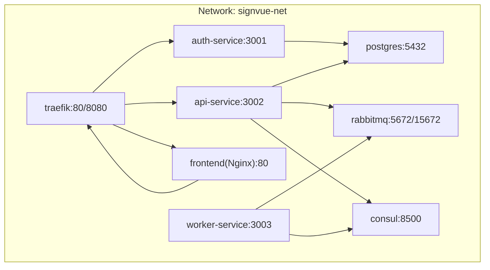
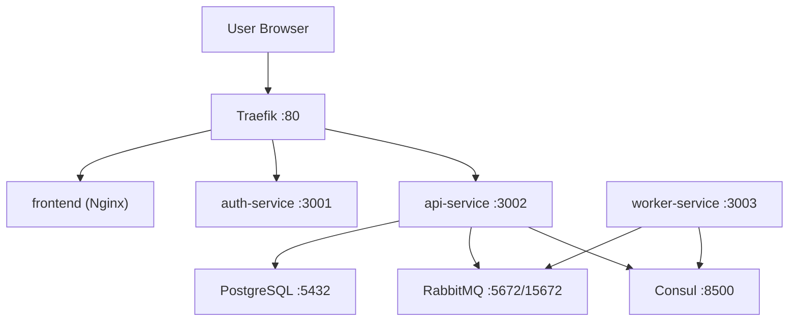
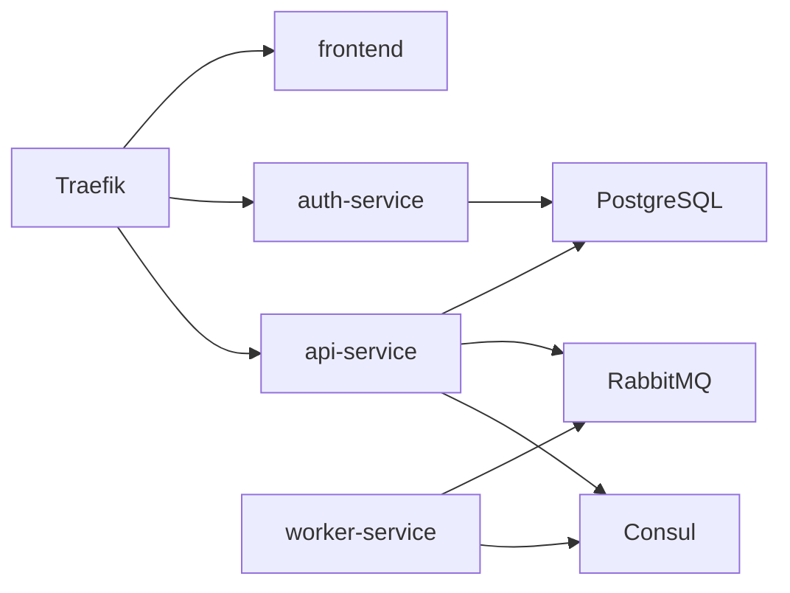
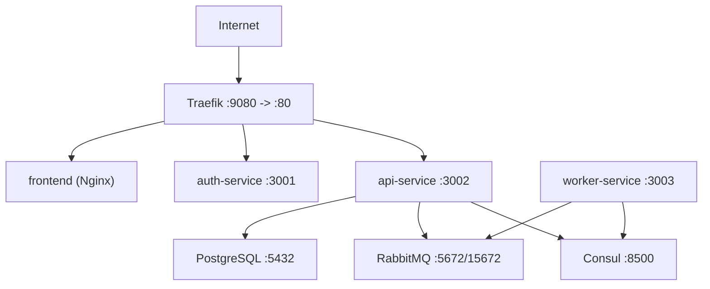

# Infrastructure Components

<cite>
**Referenced Files in This Document**
- [docker-compose.yml](file://docker-compose.yml)
- [README.md](file://README.md)
- [init-db.sql](file://infra/init-db.sql)
- [Dockerfile (api-service)](file://services/api-service/Dockerfile)
- [Dockerfile (auth-service)](file://services/auth-service/Dockerfile)
- [Dockerfile (worker-service)](file://services/worker-service/Dockerfile)
- [package.json (api-service)](file://services/api-service/package.json)
- [package.json (auth-service)](file://services/auth-service/package.json)
- [package.json (worker-service)](file://services/worker-service/package.json)
- [index.js (api-service)](file://services/api-service/src/index.js)
- [db.js (api-service)](file://services/api-service/src/db.js)
- [index.js (auth-service)](file://services/auth-service/src/index.js)
- [db.js (auth-service)](file://services/auth-service/src/db.js)
- [index.js (worker-service)](file://services/worker-service/src/index.js)
</cite>

## Table of Contents
1. [Introduction](#introduction)
2. [Project Structure](#project-structure)
3. [Core Components](#core-components)
4. [Architecture Overview](#architecture-overview)
5. [Detailed Component Analysis](#detailed-component-analysis)
6. [Dependency Analysis](#dependency-analysis)
7. [Performance Considerations](#performance-considerations)
8. [Troubleshooting Guide](#troubleshooting-guide)
9. [Conclusion](#conclusion)
10. [Appendices](#appendices)

## Introduction
This document explains the infrastructure components and deployment configuration for the multi-container microservices stack. It covers Docker Compose orchestration, service discovery with Consul, reverse proxy routing via Traefik, asynchronous messaging with RabbitMQ, and PostgreSQL initialization. It also documents container networking, health checks, service registration patterns, load balancing strategies, environment variables, scaling considerations, and operational management including monitoring and logging.

## Project Structure
The repository organizes infrastructure and services as follows:
- Root orchestration: docker-compose.yml defines services, networks, and volumes.
- Frontend static assets served by Nginx.
- Backend services:
  - auth-service: JWT-based authentication.
  - api-service: business API with database and RabbitMQ integration.
  - worker-service: asynchronous job consumer.
- Shared infrastructure:
  - Traefik reverse proxy and dashboard.
  - Consul service discovery and catalog.
  - RabbitMQ broker with management UI.
  - PostgreSQL database with persistent volume and initialization SQL.

**Diagram sources**
- [docker-compose.yml:3-137](file://docker-compose.yml#L3-L137)

**Section sources**
- [docker-compose.yml:3-137](file://docker-compose.yml#L3-L137)
- [README.md:100-111](file://README.md#L100-L111)

## Core Components
- Traefik reverse proxy and dashboard:
  - Exposes HTTP entrypoint 80 and dashboard 8080.
  - Dynamically discovers services via Docker provider.
  - Routes traffic to backend services based on host and path prefixes.
- Consul service discovery:
  - Dev mode agent with UI enabled.
  - Services register themselves with HTTP health checks.
- RabbitMQ:
  - Broker with management UI.
  - Default credentials configured via environment variables.
- PostgreSQL:
  - Persistent volume for data.
  - Initialization SQL mounted at first startup.
  - Health check ensures readiness before dependent services start.
- Services:
  - auth-service: exposes /health, JWT signing, and user management endpoints.
  - api-service: business endpoints, database migrations, and RabbitMQ publishing.
  - worker-service: consumes jobs from a durable queue and registers with Consul.
  - frontend: static Nginx serving SPA assets.

**Section sources**
- [docker-compose.yml:4-137](file://docker-compose.yml#L4-L137)
- [README.md:7-31](file://README.md#L7-L31)

## Architecture Overview
The stack routes external requests through Traefik to backend services. Services communicate internally over a shared Docker network. PostgreSQL persists relational data, while RabbitMQ handles asynchronous tasks. Consul maintains service registrations and health checks.

**Diagram sources**
- [docker-compose.yml:4-137](file://docker-compose.yml#L4-L137)

## Detailed Component Analysis

### Traefik Reverse Proxy
- Entrypoints and providers:
  - HTTP entrypoint 80 exposed to host.
  - Docker provider enabled with exposedbydefault disabled.
- Routing rules:
  - Host-based rules for localhost/127.0.0.1.
  - PathPrefix rules for /auth, /api, and root for frontend.
- Load balancing:
  - Services configured with explicit server port for load balancers.
- Middleware:
  - Strips path prefixes (/auth, /api) before forwarding to services.

Operational notes:
- Dashboard available at port 8080.
- Logs show routing decisions and middleware application.

**Section sources**
- [docker-compose.yml:4-18](file://docker-compose.yml#L4-L18)
- [docker-compose.yml:70-105](file://docker-compose.yml#L70-L105)
- [docker-compose.yml:124-130](file://docker-compose.yml#L124-L130)

### Consul Service Discovery
- Agent runs in development mode with UI.
- Services register themselves with HTTP health checks:
  - api-service: /health endpoint validates DB connectivity.
  - auth-service: /health endpoint returns service status.
  - worker-service: /health endpoint reports status and queue info.
- Registration pattern:
  - worker-service constructs a unique service ID and registers with Consul via HTTP PUT.

Operational notes:
- Health checks are scheduled intervals suitable for local dev.
- Consul UI at port 8500.

**Section sources**
- [docker-compose.yml:20-26](file://docker-compose.yml#L20-L26)
- [index.js (api-service):16-24](file://services/api-service/src/index.js#L16-L24)
- [index.js (auth-service):114-117](file://services/auth-service/src/index.js#L114-L117)
- [index.js (worker-service):19-43](file://services/worker-service/src/index.js#L19-L43)

### RabbitMQ Message Broker
- Image includes management UI.
- Ports published for AMQP and management.
- Default credentials set via environment variables.
- Services connect using URLs configured in environment variables.

Operational notes:
- Management UI at port 15672 with default credentials.
- Queue used by worker-service is durable.

**Section sources**
- [docker-compose.yml:28-38](file://docker-compose.yml#L28-L38)
- [docker-compose.yml:86](file://docker-compose.yml#L86)
- [docker-compose.yml:111](file://docker-compose.yml#L111)

### PostgreSQL Database
- Environment variables define user, password, and database name.
- Persistent volume for data directory.
- Initialization SQL mounted at first startup for schema creation.
- Health check uses pg_isready to ensure readiness.

Operational notes:
- First-run schema creation handled by mounted SQL.
- Health check interval and retries configured for fast feedback.

**Section sources**
- [docker-compose.yml:40-57](file://docker-compose.yml#L40-L57)
- [init-db.sql:1-44](file://infra/init-db.sql#L1-L44)

### Service Orchestration and Dependencies
- Startup order:
  - PostgreSQL health-checked before auth-service and api-service.
  - RabbitMQ started before worker-service.
  - Traefik and frontend started last to expose UI.
- Build context per service with explicit ports.

**Section sources**
- [docker-compose.yml:65-94](file://docker-compose.yml#L65-L94)
- [Dockerfile (api-service):1-8](file://services/api-service/Dockerfile#L1-L8)
- [Dockerfile (auth-service):1-8](file://services/auth-service/Dockerfile#L1-L8)
- [Dockerfile (worker-service):1-8](file://services/worker-service/Dockerfile#L1-L8)

### Network Configuration
- Single user-defined bridge network named signvue-net.
- All services attached to the same network for internal DNS resolution.
- Traefik uses Docker network introspection to discover services.

**Section sources**
- [docker-compose.yml:135-137](file://docker-compose.yml#L135-L137)
- [docker-compose.yml:17](file://docker-compose.yml#L17)
- [docker-compose.yml:25](file://docker-compose.yml#L25)
- [docker-compose.yml:37](file://docker-compose.yml#L37)
- [docker-compose.yml:51](file://docker-compose.yml#L51)
- [docker-compose.yml:68](file://docker-compose.yml#L68)
- [docker-compose.yml:95](file://docker-compose.yml#L95)
- [docker-compose.yml:115](file://docker-compose.yml#L115)

### Volume Management
- Named volume for PostgreSQL data persistence.
- Frontend static assets mounted read-only into Nginx.

**Section sources**
- [docker-compose.yml:132-133](file://docker-compose.yml#L132-L133)
- [docker-compose.yml:120-121](file://docker-compose.yml#L120-L121)

### Environment Variables
- Shared JWT secret for auth and API services.
- Database connection string for services requiring Postgres.
- RabbitMQ connection URL for services publishing/consuming.
- Consul host for service registration.
- Service ports exposed inside containers.

Examples of variables used:
- JWT_SECRET
- DATABASE_URL
- RABBITMQ_URL
- CONSUL_HOST
- PORT

**Section sources**
- [docker-compose.yml:61-64](file://docker-compose.yml#L61-L64)
- [docker-compose.yml:82-87](file://docker-compose.yml#L82-L87)
- [docker-compose.yml:109-112](file://docker-compose.yml#L109-L112)
- [index.js (api-service):13-14](file://services/api-service/src/index.js#L13-L14)
- [index.js (auth-service):10](file://services/auth-service/src/index.js#L10)
- [index.js (worker-service):7-11](file://services/worker-service/src/index.js#L7-L11)

### Load Balancing Strategies
- Traefik load balancer configured per service with explicit server port.
- No multiple replicas are defined in Compose; single instance per service.
- Implication: Traefik forwards to one container; horizontal scaling requires adding replicas and enabling service discovery.

**Section sources**
- [docker-compose.yml:78](file://docker-compose.yml#L78)
- [docker-compose.yml:105](file://docker-compose.yml#L105)
- [docker-compose.yml:130](file://docker-compose.yml#L130)

### Health Checks
- PostgreSQL: pg_isready healthcheck with short intervals and retries.
- api-service: GET /health queries database.
- auth-service: GET /health returns service status.
- worker-service: GET /health returns service and queue info.

**Section sources**
- [docker-compose.yml:53-57](file://docker-compose.yml#L53-L57)
- [index.js (api-service):16-24](file://services/api-service/src/index.js#L16-L24)
- [index.js (auth-service):114-117](file://services/auth-service/src/index.js#L114-L117)
- [index.js (worker-service):14-17](file://services/worker-service/src/index.js#L14-L17)

### Service Registration Patterns
- worker-service registers itself with Consul using a unique service ID and HTTP check.
- api-service does not register with Consul in the provided configuration; it exposes a /health endpoint for Traefik and Compose health checks.

**Section sources**
- [index.js (worker-service):19-43](file://services/worker-service/src/index.js#L19-L43)
- [docker-compose.yml:88-94](file://docker-compose.yml#L88-L94)

### Container Networking and DNS
- Internal DNS resolves service names to containers within the network.
- Services connect using service names as hostnames (e.g., postgres, rabbitmq, consul).

**Section sources**
- [docker-compose.yml:63](file://docker-compose.yml#L63)
- [docker-compose.yml:86](file://docker-compose.yml#L86)
- [docker-compose.yml:111](file://docker-compose.yml#L111)

### Monitoring and Logging
- Traefik dashboard at port 8080 for routing metrics and logs.
- Consul UI at port 8500 for service catalog and health.
- RabbitMQ management UI at port 15672 for queues and connections.
- Service logs via Docker Compose logs for each container.
- worker-service logs consumption events and errors.

**Section sources**
- [docker-compose.yml:7](file://docker-compose.yml#L7)
- [docker-compose.yml:24](file://docker-compose.yml#L24)
- [docker-compose.yml:33](file://docker-compose.yml#L33)
- [README.md:28-30](file://README.md#L28-L30)
- [index.js (worker-service):77-80](file://services/worker-service/src/index.js#L77-L80)

## Dependency Analysis
The following diagram shows runtime dependencies among services and infrastructure components.

**Diagram sources**
- [docker-compose.yml:4-137](file://docker-compose.yml#L4-L137)

**Section sources**
- [docker-compose.yml:65-94](file://docker-compose.yml#L65-L94)
- [docker-compose.yml:113-116](file://docker-compose.yml#L113-L116)

## Performance Considerations
- Network locality: All services share a single bridge network to minimize latency.
- Health checks: Short intervals for PostgreSQL readiness reduce startup latency.
- RabbitMQ durability: Messages survive broker restarts; ensure appropriate prefetch and ack patterns.
- Scaling: Add replicas to services and enable service discovery for load balancing.
- Resource limits: Consider adding CPU/memory constraints in production deployments.

[No sources needed since this section provides general guidance]

## Troubleshooting Guide
Common issues and remedies:
- Traefik not routing:
  - Verify entrypoints and labels for services.
  - Confirm host rules match localhost/127.0.0.1.
- Services failing to start:
  - Check depends_on conditions and health checks.
  - Review PostgreSQL readiness and RabbitMQ availability.
- Authentication failures:
  - Ensure JWT_SECRET is consistent across auth-service and api-service.
- Database migration errors:
  - Confirm DATABASE_URL and PostgreSQL readiness.
- Worker not consuming:
  - Verify RABBITMQ_URL and queue existence.
  - Check Consul registration and health endpoint.

**Section sources**
- [docker-compose.yml:65-94](file://docker-compose.yml#L65-L94)
- [docker-compose.yml:113-116](file://docker-compose.yml#L113-L116)
- [index.js (api-service):13-14](file://services/api-service/src/index.js#L13-L14)
- [index.js (auth-service):10](file://services/auth-service/src/index.js#L10)
- [index.js (worker-service):7-11](file://services/worker-service/src/index.js#L7-L11)

## Conclusion
The stack provides a cohesive, developer-friendly multi-container environment integrating Traefik, Consul, RabbitMQ, and PostgreSQL with three backend services. It demonstrates practical patterns for reverse proxy routing, service discovery, asynchronous messaging, and database initialization. For production, consider scaling out services, enforcing resource limits, securing secrets, and enabling TLS termination at the edge.

[No sources needed since this section summarizes without analyzing specific files]

## Appendices

### Deployment Topology Diagram

**Diagram sources**
- [docker-compose.yml:4-137](file://docker-compose.yml#L4-L137)

### Environment Variables Reference
- JWT_SECRET: shared secret for JWT verification.
- DATABASE_URL: connection string to PostgreSQL.
- RABBITMQ_URL: connection string to RabbitMQ.
- CONSUL_HOST: Consul agent address.
- PORT: service listening port inside container.

**Section sources**
- [docker-compose.yml:61-64](file://docker-compose.yml#L61-L64)
- [docker-compose.yml:82-87](file://docker-compose.yml#L82-L87)
- [docker-compose.yml:109-112](file://docker-compose.yml#L109-L112)
- [index.js (api-service):13-14](file://services/api-service/src/index.js#L13-L14)
- [index.js (auth-service):10](file://services/auth-service/src/index.js#L10)
- [index.js (worker-service):7-11](file://services/worker-service/src/index.js#L7-L11)

### Infrastructure Scaling Considerations
- Traefik: supports multiple replicas; ensure sticky sessions if needed.
- Consul: run multiple agents behind a load balancer for HA.
- RabbitMQ: cluster or use managed service for HA and persistence.
- PostgreSQL: use managed service or container with replication for HA.
- Services: scale out with replicas; enable Consul service discovery for dynamic routing.

[No sources needed since this section provides general guidance]