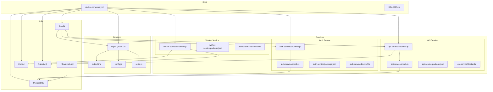
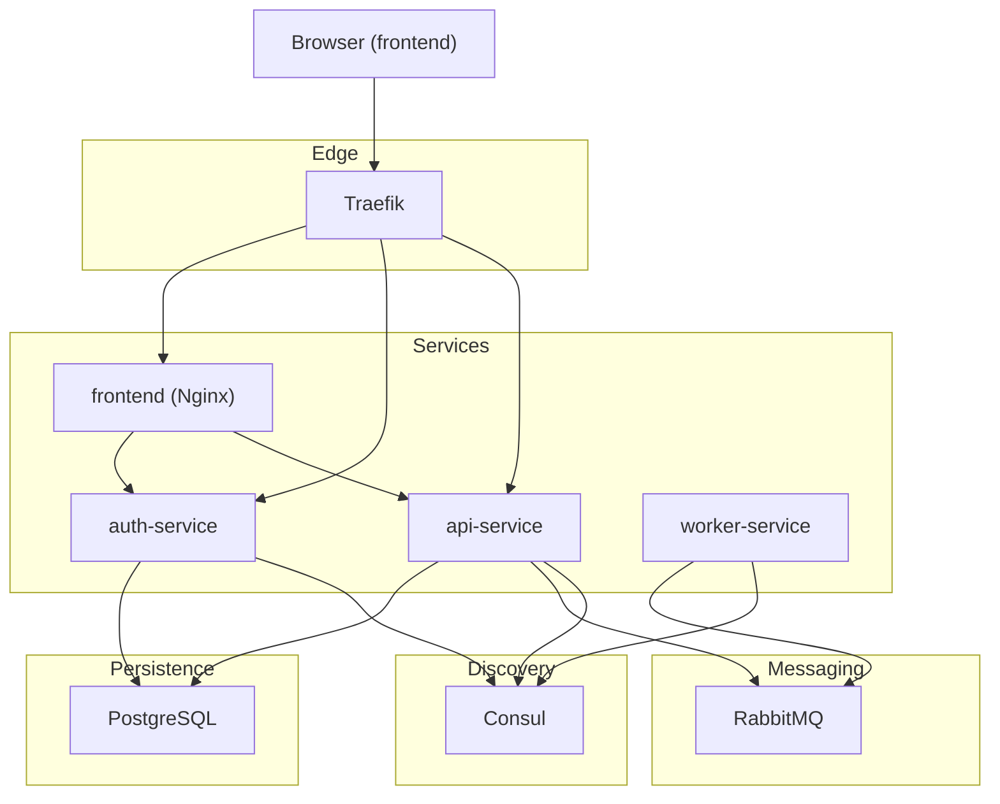
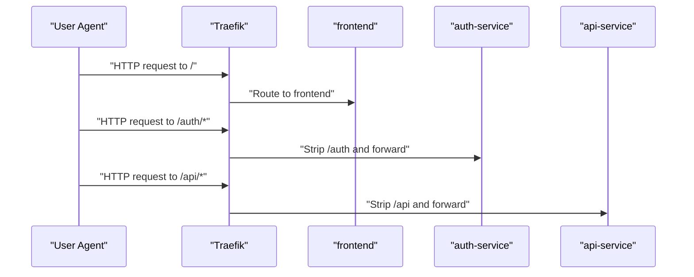
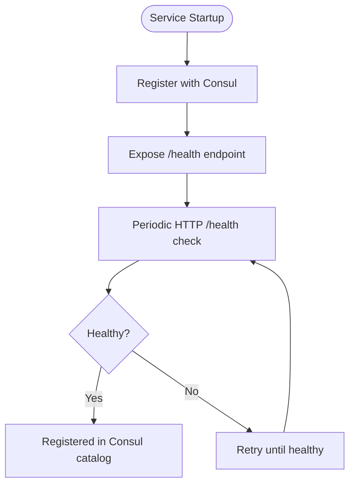
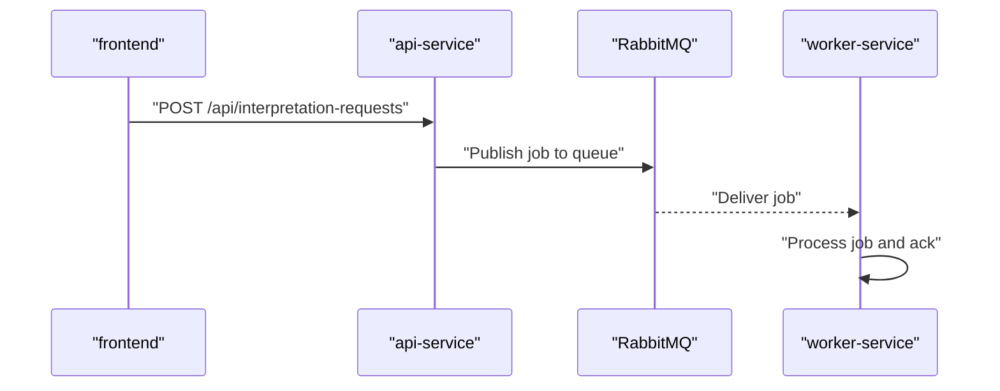
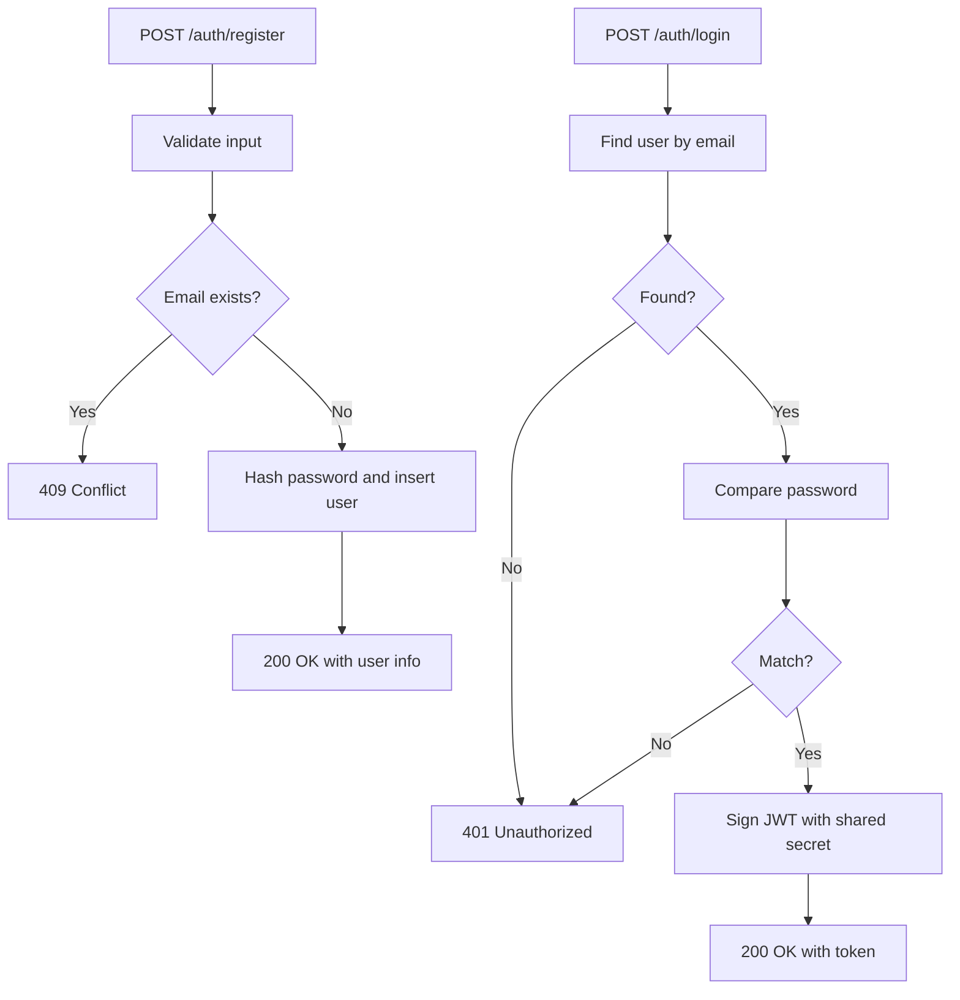
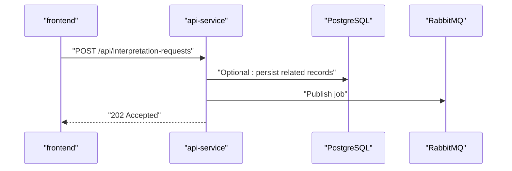
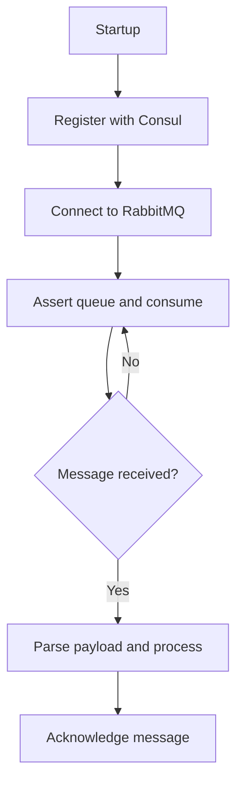
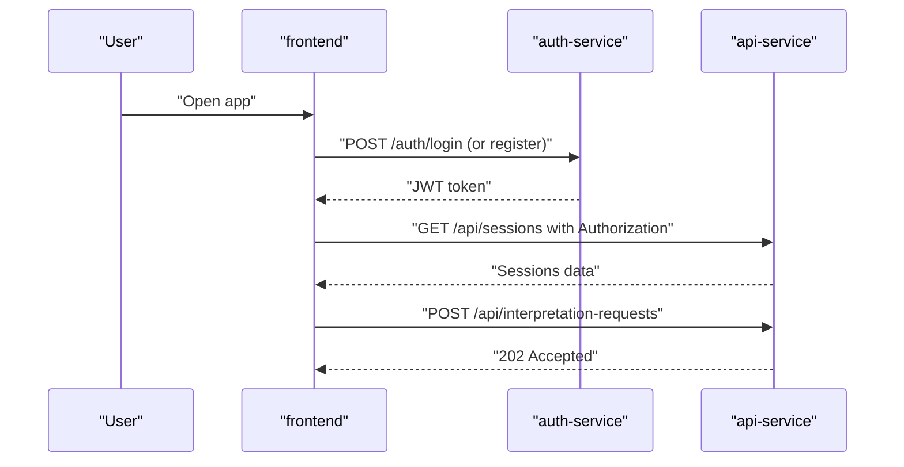
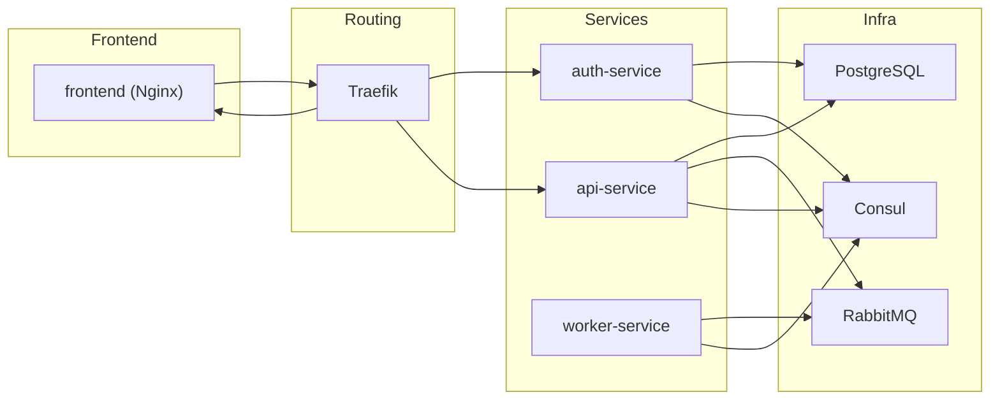

# Project Overview

<cite>
**Referenced Files in This Document**
- [README.md](file://README.md)
- [docker-compose.yml](file://docker-compose.yml)
- [frontend/index.html](file://frontend/index.html)
- [frontend/config.js](file://frontend/config.js)
- [frontend/script.js](file://frontend/script.js)
- [services/auth-service/src/index.js](file://services/auth-service/src/index.js)
- [services/auth-service/src/db.js](file://services/auth-service/src/db.js)
- [services/auth-service/package.json](file://services/auth-service/package.json)
- [services/api-service/src/index.js](file://services/api-service/src/index.js)
- [services/api-service/src/db.js](file://services/api-service/src/db.js)
- [services/api-service/package.json](file://services/api-service/package.json)
- [services/worker-service/src/index.js](file://services/worker-service/src/index.js)
- [services/worker-service/package.json](file://services/worker-service/package.json)
- [infra/init-db.sql](file://infra/init-db.sql)
- [services/auth-service/Dockerfile](file://services/auth-service/Dockerfile)
- [services/api-service/Dockerfile](file://services/api-service/Dockerfile)
- [services/worker-service/Dockerfile](file://services/worker-service/Dockerfile)
</cite>

## Table of Contents
1. [Introduction](#introduction)
2. [Project Structure](#project-structure)
3. [Core Components](#core-components)
4. [Architecture Overview](#architecture-overview)
5. [Detailed Component Analysis](#detailed-component-analysis)
6. [Dependency Analysis](#dependency-analysis)
7. [Performance Considerations](#performance-considerations)
8. [Troubleshooting Guide](#troubleshooting-guide)
9. [Conclusion](#conclusion)
10. [Appendices](#appendices)

## Introduction
SignVue is a hands-on demonstration of a modern microservices architecture. It showcases REST APIs, JWT-based authentication, a static web UI, asynchronous messaging via RabbitMQ, service discovery with Consul, reverse proxy routing with Traefik, and multi-container deployment. The project is designed for learning distributed systems concepts such as service boundaries, inter-service communication, authentication, and observability.

Target audience:
- Software engineers and developers learning microservices
- DevOps practitioners exploring container orchestration and service mesh concepts
- Educators and students studying distributed system design

Use cases:
- Understanding how a reverse proxy routes requests to multiple services
- Learning JWT authentication and token verification across services
- Observing asynchronous job processing through RabbitMQ
- Experiencing service registration and health checks with Consul
- Practicing multi-container deployment with Docker Compose

## Project Structure
The repository is organized into:
- Root: orchestration and documentation
- frontend: static web UI served by Nginx
- services: three Node.js microservices (auth-service, api-service, worker-service)
- infra: database initialization SQL

**Diagram sources**
- [docker-compose.yml:1-137](file://docker-compose.yml#L1-L137)
- [frontend/index.html:1-222](file://frontend/index.html#L1-L222)
- [frontend/config.js:1-18](file://frontend/config.js#L1-L18)
- [frontend/script.js:1-859](file://frontend/script.js#L1-L859)
- [services/auth-service/src/index.js:1-124](file://services/auth-service/src/index.js#L1-L124)
- [services/auth-service/src/db.js:1-13](file://services/auth-service/src/db.js#L1-L13)
- [services/api-service/src/index.js:1-133](file://services/api-service/src/index.js#L1-L133)
- [services/api-service/src/db.js:1-84](file://services/api-service/src/db.js#L1-L84)
- [services/worker-service/src/index.js:1-88](file://services/worker-service/src/index.js#L1-L88)
- [infra/init-db.sql:1-44](file://infra/init-db.sql#L1-L44)

**Section sources**
- [README.md:1-111](file://README.md#L1-L111)
- [docker-compose.yml:1-137](file://docker-compose.yml#L1-L137)

## Core Components
- Traefik reverse proxy: single HTTP entrypoint routing to services based on host and path prefixes.
- Consul: service registry and health checking for all services.
- RabbitMQ: asynchronous message broker for job processing.
- auth-service: user registration, login, JWT issuance, and verification endpoints.
- api-service: business CRUD endpoints, JWT verification middleware, and asynchronous job submission to RabbitMQ.
- worker-service: consumes RabbitMQ jobs and logs processing results; registers itself with Consul.
- frontend: static Nginx-based UI that communicates with auth and API services via the same host.

Key endpoints overview:
- Authentication: POST /auth/register, POST /auth/login, GET /auth/me, GET /auth/verify
- Business API: GET/POST /api/sessions, GET/PUT/DELETE /api/sessions/:id, POST /api/interpretation-requests, GET /api/stats/sessions (admin-only)
- Health: /health on each service

**Section sources**
- [README.md:34-50](file://README.md#L34-L50)
- [services/auth-service/src/index.js:13-117](file://services/auth-service/src/index.js#L13-L117)
- [services/api-service/src/index.js:26-121](file://services/api-service/src/index.js#L26-L121)
- [services/worker-service/src/index.js:14-43](file://services/worker-service/src/index.js#L14-L43)

## Architecture Overview
The system uses Traefik as the ingress router, routing requests to services based on path prefixes. Services communicate asynchronously with RabbitMQ for background tasks and register themselves with Consul for discovery and health monitoring. PostgreSQL persists user and session data.

**Diagram sources**
- [docker-compose.yml:4-137](file://docker-compose.yml#L4-L137)
- [services/worker-service/src/index.js:19-43](file://services/worker-service/src/index.js#L19-L43)
- [services/api-service/src/db.js:1-84](file://services/api-service/src/db.js#L1-L84)
- [services/auth-service/src/db.js:1-13](file://services/auth-service/src/db.js#L1-L13)

## Detailed Component Analysis

### Traefik Reverse Proxy
Traefik runs as a Docker service with Docker provider enabled. It exposes HTTP on port 80 and binds ports 9080:80 and 8080:8080. Routing rules are configured via labels on services:
- Frontend: Host match for localhost and priority 1
- auth-service: PathPrefix /auth with strip-prefix middleware
- api-service: PathPrefix /api with strip-prefix middleware

**Diagram sources**
- [docker-compose.yml:70-130](file://docker-compose.yml#L70-L130)

**Section sources**
- [docker-compose.yml:4-137](file://docker-compose.yml#L4-L137)

### Consul Service Discovery and Health Checks
Each service registers with Consul on startup:
- worker-service: registers with HTTP health check on /health
- auth-service: exposes /health endpoint
- api-service: exposes /health endpoint

Health checks are performed against each service’s /health endpoint, enabling automatic discovery and failover.

**Diagram sources**
- [services/worker-service/src/index.js:19-43](file://services/worker-service/src/index.js#L19-L43)
- [services/auth-service/src/index.js:114-117](file://services/auth-service/src/index.js#L114-L117)
- [services/api-service/src/index.js:16-24](file://services/api-service/src/index.js#L16-L24)

**Section sources**
- [services/worker-service/src/index.js:19-43](file://services/worker-service/src/index.js#L19-L43)
- [services/auth-service/src/index.js:114-117](file://services/auth-service/src/index.js#L114-L117)
- [services/api-service/src/index.js:16-24](file://services/api-service/src/index.js#L16-L24)

### RabbitMQ Message Broker
The api-service publishes interpretation requests to a durable queue named for asynchronous processing. The worker-service connects to RabbitMQ, asserts the queue, prefetches one message, and acknowledges processed messages. Both services depend on RabbitMQ being reachable.

**Diagram sources**
- [services/api-service/src/index.js:1-133](file://services/api-service/src/index.js#L1-L133)
- [services/worker-service/src/index.js:45-81](file://services/worker-service/src/index.js#L45-L81)

**Section sources**
- [services/api-service/src/index.js:1-133](file://services/api-service/src/index.js#L1-L133)
- [services/worker-service/src/index.js:1-88](file://services/worker-service/src/index.js#L1-L88)

### auth-service
Responsibilities:
- Registration: validates input, hashes passwords, stores user
- Login: verifies credentials, issues JWT signed with shared secret
- Verification: validates JWT locally using the same secret
- Health: responds with service status

**Diagram sources**
- [services/auth-service/src/index.js:13-94](file://services/auth-service/src/index.js#L13-L94)

**Section sources**
- [services/auth-service/src/index.js:1-124](file://services/auth-service/src/index.js#L1-L124)
- [services/auth-service/src/db.js:1-13](file://services/auth-service/src/db.js#L1-L13)

### api-service
Responsibilities:
- Authentication endpoints (register/login) with JWT
- Business endpoints: CRUD sessions, stats (admin-only)
- JWT verification middleware using shared secret
- Asynchronous job submission to RabbitMQ
- Database initialization and migrations

**Diagram sources**
- [services/api-service/src/index.js:1-133](file://services/api-service/src/index.js#L1-L133)
- [services/api-service/src/db.js:29-78](file://services/api-service/src/db.js#L29-L78)

**Section sources**
- [services/api-service/src/index.js:1-133](file://services/api-service/src/index.js#L1-L133)
- [services/api-service/src/db.js:1-84](file://services/api-service/src/db.js#L1-L84)
- [infra/init-db.sql:1-44](file://infra/init-db.sql#L1-L44)

### worker-service
Responsibilities:
- Registers itself with Consul on startup
- Consumes RabbitMQ queue for interpretation jobs
- Logs processing details and acknowledges messages

**Diagram sources**
- [services/worker-service/src/index.js:19-81](file://services/worker-service/src/index.js#L19-L81)

**Section sources**
- [services/worker-service/src/index.js:1-88](file://services/worker-service/src/index.js#L1-L88)

### Frontend (Static UI)
The frontend is a static site served by Nginx. It dynamically determines the API base URL via a meta tag or a global variable, supports local authentication mode, and interacts with auth and API services using bearer tokens.

**Diagram sources**
- [frontend/script.js:176-248](file://frontend/script.js#L176-L248)
- [frontend/config.js:1-18](file://frontend/config.js#L1-L18)
- [services/auth-service/src/index.js:52-94](file://services/auth-service/src/index.js#L52-L94)
- [services/api-service/src/index.js:26-121](file://services/api-service/src/index.js#L26-L121)

**Section sources**
- [frontend/index.html:1-222](file://frontend/index.html#L1-L222)
- [frontend/config.js:1-18](file://frontend/config.js#L1-L18)
- [frontend/script.js:1-859](file://frontend/script.js#L1-L859)

## Dependency Analysis
Technology stack summary:
- Backend: Node.js (Express), PostgreSQL, RabbitMQ, Consul, Traefik
- Frontend: Static HTML/CSS/JS served by Nginx
- Orchestration: Docker Compose

External dependencies by service:
- auth-service: Express, jsonwebtoken, bcryptjs, pg
- api-service: Express, jsonwebtoken, bcryptjs, pg, amqplib, cors
- worker-service: Express, amqplib

**Diagram sources**
- [docker-compose.yml:1-137](file://docker-compose.yml#L1-L137)
- [services/auth-service/package.json:9-16](file://services/auth-service/package.json#L9-L16)
- [services/api-service/package.json:9-17](file://services/api-service/package.json#L9-L17)
- [services/worker-service/package.json:9-12](file://services/worker-service/package.json#L9-L12)

**Section sources**
- [services/auth-service/package.json:1-18](file://services/auth-service/package.json#L1-L18)
- [services/api-service/package.json:1-19](file://services/api-service/package.json#L1-L19)
- [services/worker-service/package.json:1-14](file://services/worker-service/package.json#L1-L14)

## Performance Considerations
- Use durable queues and proper acknowledgment to avoid message loss during worker restarts.
- Configure RabbitMQ persistence and consider clustering for high availability.
- Ensure database connections pool appropriately and apply connection timeouts.
- Enable Traefik metrics and logging for request tracing and latency insights.
- Scale services independently based on load; keep JWT secret management secure in production.

## Troubleshooting Guide
Common issues and resolutions:
- Cannot reach frontend or services: verify Traefik is running and routing rules are applied.
- Authentication failures: confirm JWT_SECRET is identical across auth-service and api-service.
- RabbitMQ connectivity: ensure RABBITMQ_URL is correct and network connectivity exists.
- Database readiness: api-service waits for DB readiness; check logs for migration errors.
- Worker not consuming: confirm queue existence and permissions; check Consul health status.

Operational commands:
- View logs: docker compose logs -f <service>
- Restart services: docker compose up -d <service>
- Rebuild and redeploy: docker compose up --build -d

**Section sources**
- [README.md:51-90](file://README.md#L51-L90)
- [services/api-service/src/db.js:14-27](file://services/api-service/src/db.js#L14-L27)
- [services/worker-service/src/index.js:45-81](file://services/worker-service/src/index.js#L45-L81)

## Conclusion
SignVue demonstrates a practical microservices architecture with clear separation of concerns, observable service registration, asynchronous processing, and centralized routing. It serves as an excellent educational foundation for understanding modern distributed system patterns and operational practices.

## Appendices
- Access URLs after docker compose up:
  - Application: http://localhost:9080
  - Traefik dashboard: http://localhost:8080
  - Consul UI: http://localhost:8500
  - RabbitMQ management: http://localhost:15672

**Section sources**
- [README.md:25-31](file://README.md#L25-L31)