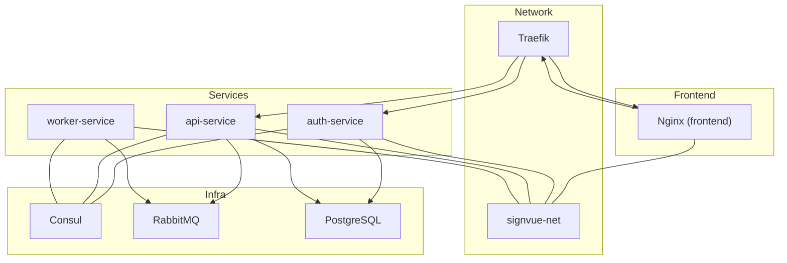
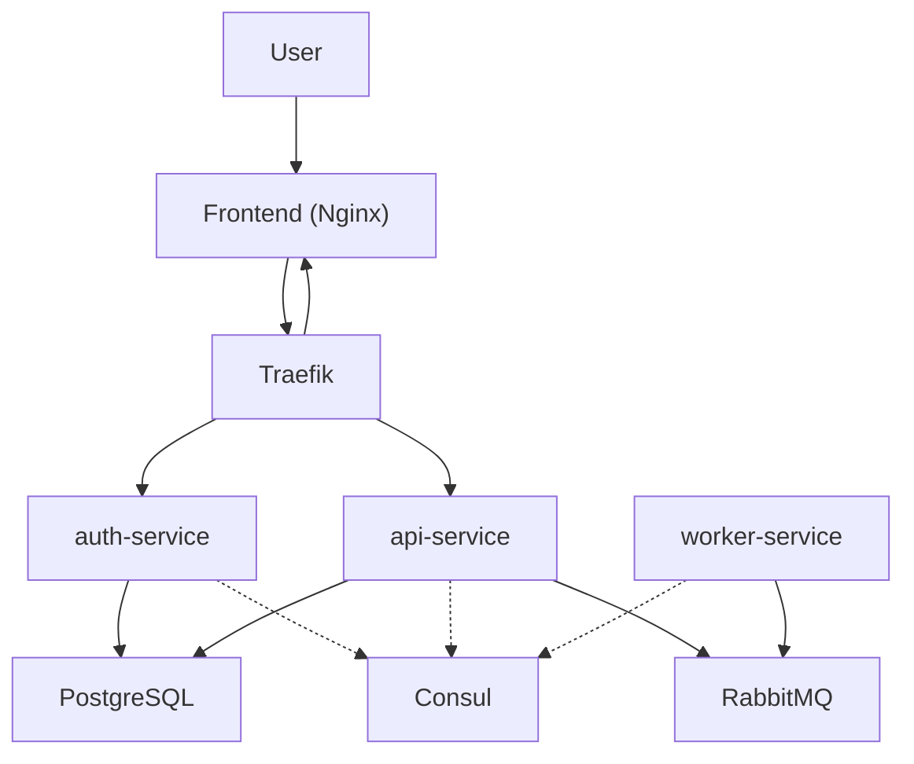
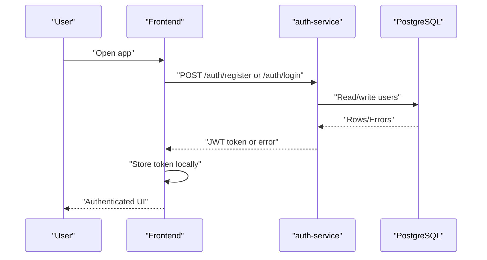
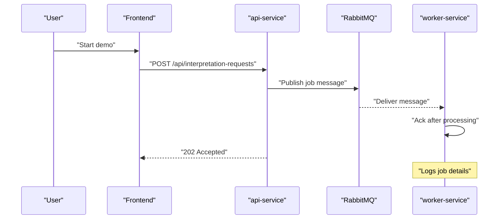
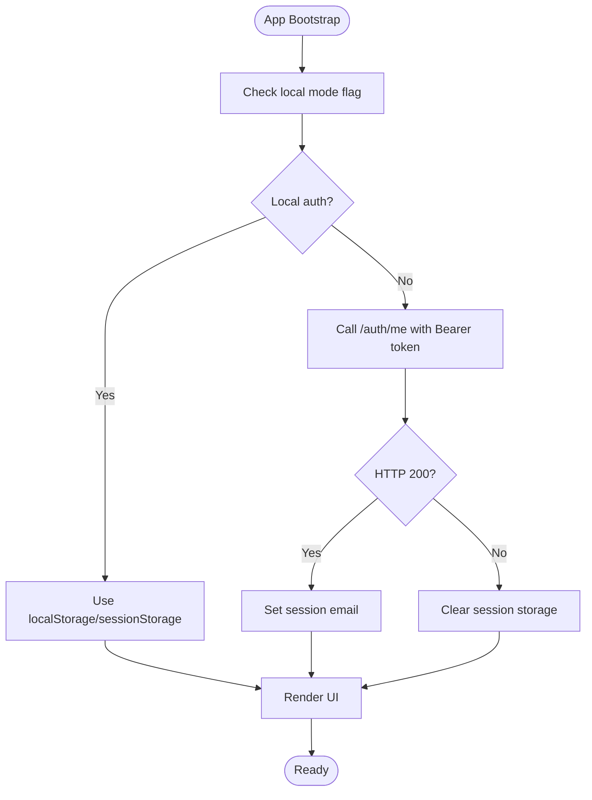
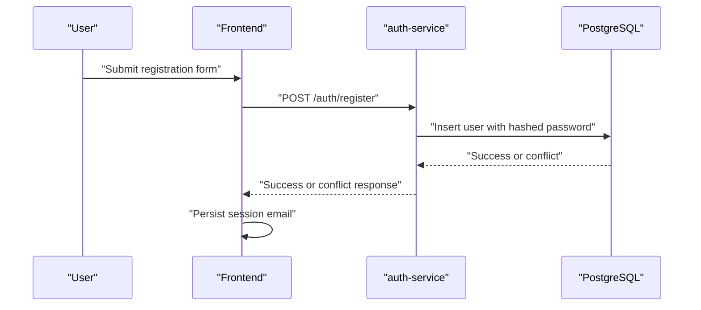
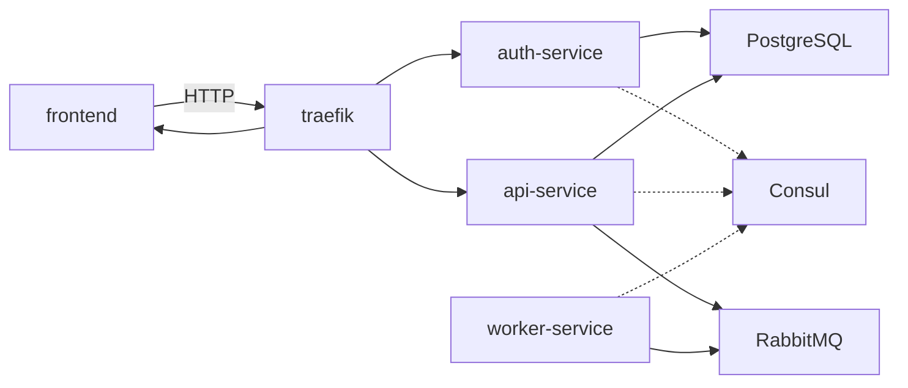

# Data Flow Architecture

<cite>
**Referenced Files in This Document**
- [README.md](file://README.md)
- [docker-compose.yml](file://docker-compose.yml)
- [frontend/config.js](file://frontend/config.js)
- [frontend/script.js](file://frontend/script.js)
- [services/api-service/src/index.js](file://services/api-service/src/index.js)
- [services/api-service/src/db.js](file://services/api-service/src/db.js)
- [services/api-service/package.json](file://services/api-service/package.json)
- [services/auth-service/src/index.js](file://services/auth-service/src/index.js)
- [services/auth-service/src/db.js](file://services/auth-service/src/db.js)
- [services/auth-service/package.json](file://services/auth-service/package.json)
- [services/worker-service/src/index.js](file://services/worker-service/src/index.js)
- [infra/init-db.sql](file://infra/init-db.sql)
</cite>

## Table of Contents
1. [Introduction](#introduction)
2. [Project Structure](#project-structure)
3. [Core Components](#core-components)
4. [Architecture Overview](#architecture-overview)
5. [Detailed Component Analysis](#detailed-component-analysis)
6. [Dependency Analysis](#dependency-analysis)
7. [Performance Considerations](#performance-considerations)
8. [Troubleshooting Guide](#troubleshooting-guide)
9. [Conclusion](#conclusion)

## Introduction
This document explains the SignVue data flow architecture across microservices. It covers:
- Authentication flow: frontend → auth-service → database
- Demo processing flow: frontend → api-service → RabbitMQ → worker-service
- Session management flow
- User registration flow
- Message queue usage for asynchronous processing
- Data consistency patterns and service integration points

The system uses a reverse proxy (Traefik), service registry (Consul), PostgreSQL, and RabbitMQ to orchestrate synchronous and asynchronous workflows.

## Project Structure
The repository organizes code by service and infrastructure:
- Frontend static UI (Nginx) consuming APIs under /auth and /api
- Backend services:
  - auth-service: JWT-based authentication and user persistence
  - api-service: business endpoints, JWT verification, RabbitMQ producer
  - worker-service: RabbitMQ consumer performing asynchronous tasks
- Infrastructure:
  - Consul for service discovery
  - RabbitMQ for asynchronous messaging
  - PostgreSQL for relational data

**Diagram sources**
- [docker-compose.yml:3-137](file://docker-compose.yml#L3-L137)
- [services/api-service/src/index.js:1-133](file://services/api-service/src/index.js#L1-L133)
- [services/auth-service/src/index.js:1-124](file://services/auth-service/src/index.js#L1-L124)
- [services/worker-service/src/index.js:1-88](file://services/worker-service/src/index.js#L1-L88)

**Section sources**
- [README.md:1-111](file://README.md#L1-L111)
- [docker-compose.yml:1-137](file://docker-compose.yml#L1-L137)

## Core Components
- Frontend (Nginx): Provides static UI and interacts with backend APIs via base URL configuration. It manages session tokens and orchestrates user actions like login, registration, and starting demos.
- auth-service: Handles user registration and login, persists users in PostgreSQL, and issues JWTs. It exposes endpoints for verification and health checks.
- api-service: Validates JWTs, exposes business endpoints (sessions, interpretation requests), and publishes messages to RabbitMQ for asynchronous processing.
- worker-service: Consumes RabbitMQ messages and performs asynchronous work, registering itself with Consul for health monitoring.
- PostgreSQL: Shared relational database used by auth-service and api-service.
- RabbitMQ: Broker for asynchronous jobs (e.g., interpretation requests).
- Consul: Service registry and health checks for services.
- Traefik: Reverse proxy routing incoming traffic to appropriate services based on path prefixes.

**Section sources**
- [frontend/config.js:1-18](file://frontend/config.js#L1-L18)
- [frontend/script.js:1-726](file://frontend/script.js#L1-L726)
- [services/auth-service/src/index.js:1-124](file://services/auth-service/src/index.js#L1-L124)
- [services/api-service/src/index.js:1-133](file://services/api-service/src/index.js#L1-L133)
- [services/worker-service/src/index.js:1-88](file://services/worker-service/src/index.js#L1-L88)
- [infra/init-db.sql:1-44](file://infra/init-db.sql#L1-L44)
- [docker-compose.yml:1-137](file://docker-compose.yml#L1-L137)

## Architecture Overview
The system routes HTTP traffic through Traefik to services:
- /auth → auth-service
- /api → api-service
- Root → frontend

Consul registers services and exposes health endpoints. RabbitMQ decouples api-service from worker-service for asynchronous processing. PostgreSQL stores user and business data.

**Diagram sources**
- [docker-compose.yml:3-137](file://docker-compose.yml#L3-L137)
- [services/api-service/src/index.js:1-133](file://services/api-service/src/index.js#L1-L133)
- [services/auth-service/src/index.js:1-124](file://services/auth-service/src/index.js#L1-L124)
- [services/worker-service/src/index.js:1-88](file://services/worker-service/src/index.js#L1-L88)

## Detailed Component Analysis

### Authentication Flow
End-to-end flow: frontend → auth-service → database.

Key behaviors:
- Registration validates presence of credentials, hashes passwords, and inserts into users table.
- Login verifies credentials against stored hash and issues a signed JWT.
- Token verification endpoint supports client-side validation.

**Diagram sources**
- [services/auth-service/src/index.js:13-50](file://services/auth-service/src/index.js#L13-L50)
- [services/auth-service/src/index.js:53-94](file://services/auth-service/src/index.js#L53-L94)
- [services/auth-service/src/index.js:97-112](file://services/auth-service/src/index.js#L97-L112)
- [infra/init-db.sql:3-9](file://infra/init-db.sql#L3-L9)

**Section sources**
- [services/auth-service/src/index.js:1-124](file://services/auth-service/src/index.js#L1-L124)
- [infra/init-db.sql:1-44](file://infra/init-db.sql#L1-L44)

### Demo Processing Flow (Asynchronous)
End-to-end flow: frontend → api-service → RabbitMQ → worker-service.

Key behaviors:
- api-service publishes messages to a durable queue for asynchronous processing.
- worker-service consumes messages with manual acknowledgment and logs job details.
- Frontend receives 202 Accepted upon successful publish.

**Diagram sources**
- [frontend/script.js:409-441](file://frontend/script.js#L409-L441)
- [services/api-service/src/index.js:123-133](file://services/api-service/src/index.js#L123-L133)
- [services/worker-service/src/index.js:45-81](file://services/worker-service/src/index.js#L45-L81)

**Section sources**
- [frontend/script.js:409-441](file://frontend/script.js#L409-L441)
- [services/api-service/src/index.js:1-133](file://services/api-service/src/index.js#L1-L133)
- [services/worker-service/src/index.js:1-88](file://services/worker-service/src/index.js#L1-L88)

### Session Management Flow
Frontend manages session tokens and validates them against the backend.

Key behaviors:
- Frontend reads token from storage and attaches Authorization header for protected endpoints.
- On load, it validates the token against /auth/me and updates UI accordingly.
- Logout clears tokens and resets UI state.

**Diagram sources**
- [frontend/script.js:160-248](file://frontend/script.js#L160-L248)
- [frontend/script.js:678-694](file://frontend/script.js#L678-L694)

**Section sources**
- [frontend/script.js:1-726](file://frontend/script.js#L1-L726)

### User Registration Flow
Frontend triggers registration; backend persists user and returns success.

Key behaviors:
- Frontend validates form and posts credentials.
- Backend checks for existing email and inserts a new user with a hashed password.
- Frontend sets session email on success.

**Diagram sources**
- [frontend/script.js:184-215](file://frontend/script.js#L184-L215)
- [services/auth-service/src/index.js:13-50](file://services/auth-service/src/index.js#L13-L50)
- [infra/init-db.sql:3-9](file://infra/init-db.sql#L3-L9)

**Section sources**
- [frontend/script.js:184-215](file://frontend/script.js#L184-L215)
- [services/auth-service/src/index.js:1-124](file://services/auth-service/src/index.js#L1-L124)
- [infra/init-db.sql:1-44](file://infra/init-db.sql#L1-L44)

### Data Consistency Patterns
- JWT Secret: Both auth-service and api-service share a JWT_SECRET for signing and verifying tokens. This ensures clients can verify tokens locally while maintaining server-side validation.
- Database Schema: Two initialization paths exist:
  - api-service migration code creates tables and indexes at startup.
  - infra/init-db.sql initializes users and related tables on first container boot.
- RabbitMQ Durability: Messages are published to a durable queue to prevent loss during restarts.

**Section sources**
- [README.md:92-98](file://README.md#L92-L98)
- [services/api-service/src/db.js:29-78](file://services/api-service/src/db.js#L29-L78)
- [infra/init-db.sql:1-44](file://infra/init-db.sql#L1-L44)
- [services/worker-service/src/index.js:53-76](file://services/worker-service/src/index.js#L53-L76)

## Dependency Analysis
Service dependencies and runtime relationships:

Observations:
- api-service depends on PostgreSQL and RabbitMQ availability.
- worker-service depends on RabbitMQ connectivity.
- auth-service depends on PostgreSQL.
- All services register health checks with Consul for discovery.

**Diagram sources**
- [docker-compose.yml:3-137](file://docker-compose.yml#L3-L137)
- [services/api-service/src/index.js:1-133](file://services/api-service/src/index.js#L1-L133)
- [services/worker-service/src/index.js:1-88](file://services/worker-service/src/index.js#L1-L88)
- [services/auth-service/src/index.js:1-124](file://services/auth-service/src/index.js#L1-L124)

**Section sources**
- [docker-compose.yml:1-137](file://docker-compose.yml#L1-L137)
- [services/api-service/package.json:1-19](file://services/api-service/package.json#L1-L19)
- [services/auth-service/package.json:1-18](file://services/auth-service/package.json#L1-L18)

## Performance Considerations
- Asynchronous processing: Offloading heavy work to worker-service via RabbitMQ prevents blocking the API and improves responsiveness.
- Health checks: Services expose /health endpoints registered with Consul to enable fast failover and routing decisions.
- Database readiness: api-service waits for PostgreSQL readiness before serving requests.
- Token verification: Clients can locally verify JWTs using shared secret to reduce round trips for validation.

[No sources needed since this section provides general guidance]

## Troubleshooting Guide
Common issues and diagnostics:
- RabbitMQ connectivity: Verify worker-service connects and consumes from the queue; check logs for connection errors.
- JWT verification failures: Confirm shared JWT_SECRET is identical across services and that Authorization headers are present.
- Database readiness: api-service waits for DB; if startup fails, inspect DB logs and connection string.
- Service registration: Ensure Consul registration succeeds and /health endpoints are reachable.

**Section sources**
- [services/worker-service/src/index.js:45-81](file://services/worker-service/src/index.js#L45-L81)
- [services/api-service/src/index.js:124-133](file://services/api-service/src/index.js#L124-L133)
- [services/auth-service/src/index.js:115-117](file://services/auth-service/src/index.js#L115-L117)
- [README.md:92-98](file://README.md#L92-L98)

## Conclusion
SignVue’s architecture separates concerns across microservices, uses JWT for lightweight authentication, and leverages RabbitMQ for asynchronous processing. The system integrates Traefik for routing, Consul for discovery, and PostgreSQL for persistence. Following the documented flows and ensuring consistent configuration (especially JWT_SECRET and database initialization) will maintain reliable data movement and user experiences.