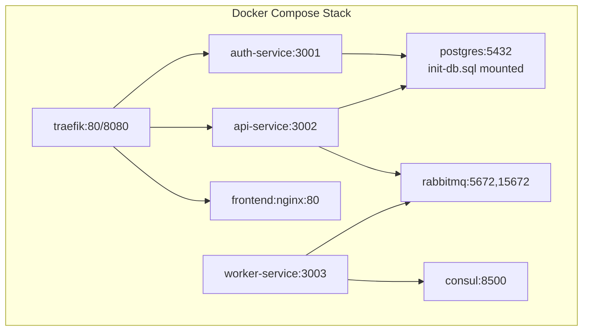
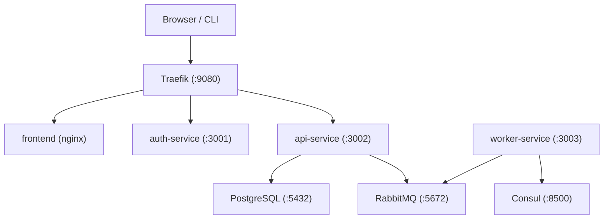
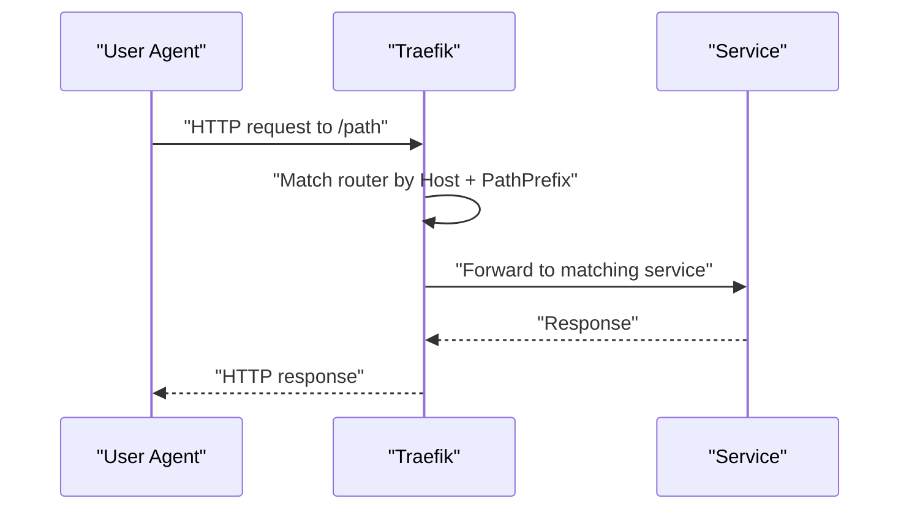
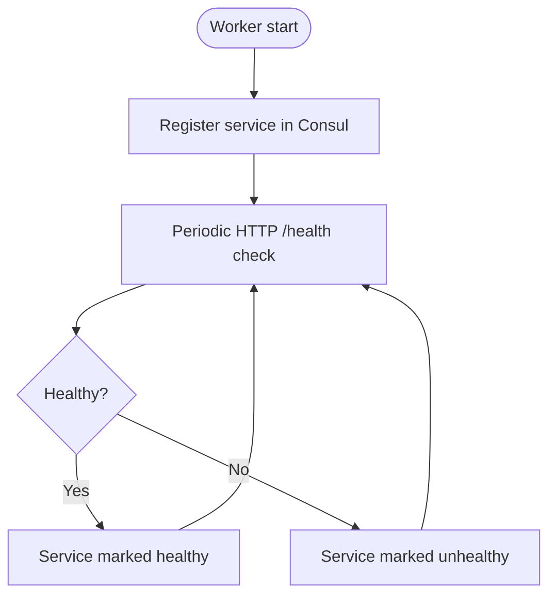
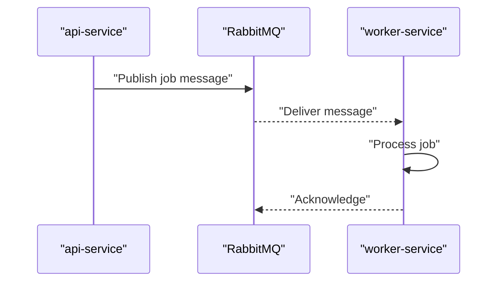
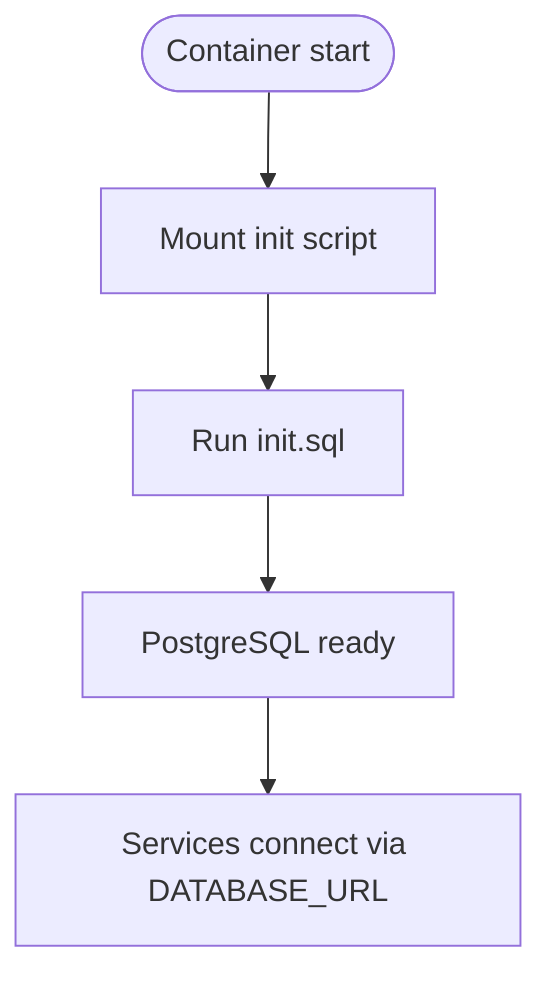
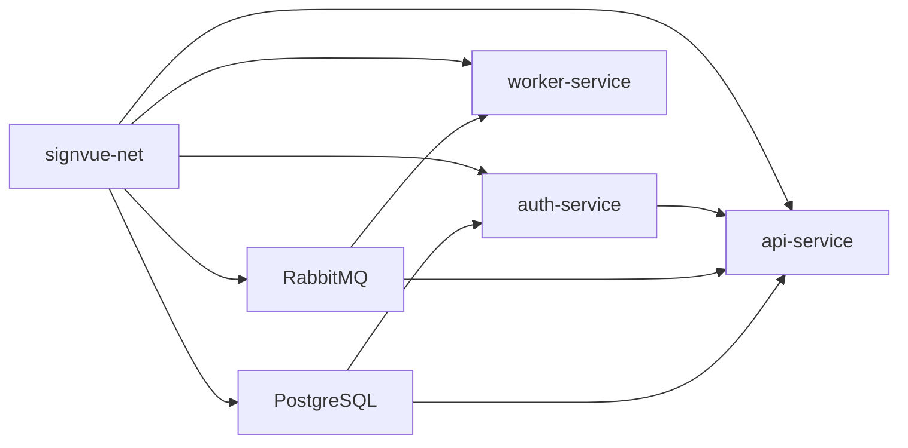
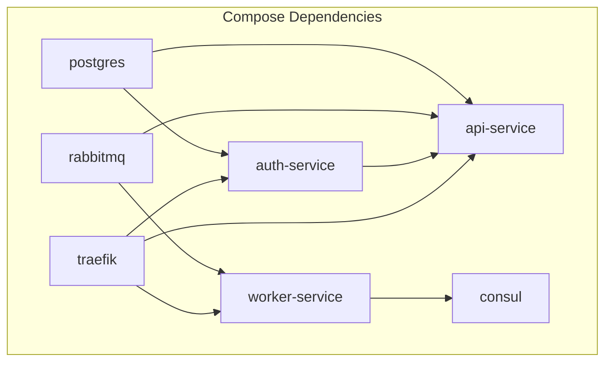

# Infrastructure Components

<cite>
**Referenced Files in This Document**
- [docker-compose.yml](file://docker-compose.yml)
- [README.md](file://README.md)
- [init-db.sql](file://infra/init-db.sql)
- [api-service/Dockerfile](file://services/api-service/Dockerfile)
- [auth-service/Dockerfile](file://services/auth-service/Dockerfile)
- [worker-service/Dockerfile](file://services/worker-service/Dockerfile)
- [api-service/package.json](file://services/api-service/package.json)
- [auth-service/package.json](file://services/auth-service/package.json)
- [worker-service/package.json](file://services/worker-service/package.json)
- [api-service/src/index.js](file://services/api-service/src/index.js)
- [api-service/src/db.js](file://services/api-service/src/db.js)
- [auth-service/src/index.js](file://services/auth-service/src/index.js)
- [auth-service/src/db.js](file://services/auth-service/src/db.js)
- [worker-service/src/index.js](file://services/worker-service/src/index.js)
</cite>

## Table of Contents
1. [Introduction](#introduction)
2. [Project Structure](#project-structure)
3. [Core Components](#core-components)
4. [Architecture Overview](#architecture-overview)
5. [Detailed Component Analysis](#detailed-component-analysis)
6. [Dependency Analysis](#dependency-analysis)
7. [Performance Considerations](#performance-considerations)
8. [Troubleshooting Guide](#troubleshooting-guide)
9. [Conclusion](#conclusion)

## Introduction
This document explains the SignVue infrastructure components orchestrated by Docker Compose. It covers the network setup, service dependencies, and container orchestration, and details the roles of each infrastructure component:
- Traefik reverse proxy for routing and load balancing
- Consul for service discovery and health checking
- RabbitMQ for message queuing and asynchronous processing
- PostgreSQL for data persistence

It also documents configuration details (ports, volumes, environment variables), scaling considerations, and resource allocation strategies.

## Project Structure
SignVue uses a single Docker Compose file to define all services and a dedicated network for inter-container communication. Supporting assets include:
- Initialization SQL for PostgreSQL schema creation
- Per-service Dockerfiles and package manifests
- Service entry points and database connectivity logic

**Diagram sources**
- [docker-compose.yml:4-137](file://docker-compose.yml#L4-L137)

**Section sources**
- [docker-compose.yml:1-137](file://docker-compose.yml#L1-L137)
- [README.md:1-111](file://README.md#L1-L111)

## Core Components
- Traefik reverse proxy
  - Exposes HTTP entrypoint 80 and dashboard 8080
  - Listens on host ports 9080 (HTTP) and 8080 (dashboard)
  - Integrates with Docker provider and routes based on labels
- Consul service registry
  - Dev mode with UI enabled
  - Exposes port 8500 for service registration and health checks
- RabbitMQ message broker
  - Includes management UI
  - Exposes AMQP (5672) and management (15672) ports
  - Default credentials configured via environment variables
- PostgreSQL database
  - Initializes schema via mounted SQL file
  - Persists data in a named volume
  - Health-checked by Compose
- Services
  - auth-service, api-service, worker-service, and frontend
  - All join the same user-defined network for service-to-service communication

**Section sources**
- [docker-compose.yml:4-137](file://docker-compose.yml#L4-L137)
- [init-db.sql:1-44](file://infra/init-db.sql#L1-L44)

## Architecture Overview
The runtime architecture routes external traffic through Traefik to services, while internal services communicate over a shared network. Consul registers worker-service health checks; RabbitMQ handles asynchronous jobs published by api-service.

**Diagram sources**
- [docker-compose.yml:4-137](file://docker-compose.yml#L4-L137)
- [worker-service/src/index.js:19-43](file://services/worker-service/src/index.js#L19-L43)

## Detailed Component Analysis

### Traefik Reverse Proxy
- Role
  - Single HTTP entrypoint for all services
  - Routes requests to auth, api, and frontend based on host and path
  - Provides dashboard for monitoring
- Network and ports
  - Container network: signvue-net
  - Host bindings: 9080:80 (HTTP), 8080:8080 (dashboard)
- Routing rules
  - auth-service: path prefix /auth
  - api-service: path prefix /api
  - frontend: root host
- Load balancing
  - Uses Docker provider with per-service load balancers

**Diagram sources**
- [docker-compose.yml:70-105](file://docker-compose.yml#L70-L105)

**Section sources**
- [docker-compose.yml:4-18](file://docker-compose.yml#L4-L18)
- [docker-compose.yml:70-105](file://docker-compose.yml#L70-L105)

### Consul Service Discovery and Health Checking
- Role
  - Registers worker-service with periodic HTTP health checks
  - Enables service discovery and health visibility
- Registration
  - Service name and ID derived from environment
  - Health check endpoint exposed by worker-service
- Health check interval and timeout
  - Interval: 10 seconds
  - Timeout: 3 seconds

**Diagram sources**
- [worker-service/src/index.js:19-43](file://services/worker-service/src/index.js#L19-L43)

**Section sources**
- [docker-compose.yml:113-116](file://docker-compose.yml#L113-L116)
- [worker-service/src/index.js:19-43](file://services/worker-service/src/index.js#L19-L43)

### RabbitMQ Message Broker
- Role
  - Asynchronous messaging backbone for interpretation jobs
  - Management UI for monitoring queues and connections
- Ports
  - AMQP: 5672
  - Management: 15672
- Credentials
  - Username/password set via environment variables
- Consumer behavior
  - worker-service connects, asserts durable queue, consumes with prefetch(1), acknowledges processed messages

**Diagram sources**
- [worker-service/src/index.js:45-81](file://services/worker-service/src/index.js#L45-L81)
- [docker-compose.yml:28-38](file://docker-compose.yml#L28-L38)

**Section sources**
- [docker-compose.yml:28-38](file://docker-compose.yml#L28-L38)
- [worker-service/src/index.js:45-81](file://services/worker-service/src/index.js#L45-L81)

### PostgreSQL Database
- Role
  - Persistent storage for users, sessions, and translation records
- Initialization
  - Schema created on first run via mounted init script
- Persistence
  - Named volume for data durability
- Health check
  - Compose uses pg_isready to verify readiness
- Service connectivity
  - auth-service and api-service connect via DATABASE_URL

**Diagram sources**
- [docker-compose.yml:40-57](file://docker-compose.yml#L40-L57)
- [init-db.sql:1-44](file://infra/init-db.sql#L1-L44)

**Section sources**
- [docker-compose.yml:40-57](file://docker-compose.yml#L40-L57)
- [init-db.sql:1-44](file://infra/init-db.sql#L1-L44)
- [api-service/src/db.js:14-27](file://services/api-service/src/db.js#L14-L27)
- [auth-service/src/db.js:3-7](file://services/auth-service/src/db.js#L3-L7)

### Service Dependencies and Orchestration
- Network
  - All services share signvue-net
- Startup order
  - auth-service and api-service depend on PostgreSQL being healthy
  - api-service additionally depends on RabbitMQ and auth-service
  - worker-service depends on RabbitMQ
- Routing labels
  - Traefik labels configure routers, middlewares, and services for each route

**Diagram sources**
- [docker-compose.yml:65-94](file://docker-compose.yml#L65-L94)
- [docker-compose.yml:113-116](file://docker-compose.yml#L113-L116)

**Section sources**
- [docker-compose.yml:65-94](file://docker-compose.yml#L65-L94)
- [docker-compose.yml:113-116](file://docker-compose.yml#L113-L116)

## Dependency Analysis
- Inter-service dependencies
  - api-service depends on PostgreSQL (healthy), RabbitMQ (started), and auth-service (started)
  - worker-service depends on RabbitMQ
  - auth-service depends on PostgreSQL
- External integrations
  - Traefik orchestrates routing based on labels
  - Consul receives health registrations from worker-service
- Volume and port mappings
  - PostgreSQL data persisted via named volume
  - Multiple host ports mapped for observability and management

**Diagram sources**
- [docker-compose.yml:65-116](file://docker-compose.yml#L65-L116)

**Section sources**
- [docker-compose.yml:65-116](file://docker-compose.yml#L65-L116)

## Performance Considerations
- Resource allocation
  - Assign CPU and memory limits per service in Compose for predictable performance
  - Scale stateless services (auth-service, api-service, frontend) horizontally behind Traefik
- Database tuning
  - Use connection pooling and limit pool size per service
  - Monitor slow queries and add appropriate indexes
- Message processing
  - Adjust RabbitMQ queue durability and consumer concurrency
  - Use dead-letter exchanges for failed jobs
- Observability
  - Enable metrics exporters for Traefik, Consul, RabbitMQ, and PostgreSQL
  - Centralize logs with a collector (e.g., ELK or similar)
- Network isolation
  - Keep services in a single user-defined network to reduce latency
  - Avoid unnecessary port exposure to the host

[No sources needed since this section provides general guidance]

## Troubleshooting Guide
- Traefik dashboard unreachable
  - Verify dashboard flag and port binding
  - Confirm Traefik joins signvue-net
- Services not reachable
  - Check Traefik labels and router rules
  - Ensure services expose correct ports and are on signvue-net
- PostgreSQL not ready
  - Confirm healthcheck passes and init script executed
  - Validate DATABASE_URL in services
- RabbitMQ connectivity
  - Verify credentials and port mapping
  - Confirm queue exists and worker is consuming
- Consul registration failures
  - Check worker-service health endpoint and Consul availability
  - Review registration payload and intervals

**Section sources**
- [docker-compose.yml:7-18](file://docker-compose.yml#L7-L18)
- [docker-compose.yml:53-57](file://docker-compose.yml#L53-L57)
- [docker-compose.yml:113-116](file://docker-compose.yml#L113-L116)
- [worker-service/src/index.js:19-43](file://services/worker-service/src/index.js#L19-L43)

## Conclusion
The SignVue infrastructure leverages Traefik for routing, Consul for discovery, RabbitMQ for asynchronous processing, and PostgreSQL for persistence. The Docker Compose configuration defines a cohesive network, explicit dependencies, and observability endpoints. For production, enforce resource limits, enable metrics, and scale stateless services behind Traefik while keeping critical stateful components (PostgreSQL, RabbitMQ) properly provisioned.