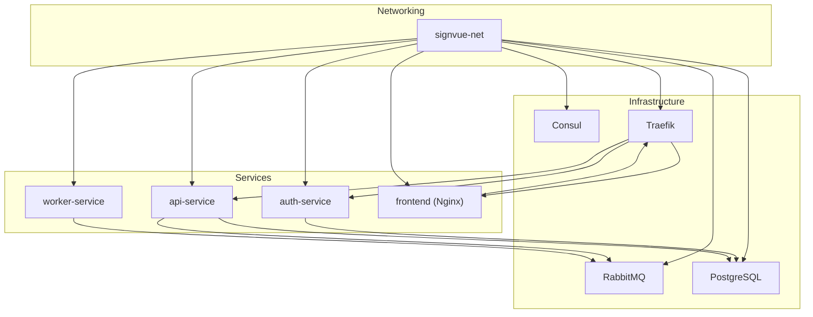
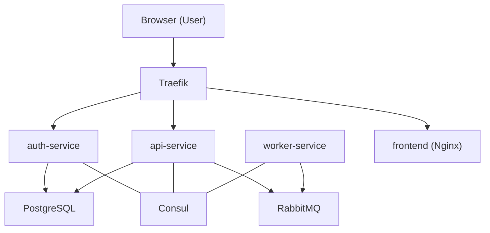
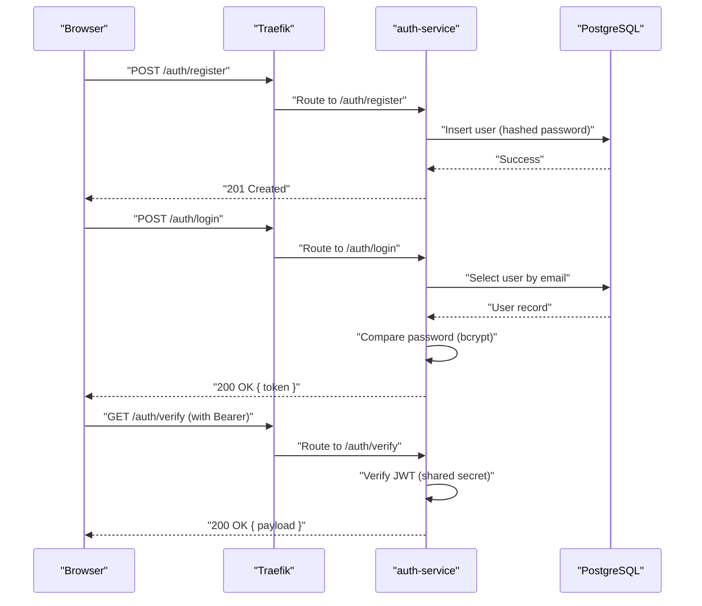
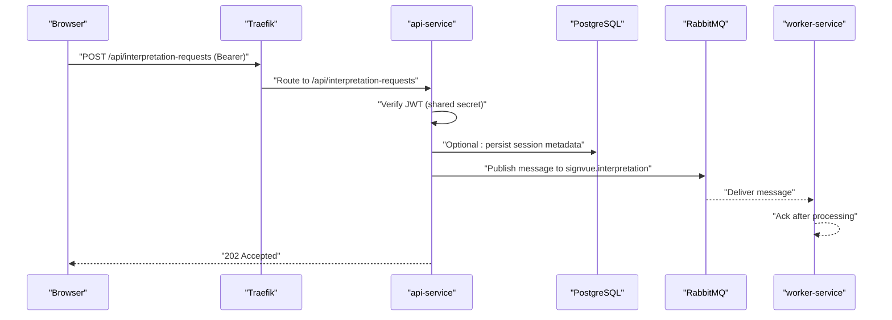
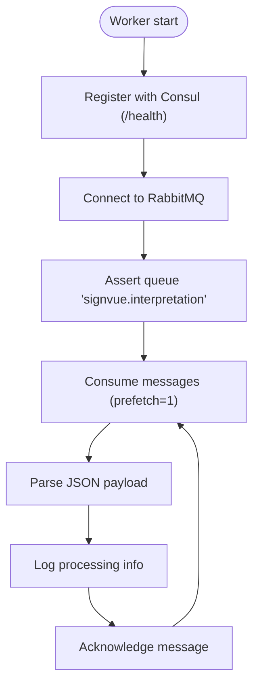
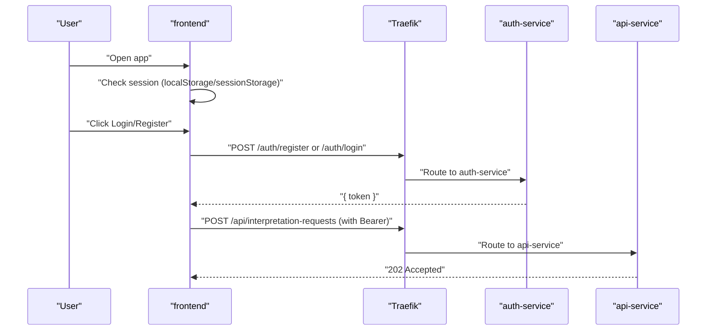
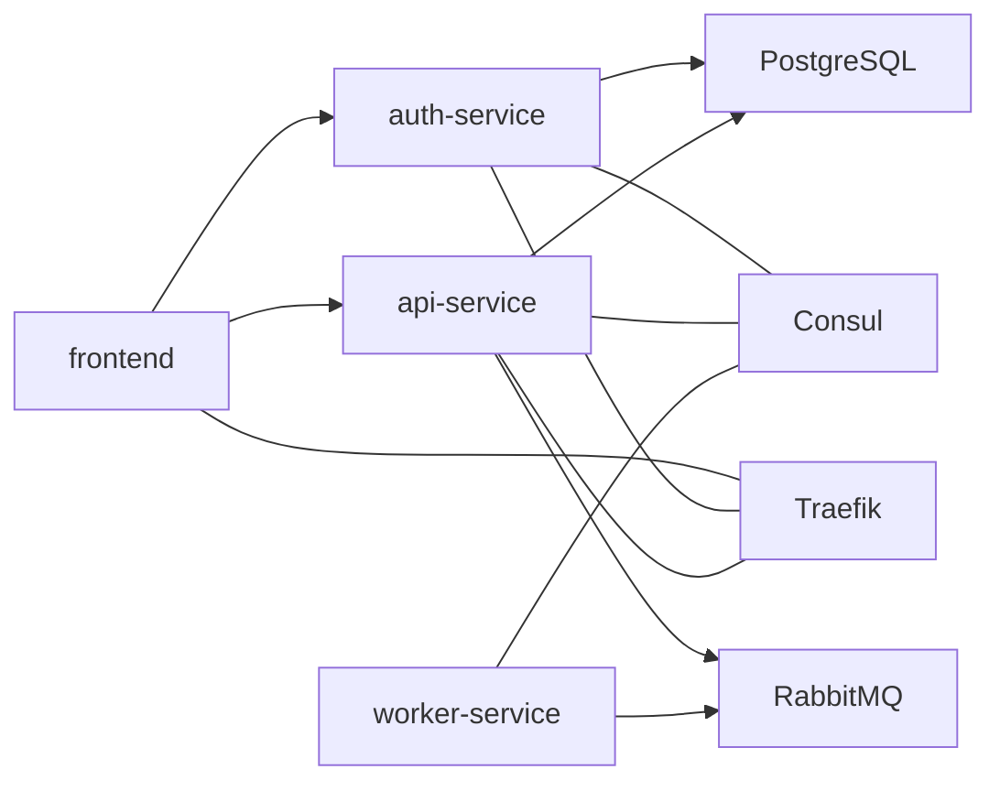

# Microservices Overview

<cite>
**Referenced Files in This Document**
- [README.md](file://README.md)
- [docker-compose.yml](file://docker-compose.yml)
- [services/api-service/src/index.js](file://services/api-service/src/index.js)
- [services/api-service/src/db.js](file://services/api-service/src/db.js)
- [services/api-service/package.json](file://services/api-service/package.json)
- [services/auth-service/src/index.js](file://services/auth-service/src/index.js)
- [services/auth-service/src/db.js](file://services/auth-service/src/db.js)
- [services/auth-service/package.json](file://services/auth-service/package.json)
- [services/worker-service/src/index.js](file://services/worker-service/src/index.js)
- [services/worker-service/package.json](file://services/worker-service/package.json)
- [frontend/index.html](file://frontend/index.html)
- [frontend/script.js](file://frontend/script.js)
- [frontend/config.js](file://frontend/config.js)
- [infra/init-db.sql](file://infra/init-db.sql)
</cite>

## Table of Contents
1. [Introduction](#introduction)
2. [Project Structure](#project-structure)
3. [Core Components](#core-components)
4. [Architecture Overview](#architecture-overview)
5. [Detailed Component Analysis](#detailed-component-analysis)
6. [Dependency Analysis](#dependency-analysis)
7. [Performance Considerations](#performance-considerations)
8. [Troubleshooting Guide](#troubleshooting-guide)
9. [Conclusion](#conclusion)

## Introduction
This document presents the SignVue microservices architecture overview. It explains the purpose and responsibilities of each microservice, service boundaries, communication patterns, and how they collaborate to deliver a complete sign language recognition system. The system integrates a reverse proxy, service registry, message broker, and a frontend UI, orchestrated via Docker Compose.

## Project Structure
The repository is organized around three backend microservices and a static frontend, plus infrastructure assets:
- services/auth-service: Authentication and user lifecycle
- services/api-service: Business logic, session management, and async job initiation
- services/worker-service: Asynchronous job processing via RabbitMQ
- frontend: Static UI consuming auth and API endpoints
- infra: Database initialization scripts
- docker-compose.yml: Multi-container orchestration

**Diagram sources**
- [docker-compose.yml:3-137](file://docker-compose.yml#L3-L137)

**Section sources**
- [docker-compose.yml:3-137](file://docker-compose.yml#L3-L137)
- [README.md:100-111](file://README.md#L100-L111)

## Core Components
- auth-service
  - Purpose: User registration, login, JWT issuance, and profile verification
  - Responsibilities: Password hashing, JWT signing/verification, user persistence
  - Boundaries: Exposes /auth routes; integrates with PostgreSQL
- api-service
  - Purpose: Business logic, session management, and async job initiation
  - Responsibilities: CRUD sessions, async request publishing, admin stats, JWT verification
  - Boundaries: Exposes /api routes; integrates with PostgreSQL and RabbitMQ
- worker-service
  - Purpose: Asynchronous job processing
  - Responsibilities: Consumes RabbitMQ queue, logs processing, registers with Consul
  - Boundaries: Listens on /health; consumes signvue.interpretation queue
- frontend
  - Purpose: Static UI for authentication and demo camera
  - Responsibilities: Renders auth forms, manages session tokens, triggers async requests
  - Boundaries: Serves static assets; calls /auth and /api endpoints

**Section sources**
- [README.md:12-15](file://README.md#L12-L15)
- [services/auth-service/src/index.js:1-124](file://services/auth-service/src/index.js#L1-L124)
- [services/api-service/src/index.js:1-133](file://services/api-service/src/index.js#L1-L133)
- [services/worker-service/src/index.js:1-88](file://services/worker-service/src/index.js#L1-L88)
- [frontend/index.html:1-222](file://frontend/index.html#L1-L222)

## Architecture Overview
The system uses a reverse proxy (Traefik) routing HTTP traffic to services based on path prefixes. Services register themselves with Consul for discovery and health checks. RabbitMQ handles asynchronous job processing. PostgreSQL persists user and session data.

**Diagram sources**
- [docker-compose.yml:4-137](file://docker-compose.yml#L4-L137)
- [README.md:17-23](file://README.md#L17-L23)

## Detailed Component Analysis

### auth-service
- Purpose: Authentication and user management
- Key responsibilities:
  - Registration: Validates input, checks uniqueness, hashes password, stores user
  - Login: Retrieves user, compares password, signs JWT with shared secret
  - Verification: Validates JWT from Authorization header
  - Health: Returns service status
- Data access:
  - Uses PostgreSQL via connection pool
  - Initializes schema via migration on startup
- Security:
  - Uses bcrypt for password hashing
  - Issues JWT with shared secret configured via environment variable

**Diagram sources**
- [services/auth-service/src/index.js:13-94](file://services/auth-service/src/index.js#L13-L94)
- [services/auth-service/src/db.js:1-13](file://services/auth-service/src/db.js#L1-L13)

**Section sources**
- [services/auth-service/src/index.js:1-124](file://services/auth-service/src/index.js#L1-L124)
- [services/auth-service/src/db.js:1-13](file://services/auth-service/src/db.js#L1-L13)
- [services/auth-service/package.json:1-18](file://services/auth-service/package.json#L1-L18)

### api-service
- Purpose: Business logic and session management; initiates async jobs
- Key responsibilities:
  - Session CRUD: GET/POST/PUT/DELETE /api/sessions with user scoping
  - Async request: POST /api/interpretation-requests publishes to RabbitMQ
  - Admin stats: GET /api/stats/sessions (admin-only)
  - JWT verification: Validates Authorization header using shared secret
  - Health: DB readiness check
- Data access:
  - PostgreSQL via connection pool
  - Migrations create users, sessions, and translations tables
- Integration:
  - Publishes messages to RabbitMQ queue signvue.interpretation
  - Depends on auth-service for JWT verification

**Diagram sources**
- [services/api-service/src/index.js:26-104](file://services/api-service/src/index.js#L26-L104)
- [services/api-service/src/db.js:30-78](file://services/api-service/src/db.js#L30-L78)
- [services/worker-service/src/index.js:45-81](file://services/worker-service/src/index.js#L45-L81)

**Section sources**
- [services/api-service/src/index.js:1-133](file://services/api-service/src/index.js#L1-L133)
- [services/api-service/src/db.js:1-84](file://services/api-service/src/db.js#L1-L84)
- [services/api-service/package.json:1-19](file://services/api-service/package.json#L1-L19)

### worker-service
- Purpose: Asynchronous job processing
- Key responsibilities:
  - Registers itself with Consul for health checks
  - Consumes RabbitMQ queue signvue.interpretation
  - Logs received job payloads and acknowledges messages
- Integration:
  - Connects to RabbitMQ using AMQP
  - Health endpoint exposed for monitoring

**Diagram sources**
- [services/worker-service/src/index.js:19-81](file://services/worker-service/src/index.js#L19-L81)

**Section sources**
- [services/worker-service/src/index.js:1-88](file://services/worker-service/src/index.js#L1-L88)
- [services/worker-service/package.json:1-14](file://services/worker-service/package.json#L1-L14)

### frontend
- Purpose: Static UI for authentication and demo camera
- Key responsibilities:
  - Renders auth modal and user menu
  - Manages session tokens and user roles
  - Triggers camera demo and sends async requests to /api/interpretation-requests
  - Respects base URL configuration via meta tag or global override
- Communication:
  - Calls /auth/register, /auth/login, /auth/verify
  - Calls /api/interpretation-requests during demo
  - Uses Authorization header with Bearer token when available

**Diagram sources**
- [frontend/script.js:184-232](file://frontend/script.js#L184-L232)
- [frontend/script.js:409-441](file://frontend/script.js#L409-L441)
- [frontend/config.js:1-18](file://frontend/config.js#L1-L18)

**Section sources**
- [frontend/index.html:1-222](file://frontend/index.html#L1-L222)
- [frontend/script.js:1-726](file://frontend/script.js#L1-L726)
- [frontend/config.js:1-18](file://frontend/config.js#L1-L18)

## Dependency Analysis
- Runtime dependencies
  - PostgreSQL: Used by auth-service and api-service for persistence
  - RabbitMQ: Used by api-service to publish async jobs and by worker-service to consume them
  - Consul: Service registry and health checks for all services
  - Traefik: Reverse proxy routing HTTP traffic based on path prefixes
- Inter-service dependencies
  - api-service depends on auth-service for JWT verification
  - worker-service depends on RabbitMQ availability
  - frontend depends on auth-service and api-service for authentication and demo initiation
- External integrations
  - Frontend base URL configurable via meta tag or global override

**Diagram sources**
- [docker-compose.yml:59-131](file://docker-compose.yml#L59-L131)
- [README.md:17-23](file://README.md#L17-L23)

**Section sources**
- [docker-compose.yml:59-131](file://docker-compose.yml#L59-L131)
- [infra/init-db.sql:1-44](file://infra/init-db.sql#L1-L44)

## Performance Considerations
- Database
  - Use connection pooling and migrations to ensure schema readiness before serving requests
  - Indexes on user and translation tables improve query performance
- Message broker
  - RabbitMQ durability and prefetch settings help balance load and reliability
- Reverse proxy
  - Traefik routing based on path prefixes ensures efficient traffic distribution
- Frontend
  - Minimize unnecessary network calls; cache tokens locally when appropriate
  - Use health checks and Consul registration to avoid routing to unhealthy instances

[No sources needed since this section provides general guidance]

## Troubleshooting Guide
- Authentication failures
  - Verify JWT secret alignment between auth-service and api-service
  - Confirm user exists and password matches using bcrypt comparison
- Database connectivity
  - Ensure PostgreSQL is healthy and reachable; check migrations ran successfully
- RabbitMQ connectivity
  - Confirm RabbitMQ is running and credentials are correct
  - Verify queue existence and consumer registration
- Service discovery
  - Check Consul for service registration and health endpoints
- Reverse proxy routing
  - Validate Traefik labels and path prefixes for auth and api routes

**Section sources**
- [services/auth-service/src/index.js:53-94](file://services/auth-service/src/index.js#L53-L94)
- [services/api-service/src/db.js:14-27](file://services/api-service/src/db.js#L14-L27)
- [services/worker-service/src/index.js:19-43](file://services/worker-service/src/index.js#L19-L43)
- [docker-compose.yml:70-105](file://docker-compose.yml#L70-L105)

## Conclusion
SignVue’s microservices architecture separates concerns across authentication, business logic, asynchronous processing, and a static UI, while leveraging Traefik for routing, Consul for discovery, RabbitMQ for async messaging, and PostgreSQL for persistence. This design enables scalable, maintainable delivery of a sign language recognition system with clear service boundaries and observable behavior.