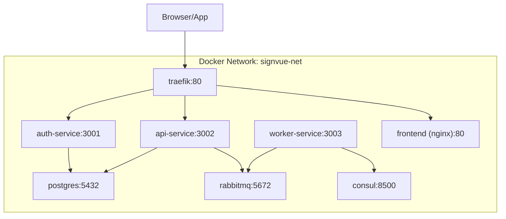
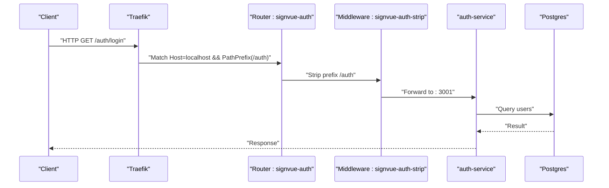
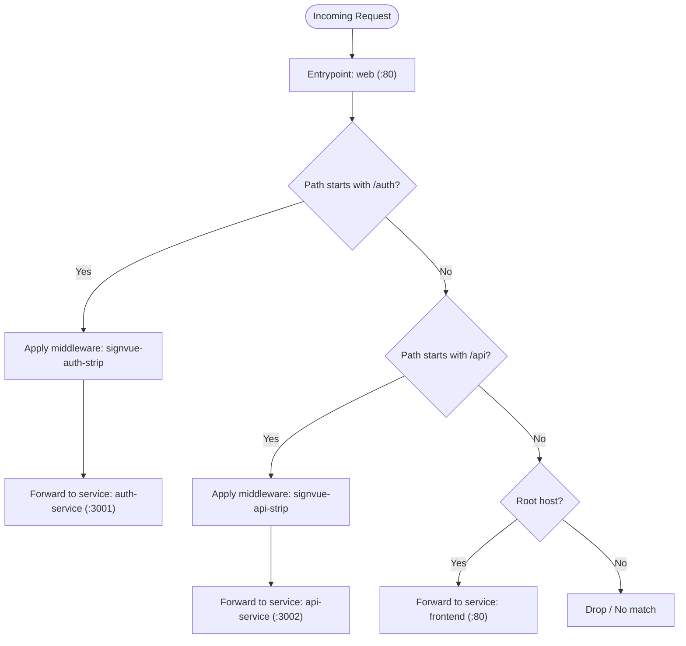
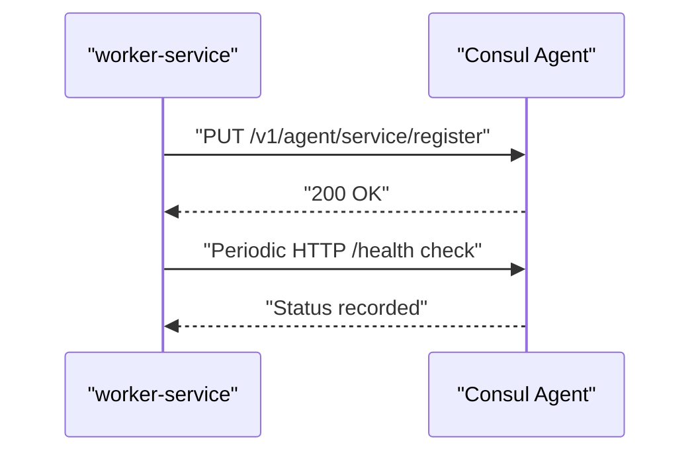
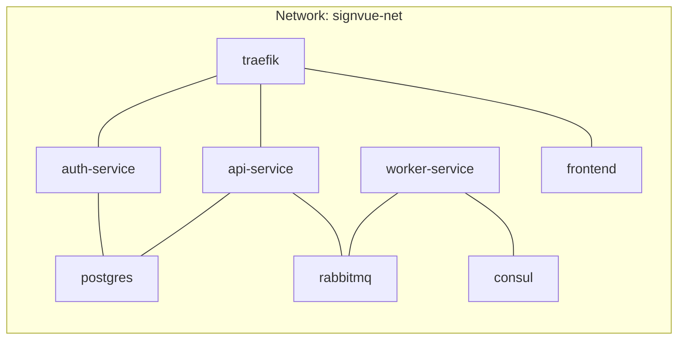
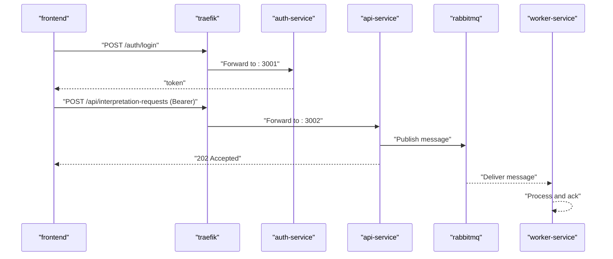
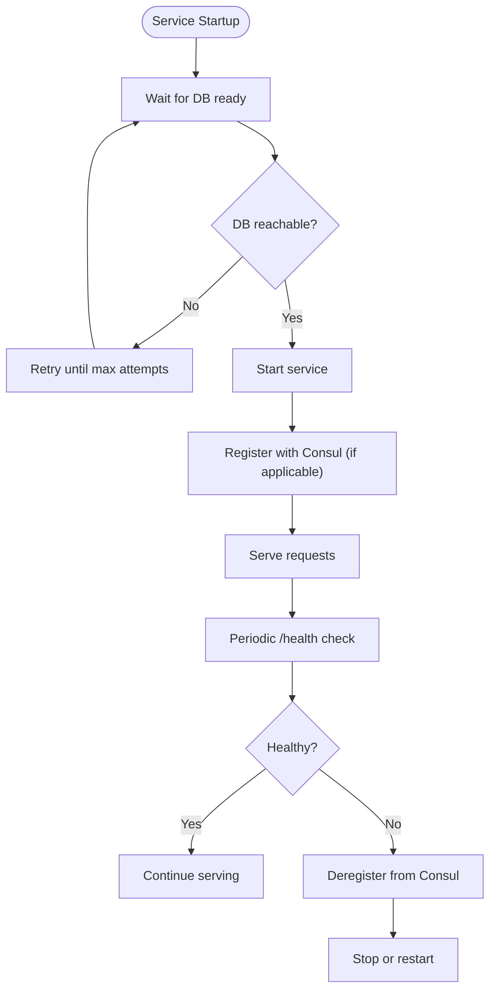
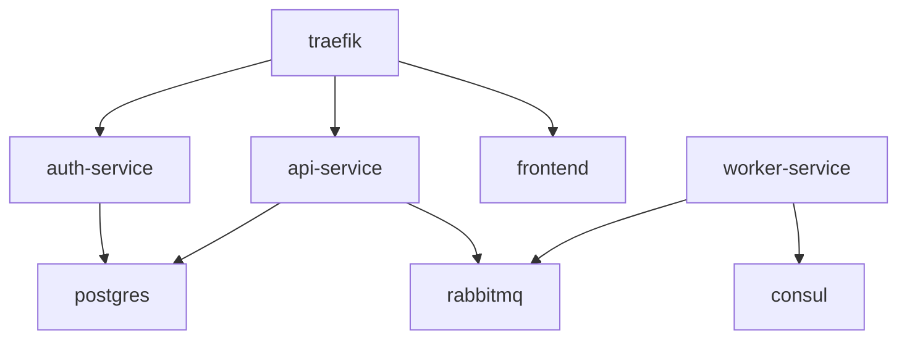

# Service Discovery Patterns

<cite>
**Referenced Files in This Document**
- [docker-compose.yml](file://docker-compose.yml)
- [README.md](file://README.md)
- [services/api-service/src/index.js](file://services/api-service/src/index.js)
- [services/api-service/src/db.js](file://services/api-service/src/db.js)
- [services/api-service/Dockerfile](file://services/api-service/Dockerfile)
- [services/auth-service/src/index.js](file://services/auth-service/src/index.js)
- [services/auth-service/src/db.js](file://services/auth-service/src/db.js)
- [services/auth-service/Dockerfile](file://services/auth-service/Dockerfile)
- [services/worker-service/src/index.js](file://services/worker-service/src/index.js)
- [services/worker-service/Dockerfile](file://services/worker-service/Dockerfile)
- [infra/init-db.sql](file://infra/init-db.sql)
- [frontend/config.js](file://frontend/config.js)
</cite>

## Table of Contents
1. [Introduction](#introduction)
2. [Project Structure](#project-structure)
3. [Core Components](#core-components)
4. [Architecture Overview](#architecture-overview)
5. [Detailed Component Analysis](#detailed-component-analysis)
6. [Dependency Analysis](#dependency-analysis)
7. [Performance Considerations](#performance-considerations)
8. [Monitoring and Observability](#monitoring-and-observability)
9. [Troubleshooting Guide](#troubleshooting-guide)
10. [Conclusion](#conclusion)

## Introduction
This document explains the service discovery and routing patterns implemented in the SignVue stack. It focuses on how Consul registers and health-checks services, how Traefik acts as an API gateway with automatic discovery, and how Docker networking enables inter-service communication. It also covers routing rules, middleware configurations, load balancing strategies, service-to-service communication patterns, failover mechanisms, and monitoring/observability aspects.

## Project Structure
The project is organized around a multi-container deployment orchestrated by Docker Compose. Services are grouped under a dedicated network and exposed through Traefik. Consul runs as a development registry and health-check aggregator. Supporting infrastructure includes PostgreSQL and RabbitMQ.

**Diagram sources**
- [docker-compose.yml:4-137](file://docker-compose.yml#L4-L137)

**Section sources**
- [docker-compose.yml:3-137](file://docker-compose.yml#L3-L137)
- [README.md:1-111](file://README.md#L1-L111)

## Core Components
- Traefik: Reverse proxy and API gateway configured with Docker provider, exposing a single entrypoint and routing based on host/path rules. It strips URL prefixes for internal service routes and load balances across service instances.
- Consul: Development registry and health-check server. Services self-register with HTTP health checks, enabling discovery and failure detection.
- PostgreSQL: Relational database for persistence, with a dedicated initialization script and health checks.
- RabbitMQ: Message broker for asynchronous work distribution.
- auth-service: Authentication and JWT issuance, with a health endpoint.
- api-service: Business API with CRUD endpoints, JWT verification, and asynchronous request publishing to RabbitMQ.
- worker-service: Consumer of a dedicated queue, with Consul service registration and health check.
- frontend: Static Nginx serving the UI, routed by Traefik.

Key runtime characteristics:
- All services run on a shared Docker network named signvue-net.
- Traefik reads service labels to configure routers, middlewares, and services.
- Services expose a /health endpoint for health checks.
- Consul receives explicit registrations from worker-service; other services rely on Traefik’s Docker provider for routing.

**Section sources**
- [docker-compose.yml:4-137](file://docker-compose.yml#L4-L137)
- [services/api-service/src/index.js:16-24](file://services/api-service/src/index.js#L16-L24)
- [services/auth-service/src/index.js:114-117](file://services/auth-service/src/index.js#L114-L117)
- [services/worker-service/src/index.js:14-17](file://services/worker-service/src/index.js#L14-L17)
- [infra/init-db.sql:1-44](file://infra/init-db.sql#L1-L44)

## Architecture Overview
The routing and discovery pipeline integrates Traefik, Consul, and Docker networking:

- Traefik watches Docker services and dynamically creates routers/middlewares/services from labels.
- Services declare Traefik labels for routing rules, middleware, and load balancer targets.
- Consul is used for service registration and health checks; specifically, worker-service registers itself with an HTTP health check.
- Docker networking ensures internal DNS resolution and service-to-service connectivity.

**Diagram sources**
- [docker-compose.yml:70-79](file://docker-compose.yml#L70-L79)
- [services/auth-service/src/index.js:52-94](file://services/auth-service/src/index.js#L52-L94)
- [docker-compose.yml:40-57](file://docker-compose.yml#L40-L57)

**Section sources**
- [docker-compose.yml:4-137](file://docker-compose.yml#L4-L137)
- [README.md:17-23](file://README.md#L17-L23)

## Detailed Component Analysis

### Traefik Routing and Middleware
- Entrypoint: web (port 80) exposed on host 9080.
- Routers:
  - signvue-auth: matches localhost/127.0.0.1 and PathPrefix(/auth), forwards to auth-service on port 3001.
  - signvue-api: matches localhost/127.0.0.1 and PathPrefix(/api), forwards to api-service on port 3002.
  - signvue-web: matches root host and forwards to frontend on port 80.
- Middlewares:
  - signvue-auth-strip: strips /auth prefix before forwarding.
  - signvue-api-strip: strips /api prefix before forwarding.
- Load Balancing:
  - Services are configured with a load balancer targeting their respective ports; Traefik distributes requests across instances if multiple replicas are deployed.

**Diagram sources**
- [docker-compose.yml:6-14](file://docker-compose.yml#L6-L14)
- [docker-compose.yml:70-105](file://docker-compose.yml#L70-L105)

**Section sources**
- [docker-compose.yml:6-14](file://docker-compose.yml#L6-L14)
- [docker-compose.yml:70-105](file://docker-compose.yml#L70-L105)

### Consul Service Registration and Health Checking
- Consul runs in development mode and exposes a UI.
- worker-service performs a one-time HTTP registration against Consul with:
  - Service ID and Name
  - Address and Port
  - HTTP health check at /health with interval and timeout
- Other services (auth-service, api-service) do not register with Consul in this implementation; Traefik relies on Docker provider labels for routing.

**Diagram sources**
- [services/worker-service/src/index.js:19-43](file://services/worker-service/src/index.js#L19-L43)
- [docker-compose.yml:20-26](file://docker-compose.yml#L20-L26)

**Section sources**
- [services/worker-service/src/index.js:19-43](file://services/worker-service/src/index.js#L19-L43)
- [docker-compose.yml:20-26](file://docker-compose.yml#L20-L26)

### Docker Networking and Inter-Service Communication
- All services share the signvue-net network.
- Internal DNS resolution allows services to reach each other by service name:
  - api-service connects to postgres via postgres:5432.
  - api-service and worker-service connect to rabbitmq via rabbitmq:5672.
  - worker-service registers with Consul via consul:8500.
- Frontend communicates with Traefik on localhost:9080; Traefik routes to backend services.

**Diagram sources**
- [docker-compose.yml:135-137](file://docker-compose.yml#L135-L137)
- [docker-compose.yml:60-95](file://docker-compose.yml#L60-L95)
- [docker-compose.yml:107-116](file://docker-compose.yml#L107-L116)

**Section sources**
- [docker-compose.yml:135-137](file://docker-compose.yml#L135-L137)
- [docker-compose.yml:60-95](file://docker-compose.yml#L60-L95)
- [docker-compose.yml:107-116](file://docker-compose.yml#L107-L116)

### Service-to-Service Communication Patterns
- JWT-based authentication:
  - Frontend obtains a token from auth-service (/auth/login).
  - Frontend sends Authorization: Bearer <token> to api-service endpoints under /api.
  - Both services share JWT_SECRET for local verification.
- Asynchronous processing:
  - api-service publishes interpretation requests to RabbitMQ.
  - worker-service consumes the queue and logs processing details.
- Database access:
  - auth-service and api-service both connect to PostgreSQL using DATABASE_URL.
  - api-service initializes schema and indexes via migration logic.

**Diagram sources**
- [docker-compose.yml:70-105](file://docker-compose.yml#L70-L105)
- [services/auth-service/src/index.js:52-94](file://services/auth-service/src/index.js#L52-L94)
- [services/api-service/src/index.js:123-133](file://services/api-service/src/index.js#L123-L133)
- [services/worker-service/src/index.js:45-81](file://services/worker-service/src/index.js#L45-L81)

**Section sources**
- [README.md:17-23](file://README.md#L17-L23)
- [services/auth-service/src/index.js:52-94](file://services/auth-service/src/index.js#L52-L94)
- [services/api-service/src/index.js:123-133](file://services/api-service/src/index.js#L123-L133)
- [services/worker-service/src/index.js:45-81](file://services/worker-service/src/index.js#L45-L81)

### Failover Mechanisms
- Traefik load balancing:
  - Services define a load balancer with a server port; if multiple instances are deployed, Traefik distributes traffic automatically.
- Health checks:
  - PostgreSQL defines a healthcheck using pg_isready.
  - Services expose /health endpoints for Traefik and Consul.
  - Consul records health statuses for registered services.
- Graceful startup:
  - api-service waits for PostgreSQL readiness before starting.

**Diagram sources**
- [docker-compose.yml:53-57](file://docker-compose.yml#L53-L57)
- [services/api-service/src/db.js:14-27](file://services/api-service/src/db.js#L14-L27)
- [services/api-service/src/index.js:16-24](file://services/api-service/src/index.js#L16-L24)
- [services/auth-service/src/index.js:114-117](file://services/auth-service/src/index.js#L114-L117)
- [services/worker-service/src/index.js:14-17](file://services/worker-service/src/index.js#L14-L17)

**Section sources**
- [docker-compose.yml:53-57](file://docker-compose.yml#L53-L57)
- [services/api-service/src/db.js:14-27](file://services/api-service/src/db.js#L14-L27)
- [services/api-service/src/index.js:16-24](file://services/api-service/src/index.js#L16-L24)
- [services/auth-service/src/index.js:114-117](file://services/auth-service/src/index.js#L114-L117)
- [services/worker-service/src/index.js:14-17](file://services/worker-service/src/index.js#L14-L17)

## Dependency Analysis
- Traefik depends on Docker socket and Docker labels to discover services.
- Services depend on:
  - PostgreSQL for persistence (auth-service and api-service).
  - RabbitMQ for asynchronous messaging (api-service publishes; worker-service consumes).
  - Consul for registration and health checks (worker-service).
- Frontend depends on Traefik for routing to auth-service and api-service.

**Diagram sources**
- [docker-compose.yml:4-137](file://docker-compose.yml#L4-L137)

**Section sources**
- [docker-compose.yml:4-137](file://docker-compose.yml#L4-L137)

## Performance Considerations
- Traefik load balancing: Configure multiple replicas of services behind the same Traefik service to distribute load.
- Health checks: Keep intervals reasonable to detect failures quickly without overloading services.
- Database connections: Use connection pooling and limit concurrent connections to PostgreSQL.
- Message throughput: Adjust RabbitMQ prefetch count and worker concurrency to match workload.
- Network latency: Keep services on the same Docker network to minimize cross-host overhead.

## Monitoring and Observability
- Traefik Dashboard:
  - Exposed on port 8080; inspect routers, middlewares, services, and metrics.
- Consul UI:
  - Exposed on port 8500; view registered services, health statuses, and catalog.
- Logs:
  - Use container logs to monitor service startup, health checks, and errors.
- Health endpoints:
  - Verify service readiness via /health endpoints.
- Frontend base URL:
  - Configure the backend base URL for local development or external deployments.

**Section sources**
- [docker-compose.yml:7-14](file://docker-compose.yml#L7-L14)
- [docker-compose.yml:23-25](file://docker-compose.yml#L23-L25)
- [services/api-service/src/index.js:16-24](file://services/api-service/src/index.js#L16-L24)
- [services/auth-service/src/index.js:114-117](file://services/auth-service/src/index.js#L114-L117)
- [services/worker-service/src/index.js:14-17](file://services/worker-service/src/index.js#L14-L17)
- [frontend/config.js:1-18](file://frontend/config.js#L1-L18)

## Troubleshooting Guide
- Traefik routing issues:
  - Confirm router rules match host and path; verify entrypoints and priorities.
  - Ensure middlewares strip prefixes correctly.
- Service discovery problems:
  - For services not registered via labels, verify Docker provider is enabled and exposedbydefault is set appropriately.
  - For Consul-registered services, confirm registration endpoint and health check URL.
- Health check failures:
  - Check PostgreSQL healthcheck configuration and credentials.
  - Verify /health endpoints return expected responses.
- Database connectivity:
  - Confirm DATABASE_URL and service dependencies; ensure migrations succeed.
- RabbitMQ connectivity:
  - Verify RABBITMQ_URL and queue existence; ensure worker acknowledges messages.

**Section sources**
- [docker-compose.yml:6-14](file://docker-compose.yml#L6-L14)
- [docker-compose.yml:53-57](file://docker-compose.yml#L53-L57)
- [services/api-service/src/db.js:14-27](file://services/api-service/src/db.js#L14-L27)
- [services/worker-service/src/index.js:19-43](file://services/worker-service/src/index.js#L19-L43)
- [infra/init-db.sql:1-44](file://infra/init-db.sql#L1-L44)

## Conclusion
The SignVue stack demonstrates practical service discovery and routing patterns:
- Traefik orchestrates inbound traffic using Docker labels and middleware.
- Consul complements discovery with explicit service registration and health checks.
- Docker networking simplifies inter-service communication and DNS resolution.
- The design supports asynchronous workflows via RabbitMQ and JWT-based authentication.
- Observability is achieved through Traefik and Consul dashboards, health endpoints, and logs.