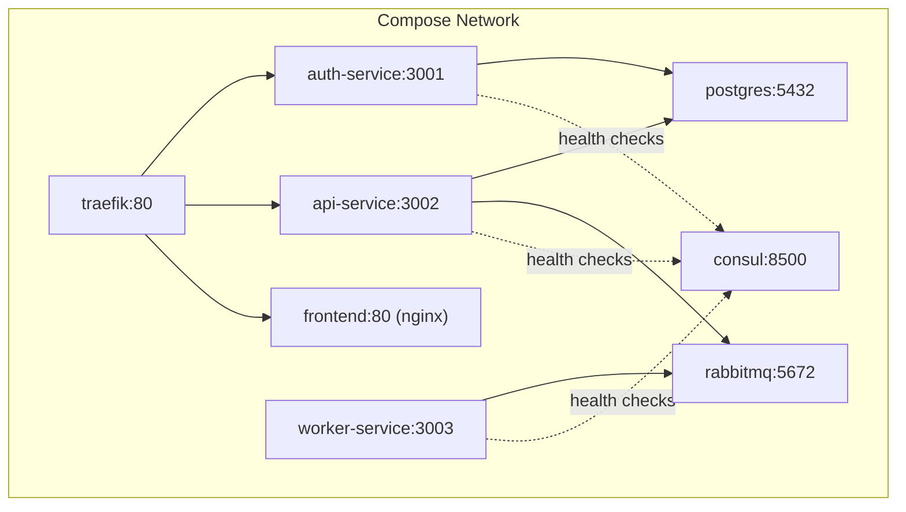
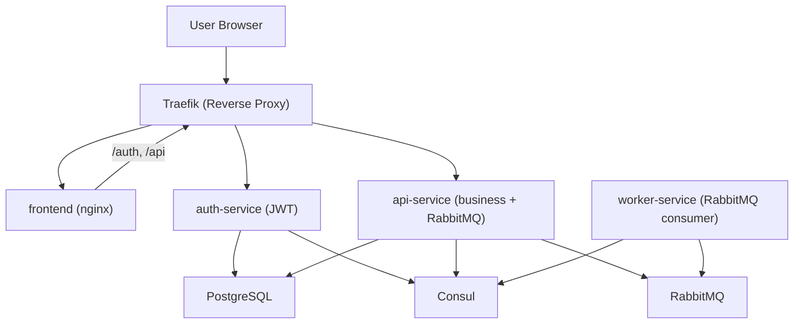
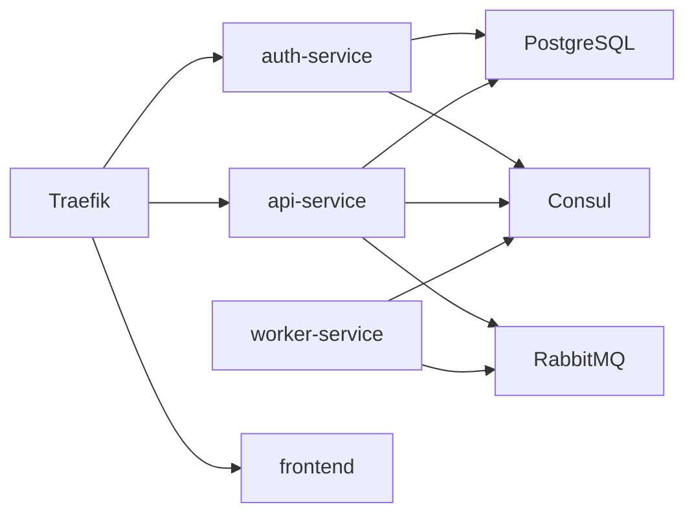

# System Architecture

<cite>
**Referenced Files in This Document**
- [README.md](file://README.md)
- [docker-compose.yml](file://docker-compose.yml)
- [services/api-service/src/index.js](file://services/api-service/src/index.js)
- [services/api-service/src/db.js](file://services/api-service/src/db.js)
- [services/api-service/package.json](file://services/api-service/package.json)
- [services/auth-service/src/index.js](file://services/auth-service/src/index.js)
- [services/auth-service/src/db.js](file://services/auth-service/src/db.js)
- [services/auth-service/package.json](file://services/auth-service/package.json)
- [services/worker-service/src/index.js](file://services/worker-service/src/index.js)
- [services/worker-service/package.json](file://services/worker-service/package.json)
- [infra/init-db.sql](file://infra/init-db.sql)
- [frontend/config.js](file://frontend/config.js)
- [frontend/script.js](file://frontend/script.js)
</cite>

## Table of Contents
1. [Introduction](#introduction)
2. [Project Structure](#project-structure)
3. [Core Components](#core-components)
4. [Architecture Overview](#architecture-overview)
5. [Detailed Component Analysis](#detailed-component-analysis)
6. [Dependency Analysis](#dependency-analysis)
7. [Performance Considerations](#performance-considerations)
8. [Troubleshooting Guide](#troubleshooting-guide)
9. [Conclusion](#conclusion)
10. [Appendices](#appendices)

## Introduction
This document describes the SignVue microservices system architecture. It covers the high-level design patterns including microservices architecture, API gateway pattern with Traefik, event-driven architecture with RabbitMQ, and service discovery with Consul. It documents component interactions, data flows among auth-service, api-service, worker-service, and the frontend, along with infrastructure requirements, scalability considerations, and deployment topology. Cross-cutting concerns such as security, monitoring, and service registration patterns are addressed.

## Project Structure
The repository is organized into:
- Backend services under services/
  - auth-service: JWT-based authentication and user management
  - api-service: business APIs, session CRUD, and asynchronous job submission
  - worker-service: RabbitMQ consumer for asynchronous processing
- Frontend under frontend/: static UI served by Nginx
- Infrastructure initialization under infra/: database schema
- Orchestration via docker-compose.yml

**Diagram sources**
- [docker-compose.yml:4-137](file://docker-compose.yml#L4-L137)

**Section sources**
- [README.md:100-111](file://README.md#L100-L111)
- [docker-compose.yml:1-137](file://docker-compose.yml#L1-L137)

## Core Components
- Traefik: Reverse proxy and router routing requests to services based on host and path prefixes.
- Consul: Service registry and discovery with HTTP health checks.
- RabbitMQ: Message broker for asynchronous job processing.
- PostgreSQL: Relational database for user and session data.
- auth-service: Registration, login, JWT issuance, and verification endpoints.
- api-service: Business endpoints, session management, JWT verification middleware, and RabbitMQ publisher.
- worker-service: RabbitMQ consumer that processes jobs and logs outcomes.
- frontend: Static Nginx-based UI that communicates with auth-service and api-service via the same host.

Key runtime characteristics:
- Services expose health endpoints for discovery and load balancing.
- JWT_SECRET is shared between auth-service and api-service for token verification.
- Traefik strips path prefixes (/auth, /api) before forwarding to services.

**Section sources**
- [README.md:5-32](file://README.md#L5-L32)
- [docker-compose.yml:59-131](file://docker-compose.yml#L59-L131)
- [services/api-service/src/index.js:106-121](file://services/api-service/src/index.js#L106-L121)
- [services/auth-service/src/index.js:96-112](file://services/auth-service/src/index.js#L96-L112)

## Architecture Overview
The system follows a microservices architecture with:
- API Gateway Pattern: Traefik routes inbound traffic to appropriate services based on host/path.
- Service Discovery: Consul registers services and exposes health endpoints for routing.
- Event-Driven Pattern: api-service publishes interpretation requests to RabbitMQ; worker-service consumes and processes them asynchronously.
- Shared JWT Secret: auth-service and api-service share JWT_SECRET for token verification.

**Diagram sources**
- [docker-compose.yml:4-137](file://docker-compose.yml#L4-L137)
- [services/api-service/src/index.js:123-133](file://services/api-service/src/index.js#L123-L133)
- [services/worker-service/src/index.js:19-43](file://services/worker-service/src/index.js#L19-L43)

## Detailed Component Analysis

### Traefik API Gateway
- Entrypoint: web (port 80) exposed on 9080:80.
- Routes:
  - /auth → auth-service (strips /auth)
  - /api → api-service (strips /api)
  - Root host → frontend (nginx)
- Dashboard available on 9081.

Operational behavior:
- Uses Docker provider and dynamic routing.
- Strips path prefixes to simplify internal routing.

**Section sources**
- [docker-compose.yml:4-18](file://docker-compose.yml#L4-L18)
- [docker-compose.yml:70-131](file://docker-compose.yml#L70-L131)

### auth-service
Responsibilities:
- Registration: validates input, hashes password, persists user.
- Login: verifies credentials, issues JWT signed with shared secret.
- Verification: validates Authorization: Bearer token locally.
- Health: responds with service status.

Security and data:
- Uses bcrypt for password hashing.
- Stores users in PostgreSQL.
- Exposes /health endpoint for discovery.

**Section sources**
- [services/auth-service/src/index.js:12-94](file://services/auth-service/src/index.js#L12-L94)
- [services/auth-service/src/index.js:114-117](file://services/auth-service/src/index.js#L114-L117)
- [services/auth-service/src/db.js:1-13](file://services/auth-service/src/db.js#L1-L13)

### api-service
Responsibilities:
- Session CRUD endpoints (filtered by user; admins see all).
- Interpretation request submission: publishes to RabbitMQ queue and returns 202.
- JWT verification middleware: decodes and validates tokens using shared secret.
- Health: DB readiness check plus service status.

Data and persistence:
- PostgreSQL schema includes users, sessions, and translations.
- Uses connection pooling and migrations at startup.

Asynchronous processing:
- Publishes job payloads to RabbitMQ queue.
- Does not consume messages itself.

**Section sources**
- [services/api-service/src/index.js:16-121](file://services/api-service/src/index.js#L16-L121)
- [services/api-service/src/index.js:123-133](file://services/api-service/src/index.js#L123-L133)
- [services/api-service/src/db.js:14-78](file://services/api-service/src/db.js#L14-L78)
- [infra/init-db.sql:1-44](file://infra/init-db.sql#L1-L44)

### worker-service
Responsibilities:
- Registers itself in Consul with HTTP health check.
- Consumes RabbitMQ queue for interpretation jobs.
- Logs job details upon successful processing.

Operational behavior:
- Connects to RabbitMQ using provided URL.
- Prefetches single messages to ensure ordered processing per worker instance.
- Acknowledges messages after processing.

**Section sources**
- [services/worker-service/src/index.js:19-43](file://services/worker-service/src/index.js#L19-L43)
- [services/worker-service/src/index.js:45-81](file://services/worker-service/src/index.js#L45-L81)

### frontend
Responsibilities:
- Static UI served by Nginx.
- Communicates with auth-service and api-service via configured base URL.
- Supports optional local mode for development without backend.

Runtime configuration:
- Respects meta tag or global override for API base URL.
- Attaches Authorization: Bearer token to authenticated requests.

**Section sources**
- [frontend/config.js:1-18](file://frontend/config.js#L1-L18)
- [frontend/script.js:160-182](file://frontend/script.js#L160-L182)
- [frontend/script.js:429-435](file://frontend/script.js#L429-L435)

### Database Initialization
- Initial schema includes users, refresh_tokens, interpretation_sessions, and translations.
- Indexes optimized for typical queries.
- Applied at first container boot via init script.

**Section sources**
- [infra/init-db.sql:1-44](file://infra/init-db.sql#L1-L44)

## Dependency Analysis
External dependencies and runtime relationships:
- RabbitMQ: consumed by worker-service; produced by api-service.
- PostgreSQL: used by auth-service and api-service.
- Consul: used by worker-service for registration and health checks.
- Traefik: orchestrates inbound routing to services.

**Diagram sources**
- [docker-compose.yml:59-131](file://docker-compose.yml#L59-L131)
- [services/worker-service/src/index.js:19-43](file://services/worker-service/src/index.js#L19-L43)

**Section sources**
- [services/api-service/package.json:9-18](file://services/api-service/package.json#L9-L18)
- [services/auth-service/package.json:9-17](file://services/auth-service/package.json#L9-L17)
- [services/worker-service/package.json:9-13](file://services/worker-service/package.json#L9-L13)

## Performance Considerations
- Asynchronous processing: api-service delegates heavy work to worker-service via RabbitMQ, keeping API latency low.
- Health checks: Consul HTTP checks enable fast failure detection and removal from load balancers.
- Database connections: api-service uses connection pooling and migrations at startup to avoid cold starts.
- Traefik routing: Path prefix stripping reduces overhead and simplifies service internals.
- Recommendations:
  - Scale out worker-service replicas to increase throughput.
  - Add rate limiting and circuit breakers at Traefik for resilience.
  - Monitor RabbitMQ queue depth and consumer lag.
  - Use read replicas for PostgreSQL if read-heavy workloads emerge.

[No sources needed since this section provides general guidance]

## Troubleshooting Guide
Common issues and diagnostics:
- Traefik dashboard unreachable: verify port mapping 9080:80 and 9081:8080.
- Services not reachable: confirm Traefik labels and network membership.
- RabbitMQ connectivity: ensure api-service and worker-service can reach rabbitmq:5672.
- JWT verification failures: confirm JWT_SECRET is identical across auth-service and api-service.
- Database readiness: api-service waits for DB; check logs for migration and connection errors.
- Service discovery: worker-service registers with Consul; verify /health endpoints are reachable.

**Section sources**
- [README.md:25-31](file://README.md#L25-L31)
- [services/api-service/src/index.js:123-133](file://services/api-service/src/index.js#L123-L133)
- [services/worker-service/src/index.js:19-43](file://services/worker-service/src/index.js#L19-L43)

## Conclusion
SignVue demonstrates a pragmatic microservices setup with clear separation of concerns:
- Traefik centralizes ingress and routing.
- Consul enables service registration and health-based routing.
- RabbitMQ decouples producers (api-service) from consumers (worker-service).
- JWT-based authentication is enforced consistently across services.
The architecture supports incremental enhancements such as scaling workers, adding monitoring/metrics, and adopting an orchestrator for production deployments.

[No sources needed since this section summarizes without analyzing specific files]

## Appendices

### API Surface and Endpoints
- Authentication
  - POST /auth/register
  - POST /auth/login
  - GET /auth/me
- Business
  - GET/POST /api/sessions
  - GET/PUT/DELETE /api/sessions/:id
  - POST /api/interpretation-requests
  - GET /api/stats/sessions (admin-only)

**Section sources**
- [README.md:34-50](file://README.md#L34-L50)

### Deployment Topology
- Development: Docker Compose with one container per service.
- Production: One machine or VM per service; optionally managed by an orchestrator.

**Section sources**
- [README.md:51-57](file://README.md#L51-L57)

### Security Notes
- JWT_SECRET must be identical between auth-service and api-service.
- Use HTTPS in production; configure TLS at Traefik.
- Store secrets externally (e.g., environment files) and avoid hardcoding.

**Section sources**
- [README.md:92-95](file://README.md#L92-L95)