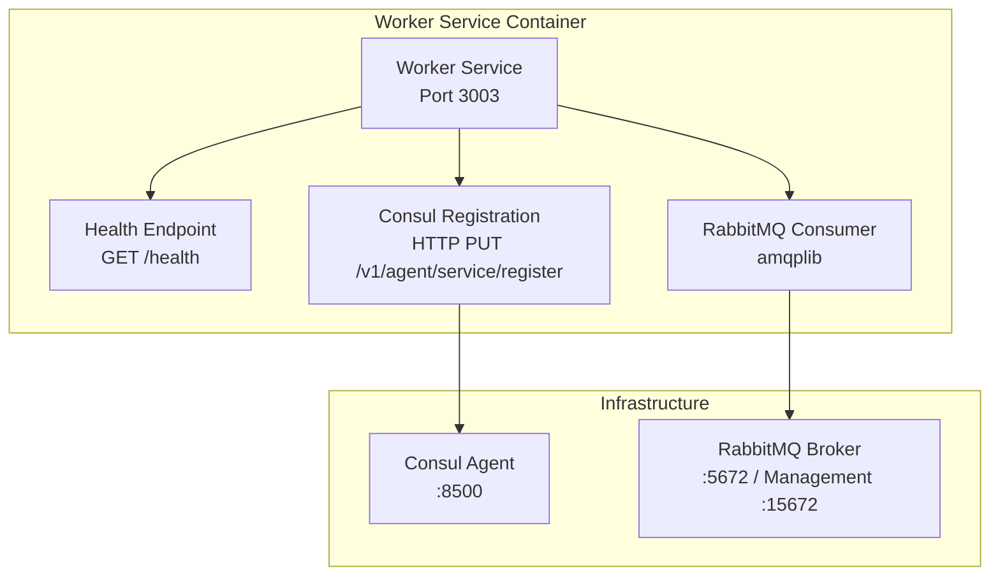
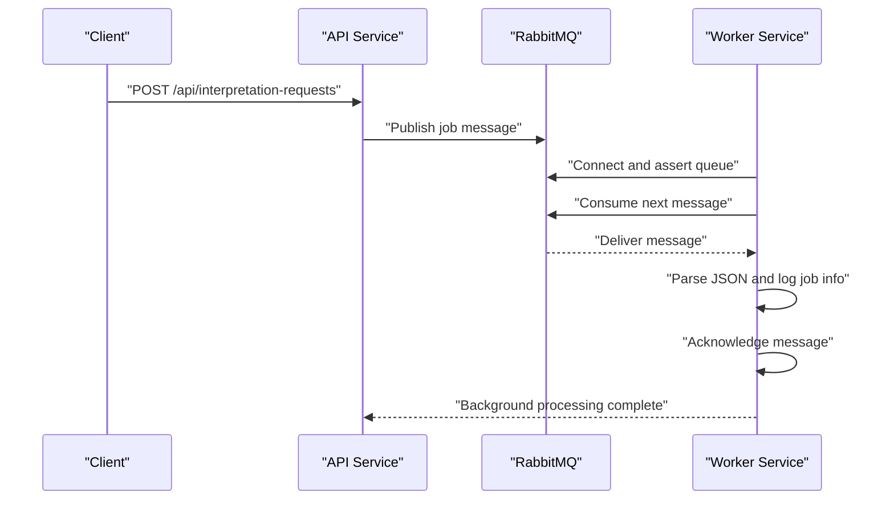
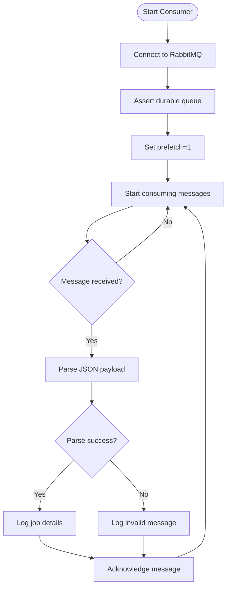
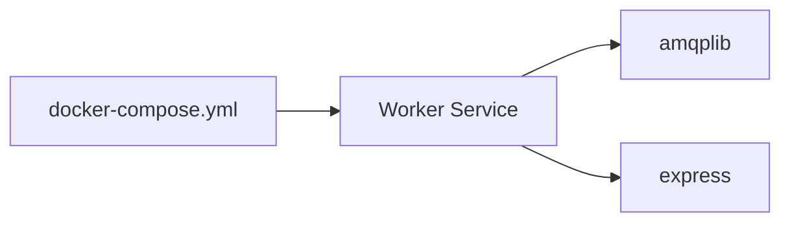

# Worker Service

<cite>
**Referenced Files in This Document**
- [index.js](file://services/worker-service/src/index.js)
- [Dockerfile](file://services/worker-service/Dockerfile)
- [package.json](file://services/worker-service/package.json)
- [docker-compose.yml](file://docker-compose.yml)
- [README.md](file://README.md)
</cite>

## Table of Contents
1. [Introduction](#introduction)
2. [Project Structure](#project-structure)
3. [Core Components](#core-components)
4. [Architecture Overview](#architecture-overview)
5. [Detailed Component Analysis](#detailed-component-analysis)
6. [Dependency Analysis](#dependency-analysis)
7. [Performance Considerations](#performance-considerations)
8. [Troubleshooting Guide](#troubleshooting-guide)
9. [Conclusion](#conclusion)

## Introduction
This document explains the Worker Service asynchronous processing implementation. It covers RabbitMQ integration, job consumption patterns, background processing architecture, Consul service registration and health checks, message queue configuration, and job processing workflows. It also provides guidance on scaling, error handling, monitoring, and integration with the API service. The Worker Service listens on a dedicated port, registers itself with Consul, connects to RabbitMQ, and consumes jobs from a durable queue for asynchronous processing.

## Project Structure
The Worker Service is a minimal Node.js application packaged as a container. It exposes a health endpoint, registers with Consul, and runs a RabbitMQ consumer loop.

**Diagram sources**
- [index.js:15-43](file://services/worker-service/src/index.js#L15-L43)
- [index.js:45-81](file://services/worker-service/src/index.js#L45-L81)
- [docker-compose.yml:107-116](file://docker-compose.yml#L107-L116)
- [docker-compose.yml:20-38](file://docker-compose.yml#L20-L38)

**Section sources**
- [index.js:1-17](file://services/worker-service/src/index.js#L1-L17)
- [Dockerfile:1-8](file://services/worker-service/Dockerfile#L1-L8)
- [package.json:1-14](file://services/worker-service/package.json#L1-L14)
- [docker-compose.yml:107-116](file://docker-compose.yml#L107-L116)

## Core Components
- Express server with a health endpoint for Consul checks.
- Consul registration routine that registers the service with HTTP health checks.
- RabbitMQ consumer that connects to a durable queue, sets prefetch to 1, and acknowledges processed messages.

Key behaviors:
- Health endpoint returns service and queue metadata.
- Consul registration uses a generated service ID and HTTP check interval.
- RabbitMQ consumer asserts a durable queue, prefetches one message, parses JSON payload, logs job details, and acknowledges messages.

**Section sources**
- [index.js:15-17](file://services/worker-service/src/index.js#L15-L17)
- [index.js:19-43](file://services/worker-service/src/index.js#L19-L43)
- [index.js:45-81](file://services/worker-service/src/index.js#L45-L81)

## Architecture Overview
The Worker Service participates in a distributed asynchronous pipeline:
- API service publishes interpretation requests to RabbitMQ.
- Worker Service consumes messages from the queue and performs background processing.
- Consul ensures service discovery and health monitoring.
- Traefik routes external traffic to services.

**Diagram sources**
- [index.js:45-81](file://services/worker-service/src/index.js#L45-L81)
- [docker-compose.yml:80-105](file://docker-compose.yml#L80-L105)

**Section sources**
- [README.md:17-23](file://README.md#L17-L23)
- [README.md:48-49](file://README.md#L48-L49)

## Detailed Component Analysis

### Health Endpoint and Consul Registration
- Health endpoint: GET /health returns service and queue identifiers.
- Consul registration:
  - Registers a service with HTTP check pointing to the health endpoint.
  - Uses a dynamic service ID derived from host.
  - Retries on transient failures but does not crash the process.

Operational notes:
- The HTTP check interval and timeout are configured in the registration payload.
- If Consul is unavailable, the service continues running without blocking startup.

**Section sources**
- [index.js:15-17](file://services/worker-service/src/index.js#L15-L17)
- [index.js:19-43](file://services/worker-service/src/index.js#L19-L43)

### RabbitMQ Consumer
- Connection: Uses the RABBITMQ_URL environment variable to connect.
- Queue: Asserts a durable queue named after the service’s queue constant.
- Prefetch: Limits concurrency to one message at a time per channel.
- Message handling:
  - Parses message content as JSON.
  - Logs job metadata (jobId, userId, source).
  - Acknowledges messages immediately after parsing.

Error handling:
- Catches and logs invalid JSON messages.
- Catches connection and consumption errors; exits the process on fatal failure.

**Diagram sources**
- [index.js:45-81](file://services/worker-service/src/index.js#L45-L81)

**Section sources**
- [index.js:45-81](file://services/worker-service/src/index.js#L45-L81)

### Environment Configuration and Containerization
- Ports:
  - Worker Service listens on 3003.
  - RabbitMQ exposes 5672 and 15672.
  - Consul exposes 8500.
- Environment variables:
  - PORT, RABBITMQ_URL, CONSUL_HOST are set in docker-compose for the Worker Service.
- Containerization:
  - Minimal base image, installs dependencies, copies source, exposes port, and starts the service.

**Section sources**
- [index.js:7-12](file://services/worker-service/src/index.js#L7-L12)
- [docker-compose.yml:107-116](file://docker-compose.yml#L107-L116)
- [Dockerfile:1-8](file://services/worker-service/Dockerfile#L1-L8)

## Dependency Analysis
External dependencies and runtime relationships:
- amqplib: RabbitMQ client library used for connection, channel creation, queue assertion, and message consumption.
- express: Provides the health endpoint and basic HTTP server capabilities.
- docker-compose: Defines service dependencies, networking, and environment variables.

**Diagram sources**
- [package.json:9-12](file://services/worker-service/package.json#L9-L12)
- [docker-compose.yml:107-116](file://docker-compose.yml#L107-L116)

**Section sources**
- [package.json:9-12](file://services/worker-service/package.json#L9-L12)
- [docker-compose.yml:107-116](file://docker-compose.yml#L107-L116)

## Performance Considerations
- Concurrency control: Prefetch is set to 1, ensuring single-consumer fairness and preventing backlog accumulation when processing is slow.
- Queue durability: The queue is declared durable, improving resilience against broker restarts.
- Health checks: Consul HTTP checks enable automatic detection of unhealthy instances.
- Scaling: Increase replicas of the Worker Service container to scale out processing. Each replica consumes independently from the same queue.

Recommendations:
- Monitor queue length and consumer lag via RabbitMQ Management.
- Tune prefetch dynamically based on job processing time.
- Add dead-letter exchanges or delayed requeue strategies for retry policies.

[No sources needed since this section provides general guidance]

## Troubleshooting Guide
Common issues and resolutions:
- RabbitMQ connectivity failures:
  - Verify RABBITMQ_URL and network reachability.
  - Confirm the queue exists or allow the service to assert it.
- Invalid message format:
  - Messages must be valid JSON; otherwise, they are logged as invalid and acknowledged.
- Consul registration failures:
  - Check CONSUL_HOST and port 8500 accessibility.
  - Review registration payload and service ID uniqueness.
- Health check failures:
  - Ensure the health endpoint responds with a valid JSON payload.
  - Confirm the HTTP check interval and timeout align with service responsiveness.

Operational tips:
- Use container logs to inspect connection attempts, queue assertions, and message acknowledgments.
- Validate service discovery in Consul UI.
- Inspect RabbitMQ Management for published messages and consumer counts.

**Section sources**
- [index.js:45-81](file://services/worker-service/src/index.js#L45-L81)
- [index.js:19-43](file://services/worker-service/src/index.js#L19-L43)

## Conclusion
The Worker Service implements a robust asynchronous processing pipeline by connecting to RabbitMQ, asserting a durable queue, and consuming messages with a single-prefetch policy. It integrates with Consul for health monitoring and service discovery, and it is containerized for easy deployment. To enhance reliability, consider implementing retry mechanisms, dead-letter queues, and metrics collection. Scaling horizontally by adding replicas leverages RabbitMQ’s built-in load distribution across consumers.

[No sources needed since this section summarizes without analyzing specific files]